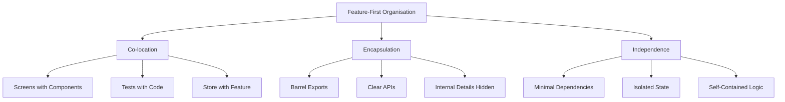
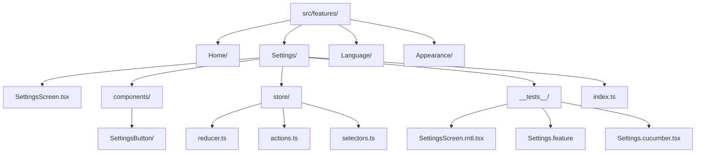
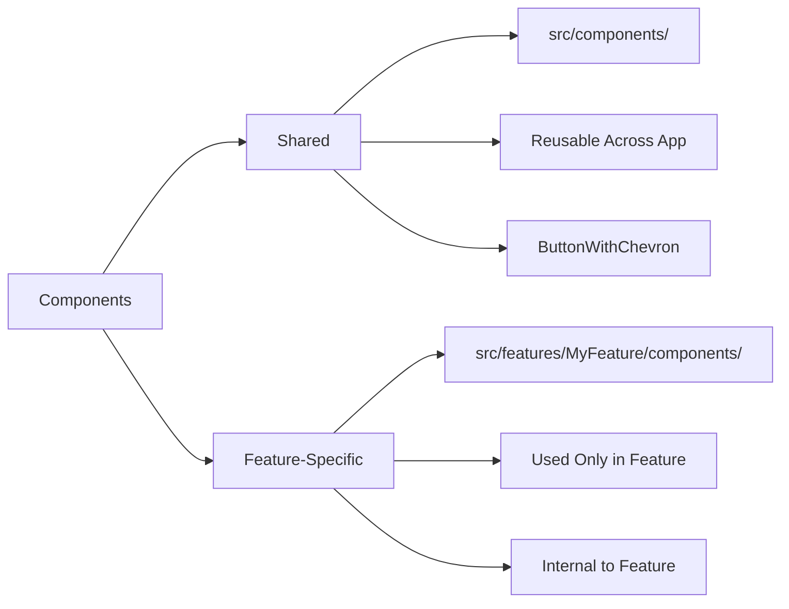

# Architecture Guide

This document explains the project structure, design decisions, and architectural patterns used in this React Native application.

## Table of Contents

- [Overview](#overview)
- [Project Structure](#project-structure)
- [Feature-First Organisation](#feature-first-organisation)
- [Component Patterns](#component-patterns)
- [Shared Utilities](#shared-utilities)
- [Path Aliases](#path-aliases)
- [Design Decisions](#design-decisions)
- [Best Practices](#best-practices)
- [Troubleshooting](#troubleshooting)

---

## Overview

This React Native application follows a **feature-first architecture** where code is organised by feature rather than by technical layer. This approach improves:

- **Maintainability:** Related code stays together
- **Scalability:** Features can grow independently
- **Team Collaboration:** Clear feature ownership
- **Code Discovery:** Easy to find feature-related code

### Architecture Principles



---

## Project Structure

### High-Level Structure

```
warrendeleon/
├── docs/                      # Documentation
├── src/
│   ├── app/                   # App entry point
│   ├── components/            # Shared components
│   ├── features/              # Feature modules (feature-first)
│   ├── navigation/            # Navigation setup
│   ├── i18n/                  # Internationalisation
│   ├── store/                 # Redux store configuration
│   ├── config/                # App configuration
│   ├── hooks/                 # Shared React hooks
│   ├── types/                 # TypeScript type declarations
│   └── test-utils/            # Testing utilities
├── ios/                       # iOS native code
├── android/                   # Android native code
└── e2e/                       # E2E test configuration (optional)
```

### Feature-First Structure



---

## Feature-First Organisation

### Anatomy of a Feature

Each feature is self-contained with its own:

- **Screens:** Main UI components for the feature
- **Components:** Feature-specific UI components
- **Store:** Redux slice (state, actions, selectors)
- **Tests:** Unit tests, E2E tests, and step definitions
- **Barrel Export:** Public API (`index.ts`)

### Example: Settings Feature

```
src/features/Settings/
├── SettingsScreen.tsx              # Main settings screen
├── LanguageScreen.tsx              # Language selection screen
├── AppearanceScreen.tsx            # Theme selection screen
├── components/                     # Feature-specific components
│   └── SettingsButton/
│       ├── SettingsButton.tsx
│       └── __tests__/SettingsButton.rntl.tsx
├── store/                          # Redux slice
│   ├── index.ts                    # Store exports
│   ├── actions.ts                  # Action creators
│   ├── reducer.ts                  # Slice reducer
│   ├── selectors.ts                # State selectors
│   └── __tests__/                  # Store tests
│       ├── actions.test.ts
│       ├── reducer.test.ts
│       └── selectors.test.ts
├── __tests__/                      # Feature tests
│   ├── SettingsScreen.rntl.tsx     # Unit tests
│   ├── Settings.feature            # E2E scenarios (Gherkin)
│   └── Settings.cucumber.tsx       # E2E step definitions
└── index.ts                        # Barrel export (public API)
```

### Benefits

- **Cohesion:** Related code stays together
- **Scalability:** Easy to add new features without affecting existing ones
- **Discoverability:** Clear where to find feature-related code
- **Ownership:** Teams can own entire features
- **Testing:** Tests live next to the code they test

### Barrel Exports Pattern

Each feature exports its public API through `index.ts`:

```typescript
// src/features/Settings/index.ts
export { SettingsScreen } from './SettingsScreen';
export { LanguageScreen } from './LanguageScreen';
export { AppearanceScreen } from './AppearanceScreen';
export * from './store';
```

**Benefits:**

- **Encapsulation:** Internal implementation details stay private
- **Clean Imports:** `import { SettingsScreen } from '@app/features'`
- **Refactoring:** Restructure internals without breaking imports
- **Clear API:** The `index.ts` file defines what's public

**What to Export:**

- ✅ Screens that are navigated to
- ✅ Public components used by other features
- ✅ Redux actions, selectors, types
- ❌ Internal helper functions
- ❌ Private components
- ❌ Test files

---

## Component Patterns

### Component Organisation



### Shared Components

Located in `src/components/`, these are reusable across the entire app:

```
components/
  ButtonWithChevron/
    __tests__/
      ButtonWithChevron.rntl.tsx
    ButtonWithChevron.tsx
    index.ts                        # Re-export
  shared/                           # Shared utilities
    types.ts                        # GroupVariant type
    constants.ts                    # Border radius constants
    utils.ts                        # getButtonGroupVariant()
    __tests__/
      utils.test.ts
    index.ts
```

**Example:**

```typescript
// src/components/ButtonWithChevron/ButtonWithChevron.tsx
interface ButtonWithChevronProps {
  label: string;
  onPress: () => void;
  startIcon?: React.ComponentType<any>;
  endLabel?: string;
  groupVariant?: 'single' | 'top' | 'middle' | 'bottom';
}

export const ButtonWithChevron: React.FC<ButtonWithChevronProps> = ({
  label,
  onPress,
  ...props
}) => {
  return <Pressable onPress={onPress}>{/* Implementation */}</Pressable>;
};
```

**Characteristics:**

- Generic and reusable
- No feature-specific logic
- Well-tested (100% coverage required)
- Exported via `src/components/index.ts`

### Feature-Specific Components

Located in `src/features/MyFeature/components/`:

```typescript
// src/features/Settings/components/SettingsSection/SettingsSection.tsx
interface SettingsSectionProps {
  title: string;
  children: React.ReactNode;
}

export const SettingsSection: React.FC<SettingsSectionProps> = ({
  title,
  children,
}) => {
  return (
    <View>
      <Text>{title}</Text>
      {children}
    </View>
  );
};
```

**Characteristics:**

- Used only within the feature
- May contain feature-specific logic
- Not exported from feature's `index.ts`
- Co-located with feature code

### Component Naming Conventions

| Type                 | Naming Convention | Example                      |
| -------------------- | ----------------- | ---------------------------- |
| Screen Components    | `*Screen.tsx`     | `SettingsScreen.tsx`         |
| UI Components        | PascalCase        | `ButtonWithChevron.tsx`      |
| Unit Tests           | `*.rntl.tsx`      | `ButtonWithChevron.rntl.tsx` |
| E2E Features         | `*.feature`       | `Settings.feature`           |
| E2E Step Definitions | `*.cucumber.tsx`  | `Settings.cucumber.tsx`      |

---

## Shared Utilities

### Test Utilities

Located in `src/test-utils/`:

```
test-utils/
  index.ts                    # Unit test utilities (renderWithProviders)
  cucumber/                   # E2E test utilities
    support/
      world.ts                # Cucumber World
      hooks.ts                # Before/After hooks
    step-definitions/
      common.steps.tsx        # Shared Cucumber steps
    mocks/
      server.ts               # MSW server setup
    formatters/
      CheckmarkFormatter.js   # Custom test output formatter
```

**renderWithProviders Utility:**

```typescript
// src/test-utils/renderWithProviders.tsx
import { render } from '@testing-library/react-native';
import { GluestackUIProvider } from '@gluestack-ui/themed';
import { I18nextProvider } from 'react-i18next';
import i18n from '@app/i18n';
import { config } from '@app/config/gluestack-ui.config';

export const renderWithProviders = (ui: React.ReactElement) =>
  render(
    <I18nextProvider i18n={i18n}>
      <GluestackUIProvider config={config}>{ui}</GluestackUIProvider>
    </I18nextProvider>
  );
```

**Use Case:** Testing components that use GlueStack UI or i18n

```typescript
// In tests
import { renderWithProviders } from '@app/test-utils';

it('renders correctly', () => {
  const { getByText } = renderWithProviders(<MyComponent />);
  expect(getByText('Hello')).toBeTruthy();
});
```

### Configuration

Located in `src/config/`:

- **Environment:** `env.ts` - Access environment variables
- **Reactotron:** `reactotron.ts` - Redux debugging (dev only)
- **GlueStack UI:** Theme configuration

---

## Path Aliases

The project uses `@app` as a path alias for `src/`:

### Configuration

**TypeScript (`tsconfig.json`):**

```json
{
  "compilerOptions": {
    "baseUrl": ".",
    "paths": {
      "@app/*": ["src/*"]
    }
  }
}
```

**Babel (`babel.config.js`):**

```javascript
module.exports = {
  plugins: [
    [
      'module-resolver',
      {
        root: ['./src'],
        alias: {
          '@app': './src',
        },
      },
    ],
  ],
};
```

### Usage

```typescript
// ❌ Avoid relative paths
import { HomeScreen } from '../../../features/Home/HomeScreen';
import { settingsActions } from '../../Settings/store/actions';

// ✅ Use @app alias
import { HomeScreen } from '@app/features/Home/HomeScreen';
import { settingsActions } from '@app/features/Settings/store';
```

**Benefits:**

- Cleaner imports
- No path calculation (`../../../`)
- Easy to refactor and move files
- Consistent import style

---

## Design Decisions

### 1. Feature-First over Layer-First

**Decision:** Organise by feature, not by technical layer.

**Why:**

- Features grow independently
- Related code stays together
- Easier to understand feature scope
- Better for team collaboration

**Example:**

```
❌ Layer-First (Avoid)
src/
├── screens/
│   ├── HomeScreen.tsx
│   └── SettingsScreen.tsx
├── components/
│   └── Button.tsx
├── actions/
│   └── settingsActions.ts
└── reducers/
    └── settingsReducer.ts

✅ Feature-First (Preferred)
src/features/
├── Home/
│   ├── HomeScreen.tsx
│   └── components/
├── Settings/
    ├── SettingsScreen.tsx
    ├── components/
    └── store/
        ├── actions.ts
        └── reducer.ts
```

### 2. Co-location of Tests

**Decision:** Place tests alongside source code.

**Why:**

- Easy to find tests
- Tests move with code
- Clear what's tested
- Encourages test writing

**Structure:**

```
src/features/Settings/
├── SettingsScreen.tsx
├── __tests__/
│   ├── SettingsScreen.rntl.tsx         # Unit test
│   ├── Settings.feature                # E2E scenarios
│   └── Settings.cucumber.tsx           # E2E steps
└── components/
    └── SettingsButton/
        ├── SettingsButton.tsx
        └── __tests__/
            └── SettingsButton.rntl.tsx
```

### 3. Test File Naming

**Decision:** Use suffixes to distinguish test types.

- `.rntl.tsx` - Unit/integration tests (React Native Testing Library)
- `.feature` - E2E Gherkin scenarios
- `.cucumber.tsx` - E2E step definitions

**Why:**

- Clear test type at a glance
- Easy to configure test runners
- Supports multiple testing strategies in same folder

### 4. Barrel Exports for Encapsulation

**Decision:** Use `index.ts` files to define public APIs.

**Why:**

- Clear separation of public vs private
- Prevents internal coupling
- Easier to refactor internals
- Reduces import boilerplate

**Example:**

```typescript
// src/features/Settings/index.ts
export { SettingsScreen } from './SettingsScreen';
export { LanguageScreen } from './LanguageScreen';
export * from './store';
// Internal components NOT exported

// Usage
import { SettingsScreen } from '@app/features';
```

### 5. Path Aliases for Clean Imports

**Decision:** Use `@app` alias instead of relative paths.

**Why:**

- Cleaner, more readable imports
- No deep relative paths (`../../../`)
- Easy to move files around
- Consistent import style

### 6. Redux Store Co-location

**Decision:** Place Redux slices within features.

**Why:**

- State belongs to the feature
- Actions and reducers stay together
- Easy to find feature state logic
- Promotes feature independence

**Structure:**

```
src/features/Settings/store/
├── index.ts        # Exports
├── actions.ts      # Action creators
├── reducer.ts      # Slice + types
├── selectors.ts    # State selectors
└── __tests__/      # Store tests
```

### 7. UK English for Documentation

**Decision:** Use UK English spelling in all documentation.

**Why:**

- Project requirement
- Consistency across docs
- Professional standard

**Examples:**

- "Organise" not "organize"
- "Behaviour" not "behavior"
- "Colour" not "color"
- "Optimise" not "optimize"

### 8. GlueStack UI + NativeWind

**Decision:** Use GlueStack UI for components and NativeWind for styling.

**Why:**

- GlueStack provides accessible, themed components
- NativeWind enables Tailwind-style utility classes
- Design tokens ensure consistency
- Works with light/dark modes

### 9. TypeScript Strict Mode

**Decision:** Enable TypeScript strict mode with additional checks.

**Why:**

- Catch errors at compile time
- Better IDE autocomplete
- Safer refactoring
- Clearer intent

**Configuration:**

```json
{
  "compilerOptions": {
    "strict": true,
    "noUnusedLocals": true,
    "noUnusedParameters": true,
    "noImplicitReturns": true,
    "noFallthroughCasesInSwitch": true,
    "noUncheckedIndexedAccess": true
  }
}
```

### 10. Shared Utilities Pattern

**Decision:** Extract shared code into dedicated `shared/` folders.

**Why:**

- DRY principle - eliminates duplication
- Single source of truth
- Easier to maintain and update
- Clear dependencies

**Example:**

```typescript
// components/shared/index.ts
export type { GroupVariant } from './types';
export { groupVariantRadius } from './constants';
export { getButtonGroupVariant } from './utils';

// Usage
import { GroupVariant, getButtonGroupVariant } from '@app/components/shared';
```

---

## Best Practices

### Adding a New Feature

See [Workflows Guide](./WORKFLOWS.md#adding-a-new-feature-complete) for complete step-by-step instructions.

**Quick Summary:**

1. Create feature directory: `mkdir -p src/features/MyFeature/{components,store,__tests__}`
2. Add screen component
3. Add navigation route
4. Add translations (en.json, es.json)
5. Export from feature (`index.ts`)
6. Add tests
7. Commit with descriptive message

### When to Share vs Feature-Specific

**Share a Component When:**

- Used by 2+ features
- Generic and reusable
- No feature-specific logic
- Well-abstracted

**Keep Component Feature-Specific When:**

- Used only in one feature
- Contains feature logic
- Tightly coupled to feature
- Still evolving

### Managing Dependencies Between Features

**Guidelines:**

- ✅ Features can import from shared components
- ✅ Features can import from other feature's public API (via barrel export)
- ❌ Features should not import internal files from other features
- ❌ Avoid circular dependencies between features

**Example:**

```typescript
// ✅ Good: Import via barrel export
import { settingsActions } from '@app/features/Settings';

// ❌ Bad: Import internal file directly
import { settingsActions } from '@app/features/Settings/store/actions';
```

---

## Troubleshooting

### "Module not found" Errors

**Problem:** Import using `@app` alias not working.

**Solution:**

1. Verify TypeScript config:

   ```bash
   cat tsconfig.json | grep -A 5 "paths"
   ```

2. Verify Babel config:

   ```bash
   cat babel.config.js | grep -A 10 "module-resolver"
   ```

3. Restart Metro bundler:

   ```bash
   yarn start --reset-cache
   ```

4. Restart TypeScript server in VS Code:
   - `Cmd+Shift+P` → "TypeScript: Restart TS Server"

### Circular Dependency Warnings

**Problem:** Metro warns about circular dependencies.

**Solution:**

1. Identify the cycle:

   ```bash
   yarn start
   # Look for "Require cycle" warnings
   ```

2. Common causes:
   - Feature A imports Feature B, Feature B imports Feature A
   - Barrel exports (`index.ts`) creating circular references

3. Fix:
   - Extract shared code to `src/components/` or `src/utils/`
   - Use lazy imports with `React.lazy()` for screens
   - Avoid re-exporting everything in barrel files

### Tests Not Finding Components

**Problem:** Tests can't find components when using path aliases.

**Solution:**

1. Ensure Jest is configured:

   ```javascript
   // jest.config.cjs
   module.exports = {
     moduleNameMapper: {
       '^@app/(.*)$': '<rootDir>/src/$1',
     },
   };
   ```

2. Restart Jest:
   ```bash
   yarn test --clearCache
   yarn test
   ```

### Feature Code Growing Too Large

**Problem:** Feature directory has too many files.

**Solution:**

1. **Extract Shared Components:**
   - Move reusable components to `src/components/`

2. **Split Large Features:**

   ```
   src/features/
   ├── UserManagement/          # Parent feature
   │   ├── Profile/             # Sub-feature
   │   ├── Settings/            # Sub-feature
   │   └── index.ts             # Barrel export
   ```

3. **Create Sub-Directories:**
   ```
   src/features/Settings/
   ├── screens/
   │   ├── LanguageScreen.tsx
   │   └── AppearanceScreen.tsx
   ├── components/
   ├── store/
   └── index.ts
   ```

### Import Order Issues

**Problem:** ESLint complaining about import order.

**Solution:**

ESLint automatically sorts imports with `eslint-plugin-simple-import-sort`:

```bash
# Fix imports
yarn lint:fix
```

**Expected Order:**

1. Side effects (`import './styles.css'`)
2. External packages (React first)
3. Internal `@app` aliases
4. Parent imports (`../`)
5. Relative imports (`./`)
6. Style imports

### Coverage Not Meeting Thresholds

**Problem:** Jest coverage fails for shared components.

**Solution:**

Shared components require 100% coverage:

```bash
# Run coverage
yarn test:coverage

# Focus on specific component
yarn test ButtonWithChevron.rntl.tsx --coverage

# View HTML report
open coverage/lcov-report/index.html
```

Ensure all branches, lines, statements, and functions are tested.

---

## Next Steps

- **[Development Guide](./DEVELOPMENT.md)** - Set up your environment
- **[Testing Guide](./TESTING.md)** - Learn about testing patterns
- **[State Management](./STATE_MANAGEMENT.md)** - Redux Toolkit usage
- **[Workflows](./WORKFLOWS.md)** - Common development workflows
- **[Cheatsheet](./CHEATSHEET.md)** - Quick reference

---

**Need help?** Open an issue on GitHub or consult the related documentation.
