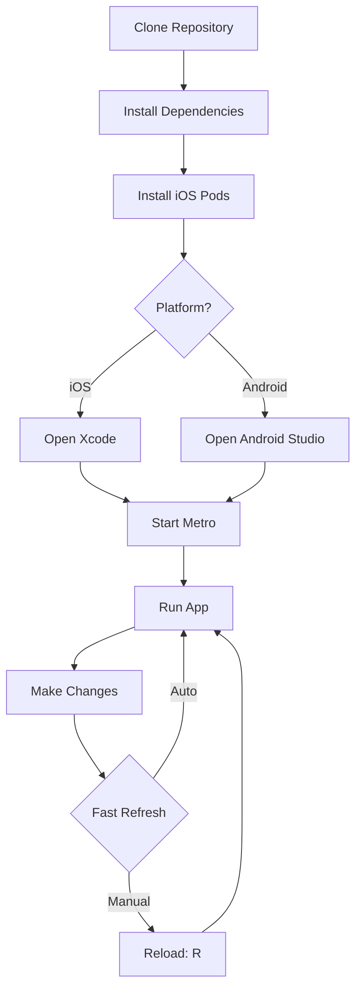
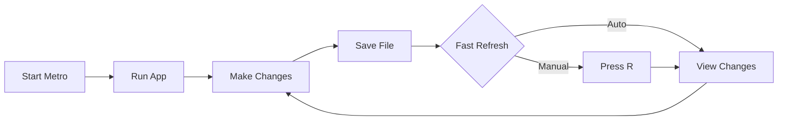

# Development Guide

This document covers setting up your development environment and running the app.

## Table of Contents

- [Prerequisites](#prerequisites)
- [Environment Setup](#environment-setup)
- [Running the App](#running-the-app)
- [Metro Bundler](#metro-bundler)
- [Development Workflow](#development-workflow)
- [Debugging](#debugging)
- [IDE Setup](#ide-setup)
- [Build Performance Tips](#build-performance-tips)
- [Common Issues](#common-issues)
- [Useful Commands](#useful-commands)

---

## Prerequisites

### Required Software

| Tool           | Version | Purpose                        |
| -------------- | ------- | ------------------------------ |
| Node.js        | 22.x    | JavaScript runtime             |
| Yarn           | 3.6.4   | Package manager (via Corepack) |
| Xcode          | 26.0+   | iOS development (macOS only)   |
| Android Studio | 2023.1+ | Android development            |
| Java (JDK)     | 17      | Android build tools            |
| CocoaPods      | 1.16+   | iOS dependency management      |

### Installation

#### 1. Node.js (via nvm - Recommended)

```bash
# Install nvm
curl -o- https://raw.githubusercontent.com/nvm-sh/nvm/v0.39.0/install.sh | bash

# Install Node.js 22.x
nvm install 22

# Use Node.js 22.x (or run `nvm use` from project root)
nvm use 22
```

The project includes a `.nvmrc` file that specifies Node.js 22.12. Running `nvm use` in the project root automatically selects this version.

#### 2. Enable Corepack (for Yarn)

```bash
# Enable Corepack (ships with Node.js 16.10+)
corepack enable

# Verify Yarn version
yarn --version  # Should output: 3.6.4
```

#### 3. Xcode (macOS only)

1. Install Xcode from the Mac App Store
2. Install Xcode Command Line Tools:
   ```bash
   xcode-select --install
   ```
3. Accept Xcode license:
   ```bash
   sudo xcodebuild -license accept
   ```

#### 4. CocoaPods

```bash
# Install CocoaPods
sudo gem install cocoapods

# Verify installation
pod --version  # Should be 1.16+
```

#### 5. Android Studio

1. Download from [developer.android.com/studio](https://developer.android.com/studio)
2. Install Android SDK (API 35)
3. Install JDK 17 (bundled with Android Studio)
4. Configure environment variables in `~/.zshrc` or `~/.bashrc`:

```bash
export ANDROID_HOME=$HOME/Library/Android/sdk
export PATH=$PATH:$ANDROID_HOME/emulator
export PATH=$PATH:$ANDROID_HOME/platform-tools
```

### Verify Installation

```bash
node --version      # Should be v22.x
yarn --version      # Should be 3.6.4
pod --version       # Should be 1.16+
java --version      # Should be 17.x
```

---

## Environment Setup

### Development Workflow Diagram



### Step-by-Step Setup

#### 1. Clone the Repository

```bash
git clone <repository-url>
cd warrendeleon
```

#### 2. Install Dependencies

```bash
yarn install
```

This installs all npm packages defined in `package.json`.

#### 3. Install iOS Dependencies

```bash
cd ios
pod install
cd ..
```

Or use the convenience command:

```bash
yarn ios:pods
```

CocoaPods manages native iOS dependencies. This step must be run whenever iOS dependencies change.

#### 4. Environment Variables

The app uses environment-specific configuration files:

| File               | Used By             | Purpose                   |
| ------------------ | ------------------- | ------------------------- |
| `.env.development` | `warrendeleon`      | Debug builds              |
| `.env.production`  | `warrendeleon-Prod` | Production/release builds |

**Contents:**

```bash
# .env.development
APP_ENV=development
API_URL=https://api-dev.example.com

# .env.production
APP_ENV=production
API_URL=https://api.example.com
```

**Accessing in Code:**

```typescript
import Config from 'react-native-config';

const apiUrl = Config.API_URL;
console.log('Environment:', Config.APP_ENV);
```

> **Note:** Environment files are committed to this repo for convenience. For production apps, add `.env*` to `.gitignore` and use `.env.example` templates instead.

---

## Running the App

### iOS

```bash
# Run on default simulator (iPhone 15 Pro)
yarn ios

# Run on specific simulator
yarn ios --simulator="iPhone 14"
yarn ios --simulator="iPhone 17 Pro"

# Run without starting Metro (if already running)
yarn ios --no-packager

# Run with production scheme
yarn ios:release
```

**First time running?** This will:

1. Build the app (takes 2-3 minutes)
2. Install on the simulator
3. Launch the app automatically

### Android

```bash
# Start emulator first
emulator -list-avds              # List available emulators
emulator -avd Pixel_7_API_35     # Start specific emulator

# Run on connected device/emulator
yarn android

# Run release build
yarn android:release
```

**Troubleshooting:** If the emulator isn't found, ensure `ANDROID_HOME` is set correctly in your shell configuration.

### Development Builds vs Production Builds

| Build Type      | Command                | Scheme/Mode        | Use Case                |
| --------------- | ---------------------- | ------------------ | ----------------------- |
| iOS Debug       | `yarn ios`             | warrendeleon/Debug | Daily development       |
| iOS Release     | `yarn ios:release`     | warrendeleon-Prod  | Testing production mode |
| Android Debug   | `yarn android`         | Debug              | Daily development       |
| Android Release | `yarn android:release` | Release            | Testing production mode |

**Key Differences:**

- **Debug builds:** Include development tools, slower performance, larger bundle size
- **Release builds:** Optimised for performance, minified code, smaller bundle size

---

## Metro Bundler

Metro is the JavaScript bundler for React Native. It transforms your code and assets for the app to consume.

### Starting Metro

```bash
# Normal start
yarn start

# Reset cache (recommended when switching branches)
yarn start:reset

# Or manually
yarn start -- --reset-cache
```

### Metro Interactive Commands

While Metro is running, press:

| Key | Action                     |
| --- | -------------------------- |
| `r` | Reload app                 |
| `d` | Open developer menu in app |
| `i` | Run on iOS simulator       |
| `a` | Run on Android emulator    |

### When to Reset Metro Cache

Reset the cache when:

- Switching between branches
- After installing new dependencies
- Experiencing stale module errors
- Assets not updating

```bash
yarn start:reset
```

---

## Development Workflow

### Recommended Daily Workflow



**Step-by-step:**

1. **Start Metro** in one terminal:

   ```bash
   yarn start
   ```

2. **Run App** in another terminal:

   ```bash
   yarn ios  # or yarn android
   ```

3. **Make Changes** to your code and save

4. **Fast Refresh** applies changes automatically (no reload needed)

5. **Run Tests** in a third terminal (optional):
   ```bash
   yarn test:watch
   ```

### Fast Refresh

Fast Refresh is enabled by default and provides:

- **Instant Updates:** Changes appear within 1-2 seconds
- **State Preservation:** Component state is maintained across edits
- **Targeted Updates:** Only changed components re-render

**Limitations:**

| Scenario                       | Behaviour            | Solution                |
| ------------------------------ | -------------------- | ----------------------- |
| Class component state          | Not preserved        | Use function components |
| Changes to `export` statements | Requires full reload | Press `r` in Metro      |
| Changes outside components     | Requires full reload | Press `r` in Metro      |
| Adding new files               | Requires restart     | Restart Metro           |

---

## Debugging

### React Native Debugger

**Install:**

```bash
brew install --cask react-native-debugger
```

**Use:**

1. Start React Native Debugger app
2. Enable Debug Menu in your app:
   - **iOS:** Press `Cmd+D` in simulator
   - **Android:** Press `Cmd+M` or shake device
3. Select "Debug" from menu
4. Debugger automatically connects

**Features:**

- React DevTools (inspect component tree)
- Redux DevTools (view actions and state)
- Network Inspector (monitor API calls)
- Console logs

### Reactotron (Redux Debugging)

**Install:**

```bash
brew install --cask reactotron
```

**Use:**

1. Open Reactotron app
2. Run your app: `yarn ios`
3. View Redux tab for:
   - Action log (every dispatched action)
   - State snapshots
   - State subscriptions
   - Timeline of changes

> **Note:** Reactotron is automatically configured and only runs in development (`__DEV__` mode).

### Flipper

**Install:**

Download from [fbflipper.com](https://fbflipper.com/)

**Use:**

1. Run app in debug mode
2. Flipper auto-detects the app
3. Available plugins:
   - React DevTools
   - Network Inspector
   - Redux Inspector
   - Layout Inspector
   - Crash Reporter

### Logging

```typescript
// Console logging (appears in Metro terminal)
console.log('Debug message');
console.warn('Warning message');
console.error('Error message');

// Object inspection
console.log('User:', JSON.stringify(user, null, 2));
```

**View Logs:**

```bash
# iOS (in Xcode console)
yarn ios --no-packager

# Android (via adb)
adb logcat | grep ReactNative

# Metro bundler (in terminal where Metro is running)
yarn start
```

---

## IDE Setup

### VS Code (Recommended)

**Recommended Extensions:**

```bash
# Install via VS Code Extensions or CLI
code --install-extension dbaeumer.vscode-eslint
code --install-extension esbenp.prettier-vscode
code --install-extension msjsdiag.vscode-react-native
code --install-extension ms-vscode.vscode-typescript-next
```

- **ESLint** - Linting and code quality
- **Prettier** - Code formatting
- **React Native Tools** - Debugging and IntelliSense
- **TypeScript** - Enhanced TypeScript support

**Settings** (`.vscode/settings.json`):

```json
{
  "editor.formatOnSave": true,
  "editor.codeActionsOnSave": {
    "source.fixAll.eslint": true
  },
  "typescript.tsdk": "node_modules/typescript/lib",
  "typescript.enablePromptUseWorkspaceTsdk": true
}
```

### IntelliJ IDEA / WebStorm

**Recommended Plugins:**

- React Native Console
- ESLint
- Prettier

**Enable Prettier on save:**

1. Preferences → Languages & Frameworks → JavaScript → Prettier
2. Check "On save"

---

## Build Performance Tips

### iOS Optimisations

1. **Use Debug Builds During Development**
   - Debug builds are faster to compile
   - Enable Fast Refresh for quick iteration

2. **Disable Flipper (If Not Using)**

   ```ruby
   # ios/Podfile
   use_flipper!(false)  # Change to false
   ```

3. **Use Incremental Builds**
   - Xcode handles this automatically
   - Avoid "Clean Build Folder" unless necessary

4. **Close Unused Xcode Projects**
   - Reduces memory usage
   - Improves indexing speed

### Android Optimisations

1. **Enable Gradle Daemon** (enabled by default)

   ```properties
   # android/gradle.properties
   org.gradle.daemon=true
   ```

2. **Increase Gradle Memory**

   ```properties
   # android/gradle.properties
   org.gradle.jvmargs=-Xmx4096m
   ```

3. **Use Build Cache** (enabled by default)

   ```properties
   # android/gradle.properties
   android.enableBuildCache=true
   ```

4. **Parallel Builds**
   ```properties
   # android/gradle.properties
   org.gradle.parallel=true
   ```

---

## Common Issues

### iOS Build Failures

#### CocoaPods Errors

**Problem:** Pod installation fails or dependencies not found

**Solution:**

```bash
cd ios
rm -rf Pods Podfile.lock
pod deintegrate
pod install
cd ..
```

#### Xcode Build Fails with "Command PhaseScriptExecution failed"

**Problem:** Build script fails during compilation

**Solution:**

1. Clean build folder in Xcode:

   ```
   Product → Clean Build Folder (Cmd+Shift+K)
   ```

2. Ensure `.xcode.env` exists:

   ```bash
   cd ios
   cat .xcode.env  # Should contain: export NODE_BINARY=$(command -v node)
   ```

3. Rebuild:
   ```bash
   yarn ios
   ```

#### Node Version Mismatch

**Problem:** Xcode uses wrong Node.js version

**Solution:**

```bash
# Ensure .nvmrc exists in project root
echo "22.12" > .nvmrc

# Use nvm
nvm use

# Verify Node version
node --version  # Should be v22.12.x

# Clean and rebuild
cd ios && rm -rf Pods && pod install && cd ..
yarn ios
```

### Android Build Failures

#### Gradle Build Fails

**Problem:** Build errors or dependencies not resolving

**Solution:**

```bash
# Clean Gradle
cd android
./gradlew clean
cd ..

# Rebuild
yarn android
```

#### SDK Not Found

**Problem:** Android SDK location not configured

**Solution:**

```bash
# Add to ~/.zshrc or ~/.bashrc
export ANDROID_HOME=$HOME/Library/Android/sdk
export PATH=$PATH:$ANDROID_HOME/emulator
export PATH=$PATH:$ANDROID_HOME/platform-tools

# Reload shell
source ~/.zshrc  # or source ~/.bashrc

# Verify
echo $ANDROID_HOME
```

#### Emulator Not Starting

**Problem:** Emulator fails to launch

**Solution:**

```bash
# List available emulators
emulator -list-avds

# Start specific emulator
emulator -avd Pixel_7_API_35

# If still failing, recreate emulator in Android Studio:
# Tools → Device Manager → Create Device
```

### Metro Bundler Issues

#### Metro Stuck or Stale Cache

**Problem:** Changes not appearing or module errors

**Solution:**

```bash
# Reset Metro cache
yarn start --reset-cache

# Or delete cache manually
rm -rf node_modules/.cache
yarn start
```

#### Port 8081 Already in Use

**Problem:** Metro can't start because port is taken

**Solution:**

```bash
# Find and kill process on port 8081
lsof -ti:8081 | xargs kill

# Or use different port
yarn start --port 8082
```

### Simulator/Emulator Issues

#### iOS Simulator Not Responding

**Problem:** Simulator frozen or app not installing

**Solution:**

```bash
# Reset all simulators (WARNING: deletes all data)
xcrun simctl erase all

# Or reset specific simulator
xcrun simctl erase <SIMULATOR_ID>

# List simulators
xcrun simctl list
```

#### Android Emulator Slow

**Problem:** Emulator running slowly

**Solution:**

1. Allocate more RAM:
   - Open Android Studio
   - Tools → Device Manager
   - Edit emulator
   - Advanced Settings → RAM: 4096 MB

2. Enable hardware acceleration:
   - Ensure Intel HAXM or Hypervisor.framework is installed

3. Use ARM emulator on Apple Silicon Macs

---

## Useful Commands

### Development

```bash
yarn ios                    # Run iOS app
yarn ios:release            # Run iOS production build
yarn android                # Run Android app
yarn android:release        # Run Android release build
yarn start                  # Start Metro bundler
yarn start:reset            # Start Metro with cache reset
```

### Testing

```bash
yarn test                   # Run unit tests
yarn test:watch             # Run tests in watch mode
yarn test:coverage          # Run tests with coverage report
yarn detox:ios:build        # Build iOS app for E2E
yarn detox:ios:test         # Run iOS E2E tests
yarn e2e:ios                # Build + run iOS E2E (convenience)
```

### Code Quality

```bash
yarn lint                   # Run ESLint
yarn lint:fix               # Auto-fix ESLint issues
yarn typecheck              # Run TypeScript type check
yarn format                 # Format with Prettier
yarn validate               # Run typecheck + lint + test
```

### Cleaning

```bash
yarn clean                  # Clean everything (Android + iOS + node_modules)
yarn clean:android          # Clean Android build only
yarn clean:ios              # Clean iOS Pods and reinstall
yarn clean:node             # Remove node_modules and reinstall
```

### iOS Specific

```bash
yarn ios:pods               # Install CocoaPods dependencies
cd ios && xcodebuild clean  # Clean Xcode build
xcrun simctl erase all      # Reset all simulators
```

### Android Specific

```bash
cd android && ./gradlew clean           # Clean Gradle build
adb devices                             # List connected devices
adb logcat | grep ReactNative           # View Android logs
```

---

## Next Steps

- **[Architecture](./ARCHITECTURE.md)** - Understand project structure and patterns
- **[Testing](./TESTING.md)** - Learn about unit and integration testing
- **[E2E Testing](./E2E_TESTING.md)** - End-to-end testing with Detox
- **[Contributing](./CONTRIBUTING.md)** - Code standards and conventions
- **[Cheatsheet](./CHEATSHEET.md)** - Quick command reference
- **[Workflows](./WORKFLOWS.md)** - Common development workflows

---

**Need help?** Open an issue on GitHub or check the troubleshooting section above.
