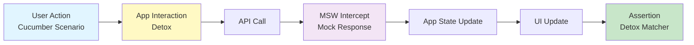
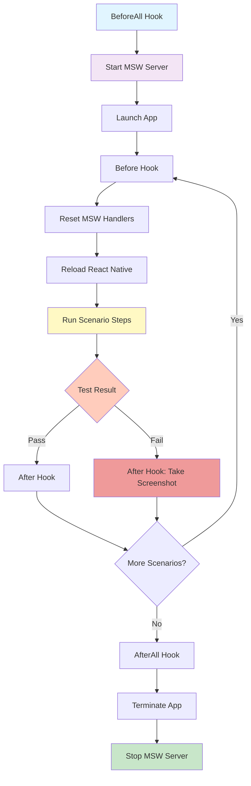
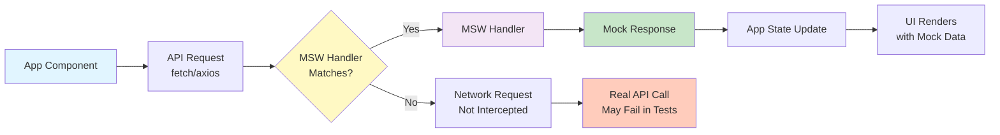

# E2E Testing Guide

This document covers end-to-end (E2E) testing with Detox, Cucumber, and MSW.

## Table of Contents

- [Overview](#overview)
- [Test Stack](#test-stack)
- [Setup](#setup)
- [Writing E2E Tests](#writing-e2e-tests)
- [Running E2E Tests](#running-e2e-tests)
- [MSW for API Mocking](#msw-for-api-mocking)
- [Best Practices](#best-practices)
- [Debugging](#debugging)
- [Troubleshooting](#troubleshooting)

## Overview

### What is E2E Testing?

End-to-end testing validates the complete user flow from start to finish, simulating real user interactions with your app. Unlike unit tests that test individual components in isolation, E2E tests verify that all parts of the app work together correctly.

### Why Detox + Cucumber?

- **Detox**: Grey-box testing framework for React Native with excellent performance and synchronisation
- **Cucumber**: Behaviour-Driven Development (BDD) tool using human-readable Gherkin syntax
- **MSW (Mock Service Worker)**: API mocking for consistent, reliable tests without backend dependencies

### Testing Flow



### Detox Test Execution Flow



## Test Stack

### Core Technologies

- **Detox**: E2E test runner and automation framework
- **Cucumber**: BDD test framework with Gherkin syntax
- **MSW**: API request interception and mocking
- **Jest**: Test runner (shared with unit tests)

### File Naming Convention

```
features/
  Home/
    __tests__/
      HomeScreen.feature        # Gherkin scenarios
      HomeScreen.cucumber.tsx   # Step definitions
```

- `.feature` - Gherkin scenarios (Given-When-Then)
- `.cucumber.tsx` - TypeScript step definitions

## Setup

### 1. Install Dependencies

```bash
# Detox CLI (global)
npm install -g detox-cli

# Project dependencies
yarn add -D detox @cucumber/cucumber msw
yarn add -D @types/cucumber @types/detox
```

### 2. Initialise Detox

```bash
detox init
```

This creates:

- `.detoxrc.json` - Detox configuration
- `e2e/` - E2E test directory (optional, we use feature-first structure)

### 3. Configure Detox

**`.detoxrc.json`:**

```json
{
  "testRunner": {
    "args": {
      "$0": "cucumber-js",
      "features": "src/**/*.feature",
      "require": ["src/test-utils/cucumber/support/**/*.ts", "src/**/*.cucumber.tsx"],
      "format": ["progress", "json:e2e-results.json"]
    },
    "jest": {
      "setupTimeout": 120000
    }
  },
  "apps": {
    "ios.debug": {
      "type": "ios.app",
      "binaryPath": "ios/build/Build/Products/Debug-iphonesimulator/warrendeleon.app",
      "build": "xcodebuild -workspace ios/warrendeleon.xcworkspace -scheme warrendeleon -configuration Debug -sdk iphonesimulator -derivedDataPath ios/build"
    },
    "ios.release": {
      "type": "ios.app",
      "binaryPath": "ios/build/Build/Products/Release-iphonesimulator/warrendeleon.app",
      "build": "xcodebuild -workspace ios/warrendeleon.xcworkspace -scheme warrendeleon -configuration Release -sdk iphonesimulator -derivedDataPath ios/build"
    },
    "android.debug": {
      "type": "android.apk",
      "binaryPath": "android/app/build/outputs/apk/debug/app-debug.apk",
      "build": "cd android && ./gradlew assembleDebug assembleAndroidTest -DtestBuildType=debug && cd .."
    },
    "android.release": {
      "type": "android.apk",
      "binaryPath": "android/app/build/outputs/apk/release/app-release.apk",
      "build": "cd android && ./gradlew assembleRelease assembleAndroidTest -DtestBuildType=release && cd .."
    }
  },
  "devices": {
    "simulator": {
      "type": "ios.simulator",
      "device": {
        "type": "iPhone 15 Pro"
      }
    },
    "emulator": {
      "type": "android.emulator",
      "device": {
        "avdName": "Pixel_7_API_35"
      }
    }
  },
  "configurations": {
    "ios.sim.debug": {
      "device": "simulator",
      "app": "ios.debug"
    },
    "ios.sim.release": {
      "device": "simulator",
      "app": "ios.release"
    },
    "android.emu.debug": {
      "device": "emulator",
      "app": "android.debug"
    },
    "android.emu.release": {
      "device": "emulator",
      "app": "android.release"
    }
  }
}
```

### 4. Configure Cucumber

**`.cucumber.js`:**

```javascript
module.exports = {
  default: {
    require: ['src/test-utils/cucumber/support/**/*.ts', 'src/**/*.cucumber.tsx'],
    requireModule: ['ts-node/register'],
    format: [
      './src/test-utils/cucumber/formatters/CheckmarkFormatter.js',
      'json:cucumber-report.json',
      'html:cucumber-report.html',
    ],
    formatOptions: { snippetInterface: 'async-await' },
  },
};
```

### 5. Add Scripts to package.json

```json
{
  "scripts": {
    "detox:ios:build": "detox build -c ios.sim.debug",
    "detox:android:build": "detox build -c android.emu.debug",
    "detox:ios:test": "DETOX_LOGLEVEL=error DETOX_CONFIGURATION=ios.sim.debug TS_NODE_PROJECT=tsconfig.cucumber.json cucumber-js --format ./src/test-utils/cucumber/formatters/CheckmarkFormatter.js --require-module ts-node/register --require-module tsconfig-paths/register 'src/features/**/__tests__/*.feature' --require 'src/test-utils/cucumber/**/*.{ts,tsx}' --require 'src/features/**/__tests__/*.cucumber.{ts,tsx}'",
    "detox:android:test": "DETOX_LOGLEVEL=error DETOX_CONFIGURATION=android.emu.debug TS_NODE_PROJECT=tsconfig.cucumber.json cucumber-js --format ./src/test-utils/cucumber/formatters/CheckmarkFormatter.js --require-module ts-node/register --require-module tsconfig-paths/register 'src/features/**/__tests__/*.feature' --require 'src/test-utils/cucumber/**/*.{ts,tsx}' --require 'src/features/**/__tests__/*.cucumber.{ts,tsx}'",
    "e2e:ios": "yarn detox:ios:build && yarn detox:ios:test",
    "e2e:android": "yarn detox:android:build && yarn detox:android:test"
  }
}
```

### 6. Setup Test Utilities

**`src/test-utils/cucumber/support/world.ts`:**

```typescript
import { setWorldConstructor, World } from '@cucumber/cucumber';
import { device, element, expect as detoxExpect } from 'detox';

/**
 * Cucumber World - shared context across step definitions
 */
export class CustomWorld extends World {
  device = device;
  element = element;
  expect = detoxExpect;

  // Store values between steps
  storage: Record<string, any> = {};
}

setWorldConstructor(CustomWorld);
```

**`src/test-utils/cucumber/support/hooks.ts`:**

```typescript
import { Before, After, BeforeAll, AfterAll } from '@cucumber/cucumber';
import { device } from 'detox';

/**
 * Detox lifecycle hooks
 */
BeforeAll(async () => {
  await device.launchApp({
    newInstance: true,
    permissions: { notifications: 'YES' },
  });
});

Before(async () => {
  await device.reloadReactNative();
});

After(async function (scenario) {
  if (scenario.result?.status === 'failed') {
    const screenshot = await device.takeScreenshot(scenario.pickle.name);
    this.attach(screenshot, 'image/png');
  }
});

AfterAll(async () => {
  await device.terminateApp();
});
```

**`src/test-utils/cucumber/step-definitions/common.steps.tsx`:**

```typescript
import { Given, When, Then } from '@cucumber/cucumber';
import { by, element, expect as detoxExpect } from 'detox';

/**
 * Common step definitions shared across all features
 */
Given('I am on the {string} screen', async (screenName: string) => {
  await detoxExpect(element(by.text(screenName))).toBeVisible();
});

When('I tap the {string} button', async (buttonLabel: string) => {
  await element(by.text(buttonLabel)).tap();
});

When('I tap the element with testID {string}', async (testID: string) => {
  await element(by.id(testID)).tap();
});

Then('I should see {string}', async (text: string) => {
  await detoxExpect(element(by.text(text))).toBeVisible();
});

Then('I should not see {string}', async (text: string) => {
  await detoxExpect(element(by.text(text))).not.toBeVisible();
});

Then('the element with testID {string} should be visible', async (testID: string) => {
  await detoxExpect(element(by.id(testID))).toBeVisible();
});
```

## Writing E2E Tests

### Gherkin Features

**Syntax:**

```gherkin
Feature: Feature Name
  Description of the feature

  Background:
    Given common setup for all scenarios

  Scenario: Scenario Name
    Given initial state
    When user action
    Then expected outcome

  Scenario Outline: Parameterised Scenario
    Given initial state with <param>
    When action with <param>
    Then outcome with <param>

    Examples:
      | param |
      | value1 |
      | value2 |
```

**Example: `src/features/Home/__tests__/HomeScreen.feature`:**

```gherkin
Feature: Home Screen
  As a user
  I want to navigate from the home screen
  So I can access different parts of the app

  Background:
    Given the app is launched
    And I am on the "Home" screen

  Scenario: Navigate to Settings
    When I tap the "Settings" button
    Then I should see "Settings"
    And I should see "Language"
    And I should see "Appearance"

  Scenario: Display environment information
    Then I should see "ENV"
    And I should see "API_URL"

  Scenario Outline: Language-specific content
    Given the app language is set to "<language>"
    When I am on the "Home" screen
    Then I should see "<homeTitle>"

    Examples:
      | language | homeTitle |
      | en       | Home      |
      | es       | Inicio    |
```

### Step Definitions

**Example: `src/features/Home/__tests__/HomeScreen.cucumber.tsx`:**

```typescript
import { Given, When, Then } from '@cucumber/cucumber';
import { by, element, expect as detoxExpect } from 'detox';

/**
 * Home screen-specific step definitions
 */
Given('the app is launched', async () => {
  // Detox handles this in BeforeAll hook
  await detoxExpect(element(by.id('app-root'))).toExist();
});

Given('the app language is set to {string}', async function (language: string) {
  // Navigate to language settings
  await element(by.text('Settings')).tap();
  await element(by.text('Language')).tap();

  // Select language
  const languageMap: Record<string, string> = {
    en: 'English',
    es: 'Spanish',
  };
  await element(by.text(languageMap[language])).tap();

  // Navigate back to home
  await element(by.id('back-button')).tap();
  await element(by.id('back-button')).tap();

  // Store language for later steps
  this.storage.language = language;
});

Then('I should see {string}', async (text: string) => {
  await detoxExpect(element(by.text(text))).toBeVisible();
});
```

### Using testID in Components

Always add `testID` props for E2E testing:

```typescript
// Component
export const HomeScreen = () => {
  const navigation = useNavigation();

  return (
    <View testID="home-screen">
      <Text testID="home-title">Home</Text>
      <Button
        testID="settings-button"
        onPress={() => navigation.navigate('Settings')}
      >
        Settings
      </Button>
    </View>
  );
};
```

### Matchers

```typescript
// Visibility
await expect(element(by.id('button'))).toBeVisible();
await expect(element(by.id('button'))).not.toBeVisible();
await expect(element(by.id('button'))).toExist();

// Value
await expect(element(by.id('input'))).toHaveText('Hello');
await expect(element(by.id('label'))).toHaveLabel('Username');

// State
await expect(element(by.id('toggle'))).toHaveToggleValue(true);
```

## Running E2E Tests

### Quick Reference

```bash
# Build the app first (only needed once or after code changes)
yarn detox:ios:build     # Takes ~2-3 minutes

# Run all tests
yarn detox:ios:test      # Takes ~2.5 minutes (12 scenarios, 96 steps)

# Run single scenario (much faster!)
yarn detox:ios:test 'src/features/Settings/__tests__/Settings.feature:10'  # Takes ~16 seconds
```

### Full Test Suite

```bash
# iOS - Full suite
yarn detox:ios:build    # Build app for testing
yarn detox:ios:test     # Run all tests
yarn e2e:ios            # Build + test (convenience)

# Android - Full suite
yarn detox:android:build
yarn detox:android:test
yarn e2e:android
```

**Timing**: Running the full suite takes approximately **2.5 minutes** for all 12 scenarios (96 steps).

### Run Single Scenario (Faster Iteration)

For faster development cycles, run individual scenarios by specifying the line number:

```bash
# Run a specific scenario (starts at line 10)
yarn detox:ios:test 'src/features/Settings/__tests__/Settings.feature:10'

# Or directly with DETOX_CONFIGURATION
DETOX_CONFIGURATION=ios.sim.debug yarn cucumber-js \
  --require-module ts-node/register \
  --require-module tsconfig-paths/register \
  'src/features/Settings/__tests__/Settings.feature:10' \
  --require 'src/test-utils/cucumber/**/*.{ts,tsx}' \
  --require 'src/features/**/__tests__/*.cucumber.{ts,tsx}'
```

**Timing**: Running a single scenario takes approximately **16 seconds** - much faster for iterating on a specific test!

**Pro tip**: Find the line number by opening your `.feature` file and noting the line where the `Scenario:` keyword appears.

### Run Specific Feature

```bash
# Run all scenarios in a feature file
yarn detox:ios:test 'src/features/Home/__tests__/HomeScreen.feature'

# Run all scenarios in Settings feature
yarn detox:ios:test 'src/features/Settings/__tests__/Settings.feature'
```

### Run with Tags

```bash
# Add tags to scenarios in .feature files
@smoke
Scenario: Critical user flow
  Given initial state
  When action
  Then outcome

# Run only @smoke tests
DETOX_CONFIGURATION=ios.sim.debug yarn cucumber-js \
  --tags @smoke \
  --require-module ts-node/register \
  --require-module tsconfig-paths/register \
  'src/features/**/__tests__/*.feature' \
  --require 'src/test-utils/cucumber/**/*.{ts,tsx}' \
  --require 'src/features/**/__tests__/*.cucumber.{ts,tsx}'

# Run all except @slow tests
DETOX_CONFIGURATION=ios.sim.debug yarn cucumber-js \
  --tags "not @slow" \
  # ... (same require flags)
```

### Debug Mode

```bash
# Run with debug logging
DETOX_LOGLEVEL=trace DETOX_CONFIGURATION=ios.sim.debug yarn cucumber-js \
  --require-module ts-node/register \
  --require-module tsconfig-paths/register \
  'src/features/**/__tests__/*.feature' \
  --require 'src/test-utils/cucumber/**/*.{ts,tsx}' \
  --require 'src/features/**/__tests__/*.cucumber.{ts,tsx}'

# Keep app running after tests
DETOX_CONFIGURATION=ios.sim.debug yarn cucumber-js --cleanup false \
  # ... (other flags)
```

## MSW for API Mocking

### MSW Request Interception Flow



### Setup MSW

**`src/test-utils/cucumber/mocks/server.ts`:**

```typescript
import { setupServer } from 'msw/node';
import { handlers } from './handlers';

/**
 * MSW server for E2E tests
 * Intercepts API calls and returns mock responses
 */
export const server = setupServer(...handlers);

export const startMockServer = () => {
  server.listen({ onUnhandledRequest: 'warn' });
};

export const stopMockServer = () => {
  server.close();
};

export const resetMockServer = () => {
  server.resetHandlers();
};
```

**`src/test-utils/cucumber/mocks/handlers.ts`:**

```typescript
import { http, HttpResponse } from 'msw';

/**
 * Default API mock handlers
 */
export const handlers = [
  // User profile endpoint
  http.get('https://api.example.com/user/profile', () => {
    return HttpResponse.json({
      id: '1',
      name: 'Test User',
      email: 'test@example.com',
    });
  }),

  // Login endpoint
  http.post('https://api.example.com/auth/login', async ({ request }) => {
    const { email, password } = await request.json();

    if (email === 'test@example.com' && password === 'password123') {
      return HttpResponse.json({
        token: 'mock-jwt-token',
        user: { id: '1', email },
      });
    }

    return HttpResponse.json({ error: 'Invalid credentials' }, { status: 401 });
  }),

  // Error scenario
  http.get('https://api.example.com/error', () => {
    return HttpResponse.json({ error: 'Server error' }, { status: 500 });
  }),
];
```

### Use MSW in Tests

**Update `hooks.ts`:**

```typescript
import { BeforeAll, AfterAll, Before } from '@cucumber/cucumber';
import { device } from 'detox';
import { startMockServer, stopMockServer, resetMockServer } from '../mocks/server';

BeforeAll(async () => {
  // Start MSW server before all tests
  startMockServer();

  await device.launchApp({
    newInstance: true,
  });
});

Before(async () => {
  // Reset handlers between scenarios
  resetMockServer();
  await device.reloadReactNative();
});

AfterAll(async () => {
  await device.terminateApp();

  // Stop MSW server after all tests
  stopMockServer();
});
```

**Custom Handlers in Tests:**

```typescript
import { Given, When, Then } from '@cucumber/cucumber';
import { http, HttpResponse } from 'msw';
import { server } from '@app/test-utils/cucumber/mocks/server';

Given('the API returns a server error', async () => {
  // Override default handler for this scenario
  server.use(
    http.get('https://api.example.com/user/profile', () => {
      return HttpResponse.json({ error: 'Server error' }, { status: 500 });
    })
  );
});

Then('I should see an error message', async () => {
  await expect(element(by.text('Failed to load profile'))).toBeVisible();
});
```

### MSW Best Practices

1. **Default Handlers**: Define common successful responses in `handlers.ts`
2. **Override Per Scenario**: Use `server.use()` to override handlers for specific test scenarios
3. **Reset Between Tests**: Always call `resetMockServer()` in `Before` hook to prevent state leakage
4. **Warn on Unhandled**: Use `onUnhandledRequest: 'warn'` to identify missing handlers
5. **Match Exact URLs**: Ensure handler URLs match your app's API calls exactly (including protocol, domain, path)

## Best Practices

### 1. Use Page Object Pattern

**`src/features/Home/__tests__/HomeScreen.page.ts`:**

```typescript
import { by, element } from 'detox';

/**
 * Page Object for Home Screen
 * Encapsulates element selectors and actions
 */
export class HomeScreenPage {
  // Selectors
  get screen() {
    return element(by.id('home-screen'));
  }

  get title() {
    return element(by.id('home-title'));
  }

  get settingsButton() {
    return element(by.id('settings-button'));
  }

  // Actions
  async tapSettings() {
    await this.settingsButton.tap();
  }

  async waitForScreen() {
    await this.screen.waitToBeVisible();
  }
}
```

**Use in steps:**

```typescript
import { When, Then } from '@cucumber/cucumber';
import { HomeScreenPage } from './HomeScreen.page';

const homePage = new HomeScreenPage();

When('I navigate to Settings from Home', async () => {
  await homePage.tapSettings();
});

Then('the Home screen is visible', async () => {
  await homePage.waitForScreen();
});
```

### 2. Write Declarative Scenarios

**Bad:**

```gherkin
Scenario: Login
  Given I tap the email input
  And I type "test@example.com"
  And I tap the password input
  And I type "password123"
  And I tap the login button
  Then I see the home screen
```

**Good:**

```gherkin
Scenario: Login
  Given I am on the login screen
  When I login with valid credentials
  Then I should be on the home screen
```

### 3. Use Background for Common Setup

```gherkin
Feature: Settings

  Background:
    Given the app is launched
    And I navigate to Settings

  Scenario: Change language
    When I select Spanish
    Then the app language should be Spanish
```

### 4. Tag Scenarios

```gherkin
@smoke
Scenario: Critical user flow
  Given initial state
  When action
  Then outcome

@slow
Scenario: Long-running test
  Given initial state
  When slow action
  Then outcome
```

Run by tag:

```bash
yarn detox:ios:test --tags @smoke
yarn detox:ios:test --tags "not @slow"
```

### 5. Keep Tests Independent

Each scenario should:

- Set up its own data
- Not depend on other scenarios
- Clean up after itself (handled by `Before` hook)

### 6. Use Meaningful testIDs

```typescript
// Bad
<Button testID="btn1" />

// Good
<Button testID="submit-login-button" />
```

### 7. Wait for Elements

```typescript
// Wait for element to appear
await waitFor(element(by.id('message')))
  .toBeVisible()
  .withTimeout(5000);

// Wait for element to disappear
await waitFor(element(by.id('loading')))
  .not.toBeVisible()
  .withTimeout(10000);
```

## Debugging

### 1. Screenshots

Automatic on failure (configured in hooks), or manual:

```typescript
await device.takeScreenshot('test-failure');
```

Screenshots are saved to:

- **iOS**: `e2e/artifacts/<test-name>.png`
- **Android**: `e2e/artifacts/<test-name>.png`

### 2. Debug Logging

```typescript
// Log element attributes
console.log('Current screen:', await element(by.id('screen-title')).getAttributes());

// Log test context
console.log('Storage:', this.storage);
```

### 3. Slow Down Tests

```typescript
await device.launchApp({
  newInstance: true,
  launchArgs: { detoxPrintBusyIdleResources: 'YES' },
});
```

### 4. Inspect Element Hierarchy

```bash
# iOS - Generate element tree
detox test --configuration ios.sim.debug --take-screenshots all --record-logs all

# Android - Dump UI hierarchy
adb shell uiautomator dump
adb pull /sdcard/window_dump.xml
```

### 5. Keep App Running

```bash
# Don't terminate app after tests (useful for debugging UI state)
detox test --configuration ios.sim.debug --cleanup false
```

### 6. Verbose Logging

```bash
# Enable trace logging
DETOX_LOGLEVEL=trace yarn detox:ios:test

# Enable MSW logging
# In server.ts:
server.listen({
  onUnhandledRequest: req => {
    console.log('Unhandled request:', req.method, req.url);
  },
});
```

## Troubleshooting

### Tests Timeout

**Problem**: Tests hang or timeout during execution

**Solution**:

```typescript
// Increase timeout for specific element
await waitFor(element(by.id('slow-element')))
  .toBeVisible()
  .withTimeout(30000); // 30 seconds

// Or globally in .detoxrc.json
{
  "testRunner": {
    "jest": {
      "setupTimeout": 300000 // 5 minutes
    }
  }
}
```

**Common Causes**:

- Network requests taking too long (use MSW to mock)
- Animations not completing (disable in test builds)
- Detox waiting for app to be idle (disable synchronisation temporarily)

### Element Not Found

**Problem**: `Error: Cannot find element with id "element-id"`

**Solution**:

1. **Verify testID exists in component**:

   ```typescript
   <Button testID="submit-button">Submit</Button>
   ```

2. **Check element visibility**:

   ```typescript
   // Element might exist but not be visible
   await waitFor(element(by.id('element')))
     .toBeVisible()
     .withTimeout(5000);
   ```

3. **Use correct matcher**:

   ```typescript
   // For testID prop
   element(by.id('element-id'));

   // For text content
   element(by.text('Button Label'));

   // For accessibility label
   element(by.label('Accessibility Label'));
   ```

4. **Debug element tree**:
   ```typescript
   // Log all attributes
   const attributes = await element(by.id('parent')).getAttributes();
   console.log('Element tree:', JSON.stringify(attributes, null, 2));
   ```

### Synchronisation Issues

**Problem**: "Detox can't synchronise with the app" or "App is busy"

**Solution**:

```typescript
// Temporarily disable synchronisation
await device.disableSynchronization();
await element(by.id('element')).tap();
await device.enableSynchronization();
```

**Common Causes**:

- Infinite animations (timers, loading spinners)
- WebSockets keeping app "busy"
- Long-running background tasks

**Permanent Fix**:

```typescript
// Disable animations in test builds
if (__DEV__ && process.env.DETOX_ENABLED) {
  UIManager.setLayoutAnimationEnabledExperimental?.(false);
}
```

### Build Failures

**Problem**: Detox build fails with Xcode or Gradle errors

**Solution**:

```bash
# iOS - Clean and rebuild
cd ios
xcodebuild clean -workspace warrendeleon.xcworkspace -scheme warrendeleon
cd ..
yarn detox:ios:build

# iOS - Reset DerivedData
rm -rf ~/Library/Developer/Xcode/DerivedData
yarn detox:ios:build

# Android - Clean and rebuild
cd android
./gradlew clean
cd ..
yarn detox:android:build

# Android - Invalidate caches
cd android
./gradlew cleanBuildCache
cd ..
```

**Verify Configuration**:

- Check `.detoxrc.json` binary paths match actual build output
- Ensure Xcode scheme matches configuration name
- Verify Android build type (debug/release) matches configuration

### MSW Not Intercepting Requests

**Problem**: API calls not being mocked, tests fail with network errors

**Solution**:

1. **Verify MSW is started**:

   ```typescript
   // In hooks.ts BeforeAll
   BeforeAll(async () => {
     startMockServer(); // Must be called!
     await device.launchApp();
   });
   ```

2. **Check handler URL matches exactly**:

   ```typescript
   // Handler URL must match API call exactly
   http.get('https://api.example.com/user/profile', () => { ... })

   // In app:
   fetch('https://api.example.com/user/profile') // Must match!
   ```

3. **Enable unhandled request logging**:

   ```typescript
   server.listen({
     onUnhandledRequest: req => {
       console.warn('Unhandled request:', req.method, req.url);
     },
   });
   ```

4. **Check MSW version compatibility**:
   ```bash
   # Ensure MSW v2+ is installed
   yarn list msw
   ```

### Simulator/Emulator Issues

**Problem**: Simulator not responding or app not installing

**Solution**:

```bash
# iOS - Reset specific simulator
xcrun simctl list | grep "iPhone 15 Pro"  # Find UDID
xcrun simctl erase <UDID>

# iOS - Reset all simulators (WARNING: deletes all data)
xcrun simctl erase all

# iOS - Boot simulator manually
xcrun simctl boot "iPhone 15 Pro"

# Android - List emulators
emulator -list-avds

# Android - Cold boot emulator
emulator -avd Pixel_7_API_35 -no-snapshot-load

# Android - Wipe emulator data
emulator -avd Pixel_7_API_35 -wipe-data
```

### Step Definition Not Found

**Problem**: "Undefined. Implement with the following snippet:"

**Solution**:

1. **Check file naming**:

   ```
   HomeScreen.cucumber.tsx  ✓ Correct
   HomeScreen.steps.tsx     ✗ Wrong (not loaded)
   ```

2. **Verify Cucumber require paths in package.json**:

   ```json
   {
     "detox:ios:test": "... --require 'src/features/**/__tests__/*.cucumber.{ts,tsx}'"
   }
   ```

3. **Ensure step definition is exported**:
   ```typescript
   import { Given, When, Then } from '@cucumber/cucumber';
   // Steps are auto-registered, no need to export
   Given('I am on the {string} screen', async (screenName: string) => {
     // Implementation
   });
   ```

### Flaky Tests

**Problem**: Tests pass sometimes and fail other times

**Common Causes & Solutions**:

1. **Timing Issues**:

   ```typescript
   // Bad - May fail if element appears slowly
   await element(by.id('button')).tap();

   // Good - Wait for element first
   await waitFor(element(by.id('button')))
     .toBeVisible()
     .withTimeout(5000);
   await element(by.id('button')).tap();
   ```

2. **State Leakage Between Tests**:

   ```typescript
   // Ensure Before hook resets app state
   Before(async () => {
     resetMockServer(); // Reset MSW handlers
     await device.reloadReactNative(); // Reset app state
   });
   ```

3. **Animation Interference**:

   ```typescript
   // Disable animations in test builds
   await device.launchApp({
     newInstance: true,
     launchArgs: { detoxEnableSynchronization: 'NO' },
   });
   ```

4. **Network Race Conditions**:
   ```typescript
   // Use MSW to return responses immediately
   // Avoid relying on real network timing
   ```

## Next Steps

- See [Testing](./TESTING.md) for unit/integration testing
- See [Contributing](./CONTRIBUTING.md) for test requirements
- See [Development](./DEVELOPMENT.md) for running the app
- See [CHEATSHEET](./CHEATSHEET.md) for quick command reference
- See [WORKFLOWS](./WORKFLOWS.md) for E2E debugging workflow

---

**Need help?** Check the [Detox documentation](https://wix.github.io/Detox/) or [Cucumber documentation](https://cucumber.io/docs/cucumber/).
