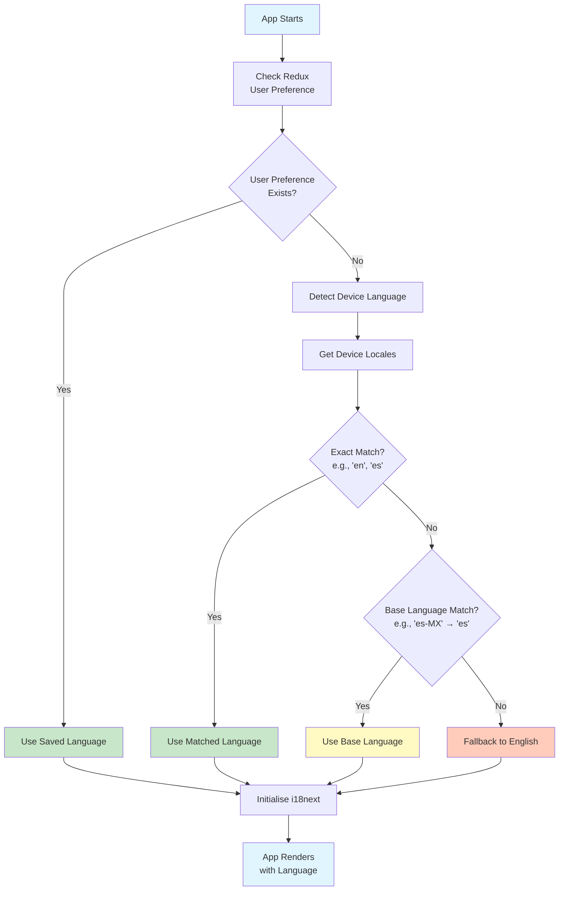

# Internationalisation (i18n) Guide

This document covers internationalisation with i18next and react-i18next.

## Table of Contents

- [Overview](#overview)
- [Setup](#setup)
- [Project Structure](#project-structure)
- [Adding Translations](#adding-translations)
- [Using Translations](#using-translations)
- [Language Detection](#language-detection)
- [Changing Language](#changing-language)
- [Best Practices](#best-practices)
- [Testing](#testing)
- [Troubleshooting](#troubleshooting)

## Overview

### Why i18next?

- **Industry Standard**: Most popular i18n framework for JavaScript
- **React Native Support**: First-class support via react-i18next
- **Type Safety**: Full TypeScript support
- **Feature Rich**: Pluralisation, interpolation, formatting, and more
- **Performance**: Efficient bundle splitting and lazy loading

### Current Languages

- English (en) - Default
- Spanish (es)

### Tech Stack

- **i18next**: Core i18n framework
- **react-i18next**: React bindings for i18next
- **react-native-localise**: Device locale detection

## Setup

The project is already configured with i18next. This section documents the setup for reference.

### Dependencies

```json
{
  "dependencies": {
    "i18next": "^25.6.0",
    "react-i18next": "^16.2.4",
    "react-native-localize": "^3.6.0"
  }
}
```

### Configuration

**`src/i18n/index.ts`:**

```typescript
import { initReactI18next } from 'react-i18next';
import { getLocales } from 'react-native-localize';
import i18next from 'i18next';

import { resources } from './resources';

export const defaultNS = 'translation';

const languageTag = resolveLanguageTag({ getLocales });

i18next.use(initReactI18next).init({
  compatibilityJSON: 'v4',
  lng: languageTag,
  fallbackLng: 'en',
  defaultNS,
  resources,
  interpolation: {
    escapeValue: false, // React already escapes
  },
});

export default i18next;
```

**`src/i18n/resources.ts`:**

```typescript
import en from './locales/en.json';
import es from './locales/es.json';

/**
 * Translation resources for all supported languages
 */
export const resources = {
  en: { translation: en },
  es: { translation: es },
} as const;
```

### Language Detection

**`src/i18n/index.ts`:**

```typescript
export interface LocalizeModule {
  getLocales?: () => Array<{
    languageTag: string;
    languageCode?: string;
  }>;
}

const fallback = { languageTag: 'en', isRTL: false };

export const resolveLanguageTag = (localize: LocalizeModule): string => {
  const supported = Object.keys(resources);
  const locales = localize.getLocales?.() ?? [];
  const primary = locales[0];

  if (primary) {
    const { languageTag, languageCode } = primary;

    // 1) Exact tag match (e.g. "en", "es")
    if (languageTag && supported.includes(languageTag)) {
      return languageTag;
    }

    // 2) Base language match (e.g. "es-ES" -> "es")
    if (languageCode) {
      const baseMatch = supported.find(code => code === languageCode);
      if (baseMatch) {
        return baseMatch;
      }
    }
  }

  // 3) Fallback to English if nothing matches
  return fallback.languageTag;
};
```

This ensures the app uses:

1. Device language if supported
2. Base language if device uses regional variant (e.g., "es-MX" → "es")
3. English as fallback

### Language Resolution Flow



## Project Structure

```
src/i18n/
├── __tests__/
│   ├── index.test.ts           # i18n initialisation tests
│   └── localesParity.test.ts   # Translation completeness tests
├── locales/
│   ├── en.json                 # English translations
│   └── es.json                 # Spanish translations
├── index.ts                    # i18next configuration
└── resources.ts                # Translation resource imports
```

### Translation Files

**`src/i18n/locales/en.json`:**

```json
{
  "home": {
    "title": "Home",
    "env": "ENV",
    "apiUrl": "API_URL",
    "settings": "Settings"
  },
  "settings": {
    "title": "Settings",
    "language": "Language",
    "preferredLanguage": "Preferred Language",
    "appearance": "Appearance",
    "darkAppearance": "Dark Appearance",
    "general": "General"
  },
  "language": {
    "title": "Language",
    "languages": "Languages",
    "english": "English",
    "spanish": "Spanish"
  },
  "appearance": {
    "title": "Appearance",
    "appearance": "Appearance",
    "automatic": "Automatic",
    "light": "Light",
    "dark": "Dark"
  }
}
```

## Adding Translations

### 1. Add New Translation Keys

Edit both `en.json` and `es.json`:

**`src/i18n/locales/en.json`:**

```json
{
  "profile": {
    "title": "Profile",
    "editProfile": "Edit Profile",
    "logout": "Logout",
    "greeting": "Hello, {{name}}!",
    "itemCount": "You have {{count}} item",
    "itemCount_plural": "You have {{count}} items",
    "lastSeen": "Last seen {{timeAgo}}",
    "followers": "{{count}} follower",
    "followers_plural": "{{count}} followers"
  }
}
```

**`src/i18n/locales/es.json`:**

```json
{
  "profile": {
    "title": "Perfil",
    "editProfile": "Editar Perfil",
    "logout": "Cerrar Sesión",
    "greeting": "¡Hola, {{name}}!",
    "itemCount": "Tienes {{count}} artículo",
    "itemCount_plural": "Tienes {{count}} artículos",
    "lastSeen": "Visto por última vez {{timeAgo}}",
    "followers": "{{count}} seguidor",
    "followers_plural": "{{count}} seguidores"
  }
}
```

### 2. Run Parity Test

Ensure all languages have the same keys:

```bash
yarn test localesParity
```

This test validates that:

- All languages have identical key structures
- No missing translations
- No extra keys in any language

**`src/i18n/__tests__/localesParity.test.ts`:**

```typescript
import { resources } from '../resources';

describe('Locales Parity', () => {
  const languages = Object.keys(resources);
  const [baseLanguage, ...otherLanguages] = languages;
  const baseKeys = getKeys(resources[baseLanguage].translation);

  otherLanguages.forEach(language => {
    it(`${language} has all keys from ${baseLanguage}`, () => {
      const languageKeys = getKeys(resources[language].translation);
      expect(languageKeys).toEqual(baseKeys);
    });
  });
});

function getKeys(obj: any, prefix = ''): string[] {
  return Object.keys(obj).reduce((keys: string[], key) => {
    const path = prefix ? `${prefix}.${key}` : key;
    if (typeof obj[key] === 'object') {
      return [...keys, ...getKeys(obj[key], path)];
    }
    return [...keys, path];
  }, []);
}
```

### 3. Organise by Feature

Structure translations to mirror your feature structure:

```json
{
  "home": {
    "title": "Home",
    "welcome": "Welcome",
    "getStarted": "Get Started"
  },
  "settings": {
    "title": "Settings",
    "language": "Language",
    "notifications": "Notifications"
  },
  "auth": {
    "login": "Login",
    "signup": "Sign Up",
    "email": "Email",
    "password": "Password",
    "forgotPassword": "Forgot Password?",
    "rememberMe": "Remember me"
  }
}
```

### 4. Nested Keys

Use dot notation for nested keys:

```json
{
  "errors": {
    "network": {
      "timeout": "Connection timeout",
      "offline": "No internet connection",
      "serverError": "Server error occurred"
    },
    "validation": {
      "required": "This field is required",
      "email": "Invalid email address",
      "passwordMinLength": "Password must be at least 8 characters",
      "passwordMatch": "Passwords do not match"
    },
    "auth": {
      "invalidCredentials": "Invalid email or password",
      "accountLocked": "Account locked. Contact support.",
      "sessionExpired": "Session expired. Please login again."
    }
  }
}
```

Access with: `t('errors.network.timeout')`

## Using Translations

### In Components

**Basic Usage:**

```typescript
import { useTranslation } from 'react-i18next';

export const HomeScreen = () => {
  const { t } = useTranslation();

  return (
    <View>
      <Text>{t('home.title')}</Text>
      <Button>{t('home.settings')}</Button>
    </View>
  );
};
```

**With Interpolation:**

```typescript
const { t } = useTranslation();

// Translation: "Hello, {{name}}!"
<Text>{t('profile.greeting', { name: 'John' })}</Text>
// Output: "Hello, John!"

// Multiple interpolations
// Translation: "{{count}} of {{total}} items selected"
<Text>{t('selection.summary', { count: 3, total: 10 })}</Text>
// Output: "3 of 10 items selected"
```

**With Pluralisation:**

```typescript
const { t } = useTranslation();

// count: 1
<Text>{t('profile.itemCount', { count: 1 })}</Text>
// Output: "You have 1 item"

// count: 5
<Text>{t('profile.itemCount', { count: 5 })}</Text>
// Output: "You have 5 items"

// count: 0 (also uses plural form in English)
<Text>{t('profile.itemCount', { count: 0 })}</Text>
// Output: "You have 0 items"
```

**With Default Value:**

```typescript
// Fallback if key doesn't exist
<Text>{t('missing.key', 'Default Text')}</Text>
// Output: "Default Text" (if key doesn't exist)
```

**Complex Example - User Profile:**

```typescript
import { useTranslation } from 'react-i18next';

export const UserProfile = ({ user }) => {
  const { t } = useTranslation();

  return (
    <View>
      {/* Interpolation */}
      <Text>{t('profile.greeting', { name: user.name })}</Text>

      {/* Pluralization */}
      <Text>{t('profile.followers', { count: user.followerCount })}</Text>

      {/* Combined interpolation + formatting */}
      <Text>{t('profile.lastSeen', { timeAgo: formatTimeAgo(user.lastSeen) })}</Text>

      {/* Conditional text */}
      <Text>
        {user.isVerified
          ? t('profile.verifiedBadge')
          : t('profile.unverifiedWarning')}
      </Text>

      {/* List with translation */}
      {user.badges.map(badge => (
        <Badge key={badge.id} text={t(`badges.${badge.key}`)} />
      ))}
    </View>
  );
};
```

### In Non-React Code

```typescript
import i18next from '@app/i18n';

// Outside React components
const message = i18next.t('errors.network.timeout');

// In utility functions
export const formatError = (errorCode: string): string => {
  return i18next.t(`errors.api.${errorCode}`, 'Unknown error');
};

// In Redux middleware
export const apiMiddleware = store => next => action => {
  if (action.error) {
    const errorMessage = i18next.t('errors.network.offline');
    showToast(errorMessage);
  }
  return next(action);
};
```

### Type-Safe Translations

Create a type helper for autocomplete:

**`src/i18n/types.ts`:**

```typescript
import { resources } from './resources';

type Translation = typeof resources.en.translation;

type RecursiveKeyOf<TObj extends object> = {
  [TKey in keyof TObj & (string | number)]: TObj[TKey] extends object
    ? `${TKey}` | `${TKey}.${RecursiveKeyOf<TObj[TKey]>}`
    : `${TKey}`;
}[keyof TObj & (string | number)];

export type TranslationKey = RecursiveKeyOf<Translation>;
```

**Usage:**

```typescript
import type { TranslationKey } from '@app/i18n/types';

const key: TranslationKey = 'home.title'; // ✓ Valid
const invalid: TranslationKey = 'home.invalid'; // ✗ TypeScript error
```

### Access Current Language

```typescript
import { useTranslation } from 'react-i18next';

const { i18n } = useTranslation();

console.log(i18n.language); // "en" or "es"
console.log(i18n.languages); // ["en"] or ["es"]
```

## Language Detection

### Device Language on App Start

The app automatically detects device language:

```typescript
// src/i18n/index.ts
import { getLocales } from 'react-native-localize';

const languageTag = resolveLanguageTag({ getLocales });
```

**Device Settings Examples:**

| Device Language | App Language | Reason                   |
| --------------- | ------------ | ------------------------ |
| English (US)    | English      | Exact match              |
| Spanish (Spain) | Spanish      | Base language match      |
| Spanish (MX)    | Spanish      | Base language match      |
| French          | English      | Fallback (not supported) |
| German          | English      | Fallback (not supported) |

### Override in Redux

User preference stored in Redux overrides device language:

```typescript
// src/features/Settings/store/reducer.ts
export interface SettingsState {
  theme: Theme;
  language: Language; // User's preference
}
```

**Priority:**

1. **User Preference** (from Redux) - Highest priority
2. **Device Language** (from react-native-localise)
3. **Fallback** (English) - Lowest priority

## Changing Language

### In Settings Screen

**`src/features/Language/LanguageScreen.tsx`:**

```typescript
import { useTranslation } from 'react-i18next';
import { useAppDispatch, useAppSelector } from '@app/store/hooks';
import { settingsSliceActions } from '@app/features/Settings/store';
import { selectLanguage } from '@app/features/Settings/store/selectors';

export const LanguageScreen = () => {
  const { t, i18n } = useTranslation();
  const dispatch = useAppDispatch();
  const currentLanguage = useAppSelector(selectLanguage);

  const changeLanguage = async (language: Language) => {
    // Update Redux state (persisted)
    dispatch(settingsSliceActions.setLanguage(language));

    // Change i18next language
    await i18n.changeLanguage(language);
  };

  return (
    <View>
      <Button
        onPress={() => changeLanguage('en')}
        variant={currentLanguage === 'en' ? 'primary' : 'secondary'}
      >
        {t('language.english')}
      </Button>
      <Button
        onPress={() => changeLanguage('es')}
        variant={currentLanguage === 'es' ? 'primary' : 'secondary'}
      >
        {t('language.spanish')}
      </Button>
    </View>
  );
};
```

### Sync Redux with i18next

**`src/app/App.tsx`:**

```typescript
import { useEffect } from 'react';
import { useTranslation } from 'react-i18next';
import { useAppSelector } from '@app/store/hooks';
import { selectLanguage } from '@app/features/Settings/store/selectors';

export const App = () => {
  const { i18n } = useTranslation();
  const language = useAppSelector(selectLanguage);

  // Sync Redux language to i18next on app start
  useEffect(() => {
    if (language && i18n.language !== language) {
      i18n.changeLanguage(language);
    }
  }, [language, i18n]);

  return <RootNavigator />;
};
```

## Best Practices

### 1. Organise Translations by Feature ✓

**Good:**

```json
{
  "auth": {
    "login": "Login",
    "signup": "Sign Up"
  },
  "profile": {
    "edit": "Edit Profile",
    "save": "Save Changes"
  }
}
```

**Bad:**

```json
{
  "login": "Login",
  "signup": "Sign Up",
  "editProfile": "Edit Profile",
  "saveProfile": "Save Changes"
}
```

> **Why**: Feature-based organisation matches your codebase structure and makes translations easier to find.

### 2. Use Descriptive Keys ✓

**Good:**

```json
{
  "auth": {
    "loginButton": "Login",
    "signupButton": "Sign Up",
    "welcomeMessage": "Welcome back!",
    "forgotPasswordLink": "Forgot password?"
  }
}
```

**Bad:**

```json
{
  "btn1": "Login",
  "btn2": "Sign Up",
  "text1": "Welcome back!",
  "link1": "Forgot password?"
}
```

> **Why**: Descriptive keys are self-documenting and easier to maintain.

### 3. Keep Values Concise ✓

Translations are for text content, not documentation:

**Good:**

```json
{
  "helpText": "Tap to start",
  "helpTextExtended": "Need more help? Visit Help Centre"
}
```

**Bad:**

```json
{
  "helpText": "This is a very long help text that explains exactly how to use this feature in great detail and provides step-by-step instructions for every possible scenario..."
}
```

> **Why**: Long translations are hard to manage and may not fit UI layouts in different languages.

### 4. Use Interpolation for Dynamic Content ✓

**Good:**

```json
{
  "welcome": "Welcome, {{name}}!",
  "itemsSelected": "{{count}} of {{total}} items selected"
}
```

**Bad:**

```json
{
  "welcomeJohn": "Welcome, John!",
  "welcomeJane": "Welcome, Jane!",
  "oneItemSelected": "1 of 10 items selected",
  "twoItemsSelected": "2 of 10 items selected"
}
```

> **Why**: Interpolation reduces duplication and supports any dynamic value.

### 5. Handle Pluralisation Properly ✓

**Good:**

```json
{
  "itemCount": "You have {{count}} item",
  "itemCount_plural": "You have {{count}} items"
}
```

```typescript
const text = t('itemCount', { count }); // Automatically selects correct form
```

**Bad:**

```typescript
const text = count === 1 ? 'You have 1 item' : `You have ${count} items`;
```

> **Why**: i18next handles pluralisation rules for different languages automatically (e.g., Arabic has 6 plural forms).

### 6. Don't Translate Code ✗

**Good:**

```json
{
  "en": {
    "apiError": "API error occurred",
    "httpStatus": "HTTP {{statusCode}}"
  },
  "es": {
    "apiError": "Error de API ocurrió",
    "httpStatus": "HTTP {{statusCode}}"
  }
}
```

**Bad:**

```json
{
  "en": {
    "apiError": "API error occurred"
  },
  "es": {
    "apiError": "Error de IPA ocurrió"
  }
}
```

> **Why**: Technical terms, brand names, and codes should remain consistent across languages.

### 7. Consider Context ✓

Some words translate differently based on context:

**Good:**

```json
{
  "modal": {
    "close": "Close" // Close a dialog
  },
  "app": {
    "exit": "Exit", // Exit the app
    "quit": "Quit" // Alternative for exit
  },
  "document": {
    "close": "Close" // Close a file
  }
}
```

**Bad:**

```json
{
  "close": "Close" // Used everywhere - ambiguous in some languages
}
```

> **Why**: The same English word may require different translations in other languages depending on context.

### 8. Maintain Translation Parity ✓

Always update all language files when adding new keys:

```bash
# Run after adding translations
yarn test localesParity

# Should pass with no missing keys
✓ es has all keys from en
```

> **Why**: Prevents runtime errors and ensures consistent user experience across languages.

### 9. Extract Common Translations ✓

**Good:**

```json
{
  "common": {
    "cancel": "Cancel",
    "save": "Save",
    "delete": "Delete",
    "edit": "Edit",
    "back": "Back",
    "next": "Next",
    "loading": "Loading...",
    "error": "Error",
    "success": "Success"
  },
  "home": {
    "title": "Home"
  }
}
```

```typescript
<Button>{t('common.save')}</Button>
```

**Bad:**

```json
{
  "home": {
    "cancel": "Cancel",
    "save": "Save"
  },
  "settings": {
    "cancel": "Cancel",
    "save": "Save"
  },
  "profile": {
    "cancel": "Cancel",
    "save": "Save"
  }
}
```

> **Why**: Reduces duplication and ensures consistent terminology.

### 10. Avoid Concatenating Translations ✗

**Good:**

```json
{
  "fullSentence": "You have {{count}} unread messages from {{sender}}"
}
```

```typescript
t('fullSentence', { count: 5, sender: 'John' });
```

**Bad:**

```typescript
// Never do this!
const message = t('youHave') + ' ' + count + ' ' + t('unreadMessages');
```

> **Why**: Word order differs between languages. Concatenation breaks translations.

### 11. Use Namespaces for Large Apps ✓

**Good:**

```typescript
// i18n/resources.ts
export const resources = {
  en: {
    common: enCommon,
    auth: enAuth,
    profile: enProfile,
  },
  es: {
    common: esCommon,
    auth: esAuth,
    profile: esProfile,
  },
};

// In component
const { t } = useTranslation('auth');
t('loginButton'); // From auth namespace
```

**Bad:**

```typescript
// All translations in single massive file
const { t } = useTranslation();
t('auth.loginButton');
t('profile.editButton');
t('settings.languageOption');
// ... hundreds of keys
```

> **Why**: Namespaces enable lazy loading and better organisation for large applications.

### 12. Test All Languages Regularly ✓

```typescript
describe('HomeScreen', () => {
  it.each(['en', 'es'])('renders correctly in %s', async language => {
    await i18next.changeLanguage(language);
    const { getByText } = render(<HomeScreen />);

    // Verify key UI elements are translated
    expect(getByText(i18next.t('home.title'))).toBeTruthy();
  });
});
```

> **Why**: Catches missing translations and UI layout issues early.

## Testing

### Test Language Switching

```typescript
import { renderWithProviders } from '@app/test-utils';
import { LanguageScreen } from '../LanguageScreen';

describe('LanguageScreen', () => {
  it('changes language when button pressed', async () => {
    const { getByText, store } = renderWithProviders(<LanguageScreen />);

    // Initially English
    expect(store.getState().settings.language).toBe('en');

    // Switch to Spanish
    fireEvent.press(getByText('Spanish'));

    await waitFor(() => {
      expect(store.getState().settings.language).toBe('es');
    });
  });

  it('persists language after app restart', async () => {
    const { getByText, store } = renderWithProviders(<LanguageScreen />);

    // Change to Spanish
    fireEvent.press(getByText('Spanish'));

    // Simulate app restart by reading persisted state
    const persistedState = await AsyncStorage.getItem('persist:root');
    const parsed = JSON.parse(persistedState);

    expect(parsed.settings.language).toBe('es');
  });
});
```

### Test Translations

```typescript
import { renderWithProviders } from '@app/test-utils';
import i18next from '@app/i18n';

describe('HomeScreen translations', () => {
  it('displays Spanish text when language is Spanish', async () => {
    // Change language
    await i18next.changeLanguage('es');

    const { getByText } = renderWithProviders(<HomeScreen />);

    expect(getByText('Inicio')).toBeTruthy(); // "Home" in Spanish
    expect(getByText('Configuración')).toBeTruthy(); // "Settings" in Spanish
  });

  it('switches language dynamically', async () => {
    const { getByText, rerender } = renderWithProviders(<HomeScreen />);

    // Initially English
    expect(getByText('Home')).toBeTruthy();

    // Switch to Spanish
    await i18next.changeLanguage('es');
    rerender(<HomeScreen />);

    expect(getByText('Inicio')).toBeTruthy();
  });
});
```

### Test Interpolation

```typescript
import { renderWithProviders } from '@app/test-utils';

describe('Greeting component', () => {
  it('interpolates name correctly', () => {
    const { getByText } = renderWithProviders(<Greeting name="John" />);

    expect(getByText('Hello, John!')).toBeTruthy();
  });

  it('interpolates multiple values', () => {
    const { getByText } = renderWithProviders(
      <ItemSelection count={3} total={10} />
    );

    expect(getByText('3 of 10 items selected')).toBeTruthy();
  });
});
```

### Test Pluralisation

```typescript
describe('ItemCount component', () => {
  it('shows singular form for count=1', () => {
    const { getByText } = renderWithProviders(<ItemCount count={1} />);

    expect(getByText('You have 1 item')).toBeTruthy();
  });

  it('shows plural form for count>1', () => {
    const { getByText } = renderWithProviders(<ItemCount count={5} />);

    expect(getByText('You have 5 items')).toBeTruthy();
  });

  it('shows plural form for count=0', () => {
    const { getByText } = renderWithProviders(<ItemCount count={0} />);

    expect(getByText('You have 0 items')).toBeTruthy();
  });
});
```

### Test Translation Parity

```typescript
import { resources } from '@app/i18n/resources';

describe('Translation Parity', () => {
  it('all languages have same key structure', () => {
    const languages = Object.keys(resources);
    const baseKeys = getKeys(resources.en.translation);

    languages.forEach(lang => {
      if (lang !== 'en') {
        const langKeys = getKeys(resources[lang].translation);
        expect(langKeys.sort()).toEqual(baseKeys.sort());
      }
    });
  });

  it('no language has empty translation values', () => {
    Object.entries(resources).forEach(([lang, { translation }]) => {
      const values = getAllValues(translation);
      const emptyValues = values.filter(v => v.trim() === '');

      expect(emptyValues).toHaveLength(0);
    });
  });
});

function getAllValues(obj: any): string[] {
  return Object.values(obj).flatMap(value =>
    typeof value === 'object' ? getAllValues(value) : [value]
  );
}
```

## Troubleshooting

### Translations Not Updating

**Problem**: Changed translations don't appear in app

**Solution**:

```bash
# 1. Clear Metro cache
yarn start --reset-cache

# 2. Reload app
# iOS: Cmd+R in simulator
# Android: RR in terminal or Cmd+M > Reload

# 3. Rebuild if still not working
# iOS
yarn ios

# Android
yarn android
```

**Common Causes**:

- Metro bundler cached old translation files
- App not reloaded after translation changes
- TypeScript not recompiled (for .ts translation files)

### Missing Translation Warning

**Problem**: `i18next: key not found: "some.key"`

**Solution**:

1. **Verify key exists in all language files**:

   ```bash
   # Search for key in all locales
   grep -r "someKey" src/i18n/locales/
   ```

2. **Check for typos**:

   ```typescript
   // Wrong
   t('home.titel'); // Typo: "titel" instead of "title"

   // Correct
   t('home.title');
   ```

3. **Run parity test**:

   ```bash
   yarn test localesParity

   # Output shows missing keys:
   # ✗ es missing keys: ["home.newFeature"]
   ```

4. **Check nesting level**:
   ```typescript
   // Translation structure:
   // { "home": { "title": "Home" } }
   // Wrong
   t('title'); // Missing namespace
   // Correct
   t('home.title');
   ```

### Wrong Language on Start

**Problem**: App doesn't use device language or shows wrong language

**Solution**:

1. **Check `resolveLanguageTag` logic**:

   ```typescript
   // Add debug logging
   export const resolveLanguageTag = (localize: LocalizeModule): string => {
     const supported = Object.keys(resources);
     const locales = localize.getLocales?.() ?? [];

     console.log('Supported languages:', supported);
     console.log('Device locales:', locales);

     // ... rest of logic
   };
   ```

2. **Verify language is supported**:

   ```typescript
   const supported = Object.keys(resources);
   console.log('Supported languages:', supported); // ["en", "es"]
   ```

3. **Check device language**:

   ```typescript
   import { getLocales } from 'react-native-localize';

   console.log('Device locales:', getLocales());
   // [{ languageTag: "es-MX", languageCode: "es", isRTL: false }]
   ```

4. **Verify Redux isn't overriding**:
   ```typescript
   const language = useAppSelector(selectLanguage);
   console.log('Redux language:', language); // Should be undefined initially
   ```

### Language Doesn't Persist

**Problem**: Language resets to device language after app restart

**Solution**:

1. **Verify Redux Persist is configured**:

   ```typescript
   // src/store/configureStore.ts
   const persistConfig = {
     key: 'root',
     storage: AsyncStorage,
     whitelist: ['settings'], // Must include 'settings'
   };

   const persistedReducer = persistReducer(persistConfig, rootReducer);
   ```

2. **Check if language is saved to Redux**:

   ```typescript
   import { selectLanguage } from '@app/features/Settings/store/selectors';

   const language = useAppSelector(selectLanguage);
   console.log('Saved language:', language); // Should be 'en' or 'es'
   ```

3. **Verify AsyncStorage**:

   ```typescript
   import AsyncStorage from '@react-native-async-storage/async-storage';

   const checkStorage = async () => {
     const value = await AsyncStorage.getItem('persist:root');
     console.log('Persisted state:', JSON.parse(value));
   };
   ```

4. **Check App.tsx synchronisation**:
   ```typescript
   // Ensure this effect exists in App.tsx
   useEffect(() => {
     if (language && i18n.language !== language) {
       i18n.changeLanguage(language);
     }
   }, [language, i18n]);
   ```

### Pluralisation Not Working

**Problem**: Plural forms not showing correctly

**Solution**:

1. **Ensure keys follow i18next convention**:

   ```json
   {
     "key": "singular form",
     "key_plural": "plural form"
   }
   ```

   ```json
   // Wrong
   {
     "item": "item",
     "items": "items"
   }

   // Correct
   {
     "item": "{{count}} item",
     "item_plural": "{{count}} items"
   }
   ```

2. **Pass `count` parameter**:

   ```typescript
   // Wrong
   t('item'); // No count provided

   // Correct
   t('item', { count: 5 }); // "5 items"
   t('item', { count: 1 }); // "1 item"
   ```

3. **Check `compatibilityJSON` setting**:

   ```typescript
   i18next.init({
     compatibilityJSON: 'v4', // Required for React Native
   });
   ```

4. **Verify plural rules for language**:
   ```typescript
   // Some languages have complex plural rules
   // Arabic: 6 forms (zero, one, two, few, many, other)
   // English: 2 forms (one, other)
   console.log(i18n.language, i18n.services.pluralResolver.getRule(i18n.language));
   ```

### Interpolation Not Working

**Problem**: Variables not replaced in translations

**Solution**:

1. **Check curly brace syntax**:

   ```json
   // Wrong
   { "greeting": "Hello, {name}!" }
   { "greeting": "Hello, $name!" }

   // Correct
   { "greeting": "Hello, {{name}}!" }
   ```

2. **Pass values object**:

   ```typescript
   // Wrong
   t('greeting', 'John'); // Passing value directly

   // Correct
   t('greeting', { name: 'John' }); // Passing object
   ```

3. **Check escaping is disabled**:

   ```typescript
   i18next.init({
     interpolation: {
       escapeValue: false, // Must be false for React
     },
   });
   ```

4. **Verify variable names match**:
   ```json
   // Translation
   { "message": "Welcome {{userName}}" }
   ```
   ```typescript
   // Wrong variable name
   t('message', { name: 'John' }); // "Welcome"
   // Correct variable name
   t('message', { userName: 'John' }); // "Welcome John"
   ```

### TypeScript Errors with Translation Keys

**Problem**: TypeScript doesn't recognise translation keys

**Solution**:

1. **Ensure resources are typed**:

   ```typescript
   export const resources = {
     en: { translation: en },
     es: { translation: es },
   } as const; // Important: 'as const'
   ```

2. **Create declaration file for react-i18next**:

   ```typescript
   // src/i18n/types.ts
   import 'react-i18next';
   import { resources } from './resources';

   declare module 'react-i18next' {
     interface CustomTypeOptions {
       defaultNS: 'translation';
       resources: (typeof resources)['en'];
     }
   }
   ```

3. **Restart TypeScript server**:
   - VS Code: `Cmd+Shift+P` → "TypeScript: Restart TS Server"

### Translation Shows as Key

**Problem**: Translation key displayed instead of translated text (e.g., "home.title" instead of "Home")

**Solution**:

1. **Check i18next initialisation**:

   ```typescript
   // Verify i18n is initialised before app renders
   import '@app/i18n'; // At top of App.tsx
   ```

2. **Ensure resources are loaded**:

   ```typescript
   console.log('i18next resources:', i18next.options.resources);
   // Should show: { en: { translation: {...} }, es: { translation: {...} } }
   ```

3. **Check for initialisation errors**:
   ```typescript
   i18next.on('initialized', options => {
     console.log('i18next initialised:', options);
   });
   i18next.on('failedLoading', (lng, ns, msg) => {
     console.error('i18next failed to load:', lng, ns, msg);
   });
   ```

## Adding a New Language

### 1. Create Translation File

**`src/i18n/locales/fr.json`:**

```json
{
  "home": {
    "title": "Accueil",
    "settings": "Paramètres"
  },
  "settings": {
    "title": "Paramètres",
    "language": "Langue"
  }
}
```

### 2. Import in resources.ts

```typescript
import en from './locales/en.json';
import es from './locales/es.json';
import fr from './locales/fr.json';

export const resources = {
  en: { translation: en },
  es: { translation: es },
  fr: { translation: fr },
} as const;
```

### 3. Add to TypeScript Type

```typescript
// src/features/Settings/store/reducer.ts
export type Language = 'en' | 'es' | 'fr';
```

### 4. Update Language Selector

```typescript
// src/features/Language/LanguageScreen.tsx
<Button onPress={() => changeLanguage('fr')}>
  {t('language.french')}
</Button>
```

### 5. Test Parity

```bash
yarn test localesParity

# Should pass:
# ✓ es has all keys from en
# ✓ fr has all keys from en
```

## Next Steps

- See [State Management](./STATE_MANAGEMENT.md) for Redux integration
- See [Testing](./TESTING.md) for testing translations
- See [Contributing](./CONTRIBUTING.md) for translation guidelines
- See [CHEATSHEET](./CHEATSHEET.md) for quick command reference
- See [WORKFLOWS](./WORKFLOWS.md) for adding translations workflow

---

**Need help?** Check the [i18next documentation](https://www.i18next.com/) or [react-i18next documentation](https://react.i18next.com/).
