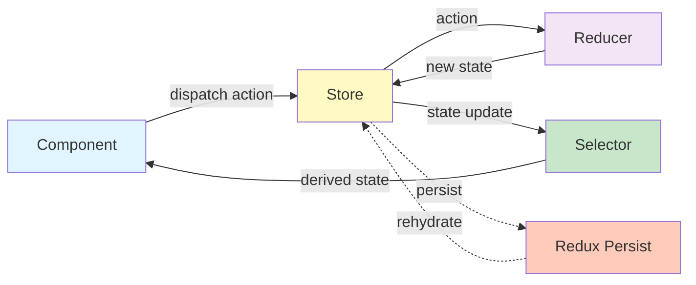
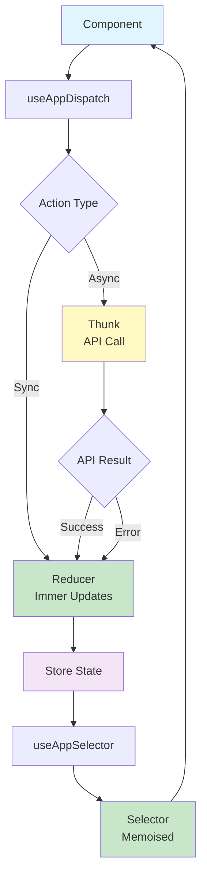

# State Management Guide

This document covers state management with Redux Toolkit and Redux Persist.

## Table of Contents

- [Overview](#overview)
- [Architecture](#architecture)
- [Setup](#setup)
- [Creating Features](#creating-features)
- [Using State](#using-state)
- [Async Operations](#async-operations)
- [Redux Persist](#redux-persist)
- [Performance](#performance)
- [Best Practices](#best-practices)
- [Testing](#testing)
- [DevTools](#devtools)
- [Troubleshooting](#troubleshooting)

## Overview

### Why Redux Toolkit?

- **Simplified Redux**: Less boilerplate than traditional Redux
- **Built-in Best Practices**: Includes Immer, Redux Thunk, and DevTools
- **Type Safety**: Excellent TypeScript support
- **Performance**: Optimised selectors and updates
- **Debugging**: Time-travel debugging with Redux DevTools

### When to Use Redux

**Use Redux for:**

- Global app state (theme, language, user preferences)
- State shared across multiple screens
- State that needs persistence
- Complex state logic

**Don't use Redux for:**

- Local component state (use `useState`)
- Form state (use `useState` or form libraries)
- Derived state (use selectors or `useMemo`)
- Server cache (use React Query/SWR for API data)

### Redux Data Flow



### Redux Toolkit Architecture



## Architecture

### Store Structure

```
store/
├── index.ts              # Store exports
├── configureStore.ts     # Store configuration
└── hooks.ts              # Typed hooks (optional)

features/
  Settings/
    store/
      ├── __tests__/
      │   ├── actions.test.ts
      │   ├── reducer.test.ts
      │   └── selectors.test.ts
      ├── index.ts        # Feature exports
      ├── actions.ts      # Action definitions
      ├── reducer.ts      # Slice and state
      └── selectors.ts    # State selectors
```

### State Shape

```typescript
{
  settings: {
    theme: 'light' | 'dark' | 'system',
    language: 'en' | 'es'
  },
  // Future features
  // auth: { ... }
  // profile: { ... }
}
```

## Setup

The project is already configured with Redux Toolkit. This section documents the setup for reference.

### Dependencies

```json
{
  "dependencies": {
    "@reduxjs/toolkit": "^2.10.1",
    "react-redux": "^9.2.0",
    "redux-persist": "^6.0.0",
    "@react-native-async-storage/async-storage": "^2.2.0"
  }
}
```

### Store Configuration

**`src/store/configureStore.ts`:**

```typescript
import AsyncStorage from '@react-native-async-storage/async-storage';
import { combineReducers, configureStore } from '@reduxjs/toolkit';
import {
  FLUSH,
  PAUSE,
  PERSIST,
  persistReducer,
  persistStore,
  PURGE,
  REGISTER,
  REHYDRATE,
} from 'redux-persist';

import reactotron from '@app/config/reactotron';
import { settingsReducer } from '@app/features/Settings/store';

/**
 * Root reducer combining all slices
 * Separates persisted (settings) from non-persisted (future auth) state
 */
const rootReducer = combineReducers({
  settings: settingsReducer,
  // Future: Add auth reducer here without persistence
  // auth: authReducer, // Will use EncryptedStorage separately
});

/**
 * Redux Persist configuration for settings
 * Uses AsyncStorage for non-sensitive data (theme, language, etc.)
 */
const persistConfig = {
  key: 'root',
  storage: AsyncStorage,
  whitelist: ['settings'], // Only persist settings
  // Future: Blacklist auth or create separate encrypted persist config
};

const persistedReducer = persistReducer(persistConfig, rootReducer);

/**
 * Configure Redux store with security best practices:
 * - Disable Redux DevTools in production
 * - Add serialisable check middleware (ignores redux-persist actions)
 * - Separate sensitive data (future auth) from settings
 * - Connect to Reactotron in development for Redux debugging
 */
export const store = configureStore({
  reducer: persistedReducer,
  middleware: getDefaultMiddleware =>
    getDefaultMiddleware({
      serializableCheck: {
        ignoredActions: [FLUSH, REHYDRATE, PAUSE, PERSIST, PURGE, REGISTER],
      },
    }),
  devTools: __DEV__, // Only enable DevTools in development
  enhancers: getDefaultEnhancers =>
    __DEV__ && reactotron.createEnhancer
      ? getDefaultEnhancers().concat(reactotron.createEnhancer())
      : getDefaultEnhancers(),
});

export const persistor = persistStore(store);

// Infer types from store
export type RootState = ReturnType<typeof store.getState>;
export type AppDispatch = typeof store.dispatch;
```

**`src/store/index.ts`:**

```typescript
export { store, persistor } from './configureStore';
export type { RootState, AppDispatch } from './configureStore';
```

### Provider Setup

**`src/app/App.tsx`:**

```typescript
import { Provider } from 'react-redux';
import { PersistGate } from 'redux-persist/integration/react';
import { store, persistor } from '@app/store';

export const App = () => {
  return (
    <Provider store={store}>
      <PersistGate loading={<LoadingScreen />} persistor={persistor}>
        <RootNavigator />
      </PersistGate>
    </Provider>
  );
};
```

### Typed Hooks (Optional)

**`src/store/hooks.ts`:**

```typescript
import { useDispatch, useSelector } from 'react-redux';
import type { RootState, AppDispatch } from './configureStore';

// Use throughout app instead of plain `useDispatch` and `useSelector`
export const useAppDispatch = useDispatch.withTypes<AppDispatch>();
export const useAppSelector = useSelector.withTypes<RootState>();
```

## Creating Features

### 1. Define State and Types

**`src/features/Settings/store/reducer.ts`:**

```typescript
import { createSlice } from '@reduxjs/toolkit';
import { settingsActions } from './actions';

// Types
export type Theme = 'light' | 'dark' | 'system';
export type Language = 'en' | 'es';

export interface SettingsState {
  theme: Theme;
  language: Language;
}

// Initial state
const initialState: SettingsState = {
  theme: 'system',
  language: 'en',
};

/**
 * Settings slice for non-sensitive user preferences
 * Persisted using AsyncStorage via redux-persist
 */
const settingsSlice = createSlice({
  name: 'settings',
  initialState,
  reducers: settingsActions,
});

export const settingsReducer = settingsSlice.reducer;
export const settingsSliceActions = settingsSlice.actions;
```

### 2. Define Actions

**`src/features/Settings/store/actions.ts`:**

```typescript
import type { PayloadAction } from '@reduxjs/toolkit';
import type { Language, SettingsState, Theme } from './reducer';

/**
 * Settings actions for managing user preferences
 */
export const settingsActions = {
  setTheme: (state: SettingsState, action: PayloadAction<Theme>) => {
    state.theme = action.payload;
  },
  setLanguage: (state: SettingsState, action: PayloadAction<Language>) => {
    state.language = action.payload;
  },
  resetSettings: (): SettingsState => ({
    theme: 'system',
    language: 'en',
  }),
};
```

**Note**: Actions use Immer for immutable updates. You can write "mutating" code like `state.theme = action.payload` and Immer handles immutability.

### 3. Define Selectors

**`src/features/Settings/store/selectors.ts`:**

```typescript
import { createSelector } from '@reduxjs/toolkit';
import type { RootState } from '@app/store';

/**
 * Settings selectors for accessing user preferences from state
 */
export const selectTheme = (state: RootState) => state.settings.theme;
export const selectLanguage = (state: RootState) => state.settings.language;

/**
 * Memoised derived selector
 * Only recomputes when theme changes
 */
export const selectIsDarkMode = createSelector([selectTheme], theme => {
  if (theme === 'system') {
    return useColorScheme() === 'dark';
  }
  return theme === 'dark';
});

/**
 * Combine multiple selectors
 * Useful for passing multiple values to components
 */
export const selectUserPreferences = createSelector(
  [selectTheme, selectLanguage],
  (theme, language) => ({ theme, language })
);
```

### 4. Export from Feature

**`src/features/Settings/store/index.ts`:**

```typescript
export { settingsReducer, settingsSliceActions } from './reducer';
export { selectTheme, selectLanguage, selectUserPreferences } from './selectors';
export type { Theme, Language, SettingsState } from './reducer';
```

### 5. Add to Root Reducer

**`src/store/configureStore.ts`:**

```typescript
import { settingsReducer } from '@app/features/Settings/store';
import { profileReducer } from '@app/features/Profile/store';

const rootReducer = combineReducers({
  settings: settingsReducer,
  profile: profileReducer, // New feature
});
```

## Using State

### Reading State

**With `useSelector`:**

```typescript
import { useSelector } from 'react-redux';
import { selectTheme } from '@app/features/Settings/store/selectors';

export const ThemedComponent = () => {
  const theme = useSelector(selectTheme);

  return <View style={theme === 'dark' ? darkStyle : lightStyle} />;
};
```

**With typed hook:**

```typescript
import { useAppSelector } from '@app/store/hooks';
import { selectTheme } from '@app/features/Settings/store/selectors';

export const ThemedComponent = () => {
  const theme = useAppSelector(selectTheme);

  return <View style={theme === 'dark' ? darkStyle : lightStyle} />;
};
```

**Multiple selectors:**

```typescript
import { useAppSelector } from '@app/store/hooks';
import { selectTheme, selectLanguage } from '@app/features/Settings/store/selectors';

export const SettingsScreen = () => {
  const theme = useAppSelector(selectTheme);
  const language = useAppSelector(selectLanguage);

  return (
    <View>
      <Text>Theme: {theme}</Text>
      <Text>Language: {language}</Text>
    </View>
  );
};
```

### Dispatching Actions

**With `useDispatch`:**

```typescript
import { useDispatch } from 'react-redux';
import { settingsSliceActions } from '@app/features/Settings/store';

export const AppearanceScreen = () => {
  const dispatch = useDispatch();

  const changeTheme = (theme: Theme) => {
    dispatch(settingsSliceActions.setTheme(theme));
  };

  return <Button onPress={() => changeTheme('dark')}>Dark Mode</Button>;
};
```

**With typed hook:**

```typescript
import { useAppDispatch } from '@app/store/hooks';
import { settingsSliceActions } from '@app/features/Settings/store';

export const AppearanceScreen = () => {
  const dispatch = useAppDispatch();

  const changeTheme = (theme: Theme) => {
    dispatch(settingsSliceActions.setTheme(theme));
  };

  return <Button onPress={() => changeTheme('dark')}>Dark Mode</Button>;
};
```

### Combined Example

```typescript
import { useAppDispatch, useAppSelector } from '@app/store/hooks';
import { settingsSliceActions, selectTheme } from '@app/features/Settings/store';

export const AppearanceScreen = () => {
  const dispatch = useAppDispatch();
  const currentTheme = useAppSelector(selectTheme);

  const changeTheme = (theme: Theme) => {
    dispatch(settingsSliceActions.setTheme(theme));
  };

  return (
    <View>
      <Button
        onPress={() => changeTheme('light')}
        variant={currentTheme === 'light' ? 'primary' : 'secondary'}
      >
        Light
      </Button>
      <Button
        onPress={() => changeTheme('dark')}
        variant={currentTheme === 'dark' ? 'primary' : 'secondary'}
      >
        Dark
      </Button>
      <Button
        onPress={() => changeTheme('system')}
        variant={currentTheme === 'system' ? 'primary' : 'secondary'}
      >
        System
      </Button>
    </View>
  );
};
```

## Async Operations

### Using createAsyncThunk

For async operations like API calls, use `createAsyncThunk`:

**`src/features/User/store/thunks.ts`:**

```typescript
import { createAsyncThunk } from '@reduxjs/toolkit';

interface User {
  id: string;
  name: string;
  email: string;
}

/**
 * Fetch user from API
 * Automatically generates pending/fulfilled/rejected action types
 */
export const fetchUser = createAsyncThunk<User, string>(
  'user/fetchUser',
  async (userId: string, { rejectWithValue }) => {
    try {
      const response = await fetch(`/api/users/${userId}`);

      if (!response.ok) {
        throw new Error('Failed to fetch user');
      }

      return response.json();
    } catch (error) {
      return rejectWithValue(error.message);
    }
  }
);

/**
 * Update user profile
 * Shows how to handle partial updates
 */
export const updateUserProfile = createAsyncThunk<User, Partial<User>>(
  'user/updateProfile',
  async (updates, { getState, rejectWithValue }) => {
    const state = getState() as RootState;
    const currentUser = state.user.data;

    try {
      const response = await fetch(`/api/users/${currentUser.id}`, {
        method: 'PATCH',
        headers: { 'Content-Type': 'application/json' },
        body: JSON.stringify(updates),
      });

      if (!response.ok) {
        throw new Error('Failed to update profile');
      }

      return response.json();
    } catch (error) {
      return rejectWithValue(error.message);
    }
  }
);
```

### Handling Thunk States in Reducer

**`src/features/User/store/reducer.ts`:**

```typescript
import { createSlice } from '@reduxjs/toolkit';
import { fetchUser, updateUserProfile } from './thunks';

interface UserState {
  data: User | null;
  loading: boolean;
  error: string | null;
  updateLoading: boolean;
}

const initialState: UserState = {
  data: null,
  loading: false,
  error: null,
  updateLoading: false,
};

const userSlice = createSlice({
  name: 'user',
  initialState,
  reducers: {
    clearError: state => {
      state.error = null;
    },
    clearUser: state => {
      state.data = null;
      state.loading = false;
      state.error = null;
    },
  },
  extraReducers: builder => {
    // Handle fetchUser lifecycle
    builder
      .addCase(fetchUser.pending, state => {
        state.loading = true;
        state.error = null;
      })
      .addCase(fetchUser.fulfilled, (state, action) => {
        state.loading = false;
        state.data = action.payload;
      })
      .addCase(fetchUser.rejected, (state, action) => {
        state.loading = false;
        state.error = action.payload as string;
      });

    // Handle updateUserProfile lifecycle
    builder
      .addCase(updateUserProfile.pending, state => {
        state.updateLoading = true;
        state.error = null;
      })
      .addCase(updateUserProfile.fulfilled, (state, action) => {
        state.updateLoading = false;
        state.data = action.payload;
      })
      .addCase(updateUserProfile.rejected, (state, action) => {
        state.updateLoading = false;
        state.error = action.payload as string;
      });
  },
});

export const userReducer = userSlice.reducer;
export const userActions = userSlice.actions;
```

### Using Thunks in Components

```typescript
import { useEffect } from 'react';
import { useAppDispatch, useAppSelector } from '@app/store/hooks';
import { fetchUser } from '@app/features/User/store/thunks';
import { selectUser, selectUserLoading, selectUserError } from '@app/features/User/store/selectors';

export const UserProfileScreen = ({ userId }: { userId: string }) => {
  const dispatch = useAppDispatch();
  const user = useAppSelector(selectUser);
  const loading = useAppSelector(selectUserLoading);
  const error = useAppSelector(selectUserError);

  useEffect(() => {
    dispatch(fetchUser(userId));
  }, [userId, dispatch]);

  if (loading) {
    return <LoadingSpinner />;
  }

  if (error) {
    return <ErrorMessage message={error} />;
  }

  if (!user) {
    return <EmptyState />;
  }

  return (
    <View>
      <Text>{user.name}</Text>
      <Text>{user.email}</Text>
    </View>
  );
};
```

### Complex Async Patterns

**Polling:**

```typescript
export const startPollingUser = createAsyncThunk<void, string>(
  'user/startPolling',
  async (userId, { dispatch, signal }) => {
    while (!signal.aborted) {
      await dispatch(fetchUser(userId));
      await new Promise(resolve => setTimeout(resolve, 5000));
    }
  }
);

// In component
useEffect(() => {
  const promise = dispatch(startPollingUser(userId));

  return () => {
    promise.abort(); // Stop polling on unmount
  };
}, [userId, dispatch]);
```

**Sequential Operations:**

```typescript
export const setupUserAccount = createAsyncThunk<void, CreateUserData>(
  'user/setup',
  async (userData, { dispatch }) => {
    // Step 1: Create user
    const user = await dispatch(createUser(userData)).unwrap();

    // Step 2: Send welcome email
    await dispatch(sendWelcomeEmail(user.email)).unwrap();

    // Step 3: Create default preferences
    await dispatch(createUserPreferences(user.id)).unwrap();
  }
);
```

## Redux Persist

### Configuration

**Basic Setup:**

```typescript
import AsyncStorage from '@react-native-async-storage/async-storage';
import { persistReducer } from 'redux-persist';

const persistConfig = {
  key: 'root',
  storage: AsyncStorage,
  whitelist: ['settings'], // Persist only these reducers
};

const persistedReducer = persistReducer(persistConfig, rootReducer);
```

### Whitelist vs Blacklist

**Whitelist** (recommended):

```typescript
const persistConfig = {
  key: 'root',
  storage: AsyncStorage,
  whitelist: ['settings', 'preferences'], // Only persist these
};
```

**Blacklist:**

```typescript
const persistConfig = {
  key: 'root',
  storage: AsyncStorage,
  blacklist: ['auth', 'session'], // Don't persist these
};
```

### Nested Persist

Persist only part of a reducer:

```typescript
import { persistReducer } from 'redux-persist';

const settingsPersistConfig = {
  key: 'settings',
  storage: AsyncStorage,
  whitelist: ['theme', 'language'], // Only persist these fields
  // blacklist: ['tempData'], // or exclude these fields
};

const rootReducer = combineReducers({
  settings: persistReducer(settingsPersistConfig, settingsReducer),
  auth: authReducer, // Not persisted
});
```

### Encryption for Sensitive Data

For sensitive data like auth tokens, use encrypted storage:

```typescript
import EncryptedStorage from 'react-native-encrypted-storage';

/**
 * Encrypted storage adapter for Redux Persist
 * Use for sensitive data (auth tokens, personal info)
 */
const encryptedStorage = {
  setItem: (key: string, value: string) => {
    return EncryptedStorage.setItem(key, value);
  },
  getItem: (key: string) => {
    return EncryptedStorage.getItem(key);
  },
  removeItem: (key: string) => {
    return EncryptedStorage.removeItem(key);
  },
};

const authPersistConfig = {
  key: 'auth',
  storage: encryptedStorage, // Use encrypted storage
};

const rootReducer = combineReducers({
  settings: persistReducer(settingsPersistConfig, settingsReducer),
  auth: persistReducer(authPersistConfig, authReducer),
});
```

### Clear Persisted State

```typescript
import { persistor } from '@app/store';

// Clear all persisted state
await persistor.purge();

// Or clear specific reducer
await persistor.flush(); // Save current state first
// Then update state and persist will save new state
```

### Migration

When changing state shape, use migrations:

```typescript
import { createMigrate } from 'redux-persist';

const migrations = {
  // Version 0 to 1: Add new field
  1: (state: any) => {
    return {
      ...state,
      settings: {
        ...state.settings,
        newField: 'defaultValue',
      },
    };
  },
  // Version 1 to 2: Rename field
  2: (state: any) => {
    const { oldField, ...rest } = state.settings;
    return {
      ...state,
      settings: {
        ...rest,
        newField: oldField,
      },
    };
  },
};

const persistConfig = {
  key: 'root',
  version: 2, // Current version
  storage: AsyncStorage,
  migrate: createMigrate(migrations, { debug: false }),
};
```

## Performance

### 1. Memoised Selectors

Always use `createSelector` for derived state to prevent unnecessary re-renders:

**Without Memoisation** (Bad):

```typescript
// This selector runs on EVERY state change
export const selectActiveUsers = (state: RootState) => {
  return state.users.filter(user => user.isActive); // Expensive!
};
```

**With Memoisation** (Good):

```typescript
import { createSelector } from '@reduxjs/toolkit';

// Only recomputes when users array changes
export const selectActiveUsers = createSelector(
  [selectUsers], // Input selectors
  users => users.filter(user => user.isActive) // Transform function
);
```

### 2. Selector Composition

Build complex selectors from simple ones:

```typescript
// Base selectors
export const selectUsers = (state: RootState) => state.users.byId;
export const selectActiveUserId = (state: RootState) => state.users.activeUserId;

// Composed memoised selector
export const selectActiveUser = createSelector(
  [selectUsers, selectActiveUserId],
  (users, activeUserId) => (activeUserId ? users[activeUserId] : null)
);

// Further composed selector
export const selectActiveUserPosts = createSelector(
  [selectActiveUser, selectPosts],
  (user, posts) => (user ? posts.filter(post => post.authorId === user.id) : [])
);
```

### 3. Parameterised Selectors

Create factory functions for selectors that need parameters:

```typescript
import { createSelector } from '@reduxjs/toolkit';

// Selector factory
export const makeSelectUserById = () =>
  createSelector(
    [selectUsers, (_: RootState, userId: string) => userId],
    (users, userId) => users[userId]
  );

// Usage in component
const selectUser = useMemo(() => makeSelectUserById(), []);
const user = useAppSelector(state => selectUser(state, userId));
```

### 4. Normalise State

Use `createEntityAdapter` for collections to avoid nested loops:

**Without Normalisation** (Slow):

```typescript
interface State {
  users: User[]; // Array lookup is O(n)
}

// Slow: Must iterate entire array
const user = state.users.find(u => u.id === userId);
```

**With Normalisation** (Fast):

```typescript
import { createEntityAdapter } from '@reduxjs/toolkit';

const usersAdapter = createEntityAdapter<User>();

interface State {
  users: {
    ids: string[];
    entities: { [id: string]: User }; // Object lookup is O(1)
  };
}

// Fast: Direct object access
const user = state.users.entities[userId];
```

### 5. Batch Updates

Redux batches updates automatically in React 18+, but you can also use `batch`:

```typescript
import { batch } from 'react-redux';

const handleMultipleActions = () => {
  batch(() => {
    dispatch(action1());
    dispatch(action2());
    dispatch(action3());
    // Single re-render instead of three
  });
};
```

### 6. Avoid Large State Objects

Split reducers to minimise update scope:

**Bad** (Everything re-renders):

```typescript
const appSlice = createSlice({
  name: 'app',
  initialState: {
    theme: 'light',
    users: [],
    posts: [],
    comments: [],
  },
});
```

**Good** (Only affected parts re-render):

```typescript
const themeSlice = createSlice({ name: 'theme', initialState: 'light' });
const usersSlice = createSlice({ name: 'users', initialState: [] });
const postsSlice = createSlice({ name: 'posts', initialState: [] });
```

## Best Practices

### 1. Feature-Based Organisation ✓

Keep Redux code with the feature it belongs to:

**Good:**

```
features/
  Settings/
    store/
      actions.ts
      reducer.ts
      selectors.ts
```

**Bad:**

```
store/
  actions/
    settingsActions.ts
  reducers/
    settingsReducer.ts
  selectors/
    settingsSelectors.ts
```

> **Why**: Co-locating Redux code with features improves maintainability and makes code easier to find.

### 2. Always Use Selectors ✓

**Good:**

```typescript
const theme = useAppSelector(selectTheme);
```

**Bad:**

```typescript
const theme = useAppSelector(state => state.settings.theme);
```

> **Why**: Selectors provide a single source of truth, are easier to test, and enable memoisation.

### 3. Normalise Collections ✓

**Good:**

```typescript
const usersAdapter = createEntityAdapter<User>();

// O(1) lookup
const user = selectUserById(state, userId);
```

**Bad:**

```typescript
// O(n) lookup
const user = state.users.find(u => u.id === userId);
```

> **Why**: Normalised state enables constant-time lookups and prevents deeply nested updates.

### 4. Use createAsyncThunk for Async ✓

**Good:**

```typescript
export const fetchUser = createAsyncThunk('user/fetch', async (userId: string) => {
  const response = await fetch(`/api/users/${userId}`);
  return response.json();
});
```

**Bad:**

```typescript
// Manual pending/fulfilled/rejected handling
dispatch({ type: 'user/fetchPending' });
try {
  const response = await fetch(`/api/users/${userId}`);
  dispatch({ type: 'user/fetchFulfilled', payload: response });
} catch (error) {
  dispatch({ type: 'user/fetchRejected', error });
}
```

> **Why**: `createAsyncThunk` automatically generates action types and handles loading states.

### 5. Keep Actions Simple ✓

**Good:**

```typescript
export const settingsActions = {
  setTheme: (state, action: PayloadAction<Theme>) => {
    state.theme = action.payload;
  },
};
```

**Bad:**

```typescript
export const settingsActions = {
  updateSettings: (state, action) => {
    // Too much logic in action
    const { theme, language } = action.payload;
    if (theme === 'dark' && language === 'en') {
      state.theme = theme;
      state.language = language;
      state.specialMode = true;
    }
  },
};
```

> **Why**: Complex logic belongs in thunks or components, not reducers.

### 6. Type Everything ✓

**Good:**

```typescript
export interface SettingsState {
  theme: Theme;
  language: Language;
}

export const selectTheme = (state: RootState): Theme => state.settings.theme;
```

**Bad:**

```typescript
export const selectTheme = state => state.settings.theme; // No types
```

> **Why**: TypeScript catches errors at compile-time and improves IDE autocomplete.

### 7. Don't Store Derived State ✗

**Good:**

```typescript
// Store primitive data
interface State {
  users: User[];
  activeUserId: string;
}

// Derive in selector
export const selectActiveUser = createSelector(
  [selectUsers, selectActiveUserId],
  (users, activeId) => users.find(u => u.id === activeId)
);
```

**Bad:**

```typescript
// Storing derived data
interface State {
  users: User[];
  activeUserId: string;
  activeUser: User; // Duplicates data!
}
```

> **Why**: Derived state creates sync issues and increases memory usage. Use selectors instead.

### 8. Use Entity Adapters for Collections ✓

**Good:**

```typescript
const usersAdapter = createEntityAdapter<User>();

// Auto-generated reducers
usersSlice: createSlice({
  name: 'users',
  initialState: usersAdapter.getInitialState(),
  reducers: {
    userAdded: usersAdapter.addOne,
    usersLoaded: usersAdapter.setAll,
  },
});

// Auto-generated selectors
export const { selectAll, selectById } = usersAdapter.getSelectors();
```

**Bad:**

```typescript
// Manual array manipulation
reducers: {
  userAdded: (state, action) => {
    state.users.push(action.payload);
  },
  userRemoved: (state, action) => {
    state.users = state.users.filter(u => u.id !== action.payload);
  },
};
```

> **Why**: Entity adapters provide optimised CRUD operations and prevent common bugs.

## Testing

### Test Reducers

```typescript
import { settingsReducer, settingsSliceActions } from '../reducer';

describe('settingsReducer', () => {
  const initialState = {
    theme: 'system' as const,
    language: 'en' as const,
  };

  it('updates theme', () => {
    const newState = settingsReducer(initialState, settingsSliceActions.setTheme('dark'));

    expect(newState.theme).toBe('dark');
  });

  it('updates language', () => {
    const newState = settingsReducer(initialState, settingsSliceActions.setLanguage('es'));

    expect(newState.language).toBe('es');
  });

  it('resets settings', () => {
    const modifiedState = {
      theme: 'dark' as const,
      language: 'es' as const,
    };

    const newState = settingsReducer(modifiedState, settingsSliceActions.resetSettings());

    expect(newState).toEqual(initialState);
  });
});
```

### Test Selectors

```typescript
import { selectTheme, selectLanguage, selectUserPreferences } from '../selectors';
import type { RootState } from '@app/store';

describe('settingsSelectors', () => {
  const state: RootState = {
    settings: {
      theme: 'dark',
      language: 'es',
    },
  };

  it('selects theme', () => {
    expect(selectTheme(state)).toBe('dark');
  });

  it('selects language', () => {
    expect(selectLanguage(state)).toBe('es');
  });

  it('selects combined preferences', () => {
    expect(selectUserPreferences(state)).toEqual({
      theme: 'dark',
      language: 'es',
    });
  });
});
```

### Test Memoised Selectors

```typescript
import { selectActiveUsers } from '../selectors';

describe('selectActiveUsers', () => {
  it('memoises result', () => {
    const state = {
      users: [
        { id: '1', isActive: true },
        { id: '2', isActive: false },
      ],
    };

    const result1 = selectActiveUsers(state);
    const result2 = selectActiveUsers(state);

    // Same reference = memoised
    expect(result1).toBe(result2);
  });

  it('recomputes when input changes', () => {
    const state1 = { users: [{ id: '1', isActive: true }] };
    const state2 = { users: [{ id: '2', isActive: true }] };

    const result1 = selectActiveUsers(state1);
    const result2 = selectActiveUsers(state2);

    // Different reference = recomputed
    expect(result1).not.toBe(result2);
  });
});
```

### Test in Components

```typescript
import { renderWithProviders } from '@app/test-utils';
import { settingsSliceActions } from '@app/features/Settings/store';

describe('AppearanceScreen', () => {
  it('dispatches setTheme action when button pressed', () => {
    const { getByText, store } = renderWithProviders(<AppearanceScreen />);

    fireEvent.press(getByText('Dark'));

    expect(store.getState().settings.theme).toBe('dark');
  });

  it('updates UI when theme changes', () => {
    const { getByTestId, store } = renderWithProviders(<AppearanceScreen />);

    act(() => {
      store.dispatch(settingsSliceActions.setTheme('dark'));
    });

    expect(getByTestId('theme-indicator')).toHaveTextContent('Dark');
  });
});
```

### Test Async Thunks

```typescript
import { fetchUser } from '../thunks';
import { configureStore } from '@reduxjs/toolkit';
import { userReducer } from '../reducer';

describe('fetchUser thunk', () => {
  let store;

  beforeEach(() => {
    store = configureStore({ reducer: { user: userReducer } });
  });

  it('fetches user successfully', async () => {
    // Mock API
    global.fetch = jest.fn(() =>
      Promise.resolve({
        ok: true,
        json: () => Promise.resolve({ id: '1', name: 'John' }),
      })
    );

    await store.dispatch(fetchUser('1'));

    expect(store.getState().user.data).toEqual({
      id: '1',
      name: 'John',
    });
    expect(store.getState().user.loading).toBe(false);
  });

  it('handles fetch error', async () => {
    global.fetch = jest.fn(() =>
      Promise.resolve({
        ok: false,
      })
    );

    await store.dispatch(fetchUser('1'));

    expect(store.getState().user.error).toBeTruthy();
    expect(store.getState().user.loading).toBe(false);
  });
});
```

## DevTools

### Redux DevTools

Automatically enabled in development:

```typescript
export const store = configureStore({
  reducer: persistedReducer,
  devTools: __DEV__, // Only in development
});
```

**Features:**

- Time-travel debugging
- Action history
- State diff
- Export/import state

### Reactotron

Integrated for React Native debugging:

```typescript
export const store = configureStore({
  enhancers: getDefaultEnhancers =>
    __DEV__ && reactotron.createEnhancer
      ? getDefaultEnhancers().concat(reactotron.createEnhancer())
      : getDefaultEnhancers(),
});
```

**Install Reactotron:**

```bash
brew install --cask reactotron
```

**View Redux in Reactotron:**

1. Open Reactotron app
2. Run your app
3. View Redux tab for:
   - Action log
   - State snapshots
   - Subscriptions

## Troubleshooting

### State Not Persisting

**Problem**: Changes don't persist after app restart

**Solution**:

1. **Check persist config whitelist**:

   ```typescript
   const persistConfig = {
     key: 'root',
     storage: AsyncStorage,
     whitelist: ['settings'], // Must include your reducer
   };
   ```

2. **Verify PersistGate in App**:

   ```typescript
   <PersistGate loading={null} persistor={persistor}>
     {/* App */}
   </PersistGate>
   ```

3. **Check AsyncStorage**:

   ```typescript
   import AsyncStorage from '@react-native-async-storage/async-storage';

   AsyncStorage.getAllKeys().then(keys => {
     console.log('Stored keys:', keys);
   });

   AsyncStorage.getItem('persist:root').then(value => {
     console.log('Persisted state:', JSON.parse(value));
   });
   ```

4. **Clear cache if structure changed**:

   ```bash
   # Reset app data
   yarn start --reset-cache

   # Clear persisted state programmatically
   import { persistor } from '@app/store';
   await persistor.purge();
   ```

### Actions Not Updating State

**Problem**: Dispatching actions doesn't update state

**Solution**:

1. **Verify action is dispatched**:

   ```typescript
   const dispatch = useAppDispatch();

   console.log('Dispatching action');
   const result = dispatch(settingsSliceActions.setTheme('dark'));
   console.log('Action result:', result);
   ```

2. **Check reducer is added to store**:

   ```typescript
   const rootReducer = combineReducers({
     settings: settingsReducer, // Must be included
   });
   ```

3. **Verify selector is correct**:

   ```typescript
   const theme = useAppSelector(state => {
     console.log('Full state:', state);
     return state.settings.theme;
   });
   ```

4. **Check for typos in action names**:
   ```typescript
   // Wrong
   dispatch(settingsSliceActions.setThemme('dark')); // Typo
   // Correct
   dispatch(settingsSliceActions.setTheme('dark'));
   ```

### TypeScript Errors

**Problem**: Type errors with actions or state

**Solution**:

1. **Use inferred types**:

   ```typescript
   export type RootState = ReturnType<typeof store.getState>;
   export type AppDispatch = typeof store.dispatch;
   ```

2. **Type action payloads**:

   ```typescript
   setTheme: (state: SettingsState, action: PayloadAction<Theme>) => {
     state.theme = action.payload;
   };
   ```

3. **Type selectors**:

   ```typescript
   export const selectTheme = (state: RootState): Theme => state.settings.theme;
   ```

4. **Use typed hooks**:
   ```typescript
   // Instead of useDispatch/useSelector
   import { useAppDispatch, useAppSelector } from '@app/store/hooks';
   ```

### Serialisation Errors

**Problem**: `A non-serialisable value was detected in an action`

**Solution**:

1. **For redux-persist, ignore persist actions**:

   ```typescript
   middleware: getDefaultMiddleware =>
     getDefaultMiddleware({
       serializableCheck: {
         ignoredActions: [FLUSH, REHYDRATE, PAUSE, PERSIST, PURGE, REGISTER],
       },
     }),
   ```

2. **Don't store non-serialisable values**:

   ```typescript
   // Bad - Don't store these in Redux
   state.callback = () => {}; // Functions
   state.date = new Date(); // Dates (use ISO string instead)
   state.map = new Map(); // Maps (use plain object)
   state.set = new Set(); // Sets (use array)
   state.promise = fetch(); // Promises (use thunks)

   // Good - Store serialisable data
   state.dateString = new Date().toISOString();
   state.items = { id1: item1, id2: item2 }; // Plain object
   state.selectedIds = ['id1', 'id2']; // Array
   ```

3. **For specific actions, whitelist them**:
   ```typescript
   serializableCheck: {
     ignoredActions: ['yourAction/type'],
     ignoredPaths: ['state.nonSerializable'],
   };
   ```

### Performance Issues

**Problem**: App slow when state updates

**Solution**:

1. **Use memoised selectors**:

   ```typescript
   import { createSelector } from '@reduxjs/toolkit';

   // Without memoisation (slow)
   const selectExpensiveData = state => expensiveTransform(state.data);

   // With memoisation (fast)
   const selectExpensiveData = createSelector([selectData], data => expensiveTransform(data));
   ```

2. **Normalise state for large collections**:

   ```typescript
   const usersAdapter = createEntityAdapter<User>();
   // O(1) lookups instead of O(n)
   ```

3. **Split large components using selectors**:

   ```typescript
   // Bad: Re-renders on any state change
   const state = useAppSelector(state => state);

   // Good: Only re-renders when theme changes
   const theme = useAppSelector(selectTheme);
   ```

4. **Use `shallowEqual` for object comparisons**:

   ```typescript
   import { shallowEqual } from 'react-redux';

   const settings = useAppSelector(selectSettings, shallowEqual);
   ```

5. **Batch multiple dispatches**:
   ```typescript
   import { batch } from 'react-redux';
   batch(() => {
     dispatch(action1());
     dispatch(action2());
     dispatch(action3());
   });
   ```

### Thunk Not Working

**Problem**: createAsyncThunk doesn't trigger reducer

**Solution**:

1. **Add extraReducers to slice**:

   ```typescript
   const userSlice = createSlice({
     name: 'user',
     initialState,
     reducers: {},
     extraReducers: builder => {
       builder
         .addCase(fetchUser.pending, state => {
           state.loading = true;
         })
         .addCase(fetchUser.fulfilled, (state, action) => {
           state.data = action.payload;
         })
         .addCase(fetchUser.rejected, (state, action) => {
           state.error = action.error.message;
         });
     },
   });
   ```

2. **Await dispatch result**:

   ```typescript
   // Get result from thunk
   const result = await dispatch(fetchUser('123')).unwrap();
   console.log('User data:', result);
   ```

3. **Handle errors properly**:
   ```typescript
   try {
     await dispatch(fetchUser('123')).unwrap();
   } catch (error) {
     console.error('Failed to fetch user:', error);
   }
   ```

### State Resets on Hot Reload

**Problem**: State resets during development when files change

**Solution**:

This is expected behaviour in development. To preserve state:

1. **Use Redux Persist** (already configured)
2. **Or manually save/restore state**:
   ```typescript
   // Save before hot reload
   window.__REDUX_STATE__ = store.getState();
   // Restore after hot reload
   const preloadedState = window.__REDUX_STATE__;
   const store = configureStore({ preloadedState });
   ```

## Next Steps

- See [Testing](./TESTING.md) for testing Redux code
- See [I18N](./I18N.md) for integrating Redux with i18next
- See [Architecture](./ARCHITECTURE.md) for project structure
- See [Contributing](./CONTRIBUTING.md) for code standards
- See [CHEATSHEET](./CHEATSHEET.md) for quick command reference
- See [WORKFLOWS](./WORKFLOWS.md) for Redux workflows

---

**Need help?** Check the [Redux Toolkit documentation](https://redux-toolkit.js.org/) or [Redux documentation](https://redux.js.org/).
