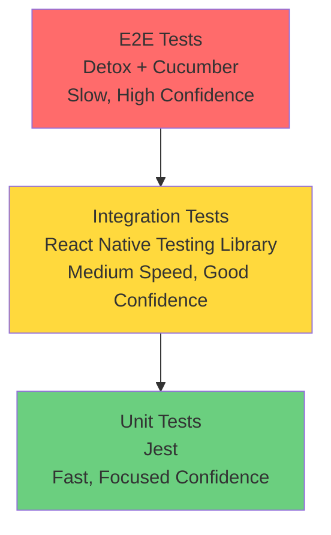

# Testing Guide

This document covers unit and integration testing with Jest and React Native Testing Library.

## Table of Contents

- [Testing Philosophy](#testing-philosophy)
- [Test Setup](#test-setup)
- [Running Tests](#running-tests)
- [Writing Tests](#writing-tests)
- [Coverage Requirements](#coverage-requirements)
- [Best Practices](#best-practices)
- [Test Organisation](#test-organisation)
- [Troubleshooting](#troubleshooting)

---

## Testing Philosophy

### What We Test

1. **Business Logic** (100% coverage required)
   - Redux actions, reducers, selectors
   - Utility functions
   - Custom hooks
   - Shared components
   - Configuration and setup

2. **Component Behaviour** (85% coverage target)
   - User interactions
   - Conditional rendering
   - Props validation
   - Event handlers

### What We Don't Test

- Third-party libraries
- React Native framework code
- Simple presentational components with no logic
- Type definitions
- Screens (excluded from coverage)

### Testing Pyramid



**Pyramid Strategy:**

- **Unit Tests (Base):** Most tests, fastest, test individual functions/utilities
- **Integration Tests (Middle):** Moderate tests, test component interactions
- **E2E Tests (Top):** Few tests, slowest, test complete user journeys

---

## Test Setup

### Tech Stack

| Tool                             | Purpose                                     |
| -------------------------------- | ------------------------------------------- |
| **Jest**                         | Test runner and assertion library           |
| **React Native Testing Library** | Component testing utilities                 |
| **renderWithProviders**          | Custom utility for GlueStack + Redux + i18n |
| **@testing-library/react-hooks** | Hook testing (if needed)                    |

### File Naming Convention

All unit/integration tests use the `.rntl.tsx` suffix:

```
HomeScreen.tsx          # Component
HomeScreen.rntl.tsx     # Unit/integration test
```

This distinguishes unit/integration tests from E2E tests (`.feature`, `.cucumber.tsx`).

### Configuration

Jest configuration is in `jest.config.cjs`:

```javascript
module.exports = {
  preset: 'react-native',
  testMatch: ['**/__tests__/**/*.rntl.tsx'], // Only run .rntl.tsx files
  coverageThreshold: {
    global: {
      statements: 85,
      branches: 80,
      functions: 85,
      lines: 85,
    },
  },
  collectCoverageFrom: [
    'src/**/*.{ts,tsx}',
    '!src/**/__tests__/**',
    '!src/**/index.ts',
    '!src/**/*Screen.tsx', // Screens excluded
  ],
};
```

**Coverage Thresholds:**

- **Global:** 85% (statements, functions, lines), 80% (branches)
- **Business Logic:** 100% (store, shared components, utilities)

---

## Running Tests

### Basic Commands

```bash
# Run all tests
yarn test

# Watch mode (re-run on file changes)
yarn test:watch

# With coverage report
yarn test:coverage

# Run specific file
yarn test HomeScreen.rntl.tsx

# Run tests matching pattern
yarn test -t "renders correctly"

# Update snapshots
yarn test -u

# Clear cache and run
yarn test --clearCache
```

### Viewing Coverage

```bash
# Run coverage
yarn test:coverage

# Open HTML report in browser
open coverage/lcov-report/index.html
```

The coverage report shows:

- **Statements:** Individual code statements executed
- **Branches:** Conditional branches taken (if/else)
- **Functions:** Functions called
- **Lines:** Lines of code executed

---

## Writing Tests

### Basic Component Test

```typescript
import React from 'react';
import { renderWithProviders } from '@app/test-utils';
import { HomeScreen } from '../HomeScreen';

describe('HomeScreen', () => {
  it('renders without crashing', () => {
    const { getByText } = renderWithProviders(<HomeScreen />);
    expect(getByText('Home')).toBeTruthy();
  });

  it('displays welcome message', () => {
    const { getByText } = renderWithProviders(<HomeScreen />);
    expect(getByText('Welcome to the app')).toBeTruthy();
  });
});
```

### Testing with Props

```typescript
import { ButtonWithChevron } from '../ButtonWithChevron';

describe('ButtonWithChevron', () => {
  it('renders with custom label', () => {
    const { getByText } = renderWithProviders(
      <ButtonWithChevron label="Click me" onPress={jest.fn()} />
    );

    expect(getByText('Click me')).toBeTruthy();
  });

  it('renders with end label', () => {
    const { getByText } = renderWithProviders(
      <ButtonWithChevron
        label="Language"
        endLabel="English"
        onPress={jest.fn()}
      />
    );

    expect(getByText('Language')).toBeTruthy();
    expect(getByText('English')).toBeTruthy();
  });
});
```

### Testing User Interactions

```typescript
import { fireEvent } from '@testing-library/react-native';

describe('Button interactions', () => {
  it('calls onPress when button is tapped', () => {
    const onPress = jest.fn();
    const { getByTestId } = renderWithProviders(
      <Button testID="my-button" onPress={onPress} />
    );

    fireEvent.press(getByTestId('my-button'));

    expect(onPress).toHaveBeenCalledTimes(1);
  });

  it('does not call onPress when disabled', () => {
    const onPress = jest.fn();
    const { getByTestId } = renderWithProviders(
      <Button testID="my-button" onPress={onPress} disabled />
    );

    fireEvent.press(getByTestId('my-button'));

    expect(onPress).not.toHaveBeenCalled();
  });
});
```

### Testing with Redux

```typescript
import { renderWithProviders } from '@app/test-utils';
import { settingsSliceActions } from '../store';

describe('AppearanceScreen with Redux', () => {
  it('updates theme in Redux store', () => {
    const { store } = renderWithProviders(<AppearanceScreen />);

    // Dispatch action
    store.dispatch(settingsSliceActions.setTheme('dark'));

    // Check state updated
    const state = store.getState();
    expect(state.settings.theme).toBe('dark');
  });

  it('displays current theme from store', () => {
    const { getByText } = renderWithProviders(<AppearanceScreen />, {
      preloadedState: {
        settings: { theme: 'dark', language: 'en' },
      },
    });

    expect(getByText('Dark')).toBeTruthy();
  });
});
```

### Testing Redux Logic

#### Testing Reducers

```typescript
import { settingsReducer, settingsSliceActions } from '../reducer';

describe('settingsReducer', () => {
  const initialState = {
    theme: 'system' as const,
    language: 'en' as const,
  };

  it('updates theme', () => {
    const newState = settingsReducer(initialState, settingsSliceActions.setTheme('dark'));

    expect(newState.theme).toBe('dark');
    expect(newState.language).toBe('en'); // Unchanged
  });

  it('updates language', () => {
    const newState = settingsReducer(initialState, settingsSliceActions.setLanguage('es'));

    expect(newState.language).toBe('es');
    expect(newState.theme).toBe('system'); // Unchanged
  });

  it('resets to initial state', () => {
    const modifiedState = { theme: 'dark' as const, language: 'es' as const };
    const newState = settingsReducer(modifiedState, settingsSliceActions.resetSettings());

    expect(newState).toEqual(initialState);
  });
});
```

#### Testing Selectors

```typescript
import { selectTheme, selectLanguage } from '../selectors';
import type { RootState } from '@app/store';

describe('settingsSelectors', () => {
  const mockState: RootState = {
    settings: {
      theme: 'dark',
      language: 'en',
    },
  };

  it('selects theme from state', () => {
    expect(selectTheme(mockState)).toBe('dark');
  });

  it('selects language from state', () => {
    expect(selectLanguage(mockState)).toBe('en');
  });
});
```

### Testing Utilities

```typescript
import { getButtonGroupVariant } from '../utils';

describe('getButtonGroupVariant', () => {
  it('returns single for a single item', () => {
    expect(getButtonGroupVariant(0, 1)).toBe('single');
  });

  it('returns top for the first item of multiple', () => {
    expect(getButtonGroupVariant(0, 3)).toBe('top');
  });

  it('returns middle for middle items', () => {
    expect(getButtonGroupVariant(1, 3)).toBe('middle');
  });

  it('returns bottom for the last item', () => {
    expect(getButtonGroupVariant(2, 3)).toBe('bottom');
  });

  it('handles edge case of empty array', () => {
    expect(getButtonGroupVariant(0, 0)).toBe('single');
  });
});
```

### Mocking

#### Mock Functions

```typescript
const mockNavigate = jest.fn();
const mockOnPress = jest.fn();
```

#### Mock Modules

```typescript
jest.mock('@app/hooks/useAppColorScheme', () => ({
  useAppColorScheme: () => 'light',
}));

// Then import after mock
import { useAppColorScheme } from '@app/hooks/useAppColorScheme';
```

#### Mock React Native APIs

```typescript
import * as ReactNative from 'react-native';

jest.spyOn(ReactNative, 'useColorScheme').mockReturnValue('dark');
```

#### Mock Navigation

```typescript
const mockNavigation = {
  navigate: jest.fn(),
  goBack: jest.fn(),
  setOptions: jest.fn(),
};

it('navigates to Settings', () => {
  const { getByText } = renderWithProviders(
    <HomeScreen navigation={mockNavigation} />
  );

  fireEvent.press(getByText('Settings'));

  expect(mockNavigation.navigate).toHaveBeenCalledWith('Settings');
});
```

### Testing Async Operations

```typescript
import { waitFor } from '@testing-library/react-native';

it('loads data asynchronously', async () => {
  const { getByText, queryByText } = renderWithProviders(<DataScreen />);

  // Initially shows loading
  expect(getByText('Loading...')).toBeTruthy();

  // Wait for data to load
  await waitFor(() => {
    expect(queryByText('Loading...')).toBeNull();
    expect(getByText('Data loaded')).toBeTruthy();
  });
});

it('handles errors gracefully', async () => {
  const { getByText } = renderWithProviders(<DataScreen />);

  await waitFor(() => {
    expect(getByText('Error loading data')).toBeTruthy();
  });
});
```

---

## Coverage Requirements

### Global Thresholds

- **85% minimum** for statements, functions, lines
- **80% minimum** for branches

### Business Logic (100% Coverage Required)

Must have 100% coverage:

- Redux actions
- Redux reducers
- Redux selectors
- Utility functions (`src/utils/`, `src/components/shared/`)
- Custom hooks (`src/hooks/`)
- Shared components (`src/components/`)

### Excluded from Coverage

These files don't require test coverage:

- Presentation components (`*Screen.tsx`)
- Navigation setup (`src/navigation/`)
- Store configuration (`src/store/index.ts`)
- Barrel exports (`index.ts` files)
- Type definitions (`*.d.ts`)
- Config files (`src/config/`)

### Per-Directory Thresholds

```javascript
// jest.config.cjs
coverageThreshold: {
  global: { statements: 85, functions: 85, lines: 85, branches: 80 },
  'src/features/**/store/': { statements: 100, functions: 100, lines: 100, branches: 100 },
  'src/store/': { statements: 100, functions: 100, lines: 100, branches: 100 },
  'src/components/': { statements: 100, functions: 100, lines: 100, branches: 100 },
}
```

### View Coverage Report

```bash
yarn test:coverage
open coverage/lcov-report/index.html
```

---

## Best Practices

### 1. Test Behaviour, Not Implementation

**❌ Bad** (testing implementation):

```typescript
it('calls setState', () => {
  const { rerender } = render(<Component />);
  // Testing internal state implementation
});
```

**✅ Good** (testing behaviour):

```typescript
it('displays updated text when button clicked', () => {
  const { getByText, getByTestId } = renderWithProviders(<Component />);

  fireEvent.press(getByTestId('update-button'));

  expect(getByText('Updated')).toBeTruthy();
});
```

### 2. Use renderWithProviders

Always use `renderWithProviders` for components that use:

- GlueStack UI components
- Redux hooks (`useAppSelector`, `useAppDispatch`)
- i18n hooks (`useTranslation`)

```typescript
import { renderWithProviders } from '@app/test-utils';

const { getByText } = renderWithProviders(<MyComponent />);
```

**Why?** It wraps your component with all required providers (GlueStack, Redux, i18n).

### 3. Use Descriptive Test Names

**❌ Bad:**

```typescript
it('works', () => { ... });
it('test 1', () => { ... });
```

**✅ Good:**

```typescript
it('displays error message when form submission fails', () => { ... });
it('disables submit button while loading', () => { ... });
```

### 4. Follow AAA Pattern (Arrange, Act, Assert)

```typescript
it('increments counter when button pressed', () => {
  // Arrange: Set up test data
  const { getByTestId, getByText } = renderWithProviders(<Counter />);

  // Act: Perform action
  fireEvent.press(getByTestId('increment-button'));

  // Assert: Verify result
  expect(getByText('Count: 1')).toBeTruthy();
});
```

### 5. Test Edge Cases

```typescript
describe('getButtonGroupVariant', () => {
  it('handles single item', () => { ... });
  it('handles first item', () => { ... });
  it('handles middle items', () => { ... });
  it('handles last item', () => { ... });

  // Edge cases
  it('handles empty array', () => { ... });
  it('handles negative index', () => { ... });
  it('handles index out of bounds', () => { ... });
});
```

### 6. Keep Tests Independent

Each test should:

- Set up its own data
- Not depend on other tests
- Clean up after itself
- Be able to run in any order

```typescript
// ❌ Bad: Tests depend on each other
let count = 0;
it('increments', () => {
  count++;
});
it('shows 1', () => {
  expect(count).toBe(1);
});

// ✅ Good: Tests are independent
it('increments from 0 to 1', () => {
  const count = 0;
  expect(count + 1).toBe(1);
});
```

### 7. Use testID for Elements

```typescript
// Component
<Button testID="submit-button" onPress={onSubmit}>
  Submit
</Button>

// Test
const { getByTestId } = renderWithProviders(<Form />);
fireEvent.press(getByTestId('submit-button'));
```

**Why?** `testID` is reliable across text changes and localisation.

### 8. Avoid Implementation Details

**❌ Bad:**

```typescript
expect(component.state.isLoading).toBe(true);
expect(component.instance().handleClick).toHaveBeenCalled();
```

**✅ Good:**

```typescript
expect(getByText('Loading...')).toBeTruthy();
expect(mockOnClick).toHaveBeenCalled();
```

---

## Test Organisation

### Component Tests

```typescript
describe('ButtonWithChevron', () => {
  describe('rendering', () => {
    it('renders without crashing', () => { ... });
    it('renders with custom props', () => { ... });
    it('renders with start icon', () => { ... });
    it('renders with end label', () => { ... });
  });

  describe('interactions', () => {
    it('calls onPress when tapped', () => { ... });
    it('does not call onPress when disabled', () => { ... });
  });

  describe('edge cases', () => {
    it('handles missing props gracefully', () => { ... });
    it('handles empty label', () => { ... });
  });
});
```

### Redux Tests

```typescript
describe('settingsSlice', () => {
  describe('actions', () => {
    it('creates setTheme action', () => { ... });
    it('creates setLanguage action', () => { ... });
  });

  describe('reducer', () => {
    it('handles setTheme', () => { ... });
    it('handles setLanguage', () => { ... });
    it('handles reset', () => { ... });
  });

  describe('selectors', () => {
    it('selects theme', () => { ... });
    it('selects language', () => { ... });
  });
});
```

---

## Troubleshooting

### Tests Not Running

**Problem:** Jest not finding tests

**Solution:**

1. Verify file naming uses `.rntl.tsx` suffix
2. Check Jest config:
   ```bash
   cat jest.config.cjs | grep testMatch
   ```
3. Ensure file is in correct location (`__tests__/` directory)

### Mocks Not Working

**Problem:** Module mocks not applying

**Solution:**

Ensure mocks are defined **before** imports:

```typescript
// ✅ Correct order
jest.mock('@app/hooks/useTheme');
import { useTheme } from '@app/hooks/useTheme';

// ❌ Wrong order
import { useTheme } from '@app/hooks/useTheme';
jest.mock('@app/hooks/useTheme'); // Too late!
```

### Async Tests Timing Out

**Problem:** Test hangs or times out

**Solution:**

Use `waitFor` for async operations:

```typescript
import { waitFor } from '@testing-library/react-native';

await waitFor(() => {
  expect(getByText('Loaded')).toBeTruthy();
});

// Or with timeout
await waitFor(
  () => {
    expect(getByText('Loaded')).toBeTruthy();
  },
  { timeout: 5000 }
);
```

### Coverage Not Accurate

**Problem:** Coverage report shows untested code as tested

**Solution:**

Check for:

- Unused imports (counted as covered)
- Dead code (unreachable branches)
- Commented-out code
- Type-only imports

```bash
# Clear coverage cache
yarn test --clearCache
yarn test:coverage
```

### React Native Components Not Rendering

**Problem:** `ReferenceError: View is not defined`

**Solution:**

Ensure Jest is configured with React Native preset:

```javascript
// jest.config.cjs
module.exports = {
  preset: 'react-native',
  // ...
};
```

### renderWithProviders Not Working

**Problem:** Components using GlueStack UI or Redux not rendering

**Solution:**

1. Verify you're importing from the correct location:

   ```typescript
   import { renderWithProviders } from '@app/test-utils';
   ```

2. Check that `renderWithProviders` wraps all providers:
   ```typescript
   // src/test-utils/renderWithProviders.tsx
   export const renderWithProviders = (ui: React.ReactElement) =>
     render(
       <I18nextProvider i18n={i18n}>
         <GluestackUIProvider config={config}>{ui}</GluestackUIProvider>
       </I18nextProvider>
     );
   ```

### Snapshot Tests Failing

**Problem:** Snapshot tests fail after legitimate changes

**Solution:**

1. Review snapshot diff to ensure changes are intentional
2. Update snapshots:
   ```bash
   yarn test -u
   ```
3. Commit updated snapshots

**Tip:** Use snapshots sparingly - prefer explicit assertions.

---

## Next Steps

- **[E2E Testing](./E2E_TESTING.md)** - End-to-end testing with Detox
- **[Contributing](./CONTRIBUTING.md)** - Code quality standards
- **[Architecture](./ARCHITECTURE.md)** - Project structure and patterns
- **[Workflows](./WORKFLOWS.md)** - Common testing workflows
- **[Cheatsheet](./CHEATSHEET.md)** - Quick testing reference

---

**Need help?** Open an issue on GitHub or consult the troubleshooting section above.
