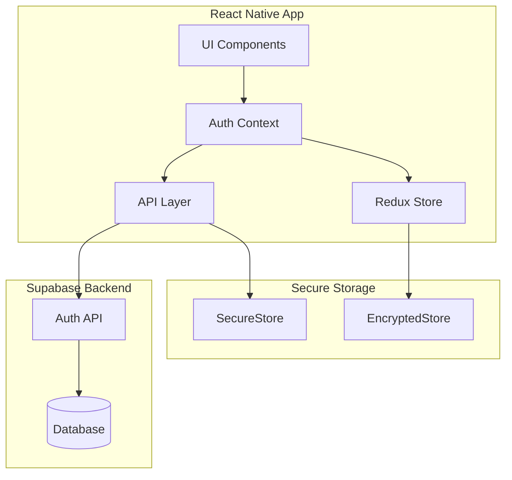
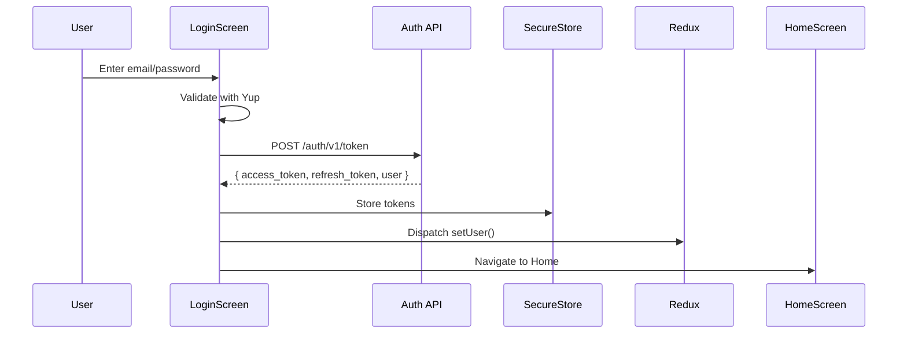
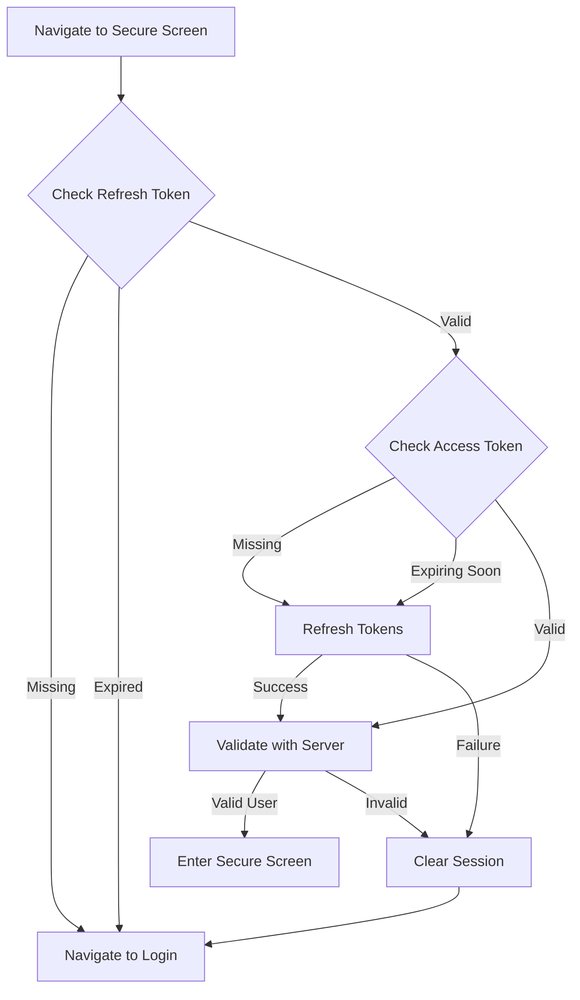
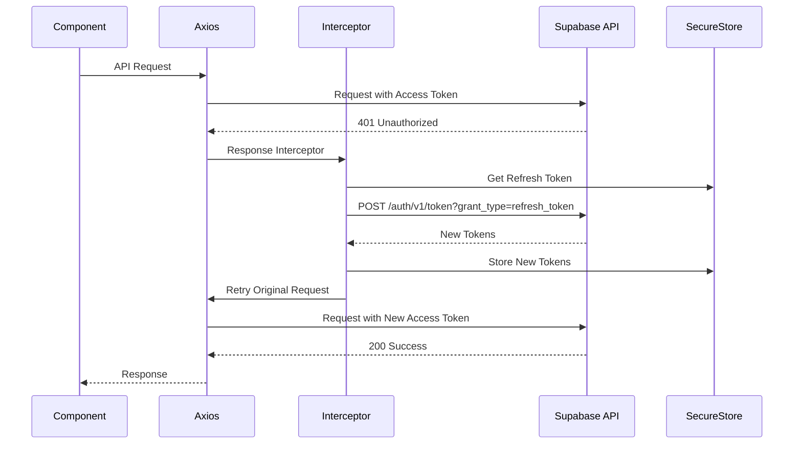
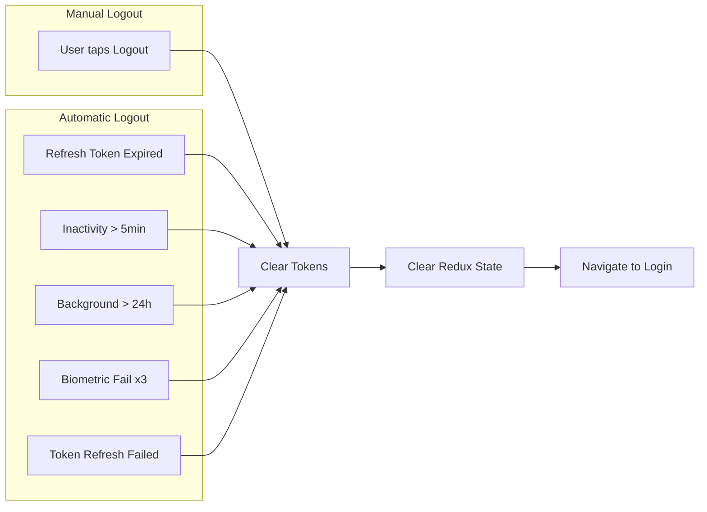
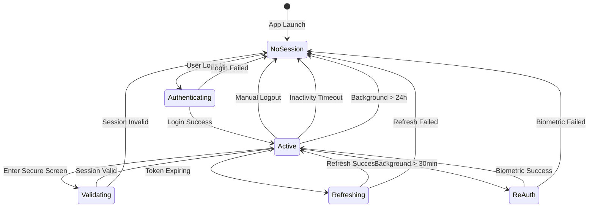

# TASK-370: Comprehensive Auth Flow Documentation

**Task ID**: TASK-370
**Title**: Comprehensive Auth Flow Documentation with Visual Aids
**User Story**: [US-066](../stories/US-066-proactive-session-validation.md) - Proactive Session Validation
**Epic**: [EPIC-022](../epics/EPIC-022-login-session-management.md) - Login & Session Management
**Status**: 📋 To Do
**Priority**: Medium
**Effort**: 2.5 hours
**Owner**: Warren de Leon
**Created**: 2025-11-27

---

## Context

The authentication system has grown complex with multiple login methods, token management, session validation, and various logout conditions. This task creates comprehensive documentation that explains the complete auth flow with visual diagrams, making it easy for any developer (or future me) to understand how authentication works in this app.

**Why Documentation?**

- Auth is critical infrastructure - must be understood by anyone maintaining the codebase
- Visual diagrams explain flows better than code comments alone
- Single source of truth for auth behaviour
- Helps debug auth issues by understanding the expected flow
- Onboarding resource for future developers

---

## Objective

Create `docs/readme/AUTH_FLOW.md` with comprehensive documentation covering:

1. **Login flows** - All authentication methods with diagrams
2. **Registration flow** - Account creation process
3. **Token storage and security** - Where and how tokens are stored
4. **Token refresh conditions** - When and why tokens are refreshed
5. **Logout conditions** - Manual and automatic logout triggers
6. **Session validation** - Proactive vs reactive approaches
7. **Error handling** - How auth errors are handled

All sections should include Mermaid diagrams for visual clarity.

---

## Deliverables

### 1. AUTH_FLOW.md Document

Create `docs/readme/AUTH_FLOW.md` with the following structure:

```markdown
# Authentication Flow

> Complete guide to authentication, session management, and token handling

## Table of Contents

1. [Overview](#overview)
2. [Login Flows](#login-flows)
3. [Registration Flow](#registration-flow)
4. [Token Management](#token-management)
5. [Session Validation](#session-validation)
6. [Logout Conditions](#logout-conditions)
7. [Error Handling](#error-handling)
8. [Security Considerations](#security-considerations)
9. [Troubleshooting](#troubleshooting)

---

## Overview

### Architecture

[Mermaid diagram showing high-level auth architecture]

### Key Concepts

- **Access Token**: Short-lived JWT (1 hour) used for API authentication
- **Refresh Token**: Long-lived JWT (30 days) used to obtain new access tokens
- **SecureStore**: Hardware-backed secure storage (iOS Keychain / Android Keystore)
- **Proactive Validation**: Session checked before entering secure screens
- **Reactive Refresh**: Tokens refreshed when API returns 401

---

## Login Flows

### Email/Password Login

[Mermaid sequence diagram]

### LinkedIn OAuth Login

[Mermaid sequence diagram]

### Magic Link Login

[Mermaid sequence diagram]

### Biometric Re-Authentication

[Mermaid sequence diagram]

---

## Registration Flow

### Email/Password Registration

[Mermaid sequence diagram]

### LinkedIn OAuth Registration

[Mermaid sequence diagram]

---

## Token Management

### Token Lifecycle

[Mermaid state diagram showing token states]

### Storage Security

[Table showing what's stored where and why]

### Refresh Flow

[Mermaid sequence diagram - both proactive and reactive]

---

## Session Validation

### Proactive Validation (Recommended)

[Mermaid flowchart]

### Reactive Validation (Interceptor-based)

[Mermaid flowchart]

### Comparison

[Table comparing proactive vs reactive]

---

## Logout Conditions

### Manual Logout

[Steps and diagram]

### Automatic Logout Triggers

[List with explanations]

---

## Error Handling

### Auth Error Types

[Table of errors and handling]

### Error Flow

[Mermaid diagram]

---

## Security Considerations

### Token Security

[Best practices and what we do]

### Session Security

[Inactivity timeout, re-auth requirements]

---

## Troubleshooting

### Common Issues

[FAQ-style troubleshooting guide]
```

### 2. Mermaid Diagrams to Include

#### High-Level Architecture



#### Email/Password Login Flow



#### Token Refresh Flow (Proactive)



#### Token Refresh Flow (Reactive - Interceptor)



#### Logout Conditions



#### Session State Machine



---

## Content Requirements

### Section: Token Management

Must document:

| Storage        | What's Stored | Security Level  | Persistence         |
| -------------- | ------------- | --------------- | ------------------- |
| SecureStore    | Access Token  | Hardware-backed | Session             |
| SecureStore    | Refresh Token | Hardware-backed | Until expiry/logout |
| EncryptedStore | User Metadata | Encrypted       | Session             |
| Redux          | Auth State    | In-memory       | Session             |

### Section: Refresh Conditions

When are tokens refreshed?

1. **Proactive** (ensureValidSession):
   - Access token expires within 5 minutes
   - Access token missing (refresh token valid)
   - Before entering any secure screen

2. **Reactive** (Axios interceptor):
   - API request returns 401 Unauthorized
   - Access token expired during API call

### Section: Logout Triggers

Document all conditions that cause logout:

| Trigger                | Type      | User Impact                    | Token Handling |
| ---------------------- | --------- | ------------------------------ | -------------- |
| User taps Logout       | Manual    | Returns to Login               | All cleared    |
| Refresh token expired  | Automatic | "Session expired" message      | All cleared    |
| Inactivity > 5 minutes | Automatic | "Logged out due to inactivity" | All cleared    |
| Background > 24 hours  | Automatic | "Session expired" message      | All cleared    |
| Biometric failure x3   | Automatic | "Please log in again"          | All cleared    |
| Token refresh fails    | Automatic | "Session expired" message      | All cleared    |

### Section: Error Handling

Document error scenarios:

| Error                  | Cause                      | User Sees                         | Resolution                     |
| ---------------------- | -------------------------- | --------------------------------- | ------------------------------ |
| `SESSION_EXPIRED`      | Refresh token expired      | "Session expired" modal           | Login again                    |
| `INVALID_CREDENTIALS`  | Wrong email/password       | "Invalid email or password"       | Retry with correct credentials |
| `NETWORK_ERROR`        | No internet                | "Network error" with retry button | Check connection, retry        |
| `TOKEN_REFRESH_FAILED` | Server rejected refresh    | "Session expired" modal           | Login again                    |
| `BIOMETRIC_FAILED`     | Face ID/fingerprint failed | "Try again" option                | Retry or use PIN               |

---

## Acceptance Criteria

### Documentation Content

- [ ] Overview section with architecture diagram
- [ ] All 4 login methods documented with sequence diagrams
- [ ] Registration flow documented
- [ ] Token lifecycle explained with state diagram
- [ ] Storage security table (what's stored where)
- [ ] Proactive vs reactive refresh comparison
- [ ] All logout conditions documented
- [ ] Error handling scenarios listed
- [ ] Security best practices documented
- [ ] Troubleshooting FAQ

### Visual Aids

- [ ] High-level architecture diagram
- [ ] Email/password login sequence diagram
- [ ] LinkedIn OAuth login sequence diagram
- [ ] Magic link login sequence diagram
- [ ] Token refresh flowchart (proactive)
- [ ] Token refresh sequence diagram (reactive)
- [ ] Logout conditions flowchart
- [ ] Session state machine diagram
- [ ] At least 8 Mermaid diagrams total

### Quality

- [ ] All diagrams render correctly in GitHub markdown
- [ ] British English spelling throughout
- [ ] Natural, conversational tone (not robotic)
- [ ] Cross-references to code files where relevant
- [ ] Table of contents with working links

---

## File Structure

```
docs/readme/
├── AUTH_FLOW.md           # NEW: This document
├── DEVELOPMENT.md         # Existing
├── ARCHITECTURE.md        # Existing (link to AUTH_FLOW.md)
├── TESTING.md             # Existing
└── ...
```

Update existing docs:

- `ARCHITECTURE.md`: Add link to AUTH_FLOW.md in auth section
- `README.md` (root): Add AUTH_FLOW.md to documentation list

---

## Implementation Notes

### Mermaid Diagram Tips

1. Keep diagrams focused - one concept per diagram
2. Use consistent naming (e.g., always "SecureStore" not "Keychain")
3. Test diagrams render in GitHub before committing
4. Add brief text explanations after each diagram

### Writing Style

- Use active voice: "The app refreshes tokens" not "Tokens are refreshed"
- Be specific: "5 minutes" not "a few minutes"
- Include code references: "See `ensureValidSession.ts:45`"
- Keep sentences short and scannable

### Cross-References

Link to relevant code files:

- `src/features/Auth/api/ensureValidSession.ts` - Proactive validation
- `src/features/Auth/api/refresh.ts` - Token refresh
- `src/features/Auth/components/ProtectedRoute.tsx` - Route protection
- `src/features/Auth/context/AuthContext.tsx` - Auth state management

---

## Dependencies

### Upstream Dependencies

- TASK-369 (ensureValidSession) - Should be complete or in progress to document accurately
- Existing auth infrastructure - Login, logout, refresh already implemented

### Downstream Dependencies

- None - This is documentation only

---

## Security Checklist

Documentation must NOT include:

- [ ] Actual API keys or secrets
- [ ] Production endpoint URLs
- [ ] User data or real tokens
- [ ] Security vulnerabilities in detail (only mention we protect against them)

Documentation SHOULD include:

- [ ] Security best practices we follow
- [ ] Why certain decisions were made (e.g., why SecureStore)
- [ ] What NOT to do (anti-patterns)

---

**Estimated Time**: 2.5 hours
**Last Updated**: 2025-11-27
