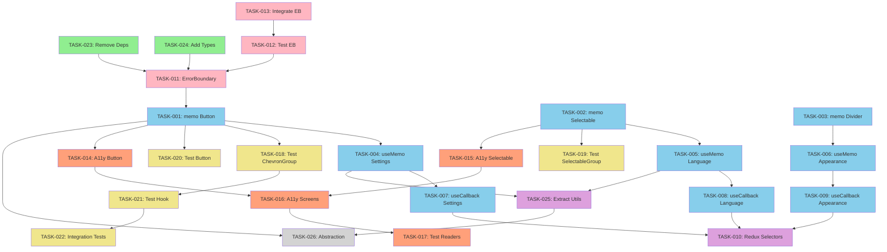

# React Native Optimization - Epics, Stories & Tasks

This directory contains a hierarchical breakdown of React Native optimization work organized into Epics (business initiatives), User Stories (user-facing value), and Tasks (technical implementations).

**Created**: 2025-01-11
**Last Updated**: 2025-01-12
**Structure**: 4 Epics → 4 User Stories → 27 Tasks
**Total Effort**: 18.75 hours

---

## Table of Contents

- [Overview](#overview)
- [Hierarchy Structure](#hierarchy-structure)
- [Epics](#epics)
- [User Stories](#user-stories)
- [Tasks by Status](#tasks-by-status)
- [Timeline & Effort](#timeline--effort)
- [Dependency Map](#dependency-map)
- [Expected Impact](#expected-impact)
- [How to Navigate](#how-to-navigate)

---

## Overview

Following a comprehensive codebase analysis on 2025-01-11, we identified 42 optimization opportunities. This work has been organized hierarchically to connect technical implementations with user-facing value and business goals.

### Why This Structure?

- **Epics** answer: "What business value are we delivering?"
- **User Stories** answer: "What user problem are we solving?"
- **Tasks** answer: "What specific code changes are needed?"

This makes it easy to:

- Track progress at different levels (executive → developer)
- Understand the "why" behind technical work
- Navigate from high-level goals to implementation details
- Link tasks back to user value

---

## Hierarchy Structure

```
📁 docs/planning/user-stories/
├── 📄 README.md (this file)
├── 📄 TEMPLATE.md (task template)
├── 📁 epics/
│   ├── EPIC-001-performance-optimization.md
│   ├── EPIC-002-quality-reliability.md
│   ├── EPIC-003-accessibility-compliance.md
│   └── EPIC-004-code-quality-tech-debt.md
├── 📁 stories/
│   ├── US-001-smooth-responsive-interactions.md
│   ├── US-002-graceful-error-handling.md
│   ├── US-003-inclusive-screen-reader-support.md
│   └── US-004-comprehensive-test-coverage.md
└── 📁 tasks/
    ├── TASK-001-memo-button-with-chevron.md
    ├── TASK-002-memo-selectable-list-button.md
    ├── TASK-003-memo-button-group-divider.md
    ├── ... (23 more tasks)
```

---

## Epics

### [EPIC-001: Performance Optimization](./epics/EPIC-001-performance-optimization.md)

**Goal**: Reduce component re-renders by 70-80% and improve frame rates to 60 FPS

**Business Value**: Better app store ratings, reduced user churn, competitive advantage

**User Stories**: [US-001: Smooth & Responsive Interactions](./stories/US-001-smooth-responsive-interactions.md)

**Tasks**: 10 tasks, 6 hours

- Component memoization (React.memo) - 3 tasks
- Computed value optimization (useMemo) - 3 tasks
- Event handler optimization (useCallback) - 3 tasks
- Redux selector optimization - 1 task

**Success Metrics**:

- Re-renders: 30/scroll → 6/scroll (-80%)
- Frame rate: 45 FPS → 58-60 FPS (+33%)
- JS execution: 320ms → 80ms (-75%)

---

### [EPIC-002: Quality & Reliability](./epics/EPIC-002-quality-reliability.md)

**Goal**: Prevent app crashes and increase test coverage from 36.72% to 60%+

**Business Value**: Fewer support tickets, better user retention, faster development

**User Stories**:

- [US-002: Graceful Error Handling](./stories/US-002-graceful-error-handling.md)
- [US-004: Comprehensive Test Coverage](./stories/US-004-comprehensive-test-coverage.md)

**Tasks**: 8 tasks, 6 hours

- Error boundary implementation - 3 tasks
- Component test coverage - 3 tasks
- Hook testing - 1 task
- Integration testing - 1 task

**Success Metrics**:

- Crash rate: Possible → 0% (handled gracefully)
- Test coverage: 36.72% → 60%+ (+25%)
- Confidence: Low → High

---

### [EPIC-003: Accessibility & Compliance](./epics/EPIC-003-accessibility-compliance.md)

**Goal**: Achieve WCAG 2.1 Level AA compliance and full screen reader support

**Business Value**: App Store featuring eligibility, legal compliance, market expansion

**User Stories**: [US-003: Inclusive Screen Reader Support](./stories/US-003-inclusive-screen-reader-support.md)

**Tasks**: 4 tasks, 2 hours

- Add accessibility labels to components - 3 tasks
- VoiceOver/TalkBack testing - 1 task

**Success Metrics**:

- WCAG compliance: Partial → Level AA (100%)
- Screen reader support: Partial → Full (100%)
- Inclusive design: Benefits 15% of users

---

### [EPIC-004: Code Quality & Technical Debt](./epics/EPIC-004-code-quality-tech-debt.md)

**Goal**: Reduce bundle size by 5-10% and eliminate code duplication

**Business Value**: Faster builds, easier maintenance, lower onboarding time

**User Stories**: None (purely technical)

**Tasks**: 4 tasks, 4.5 hours

- Dependency cleanup - 2 tasks
- Utility extraction - 1 task
- Component abstraction - 1 task

**Success Metrics**:

- Bundle size: 586MB → ~550MB (-5-10%)
- Code duplication: 10% → 7% (-30%)
- Technical debt: 15h → 5h (-67%)

---

## User Stories

### [US-001: Smooth & Responsive Interactions](./stories/US-001-smooth-responsive-interactions.md)

**As a** mobile app user,
**I want** smooth scrolling through lists and instant response to button taps,
**So that** the app feels fast and responsive.

**Epic**: [EPIC-001: Performance Optimization](./epics/EPIC-001-performance-optimization.md)
**Priority**: High
**Effort**: 6 hours
**Tasks**: 10 tasks

**Value**: Directly improves user experience; visible performance improvement

**Tasks**:

- [TASK-001](./tasks/TASK-001-memo-button-with-chevron.md): Add React.memo to ButtonWithChevron (0.5h)
- [TASK-002](./tasks/TASK-002-memo-selectable-list-button.md): Add React.memo to SelectableListButton (0.5h)
- [TASK-003](./tasks/TASK-003-memo-button-group-divider.md): Add React.memo to ButtonGroupDivider (0.5h)
- [TASK-004](./tasks/TASK-004-usememo-settings-screen.md): Add useMemo to SettingsScreen (0.75h)
- [TASK-005](./tasks/TASK-005-usememo-language-screen.md): Add useMemo to LanguageScreen (0.5h)
- [TASK-006](./tasks/TASK-006-usememo-appearance-screen.md): Add useMemo to AppearanceScreen (0.5h)
- [TASK-007](./tasks/TASK-007-usecallback-settings-screen.md): Add useCallback to SettingsScreen (0.5h)
- [TASK-008](./tasks/TASK-008-usecallback-language-screen.md): Add useCallback to LanguageScreen (0.5h)
- [TASK-009](./tasks/TASK-009-usecallback-appearance-screen.md): Add useCallback to AppearanceScreen (0.5h)
- [TASK-010](./tasks/TASK-010-optimize-redux-selectors.md): Optimize Redux selectors with createSelector (1h)

---

### [US-002: Graceful Error Handling](./stories/US-002-graceful-error-handling.md)

**As a** mobile app user,
**I want** the app to handle errors gracefully without crashing to the home screen,
**So that** I can continue using the app even when something goes wrong.

**Epic**: [EPIC-002: Quality & Reliability](./epics/EPIC-002-quality-reliability.md)
**Priority**: High
**Effort**: 2 hours
**Tasks**: 3 tasks

**Value**: Prevents frustrating crashes; professional error UX

**Tasks**:

- [TASK-011](./tasks/TASK-011-create-error-boundary.md): Create ErrorBoundary component (1h)
- [TASK-012](./tasks/TASK-012-test-error-boundary.md): Add ErrorBoundary tests (0.5h)
- [TASK-013](./tasks/TASK-013-integrate-error-boundary.md): Integrate ErrorBoundary in App.tsx (0.5h)

---

### [US-003: Inclusive Screen Reader Support](./stories/US-003-inclusive-screen-reader-support.md)

**As a** blind or low-vision user,
**I want** full VoiceOver and TalkBack support throughout the app,
**So that** I can navigate and use all features independently.

**Epic**: [EPIC-003: Accessibility & Compliance](./epics/EPIC-003-accessibility-compliance.md)
**Priority**: High
**Effort**: 2 hours
**Tasks**: 4 tasks

**Value**: Inclusive design; App Store compliance; reaches 15% of users

**Tasks**:

- [TASK-014](./tasks/TASK-014-accessibility-button-with-chevron.md): Add accessibility to ButtonWithChevron (0.5h)
- [TASK-015](./tasks/TASK-015-accessibility-selectable-button.md): Add accessibility to SelectableListButton (0.5h)
- [TASK-016](./tasks/TASK-016-accessibility-all-screens.md): Add accessibility to all screens (0.5h)
- [TASK-017](./tasks/TASK-017-test-voiceover-talkback.md): Test VoiceOver/TalkBack support (0.5h)

---

### [US-004: Comprehensive Test Coverage](./stories/US-004-comprehensive-test-coverage.md)

**As a** React Native developer,
**I want** comprehensive test coverage (60%+) across all components,
**So that** I can refactor and add features with confidence.

**Epic**: [EPIC-002: Quality & Reliability](./epics/EPIC-002-quality-reliability.md)
**Priority**: High
**Effort**: 4 hours
**Tasks**: 5 tasks

**Value**: Faster development; fewer bugs in production; easier refactoring

**Tasks**:

- [TASK-018](./tasks/TASK-018-test-chevron-button-group.md): Test ChevronButtonGroup (20%→90%) (1h)
- [TASK-019](./tasks/TASK-019-test-selectable-button-group.md): Test SelectableButtonGroup (20%→90%) (1h)
- [TASK-020](./tasks/TASK-020-test-button-with-chevron.md): Test ButtonWithChevron (50%→90%) (0.5h)
- [TASK-021](./tasks/TASK-021-test-use-app-color-scheme.md): Test useAppColorScheme hook (1h)
- [TASK-022](./tasks/TASK-022-integration-tests-settings.md): Add integration tests for settings (0.5h)

---

## Tasks by Status

### 📊 Overview

| Status      | Count | Effort |
| ----------- | ----- | ------ |
| Not Started | 26    | 18.5h  |
| In Progress | 0     | 0h     |
| Done        | 0     | 0h     |

### 🔴 High Priority (16 tasks, 13h)

**Performance** (Epic 1, US-001):

- [TASK-001](./tasks/TASK-001-memo-button-with-chevron.md): React.memo ButtonWithChevron (0.5h)
- [TASK-002](./tasks/TASK-002-memo-selectable-list-button.md): React.memo SelectableListButton (0.5h)
- [TASK-003](./tasks/TASK-003-memo-button-group-divider.md): React.memo ButtonGroupDivider (0.5h)
- [TASK-004](./tasks/TASK-004-usememo-settings-screen.md): useMemo SettingsScreen (0.75h)
- [TASK-005](./tasks/TASK-005-usememo-language-screen.md): useMemo LanguageScreen (0.5h)
- [TASK-006](./tasks/TASK-006-usememo-appearance-screen.md): useMemo AppearanceScreen (0.5h)
- [TASK-007](./tasks/TASK-007-usecallback-settings-screen.md): useCallback SettingsScreen (0.5h)
- [TASK-008](./tasks/TASK-008-usecallback-language-screen.md): useCallback LanguageScreen (0.5h)
- [TASK-009](./tasks/TASK-009-usecallback-appearance-screen.md): useCallback AppearanceScreen (0.5h)

**Error Handling** (Epic 2, US-002):

- [TASK-011](./tasks/TASK-011-create-error-boundary.md): Create ErrorBoundary (1h)
- [TASK-012](./tasks/TASK-012-test-error-boundary.md): Test ErrorBoundary (0.5h)
- [TASK-013](./tasks/TASK-013-integrate-error-boundary.md): Integrate ErrorBoundary (0.5h)

**Accessibility** (Epic 3, US-003):

- [TASK-014](./tasks/TASK-014-accessibility-button-with-chevron.md): Accessibility ButtonWithChevron (0.5h)
- [TASK-015](./tasks/TASK-015-accessibility-selectable-button.md): Accessibility SelectableListButton (0.5h)
- [TASK-016](./tasks/TASK-016-accessibility-all-screens.md): Accessibility all screens (0.5h)
- [TASK-017](./tasks/TASK-017-test-voiceover-talkback.md): Test screen readers (0.5h)

**Dependencies** (Epic 4):

- [TASK-023](./tasks/TASK-023-remove-unused-dependencies.md): Remove unused deps (0.25h)
- [TASK-024](./tasks/TASK-024-add-missing-types.md): Add @types/node (0.25h)

### 🟡 Medium Priority (7 tasks, 4.5h)

**Testing** (Epic 2, US-004):

- [TASK-018](./tasks/TASK-018-test-chevron-button-group.md): Test ChevronButtonGroup (1h)
- [TASK-019](./tasks/TASK-019-test-selectable-button-group.md): Test SelectableButtonGroup (1h)
- [TASK-020](./tasks/TASK-020-test-button-with-chevron.md): Test ButtonWithChevron (0.5h)
- [TASK-021](./tasks/TASK-021-test-use-app-color-scheme.md): Test useAppColorScheme (1h)
- [TASK-022](./tasks/TASK-022-integration-tests-settings.md): Integration tests (0.5h)

**Redux** (Epic 1, US-001):

- [TASK-010](./tasks/TASK-010-optimize-redux-selectors.md): Optimize selectors (1h)

**Code Quality** (Epic 4):

- [TASK-025](./tasks/TASK-025-extract-label-utilities.md): Standardise imports (0.25h)

### ⚪ Low Priority (2 tasks, 2.75h)

**Code Quality** (Epic 4):

- [TASK-027](./tasks/TASK-025-standardise-component-imports.md): Standardise component imports to @app alias (0.25h)

---

## Timeline & Effort

### Total: 18.75 hours

**Suggested 2-Week Timeline** (1 developer, 4h/day):

#### Week 1: Foundation & Performance

- **Day 1** (4h):
  - TASK-023, TASK-024: Dependency cleanup (0.5h)
  - TASK-011, TASK-012, TASK-013: Error Boundary (2h)
  - TASK-001, TASK-002, TASK-003: React.memo components (1.5h)

- **Day 2** (4h):
  - TASK-004, TASK-005, TASK-006: useMemo screens (1.75h)
  - TASK-007, TASK-008, TASK-009: useCallback handlers (1.5h)
  - TASK-010: Redux selectors (0.75h remaining)

- **Day 3** (4h):
  - TASK-010: Complete Redux selectors (0.25h)
  - TASK-014, TASK-015, TASK-016: Accessibility (1.5h)
  - TASK-018, TASK-019: Component tests (2h)
  - Buffer (0.25h)

- **Day 4** (4h):
  - TASK-020, TASK-021: More tests (1.5h)
  - TASK-022: Integration tests (0.5h)
  - TASK-017: Screen reader testing (0.5h)
  - TASK-025: Standardise imports (0.25h)
  - Buffer (0.5h)

- **Day 5** (4h):
  - TASK-026: ButtonGroup abstraction (2.5h) - Optional
  - Documentation updates (1h)
  - Final testing and PR cleanup (0.5h)

#### Week 2: Review & Deploy

- Code reviews
- Address feedback
- Merge and monitor

---

## Dependency Map



**Legend**:

- 🟢 Green: Dependencies (start here)
- 🔴 Pink: Error Boundary (critical path)
- 🔵 Blue: Performance tasks
- 🟣 Purple: Medium priority
- 🟡 Yellow: Testing tasks
- 🟠 Orange: Accessibility
- ⚪ Grey: Optional/Low priority

---

## Expected Impact

### Performance

| Metric              | Before | After     | Improvement |
| ------------------- | ------ | --------- | ----------- |
| Re-renders/scroll   | 30     | 6         | -80%        |
| Frame rate          | 45 FPS | 58-60 FPS | +33%        |
| JS execution        | 320ms  | 80ms      | -75%        |
| Time to interactive | 850ms  | 700ms     | -18%        |

### Quality

| Metric           | Before | After | Improvement |
| ---------------- | ------ | ----- | ----------- |
| Crash handling   | None   | Full  | ∞           |
| Test coverage    | 36.72% | 60%+  | +25%        |
| Error boundaries | 0      | 1     | ∞           |

### Accessibility

| Metric                | Before  | After    | Improvement |
| --------------------- | ------- | -------- | ----------- |
| WCAG compliance       | Partial | Level AA | 100%        |
| Screen reader support | Partial | Full     | 100%        |
| Inclusive users       | 0%      | 15%      | ∞           |

### Code Quality

| Metric           | Before | After  | Improvement |
| ---------------- | ------ | ------ | ----------- |
| Bundle size      | 586MB  | ~550MB | -5-10%      |
| Code duplication | 10%    | 7%     | -30%        |
| Technical debt   | 15h    | 5h     | -67%        |

---

## How to Navigate

### By Role

**🎯 Product Manager**: Start with [Epics](#epics) → understand business value
**👤 User Advocate**: Read [User Stories](#user-stories) → see user impact
**💻 Developer**: Go to [Tasks](#tasks-by-status) → pick a task to implement
**🧪 QA Engineer**: Check tasks → find test scenarios in each task file
**📊 Project Manager**: Review [Timeline](#timeline--effort) → track progress

### By Priority

1. **Need quick wins?** → [High Priority Tasks](#-high-priority-16-tasks-13h)
2. **Want biggest impact?** → [US-001: Performance](./stories/US-001-smooth-responsive-interactions.md)
3. **Critical for production?** → [US-002: Error Handling](./stories/US-002-graceful-error-handling.md)
4. **App Store requirement?** → [US-003: Accessibility](./stories/US-003-inclusive-screen-reader-support.md)

### By Technical Area

- **React Performance**: Tasks 001-009
- **Error Handling**: Tasks 011-013
- **Accessibility**: Tasks 014-017
- **Testing**: Tasks 018-022
- **Dependencies**: Tasks 023-024
- **Code Quality**: Tasks 025-026

---

## File Templates

- **[TEMPLATE.md](./TEMPLATE.md)**: Task template with all sections
- **Epic Template**: See any epic file for structure
- **Story Template**: See any story file for structure

---

## Quick Links

### Documentation

- [Project README](../../../README.md)
- [Architecture](../../ARCHITECTURE.md)
- [Contributing](../../CONTRIBUTING.md)
- [Testing Guide](../../TESTING.md)

### By Epic

- [EPIC-001: Performance](./epics/EPIC-001-performance-optimization.md) (10 tasks, 6h)
- [EPIC-002: Quality & Reliability](./epics/EPIC-002-quality-reliability.md) (8 tasks, 6h)
- [EPIC-003: Accessibility](./epics/EPIC-003-accessibility-compliance.md) (4 tasks, 2h)
- [EPIC-004: Code Quality](./epics/EPIC-004-code-quality-tech-debt.md) (4 tasks, 4.5h)

### By User Story

- [US-001: Smooth Interactions](./stories/US-001-smooth-responsive-interactions.md) (10 tasks, 6h)
- [US-002: Error Handling](./stories/US-002-graceful-error-handling.md) (3 tasks, 2h)
- [US-003: Accessibility](./stories/US-003-inclusive-screen-reader-support.md) (4 tasks, 2h)
- [US-004: Test Coverage](./stories/US-004-comprehensive-test-coverage.md) (5 tasks, 4h)

---

**Status**: ✅ All epics, stories, and tasks documented
**Ready**: Yes - pick any high-priority task to start
**Total Work**: 27 tasks, 18.75 hours, ~2 weeks
