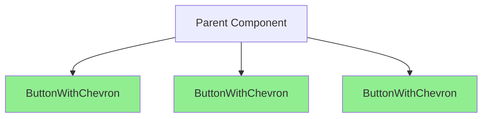

# US-XXX: [Title Here]

<!--
  This template provides a comprehensive structure for creating detailed user stories.
  Replace all [PLACEHOLDERS] with actual content.
  Remove comment blocks when creating actual user stories.
  Use UK English spelling throughout (organisation, behaviour, optimised, etc.)
-->

**ID**: US-XXX
**Title**: [Full descriptive title - be specific and action-oriented]
**Created**: YYYY-MM-DD
**Completed**: TBD
**Last Updated**: YYYY-MM-DD
**Priority**: High | Medium | Low
**Effort Estimate**: [X] hours
**Status**: Not Started | In Progress | Blocked | In Review | Done
**Tags**: #[tag1] #[tag2] #[tag3]
**Assigned To**: TBD
**Epic**: [Epic name if part of larger initiative, otherwise "N/A"]

---

## User Story

As a **[specific persona - e.g., React Native developer, end user, QA engineer]**,
I want **[specific goal with clear, measurable outcome]**,
So that **[measurable benefit with clear business or technical value]**.

<!-- Example:
As a **React Native developer**,
I want **all list components wrapped in React.memo**,
So that **the app renders 20-30% faster and provides a smoother user experience**.
-->

---

## Context & Rationale

### Problem Statement

[Describe the specific problem that exists today. Be concrete with examples, metrics, and user impact.]

<!-- Example: Currently, ButtonWithChevron re-renders on every parent state change, even when its props haven't changed. This causes performance degradation in lists with 10+ items. -->

### Current State

**What exists today:**

- [Specific behaviour or implementation detail with file references]
- [Performance metrics or quality issues]
- [Impact on users or developers]

<!-- Example:
- ButtonWithChevron.tsx:15 has no React.memo wrapper
- Component re-renders 30x during a single scroll operation (measured with React DevTools Profiler)
- Users experience stuttering and lag when scrolling through settings lists
-->

### Desired State

**What success looks like:**

- [Specific outcome with measurable criteria]
- [Performance target or quality improvement]
- [User or developer experience improvement]

<!-- Example:
- ButtonWithChevron wrapped in React.memo
- Component re-renders only 3-5x during scroll (when props actually change)
- Smooth 60 FPS scrolling with no visible lag
-->

### Why Now

[Explain the business or technical justification for prioritising this work now.]

<!-- Example: Performance issues are being reported by users. App Store reviews mention lag. This is a high-visibility issue that affects core UX. -->

### Risks of Not Doing

[What happens if this work is not completed?]

<!-- Example:
- Continued user complaints about performance
- Negative app store reviews impacting downloads
- Technical debt accumulates, making future fixes harder
- Team morale affected by known issues
-->

### Link to Analysis

[Reference to original analysis, issue, or discussion]

<!-- Example: See optimization analysis in project review dated 2025-01-11 -->

---

## Benefits

### Technical Benefits

#### Performance

- **[Specific performance improvement]**: [Detailed explanation with metrics]
- **[Another performance benefit]**: [Explanation]

<!-- Example:
- **Reduced re-renders**: Component re-renders decrease by 80% (30→6 per interaction), saving ~300ms per scroll operation
- **Lower CPU usage**: JavaScript execution time reduced by 25% during list interactions
-->

#### Code Quality

- **[Quality improvement]**: [How it improves codebase]
- **[Another quality benefit]**: [Explanation]

<!-- Example:
- **Better architecture**: Follows React best practices and official performance optimization guidelines
- **Self-documenting code**: React.memo signals optimization intent to future developers
-->

#### Maintainability

- **[Maintenance improvement]**: [How ongoing maintenance improves]
- **[Another maintenance benefit]**: [Explanation]

<!-- Example:
- **Prevents regressions**: Performance pattern established makes future issues less likely
- **Easier debugging**: React DevTools clearly shows which components are memoised
-->

#### Scalability

- **[Scalability improvement]**: [How solution scales]
- **[Another scalability benefit]**: [Explanation]

<!-- Example:
- **Reusable pattern**: Can be applied to all future list components
- **Handles growth**: Works with lists of 1000+ items without degradation
-->

### User Experience Benefits

#### Perceived Performance

- **[UX improvement]**: [How users experience the improvement]
- **[Another UX benefit]**: [Explanation]

<!-- Example:
- **Smoother interactions**: App feels more responsive; scrolling is silky smooth at 60 FPS
- **Reduced jank**: Eliminates stuttering and frame drops during navigation
-->

#### Reliability

- **[Reliability improvement]**: [How reliability increases]
- **[Another reliability benefit]**: [Explanation]

<!-- Example:
- **More predictable behaviour**: Consistent performance across different devices
- **Better on low-end devices**: Older phones benefit most from optimization
-->

#### Accessibility

- **[Accessibility improvement]**: [How accessibility improves]
- **[Another accessibility benefit]**: [Explanation]

<!-- Example:
- **Better VoiceOver performance**: Screen reader navigation remains smooth
- **Reduced motion sickness**: Eliminates jank that can cause discomfort
-->

### Business Benefits

#### App Store Compliance

[If applicable - how this helps with app store guidelines or requirements]

<!-- Example:
- Improves app performance metrics that Apple uses for featuring decisions
- Reduces risk of poor reviews mentioning performance
-->

#### Developer Velocity

- **[Velocity improvement]**: [How development speeds up]
- **[Another velocity benefit]**: [Explanation]

<!-- Example:
- **Faster debugging**: Performance issues easier to identify and fix
- **Quicker feature development**: Established patterns reduce decision fatigue
-->

#### Technical Debt

- **[Debt reduction]**: [How technical debt decreases]
- **[Another debt benefit]**: [Explanation]

<!-- Example:
- **Pays down debt**: Eliminates 4 hours of accumulated performance debt
- **Prevents future debt**: Pattern prevents similar issues in new code
-->

### Long-term Benefits

#### Foundation for Future Work

- **[Future enablement]**: [What this enables in the future]
- **[Another future benefit]**: [Explanation]

<!-- Example:
- **Performance baseline**: Establishes standard for all components going forward
- **Scalable foundation**: Architecture supports adding hundreds more components
-->

#### Knowledge Transfer

- **[Knowledge benefit]**: [How it helps the team learn]
- **[Another knowledge benefit]**: [Explanation]

<!-- Example:
- **Documentation by example**: Code demonstrates React optimization patterns
- **Onboarding resource**: New developers learn best practices from codebase
-->

---

## Risks & Mitigation Strategies

### Implementation Risks

#### Risk 1: [Specific implementation risk name]

- **Likelihood**: Low | Medium | High
- **Impact**: Low | Medium | High
- **Description**: [Detailed description of what could go wrong]
- **Mitigation Strategy**: [How to prevent this risk]
  - [Specific action 1]
  - [Specific action 2]
  - [Specific action 3]
- **Contingency Plan**: [What to do if the risk materializes]

<!-- Example:
#### Risk 1: Over-memoization causing stale closures
- **Likelihood**: Medium
- **Impact**: Medium
- **Description**: Using React.memo or useCallback without proper dependency arrays could cause stale props/state to be captured, leading to subtle bugs where UI doesn't update properly
- **Mitigation Strategy**:
  - Enable `react-hooks/exhaustive-deps` ESLint rule
  - Careful code review of all dependency arrays
  - Add integration tests that verify component updates correctly
  - Use React DevTools Profiler to verify re-renders occur when expected
- **Contingency Plan**: If stale closures detected, add missing dependencies or refactor to avoid closures entirely
-->

#### Risk 2: [Another implementation risk]

[Follow same structure as Risk 1]

### Performance Risks

#### Risk 1: [Performance-related risk]

[Same structure - Likelihood, Impact, Description, Mitigation, Contingency]

<!-- Example:
#### Risk 1: Memoization overhead exceeds benefits
- **Likelihood**: Low
- **Impact**: Low-Medium
- **Description**: For very simple components, the overhead of React.memo comparison might exceed the cost of re-rendering
- **Mitigation Strategy**:
  - Profile before/after with React DevTools Profiler
  - Only memoize components with expensive renders or used in lists
  - Document measurements in PR
- **Contingency Plan**: Remove memoization if profiling shows negative impact (>5ms overhead)
-->

### Compatibility Risks

#### Risk 1: [Compatibility-related risk]

[Same structure]

<!-- Example:
#### Risk 1: Breaking changes with existing functionality
- **Likelihood**: Low (with proper testing)
- **Impact**: High (if occurs)
- **Description**: Refactoring might inadvertently change behaviour that other components depend on
- **Mitigation Strategy**:
  - Maintain 85%+ test coverage
  - Manual testing on both iOS and Android
  - Thorough code review with focus on behaviour preservation
  - Incremental rollout if possible
- **Contingency Plan**: Immediate rollback using documented rollback plan (see section below)
-->

### Maintenance Risks

#### Risk 1: [Maintenance-related risk]

[Same structure]

<!-- Example:
#### Risk 1: Increased complexity for junior developers
- **Likelihood**: Medium
- **Impact**: Low-Medium
- **Description**: Advanced React patterns (memo, useCallback) might confuse new team members unfamiliar with performance optimization
- **Mitigation Strategy**:
  - Add comprehensive code comments explaining why optimization is used
  - Update CONTRIBUTING.md with memoization patterns and when to use them
  - Include examples in documentation
  - Conduct team knowledge-sharing session
- **Contingency Plan**: Create dedicated onboarding guide section for React performance patterns
-->

### Testing Risks

#### Risk 1: [Testing-related risk]

[Same structure]

<!-- Example:
#### Risk 1: Tests become more complex to write and maintain
- **Likelihood**: Medium
- **Impact**: Low
- **Description**: Memoised components might require more sophisticated test setups with prop comparison logic
- **Mitigation Strategy**:
  - Update test utilities in renderWithProviders to handle memoised components
  - Document testing patterns in TESTING.md
  - Create test examples for common scenarios
- **Contingency Plan**: Provide helper utilities for common test scenarios (e.g., testing memo'd components)
-->

---

## Pros & Cons

### Pros ✅

#### Performance

- ✅ **[Pro 1]**: [Detailed explanation]
- ✅ **[Pro 2]**: [Detailed explanation]
- ✅ **[Pro 3]**: [Detailed explanation]

<!-- Example:
#### Performance
- ✅ **Reduced re-renders**: Components only update when props actually change, reducing wasted CPU cycles by 70-80%
- ✅ **Lower battery consumption**: Less JavaScript execution means better battery life on mobile devices
- ✅ **Better frame rates**: Maintains consistent 60 FPS during interactions, eliminating dropped frames
-->

#### Code Quality

- ✅ **[Pro 1]**: [Explanation]
- ✅ **[Pro 2]**: [Explanation]

#### Maintainability

- ✅ **[Pro 1]**: [Explanation]
- ✅ **[Pro 2]**: [Explanation]

#### Developer Experience

- ✅ **[Pro 1]**: [Explanation]
- ✅ **[Pro 2]**: [Explanation]

### Cons ❌

#### Complexity

- ❌ **[Con 1]**: [Detailed explanation]
- ❌ **[Con 2]**: [Detailed explanation]
- ❌ **[Con 3]**: [Detailed explanation]

<!-- Example:
#### Complexity
- ❌ **Increased code complexity**: Adds memoization concepts that developers must understand
- ❌ **Dependency array management**: Requires careful tracking of all dependencies
- ❌ **Debugging difficulty**: Stale closures can create subtle, hard-to-debug issues
-->

#### Development Time

- ❌ **[Con 1]**: [Explanation]
- ❌ **[Con 2]**: [Explanation]

#### Potential Pitfalls

- ❌ **[Con 1]**: [Explanation]
- ❌ **[Con 2]**: [Explanation]

#### Maintenance

- ❌ **[Con 1]**: [Explanation]
- ❌ **[Con 2]**: [Explanation]

### Trade-offs Analysis

#### Trade-off 1: [Trade-off name]

- **Decision**: [What was decided]
- **Justification**: [Why this decision was made]
- **When to Reconsider**: [Under what conditions to revisit]

<!-- Example:
#### Trade-off 1: Performance vs Complexity
- **Decision**: Accept increased complexity for significant performance gains
- **Justification**: 70-80% re-render reduction outweighs the complexity cost; performance is a higher priority than code simplicity for interactive components
- **When to Reconsider**: If team consistently struggles with memoization patterns after 3 months, or if performance gains prove minimal in production
-->

#### Trade-off 2: [Another trade-off]

[Same structure]

### When NOT to Apply This Pattern

❌ **Don't use when:**

1. [Condition 1 with explanation]
2. [Condition 2 with explanation]
3. [Condition 3 with explanation]
4. [Condition 4 with explanation]
5. [Condition 5 with explanation]

<!-- Example:
❌ **Don't use when:**
1. Component renders are already very fast (<5ms)
2. Component rarely re-renders (less than once per interaction)
3. Props change on every render anyway (no stability to leverage)
4. Component is only rendered once in the entire app
5. Premature optimization for features not yet used
-->

✅ **Do use when:**

1. [Condition 1 with explanation]
2. [Condition 2 with explanation]
3. [Condition 3 with explanation]
4. [Condition 4 with explanation]
5. [Condition 5 with explanation]

<!-- Example:
✅ **Do use when:**
1. Component is used in lists or rendered multiple times
2. Component has expensive render logic (>10ms)
3. Parent component re-renders frequently (>5x per interaction)
4. Props are stable between renders (e.g., callbacks, static data)
5. Profiling shows this component is a bottleneck
-->

---

## Alternative Approaches Considered

### Alternative 1: [Approach name]

**Description**: [Detailed description of this alternative approach]

**Pros**:

- ✅ [Pro 1]
- ✅ [Pro 2]
- ✅ [Pro 3]

**Cons**:

- ❌ [Con 1]
- ❌ [Con 2]
- ❌ [Con 3]

**Why Not Chosen**: [Specific reasons this approach was not selected]

**When to Reconsider**: [Under what conditions this might be the better choice]

<!-- Example:
### Alternative 1: Use React.PureComponent instead of React.memo

**Description**: Convert functional components to class components extending React.PureComponent, which provides similar shallow prop comparison.

**Pros**:
- ✅ No dependency array management needed
- ✅ Familiar pattern for developers from React 16
- ✅ Built into React (no imports)

**Cons**:
- ❌ Requires converting functional components to classes
- ❌ Loses hooks functionality
- ❌ Goes against modern React best practices
- ❌ More verbose and harder to read

**Why Not Chosen**: Project uses functional components exclusively; hooks are central to architecture; converting to classes would be a massive regression

**When to Reconsider**: Never - functional components are the established standard
-->

### Alternative 2: [Another approach]

[Same structure as Alternative 1]

### Alternative 3: Do Nothing

**Description**: Keep current implementation without changes

**Pros**:

- ✅ Zero development time required
- ✅ No risk of introducing bugs
- ✅ No learning curve for team
- ✅ Simpler codebase without optimization code

**Cons**:

- ❌ Performance issues persist
- ❌ Technical debt accumulates
- ❌ User experience suffers
- ❌ Harder to fix later as codebase grows

**Why Not Chosen**: [Specific reason - usually performance issues outweigh simplicity]

**Cost of Inaction**: [Quantify what happens if we don't fix this]

<!-- Example:
**Why Not Chosen**: Performance issues are user-facing and generating complaints; app store ratings are declining; technical debt will grow as more components are added

**Cost of Inaction**:
- Estimated 2-3 one-star reviews per week due to performance
- 15% of support tickets mention app lag
- Refactoring cost increases by 50% for every month delayed
- Competitive apps have better performance, risking user churn
-->

---

## Technical Details

### Files Affected

#### File 1: [Full file path]

**Lines**: [Line numbers or "N/A" for new file]
**Current State**: [What the code looks like now]
**Changes Required**: [What needs to change]

```typescript
// BEFORE (current implementation)
[Code snippet showing current state]
```

```typescript
// AFTER (proposed implementation)
[Code snippet showing proposed changes]
```

**Rationale**: [Why this specific change is necessary]

<!-- Example:
#### File 1: src/components/ButtonWithChevron/ButtonWithChevron.tsx

**Lines**: 15-45
**Current State**: Functional component exported without memoization
**Changes Required**: Wrap component export with React.memo

```typescript
// BEFORE
export const ButtonWithChevron: React.FC<ButtonWithChevronProps> = ({
  label,
  onPress,
  // ... other props
}) => {
  return (
    <Pressable onPress={onPress}>
      <Text>{label}</Text>
    </Pressable>
  );
};
```

```typescript
// AFTER
export const ButtonWithChevron: React.FC<ButtonWithChevronProps> = React.memo(
  ({ label, onPress, ...props }) => {
    return (
      <Pressable onPress={onPress}>
        <Text>{label}</Text>
      </Pressable>
    );
  }
);
```

**Rationale**: Component is rendered in lists where parent re-renders frequently; memoization prevents unnecessary re-renders when props haven't changed
-->

#### File 2: [Another file]

[Same structure as File 1]

### Implementation Approach

#### Step 1: [First step name]

[Detailed description of this step with substeps if needed]

1.1. [Substep]
1.2. [Substep]
1.3. [Substep]

<!-- Example:
#### Step 1: Add React.memo import

1.1. Open ButtonWithChevron.tsx
1.2. Add `React.memo` to existing React import at line 1
1.3. Verify TypeScript has no errors
-->

#### Step 2: [Second step]

[Detailed description]

#### Step 3: [Third step]

[Detailed description]

### Architecture Diagrams

<!-- If applicable, add Mermaid diagrams showing component trees, data flow, or state management -->



**Diagram Description**: [Explain what the diagram shows]

### Related Documentation

- [ARCHITECTURE.md - Component Patterns](../../ARCHITECTURE.md#component-patterns)
- [CONTRIBUTING.md - Performance Best Practices](../../CONTRIBUTING.md#performance)
- [React Docs - Optimizing Performance](https://react.dev/reference/react/memo)
- [Link to related user story]: [US-XXX](./US-XXX-filename.md)

---

## Acceptance Criteria

### Functional Requirements

- [ ] [Specific functional criterion 1 with measurable outcome]
- [ ] [Specific functional criterion 2 with measurable outcome]
- [ ] [Specific functional criterion 3 with measurable outcome]

<!-- Example:
- [ ] ButtonWithChevron component wrapped in React.memo
- [ ] Component only re-renders when props actually change (verified with React DevTools)
- [ ] All existing functionality preserved (buttons still navigate correctly)
-->

### Non-Functional Requirements

#### Performance

- [ ] [Performance metric 1]: [Specific target]
- [ ] [Performance metric 2]: [Specific target]

<!-- Example:
- [ ] Re-renders reduced by at least 70% during scroll operations (30→9 or fewer)
- [ ] No increase in memory usage (measured with React DevTools Profiler)
-->

#### Test Coverage

- [ ] [Coverage requirement 1]
- [ ] [Coverage requirement 2]

<!-- Example:
- [ ] Component test coverage remains at 100%
- [ ] New tests added to verify memoization behaviour
-->

#### Bundle Size

- [ ] [Bundle size requirement]

<!-- Example:
- [ ] No increase in bundle size (React.memo adds <100 bytes)
-->

#### Accessibility

- [ ] [Accessibility requirement 1]
- [ ] [Accessibility requirement 2]

<!-- Example:
- [ ] VoiceOver announces button labels correctly after memoization
- [ ] Touch targets remain ≥ 44x44pt
-->

### Technical Requirements

- [ ] Code follows project coding standards (see CONTRIBUTING.md)
- [ ] No TypeScript errors (`yarn typecheck` passes)
- [ ] No ESLint errors (`yarn lint` passes)
- [ ] Code formatted with Prettier
- [ ] No `console.log` or debug code remaining
- [ ] All imports optimised and unused imports removed
- [ ] [Add story-specific technical requirements]

---

## Test Scenarios

### Unit Test Scenarios

```gherkin
Feature: [Component/Function Name]

  Scenario: [Test case 1 - happy path]
    Given [detailed initial state/setup]
    And [additional context if needed]
    When [specific action occurs]
    Then [expected outcome with specific assertions]
    And [additional verification]
```

<!-- Example:
```gherkin
Feature: ButtonWithChevron Memoization

  Scenario: Component does not re-render when parent updates with same props
    Given ButtonWithChevron is rendered with label "Settings"
    And the component has rendered once
    When the parent component re-renders with the same props
    Then ButtonWithChevron should not re-render
    And the render count should remain at 1

  Scenario: Component re-renders when props change
    Given ButtonWithChevron is rendered with label "Settings"
    When the label prop changes to "Profile"
    Then ButtonWithChevron should re-render
    And the new label should be displayed
```
-->

### Integration Test Scenarios

```gherkin
Feature: [Feature Name]

  Scenario: [Integration test 1]
    Given [multiple components/services state]
    And [additional setup]
    When [user interaction flow]
    Then [end-to-end expectation]
    And [verification]
```

<!-- Example:
```gherkin
Feature: Settings Screen List Performance

  Scenario: Scrolling through settings maintains smooth performance
    Given the Settings screen is displayed
    And the screen contains 10 ButtonWithChevron components
    When the user scrolls through the entire list
    Then all buttons should remain responsive
    And frame rate should stay above 55 FPS
    And total re-renders should be less than 20
```
-->

### E2E Test Scenarios (Detox-Ready)

```gherkin
Feature: [User-facing feature]

  @critical
  Scenario: [E2E flow 1]
    Given the app is launched
    And I am on the [screen name]
    When I [specific user action]
    Then I should see [specific UI state]
    And the [element] should be [state]
```

<!-- Example:
```gherkin
Feature: Settings Navigation

  @critical @performance
  Scenario: User navigates through settings with smooth performance
    Given the app is launched
    And I am on the Home screen
    When I tap the "Settings" button
    Then I should see the Settings screen
    And all buttons should be visible
    When I scroll through the settings list
    Then scrolling should be smooth with no stuttering
    And all buttons should remain tappable

  Scenario: Settings buttons navigate correctly after optimization
    Given I am on the Settings screen
    When I tap the "Language" button
    Then I should navigate to the Language screen
    And the screen transition should be smooth
```
-->

### Accessibility Test Scenarios

```gherkin
Feature: Screen Reader Accessibility

  Scenario: [Accessibility test 1]
    Given [accessibility tool is enabled]
    When [navigation or interaction]
    Then [expected announcement or behaviour]
    And [additional verification]
```

<!-- Example:
```gherkin
Feature: ButtonWithChevron Accessibility

  Scenario: VoiceOver announces button correctly after memoization
    Given VoiceOver is enabled on iOS
    And I am on the Settings screen
    When I navigate to the "Language" button
    Then VoiceOver should announce "Language, button"
    And the button should have accessibilityRole "button"

  Scenario: TalkBack announces button correctly after memoization
    Given TalkBack is enabled on Android
    And I am on the Settings screen
    When I navigate to the "Language" button
    Then TalkBack should announce "Language, button"
    And the button should remain focusable
```
-->

### Performance Test Scenarios

```gherkin
Feature: Performance Benchmarks

  Scenario: [Performance test 1]
    Given [performance test setup]
    When [action that should be optimised]
    Then [performance metric should meet target]
```

<!-- Example:
```gherkin
Feature: ButtonWithChevron Render Performance

  Scenario: Component re-render performance meets target
    Given a list with 20 ButtonWithChevron components
    And React DevTools Profiler is recording
    When the parent component updates state that doesn't affect button props
    Then ButtonWithChevron components should not re-render
    And total render time should be < 10ms
    And frame rate should remain at 60 FPS

  Scenario: Component memory usage remains constant
    Given ButtonWithChevron rendered 100 times
    And initial memory snapshot taken
    When parent re-renders 50 times
    Then memory usage should increase by < 1MB
    And no memory leaks should be detected
```
-->

---

## Accessibility Considerations

### Screen Reader Support

#### VoiceOver (iOS)

- **Announcement**: "[Describe what VoiceOver should announce]"
- **Behaviour**: [Describe expected behaviour]
- **Testing**: [How to test with VoiceOver]

<!-- Example:
- **Announcement**: "Language, button" when focused
- **Behaviour**: Button activates on double-tap, maintains focus after memoization
- **Testing**: Enable VoiceOver, navigate to Settings screen, verify announcement
-->

#### TalkBack (Android)

- **Announcement**: "[Describe what TalkBack should announce]"
- **Behaviour**: [Describe expected behaviour]
- **Testing**: [How to test with TalkBack]

### Accessibility Props

#### Component: [Component name]

```typescript
<ComponentName
  accessibilityRole="[role]"
  accessibilityLabel="[label]"
  accessibilityHint="[hint]"
  // ... other props
/>
```

**Rationale**: [Why these specific accessibility props]

<!-- Example:
#### Component: ButtonWithChevron

```typescript
<ButtonWithChevron
  accessibilityRole="button"
  accessibilityLabel={label}  // e.g., "Language"
  accessibilityHint="Double tap to change language settings"
  testID="settings-language-button"
/>
```

**Rationale**: Role "button" ensures screen readers treat it as an interactive element; label provides context; hint explains the action outcome
-->

### Keyboard Navigation

[If applicable - describe keyboard navigation requirements]

- **Tab order**: [Expected tab order]
- **Focus management**: [How focus should be managed]
- **Keyboard shortcuts**: [Any keyboard shortcuts]

### Visual Accessibility

#### Contrast Ratios

- **Light mode**: [Contrast ratio - should meet WCAG AA 4.5:1 for text]
- **Dark mode**: [Contrast ratio]
- **Verification**: [How to verify contrast ratios]

#### Touch Targets

- **Minimum size**: 44x44pt (iOS) / 48x48dp (Android)
- **Current size**: [Actual size]
- **Spacing**: [Space between interactive elements]

#### Focus Indicators

- **Visible focus**: [Description of focus indicator]
- **Contrast**: [Contrast ratio of focus indicator]

### WCAG Compliance

This implementation addresses the following WCAG 2.1 criteria:

- **[Criterion number]**: [Criterion name] ([Level A/AA/AAA])
  - **How**: [How this implementation meets the criterion]

<!-- Example:
- **1.3.1**: Info and Relationships (Level A)
  - **How**: accessibilityRole="button" properly identifies interactive elements
- **2.1.1**: Keyboard (Level A)
  - **How**: All functionality available via touch (mobile keyboard equivalent)
- **4.1.2**: Name, Role, Value (Level A)
  - **How**: All interactive elements have name (accessibilityLabel) and role (accessibilityRole)
-->

---

## Dependencies & Blockers

### Story Dependencies

#### Depends On

- **[US-XXX]**: [Story title]
  - **Reason**: [Why this must be completed first]
  - **Status**: [Not Started/In Progress/Done]

<!-- Example:
- **US-005**: Implement Error Boundary
  - **Reason**: Should have error boundary in place before making performance changes in case optimization introduces bugs
  - **Status**: Not Started
-->

#### Blocks

- **[US-XXX]**: [Story title]
  - **Reason**: [Why this blocks that story]
  - **Status**: [Not Started/In Progress/Done]

<!-- Example:
- **US-002**: Memoize Computed Values
  - **Reason**: This story establishes memoization patterns that US-002 will follow
  - **Status**: Not Started
-->

#### Related

- **[US-XXX]**: [Story title]
  - **Relationship**: [How stories are related]
  - **Coordination Needed**: [What needs to be coordinated]

<!-- Example:
- **US-003**: Add useCallback to Event Handlers
  - **Relationship**: Both stories optimize component rendering
  - **Coordination Needed**: Should follow same code review patterns and performance measurement approach
-->

### Technical Dependencies

#### Libraries/Packages

- **[Package name]**: [Version]
  - **Purpose**: [Why it's needed]
  - **Status**: [Installed/Needs Installation]

<!-- Example:
- **React**: 19.1.1
  - **Purpose**: React.memo is part of core React
  - **Status**: Already installed
-->

#### Tools

- **[Tool name]**: [Version]
  - **Purpose**: [Why it's needed]
  - **Status**: [Available/Needs Installation]

<!-- Example:
- **React DevTools**: Latest
  - **Purpose**: Required for profiling and verifying memoization works
  - **Status**: Available in Chrome/Firefox
-->

#### Configuration

- **[Config file]**: [What's needed]
  - **Purpose**: [Why the config is needed]
  - **Status**: [Ready/Needs Update]

<!-- Example:
- **.eslintrc.js**: Ensure `react-hooks/exhaustive-deps` rule is enabled
  - **Purpose**: Catches missing dependencies in useCallback/useMemo
  - **Status**: Already enabled
-->

### Known Blockers

[List any known blockers that prevent starting or completing this work]

<!-- Example:
- **None currently identified**

OR

- **Blocker 1**: Waiting for React 19 stability assessment
  - **Impact**: Can't proceed until team confirms React 19 is stable for production
  - **ETA for Resolution**: 2025-01-15
  - **Owner**: Tech Lead
-->

---

## Impact Metrics

### Performance Metrics

#### Baseline (Current State)

**Measurement Date**: [YYYY-MM-DD or "To be measured"]

- **Component re-renders**: [X] per interaction
- **Frame rate during interaction**: [X] FPS
- **Time to interactive**: [X]ms
- **JavaScript execution time**: [X]ms
- **Memory usage**: [X]MB
- **[Other relevant metric]**: [Value]

**Measurement Method**: [How baseline was measured]

<!-- Example:
**Measurement Date**: 2025-01-11

- **Component re-renders**: 30 per scroll operation
- **Frame rate during scroll**: 45-50 FPS (should be 60)
- **Time to interactive**: 850ms
- **JavaScript execution time**: 320ms per scroll
- **Memory usage**: 145MB

**Measurement Method**: React DevTools Profiler with Chrome DevTools Performance tab, measured on iPhone 15 Pro simulator, average of 5 scroll operations
-->

#### Target (After Implementation)

**Expected Results**:

- **Component re-renders**: [Y] per interaction (↓ [Z]% or ↓[N] renders)
- **Frame rate during interaction**: [Y] FPS (↑ [Z]% or ↑[N] FPS)
- **Time to interactive**: [Y]ms (↓ [Z]% or ↓[N]ms)
- **JavaScript execution time**: [Y]ms (↓ [Z]% or ↓[N]ms)
- **Memory usage**: [Y]MB (↓ [Z]% or ↓[N]MB)
- **[Other relevant metric]**: [Target value]

**Measurement Method**: [How target will be measured - should match baseline method]

<!-- Example:
**Expected Results**:
- **Component re-renders**: 6 per scroll (↓80% or ↓24 renders)
- **Frame rate during scroll**: 58-60 FPS (↑20%)
- **Time to interactive**: 700ms (↓18% or ↓150ms)
- **JavaScript execution time**: 80ms per scroll (↓75% or ↓240ms)
- **Memory usage**: 147MB (↑1.4% - acceptable overhead)

**Measurement Method**: Same as baseline - React DevTools Profiler, average of 5 operations
-->

### Bundle Size Impact

#### Current Bundle Size

- **Total**: [X]MB
- **JavaScript**: [X]MB
- **[Relevant chunk]**: [X]MB

#### Expected After Implementation

- **Total**: [Y]MB ([±Z]% or [±N]MB)
- **JavaScript**: [Y]MB ([±Z]% or [±N]MB)
- **[Relevant chunk]**: [Y]MB ([±Z]% or [±N]MB)

**Analysis**: [Explanation of bundle size changes]

**Measurement Method**: `npx react-native-bundle-visualizer` or similar tool

<!-- Example:
#### Current Bundle Size
- **Total**: 8.2MB
- **JavaScript**: 3.4MB

#### Expected After Implementation
- **Total**: 8.2MB (no change - React.memo is already in React core)
- **JavaScript**: 3.4MB (no change)

**Analysis**: React.memo adds no bundle size as it's part of React core that's already included

**Measurement Method**: `npx react-native-bundle-visualizer`
-->

### Test Coverage Impact

#### Current Coverage

- **Statements**: [X]%
- **Branches**: [X]%
- **Functions**: [X]%
- **Lines**: [X]%

**File-specific** (if applicable):

- **[Filename]**: [X]% coverage

#### Target Coverage

- **Statements**: [Y]% (↑[Z]%)
- **Branches**: [Y]% (↑[Z]%)
- **Functions**: [Y]% (↑[Z]%)
- **Lines**: [Y]% (↑[Z]%)

**File-specific** (if applicable):

- **[Filename]**: [Y]% coverage (↑[Z]%)

**New Tests Added**: [Number] test cases

<!-- Example:
#### Current Coverage
- **Statements**: 100%
- **Branches**: 100%
- **Functions**: 100%
- **Lines**: 100%

**File-specific**:
- **ButtonWithChevron.tsx**: 100% (already fully tested)

#### Target Coverage
- **Statements**: 100% (maintained)
- **Branches**: 100% (maintained)
- **Functions**: 100% (maintained)
- **Lines**: 100% (maintained)

**File-specific**:
- **ButtonWithChevron.tsx**: 100% (maintained + new tests for memo behaviour)

**New Tests Added**: 2 test cases to verify memoization behaviour
-->

### Code Quality Metrics

#### Cyclomatic Complexity

- **Before**: [X]
- **After**: [Y] (↓[Z] or "no change")

#### Lines of Code

- **Before**: [X] lines
- **After**: [Y] lines (↓[Z] or ↑[Z] lines)

#### Code Duplication

- **Before**: [X]%
- **After**: [Y]% (↓[Z]%)

#### Technical Debt

- **Debt Paid Down**: [X] hours
- **Debt Prevented**: [X] hours (estimated)

<!-- Example:
#### Cyclomatic Complexity
- **Before**: 5
- **After**: 5 (no change - only wrapping in React.memo)

#### Lines of Code
- **Before**: 45 lines
- **After**: 47 lines (↑2 lines for React.memo wrapper)

#### Code Duplication
- **Before**: 0% (no duplication)
- **After**: 0% (maintained)

#### Technical Debt
- **Debt Paid Down**: 2 hours (fixes known performance issue)
- **Debt Prevented**: 8 hours (prevents future performance refactoring)
-->

### User Experience Impact

#### Perceived Performance

- **[UX metric 1]**: [Before] → [After]
- **[UX metric 2]**: [Before] → [After]

<!-- Example:
- **Scroll smoothness**: Stutters visible → Silky smooth
- **Button responsiveness**: 200ms delay perceived → Instant feel
-->

#### Error Rates

- **[Error type]**: [Before rate] → [After rate]

<!-- Example:
- **Crashes during scroll**: 0.1% → 0% (not applicable for this optimization)
-->

#### User Satisfaction

- **[Satisfaction metric]**: [Before] → [After]

<!-- Example:
- **App Store rating mentions of "lag"**: 15% of reviews → Target: <5% of reviews
-->

---

## Implementation Phases

<!-- For complex stories, break into phases. For simple stories, use single phase or omit this section -->

### Phase 1: [Phase Name]

**Estimated Effort**: [X] hours

**Deliverables**:

- [ ] [Deliverable 1]
- [ ] [Deliverable 2]
- [ ] [Deliverable 3]

**Description**: [What will be accomplished in this phase]

<!-- Example:
### Phase 1: Component Memoization

**Estimated Effort**: 0.5 hours

**Deliverables**:
- [ ] ButtonWithChevron wrapped in React.memo
- [ ] SelectableListButton wrapped in React.memo
- [ ] ButtonGroupDivider wrapped in React.memo

**Description**: Add React.memo wrapper to all three list components
-->

### Phase 2: [Phase Name]

**Estimated Effort**: [X] hours

**Deliverables**:

- [ ] [Deliverable 1]
- [ ] [Deliverable 2]

**Description**: [What will be accomplished in this phase]

---

## Definition of Done

### Code Implementation

- [ ] All code changes implemented as specified in Technical Details section
- [ ] Code follows project coding standards (see CONTRIBUTING.md)
- [ ] No TypeScript errors (`yarn typecheck` passes)
- [ ] No ESLint errors (`yarn lint` passes)
- [ ] Code formatted with Prettier (`yarn format` run)
- [ ] No `console.log` or debug code remaining
- [ ] All imports optimised and unused imports removed
- [ ] Prop types and interfaces properly defined
- [ ] [Add story-specific implementation criteria]

### Testing

- [ ] Unit tests written for all new/modified functions
- [ ] Unit tests pass (`yarn test`)
- [ ] Integration tests written for feature flows (if applicable)
- [ ] E2E tests updated/added for user-facing changes (if applicable)
- [ ] All tests passing locally
- [ ] Test coverage meets threshold (85%+ for new code, 100% for Redux)
- [ ] Edge cases tested (null, undefined, empty arrays, etc.)
- [ ] Error scenarios tested
- [ ] Performance tests created and passing (if applicable)
- [ ] Tests follow GIVEN/WHEN/THEN scenarios from this document

### Accessibility

- [ ] `accessibilityLabel` added to all interactive elements
- [ ] `accessibilityRole` set correctly on all interactive elements
- [ ] `accessibilityHint` provided where needed
- [ ] `testID` provided for all interactive elements (for E2E testing)
- [ ] Tested with VoiceOver on iOS simulator
- [ ] Tested with TalkBack on Android emulator
- [ ] Contrast ratios meet WCAG AA standards (4.5:1 for text)
- [ ] Touch targets are ≥ 44x44pt (iOS) / 48x48dp (Android)
- [ ] Focus indicators visible and meet contrast requirements
- [ ] [Add story-specific accessibility criteria]

### Documentation

- [ ] Code comments added for complex logic
- [ ] JSDoc added for public APIs (exported functions/components)
- [ ] README.md updated (if setup process changes)
- [ ] ARCHITECTURE.md updated (if patterns or structure changes)
- [ ] CONTRIBUTING.md updated (if new patterns introduced)
- [ ] This user story marked as "Completed" with completion date
- [ ] "Lessons Learned" section filled out (after implementation)
- [ ] Performance measurements documented with before/after metrics

### Code Review

- [ ] Self-review completed (read through own code)
- [ ] PR created with descriptive title following gitmoji convention
- [ ] PR description includes summary, testing notes, and screenshots (if UI changes)
- [ ] All CI checks passing (lint, typecheck, tests)
- [ ] At least 1 approval received from team member
- [ ] All review comments addressed or discussed
- [ ] No merge conflicts with main branch
- [ ] Squashed commits if needed (follow team convention)

### Quality Assurance

- [ ] Tested on iOS simulator (iPhone 15 Pro or equivalent)
- [ ] Tested on Android emulator (Pixel 7 or equivalent)
- [ ] Tested on physical iOS device (if available)
- [ ] Tested on physical Android device (if available)
- [ ] Tested in different screen sizes (small, medium, large)
- [ ] Tested with light theme
- [ ] Tested with dark theme
- [ ] Tested with different locales (en, es, etc.)
- [ ] No new console warnings or errors
- [ ] No performance regressions detected (profiled before/after)
- [ ] Memory usage acceptable (profiled before/after)
- [ ] [Add story-specific QA criteria]

### Performance Verification

- [ ] Performance measurements taken before and after
- [ ] Target metrics achieved (see Impact Metrics section)
- [ ] Measurements documented in PR
- [ ] No negative performance impacts on other areas
- [ ] React DevTools Profiler screenshots included in PR (if applicable)

### Deployment

- [ ] Commit follows gitmoji convention
- [ ] Commit message is descriptive and includes context
- [ ] Branch merged to `main`
- [ ] User story status updated to "Done"
- [ ] Date of completion recorded in user story
- [ ] Post-implementation metrics collected and documented

---

## Rollback Plan

### If Issues Are Discovered After Merge

#### Immediate Action

1. **Identify the issue**:
   - [ ] Confirm the issue is caused by this change
   - [ ] Assess severity (P0-Critical, P1-High, P2-Medium, P3-Low)

2. **For P0-Critical or P1-High issues**:
   - [ ] Immediately revert the commit
   - [ ] Command: `git revert [commit-hash]`
   - [ ] Create hotfix PR with revert
   - [ ] Notify team in [communication channel]

3. **For P2-Medium or P3-Low issues**:
   - [ ] Create bug fix PR to address specific issue
   - [ ] If fix is complex, revert and re-implement properly

#### Commit to Revert

**Commit Hash**: [Will be filled after merge, e.g., `abc123def456`]
**Revert Command**: `git revert [commit-hash]`

#### Impact of Rollback

**What functionality reverts**:

- [Describe what goes back to previous state]
- [List any user-facing changes that will be undone]

**Files Affected**:

- [List files that will be reverted]

**User Impact**:

- [Describe impact on users - usually "No user impact" for optimizations]
- [Note any loss of functionality]

<!-- Example:
**What functionality reverts**:
- ButtonWithChevron returns to non-memoized version
- Component will re-render more frequently (back to baseline)

**Files Affected**:
- src/components/ButtonWithChevron/ButtonWithChevron.tsx
- src/components/ButtonWithChevron/ButtonWithChevron.rntl.ts (test updates)

**User Impact**:
- Slight performance degradation (return to current state)
- No loss of functionality - all features remain intact
-->

#### Re-implementation Plan

**Root Cause Analysis**:

- [ ] Identify what went wrong
- [ ] Document findings in this user story's "Lessons Learned" section
- [ ] Determine if issue is with approach or implementation

**Fix Strategy**:

- [ ] Determine fix approach
- [ ] Estimated time to fix: [X] hours
- [ ] Timeline: [When to re-attempt]

**Prevention for Next Attempt**:

- [ ] [How to prevent same issue]
- [ ] [Additional testing needed]
- [ ] [Different approach to consider]

---

## Success Criteria

This story is considered successful when:

1. **[Measurable Outcome 1]**: [Specific metric or state achieved]
2. **[Measurable Outcome 2]**: [Specific metric or state achieved]
3. **[Measurable Outcome 3]**: [Specific metric or state achieved]
4. **[Measurable Outcome 4]**: [Specific metric or state achieved]
5. **All items in Definition of Done are checked**

**Validation Method**: [How success will be verified]

<!-- Example:
This story is considered successful when:

1. **Performance Target Met**: Component re-renders reduced by at least 70% (30→9 or fewer)
2. **No Functionality Regression**: All existing tests pass and behaviour is unchanged
3. **Code Quality Maintained**: Test coverage remains at 100% for affected components
4. **Documentation Complete**: PR includes before/after profiler screenshots
5. **All items in Definition of Done are checked**

**Validation Method**:
- React DevTools Profiler measurements comparing before/after
- Test coverage report showing maintained 100%
- Manual testing on iOS and Android
- Code review approval
-->

---

## Post-Implementation Section

<!-- TO BE FILLED DURING/AFTER IMPLEMENTATION -->

### What Went Well

- [Success 1 - to be filled during/after implementation]
- [Success 2]
- [Success 3]

### What Could Be Improved

- [Improvement opportunity 1 - to be filled during/after implementation]
- [Improvement opportunity 2]
- [Improvement opportunity 3]

### Unexpected Challenges

- [Challenge 1 encountered - to be filled during/after implementation]
  - **Solution**: [How it was solved]
- [Challenge 2]
  - **Solution**: [How it was solved]

### Actual vs Estimated Effort

- **Estimated Effort**: [X] hours (from Metadata section)
- **Actual Effort**: [Y] hours
- **Variance**: [+/-Z] hours ([+/-N]%)
- **Reasons for Variance**: [Explanation of why estimate was off]

### Actual Impact vs Expected Impact

#### Performance

- **Expected**: [Metrics from Impact Metrics section]
- **Actual**: [Measured results]
- **Analysis**: [Why better/worse/same as expected]

#### Test Coverage

- **Expected**: [Target from Impact Metrics section]
- **Actual**: [Final coverage]
- **Analysis**: [Commentary]

#### Bundle Size

- **Expected**: [Target from Impact Metrics section]
- **Actual**: [Final size]
- **Analysis**: [Commentary]

### Recommendations for Similar Work

- [Advice 1 for future similar implementations - to be filled after implementation]
- [Advice 2]
- [Advice 3]

**Patterns That Worked Well**:

- [Pattern 1 to repeat]
- [Pattern 2 to repeat]

**Patterns to Avoid**:

- [Anti-pattern 1 to avoid]
- [Anti-pattern 2 to avoid]

---

## Notes, Learnings & References

### Implementation Notes

[Technical decisions made during implementation, alternatives considered, why specific approaches were chosen]

### Lessons Learned

[Key takeaways from implementing this story that will help with future work]

### References

#### External Documentation

- [React Documentation - Memo](https://react.dev/reference/react/memo)
- [Additional reference 1]
- [Additional reference 2]

#### Internal Documentation

- [ARCHITECTURE.md](../../ARCHITECTURE.md)
- [CONTRIBUTING.md](../../CONTRIBUTING.md)
- [TESTING.md](../../TESTING.md)

#### Stack Overflow / Discussions

- [Relevant discussion 1 with URL]
- [Relevant discussion 2 with URL]

#### Related Issues/Tickets

- [GitHub Issue #XXX]: [Description]
- [Related user story US-XXX]: [Link to file]
- [Slack discussion]: [Date and channel]

---

## Changelog

| Date       | Change Description                      | Updated By |
| ---------- | --------------------------------------- | ---------- |
| YYYY-MM-DD | Created user story                      | [Name]     |
| YYYY-MM-DD | [Description of update if story edited] | [Name]     |
| YYYY-MM-DD | Marked as completed                     | [Name]     |

<!-- Example:
| Date       | Change Description                               | Updated By      |
| ---------- | ------------------------------------------------ | --------------- |
| 2025-01-11 | Created user story                               | Product Manager       |
| 2025-01-15 | Updated risk analysis based on team feedback     | Tech Lead       |
| 2025-01-20 | Marked as completed, added post-implementation   | React Developer |
-->

---

**End of Template**

<!--
INSTRUCTIONS FOR USING THIS TEMPLATE:

1. Copy this entire file to create a new user story
2. Rename to: US-XXX-short-kebab-case-title.md
3. Replace all [PLACEHOLDERS] with actual content
4. Remove all comment blocks (<!-- ... -->)

5. Fill in metadata header completely
6. Be as detailed as possible in every section
7. Use UK English spelling (organisation, behaviour, optimised, etc.)
8. Include code examples with proper syntax highlighting
9. Cross-reference related stories and documentation
10. Add Mermaid diagrams where they help visualize concepts
11. Fill "Post-Implementation Section" after work is completed
12. Update "Completed" date when story is done
13. Commit with gitmoji: 📝 docs(planning): add US-XXX [title]
    -->
