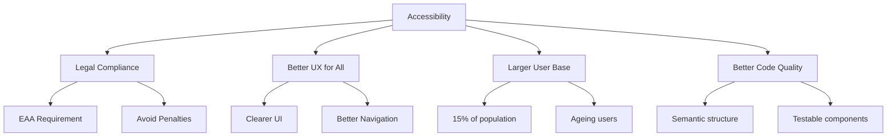

# Accessibility Guide

This document covers European Accessibility Act (EAA) compliance requirements for this React Native application.

## Table of Contents

- [Overview](#overview)
- [Legal Requirements](#legal-requirements)
- [WCAG 2.1 Level AA](#wcag-21-level-aa)
- [React Native Implementation](#react-native-implementation)
- [Component Requirements](#component-requirements)
- [Testing Accessibility](#testing-accessibility)
- [Screen Reader Support](#screen-reader-support)
- [Common Patterns](#common-patterns)
- [Checklist](#checklist)
- [Troubleshooting](#troubleshooting)

---

## Overview

This project must comply with the **European Accessibility Act (EAA)**, which requires all mobile applications sold or distributed in the EU to meet accessibility standards by **June 28, 2025**.

### Why Accessibility Matters



### Project Standard

- **Standard**: WCAG 2.1 Level AA
- **Deadline**: June 28, 2025
- **Scope**: All user-facing components
- **Enforcement**: Build accessibility in from the start

---

## Legal Requirements

### European Accessibility Act (EAA)

The EAA (Directive 2019/882) requires:

1. **Mobile Applications**: Must be perceivable, operable, understandable, and robust
2. **Digital Services**: Must provide accessible interfaces
3. **Penalties**: Non-compliance can result in fines and market restrictions

### Who Must Comply

- Apps distributed in EU countries
- Apps sold to EU customers
- Apps with EU user base

### Timeline

| Date          | Milestone                         |
| ------------- | --------------------------------- |
| June 2019     | EAA adopted                       |
| June 2022     | Member states transposed into law |
| **June 2025** | **Compliance deadline**           |

---

## WCAG 2.1 Level AA

### Four Principles (POUR)

1. **Perceivable**: Information must be presentable to users
2. **Operable**: Interface must be operable by all users
3. **Understandable**: Information and UI must be understandable
4. **Robust**: Content must be robust enough for assistive technologies

### Key Requirements

#### Visual

| Requirement       | Criteria                   | Implementation            |
| ----------------- | -------------------------- | ------------------------- |
| Colour Contrast   | 4.5:1 for text, 3:1 for UI | Use GlueStack UI tokens   |
| Text Sizing       | Support up to 200% scaling | Use relative units        |
| Non-Text Contrast | 3:1 for UI components      | Check against backgrounds |

#### Touch

| Requirement       | Criteria                         | Implementation              |
| ----------------- | -------------------------------- | --------------------------- |
| Touch Target Size | 44×44 (iOS), 48×48 (Android)     | minWidth/minHeight props    |
| Spacing           | Adequate space between targets   | margin/padding              |
| Gestures          | Alternative for complex gestures | Provide button alternatives |

#### Screen Reader

| Requirement | Criteria                          | Implementation     |
| ----------- | --------------------------------- | ------------------ |
| Labels      | All interactive elements labelled | accessibilityLabel |
| Roles       | Correct semantic roles            | accessibilityRole  |
| Hints       | Helpful action descriptions       | accessibilityHint  |
| States      | Current state communicated        | accessibilityState |

---

## React Native Implementation

### Required Accessibility Props

Every interactive element must have these props:

```typescript
<Pressable
  onPress={handleSubmit}
  accessibilityRole="button"
  accessibilityLabel="Submit form"
  accessibilityHint="Saves your changes and returns to previous screen"
  accessibilityState={{ disabled: isSubmitting }}
  style={{ minWidth: 44, minHeight: 44 }}
  testID="submit-button"
>
  <Text>Submit</Text>
</Pressable>
```

### Accessibility Props Reference

| Prop                      | Purpose           | Example                               |
| ------------------------- | ----------------- | ------------------------------------- |
| `accessibilityRole`       | Element type      | `"button"`, `"link"`, `"header"`      |
| `accessibilityLabel`      | Descriptive label | `"Close modal"`                       |
| `accessibilityHint`       | Action result     | `"Returns to home screen"`            |
| `accessibilityState`      | Current state     | `{ disabled: true, selected: false }` |
| `accessibilityValue`      | Current value     | `{ min: 0, max: 100, now: 50 }`       |
| `accessibilityActions`    | Custom actions    | Array of action objects               |
| `accessibilityLiveRegion` | Announce changes  | `"polite"`, `"assertive"`             |

### Accessibility Roles

```typescript
// Common roles
accessibilityRole = 'button'; // Pressable buttons
accessibilityRole = 'link'; // Navigation links
accessibilityRole = 'header'; // Section headers
accessibilityRole = 'image'; // Images (with label)
accessibilityRole = 'text'; // Important text
accessibilityRole = 'search'; // Search inputs
accessibilityRole = 'alert'; // Important messages
accessibilityRole = 'checkbox'; // Toggleable items
accessibilityRole = 'radio'; // Radio buttons
accessibilityRole = 'tab'; // Tab buttons
accessibilityRole = 'tablist'; // Tab container
accessibilityRole = 'menu'; // Menu container
accessibilityRole = 'menuitem'; // Menu items
accessibilityRole = 'progressbar'; // Loading indicators
accessibilityRole = 'slider'; // Sliders
accessibilityRole = 'switch'; // Toggle switches
accessibilityRole = 'adjustable'; // Adjustable values
```

### Accessibility States

```typescript
accessibilityState={{
  disabled: false,    // Cannot be interacted with
  selected: true,     // Currently selected
  checked: true,      // Checkbox/radio checked
  busy: false,        // Loading/processing
  expanded: false,    // Accordion expanded
}}
```

---

## Component Requirements

### Buttons

```typescript
// ✅ Correct - Full accessibility
<Pressable
  onPress={handlePress}
  accessibilityRole="button"
  accessibilityLabel="Save changes"
  accessibilityHint="Saves your settings and returns to profile"
  accessibilityState={{ disabled: isSaving }}
  style={{ minWidth: 44, minHeight: 44 }}
>
  <Text>Save</Text>
</Pressable>

// ❌ Wrong - Missing accessibility
<Pressable onPress={handlePress}>
  <Text>Save</Text>
</Pressable>
```

### Icons with Text

```typescript
// ✅ Correct - Combined label
<Pressable
  onPress={handleSettings}
  accessibilityRole="button"
  accessibilityLabel="Settings"
  accessibilityHint="Opens app settings"
>
  <SettingsIcon accessibilityElementsHidden />
  <Text>Settings</Text>
</Pressable>
```

### Icon-Only Buttons

```typescript
// ✅ Correct - Descriptive label
<Pressable
  onPress={handleClose}
  accessibilityRole="button"
  accessibilityLabel="Close modal"
  accessibilityHint="Closes this dialog"
  style={{ minWidth: 44, minHeight: 44, padding: 10 }}
>
  <CloseIcon size={24} />
</Pressable>

// ❌ Wrong - No label for icon
<Pressable onPress={handleClose}>
  <CloseIcon size={24} />
</Pressable>
```

### Text Inputs

```typescript
<TextInput
  value={email}
  onChangeText={setEmail}
  accessibilityLabel="Email address"
  accessibilityHint="Enter your email address"
  accessibilityRole="text"
  keyboardType="email-address"
  autoComplete="email"
  textContentType="emailAddress"
/>
```

### Images

```typescript
// Decorative image (hide from screen reader)
<Image
  source={decorativeImage}
  accessibilityElementsHidden
/>

// Informative image (provide description)
<Image
  source={chartImage}
  accessibilityRole="image"
  accessibilityLabel="Sales chart showing 50% increase in Q4"
/>
```

### Lists

```typescript
<FlatList
  data={items}
  renderItem={({ item, index }) => (
    <Pressable
      accessibilityRole="button"
      accessibilityLabel={item.name}
      accessibilityHint={`Opens ${item.name} details`}
      accessibilityValue={{
        text: `Item ${index + 1} of ${items.length}`,
      }}
    >
      <Text>{item.name}</Text>
    </Pressable>
  )}
/>
```

### Headings

```typescript
<Text
  accessibilityRole="header"
  style={styles.sectionHeader}
>
  Account Settings
</Text>
```

### Switches/Toggles

```typescript
<Switch
  value={darkMode}
  onValueChange={setDarkMode}
  accessibilityRole="switch"
  accessibilityLabel="Dark mode"
  accessibilityState={{ checked: darkMode }}
  accessibilityHint="Toggles dark theme"
/>
```

---

## Testing Accessibility

### Manual Testing

#### iOS VoiceOver

1. Enable: Settings → Accessibility → VoiceOver
2. Navigate: Swipe left/right to move between elements
3. Activate: Double-tap to activate
4. Verify: Labels, hints, and roles read correctly

#### Android TalkBack

1. Enable: Settings → Accessibility → TalkBack
2. Navigate: Swipe left/right to move between elements
3. Activate: Double-tap to activate
4. Verify: Labels, hints, and roles read correctly

### Automated Testing

```typescript
// Using React Native Testing Library
import { render } from '@testing-library/react-native';

describe('SettingsButton Accessibility', () => {
  it('has correct accessibility properties', () => {
    const { getByRole } = render(
      <SettingsButton label="Language" onPress={() => {}} />
    );

    const button = getByRole('button');

    expect(button).toHaveAccessibilityValue({ text: 'Language' });
    expect(button).not.toHaveAccessibilityState({ disabled: true });
  });

  it('meets touch target requirements', () => {
    const { getByTestId } = render(
      <SettingsButton label="Theme" onPress={() => {}} testID="theme-btn" />
    );

    const button = getByTestId('theme-btn');
    const { width, height } = button.props.style;

    // iOS minimum is 44
    expect(width).toBeGreaterThanOrEqual(44);
    expect(height).toBeGreaterThanOrEqual(44);
  });
});
```

### Accessibility Audit

Use the `/check-accessibility` command to run a quick accessibility scan:

```bash
# Quick accessibility scan
/check-accessibility

# Full EAA compliance audit
/eaa-audit
```

---

## Screen Reader Support

### Navigation Order

Ensure logical reading order:

```typescript
<View>
  {/* Read first */}
  <Text accessibilityRole="header">Profile</Text>

  {/* Read second */}
  <Image
    source={avatar}
    accessibilityLabel="Profile picture"
  />

  {/* Read third */}
  <Text>John Doe</Text>

  {/* Read last */}
  <Pressable accessibilityLabel="Edit profile">
    <Text>Edit</Text>
  </Pressable>
</View>
```

### Grouping Related Elements

```typescript
// Group related content
<View
  accessible
  accessibilityLabel="John Doe, Software Engineer, San Francisco"
>
  <Text>John Doe</Text>
  <Text>Software Engineer</Text>
  <Text>San Francisco</Text>
</View>
```

### Hiding Decorative Elements

```typescript
// Hide from screen reader
<View accessibilityElementsHidden>
  <DecorativeIcon />
</View>

// Or on individual elements
<Image
  source={decorativeBackground}
  importantForAccessibility="no-hide-descendants"
/>
```

### Announcements

```typescript
import { AccessibilityInfo } from 'react-native';

// Announce important changes
const handleSave = async () => {
  await saveData();
  AccessibilityInfo.announceForAccessibility('Settings saved successfully');
};
```

---

## Common Patterns

### Settings List Item

```typescript
export const SettingsItem: React.FC<SettingsItemProps> = ({
  label,
  endLabel,
  onPress,
  startIcon: StartIcon,
  showChevron = true,
  accessibilityHint,
}) => {
  // Combine label and end label for screen readers
  const combinedLabel = endLabel ? `${label}, ${endLabel}` : label;

  return (
    <Pressable
      onPress={onPress}
      accessibilityRole="button"
      accessibilityLabel={combinedLabel}
      accessibilityHint={accessibilityHint}
      style={{ minHeight: 44 }}
    >
      {StartIcon && <StartIcon accessibilityElementsHidden />}
      <Text>{label}</Text>
      {endLabel && <Text>{endLabel}</Text>}
      {showChevron && <ChevronIcon accessibilityElementsHidden />}
    </Pressable>
  );
};
```

### Modal Dialog

```typescript
<Modal
  visible={isVisible}
  onRequestClose={handleClose}
  accessibilityViewIsModal
>
  <View>
    <Text accessibilityRole="header">Confirm Action</Text>
    <Text>Are you sure you want to proceed?</Text>

    <Pressable
      onPress={handleCancel}
      accessibilityRole="button"
      accessibilityLabel="Cancel"
    >
      <Text>Cancel</Text>
    </Pressable>

    <Pressable
      onPress={handleConfirm}
      accessibilityRole="button"
      accessibilityLabel="Confirm"
    >
      <Text>Confirm</Text>
    </Pressable>
  </View>
</Modal>
```

### Loading State

```typescript
const LoadingIndicator = () => (
  <View
    accessibilityRole="progressbar"
    accessibilityLabel="Loading"
    accessibilityState={{ busy: true }}
    accessibilityLiveRegion="polite"
  >
    <ActivityIndicator />
    <Text>Loading...</Text>
  </View>
);
```

### Error Messages

```typescript
const ErrorMessage = ({ message }) => (
  <View
    accessibilityRole="alert"
    accessibilityLiveRegion="assertive"
  >
    <Text style={{ color: 'red' }}>{message}</Text>
  </View>
);
```

---

## Checklist

### Component Checklist

Before committing any component:

- [ ] All interactive elements have `accessibilityRole`
- [ ] All interactive elements have `accessibilityLabel`
- [ ] Complex actions have `accessibilityHint`
- [ ] States are communicated via `accessibilityState`
- [ ] Touch targets are at least 44×44 (iOS) or 48×48 (Android)
- [ ] Colour contrast meets 4.5:1 for text
- [ ] Colour contrast meets 3:1 for UI elements
- [ ] Decorative elements are hidden from screen readers
- [ ] Focus order is logical
- [ ] No information conveyed by colour alone

### Screen Checklist

- [ ] Screen has a header with `accessibilityRole="header"`
- [ ] Navigation is keyboard accessible
- [ ] All forms have proper labels
- [ ] Error messages are announced
- [ ] Success messages are announced
- [ ] Loading states are announced

### Testing Checklist

- [ ] Tested with VoiceOver (iOS)
- [ ] Tested with TalkBack (Android)
- [ ] All elements are reachable
- [ ] All elements are properly labelled
- [ ] All actions can be performed
- [ ] Focus doesn't get trapped

---

## Troubleshooting

### Element Not Announced

**Problem:** Screen reader skips element.

**Solution:**

```typescript
// Ensure element is accessible
<View accessible>
  <Text>This will be announced</Text>
</View>
```

### Label Too Verbose

**Problem:** Screen reader reads too much.

**Solution:**

```typescript
// Group elements and provide single label
<View
  accessible
  accessibilityLabel="Email: john@example.com"
>
  <Text>Email</Text>
  <Text>john@example.com</Text>
</View>
```

### Decorative Elements Announced

**Problem:** Icons/images announced unnecessarily.

**Solution:**

```typescript
<Icon accessibilityElementsHidden />
// or
<Icon importantForAccessibility="no" />
```

### Touch Target Too Small

**Problem:** Difficult to tap on mobile.

**Solution:**

```typescript
<Pressable
  hitSlop={{ top: 10, bottom: 10, left: 10, right: 10 }}
  style={{ minWidth: 44, minHeight: 44 }}
>
  <SmallIcon />
</Pressable>
```

### Focus Trap in Modal

**Problem:** User can't navigate out of modal.

**Solution:**

```typescript
<Modal accessibilityViewIsModal>
  {/* Modal content */}
</Modal>
```

---

## Resources

- [React Native Accessibility](https://reactnative.dev/docs/accessibility)
- [WCAG 2.1 Guidelines](https://www.w3.org/WAI/WCAG21/quickref/)
- [Apple Accessibility Guidelines](https://developer.apple.com/accessibility/)
- [Android Accessibility Guidelines](https://developer.android.com/guide/topics/ui/accessibility)

---

## Next Steps

- **[Testing](./TESTING.md)** - Testing accessibility
- **[Storybook](./STORYBOOK.md)** - Document accessible components
- **[Architecture](./ARCHITECTURE.md)** - Project structure
- **[Cheatsheet](./CHEATSHEET.md)** - Quick reference

---

**Need help?** Open an issue on GitHub or consult the resources above.
