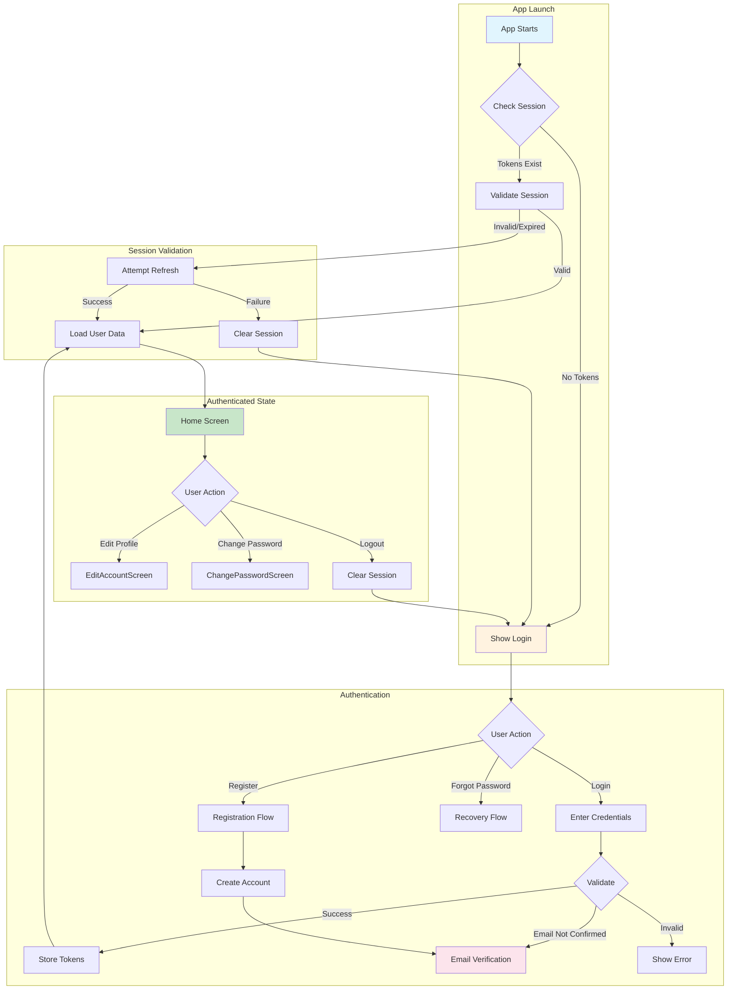
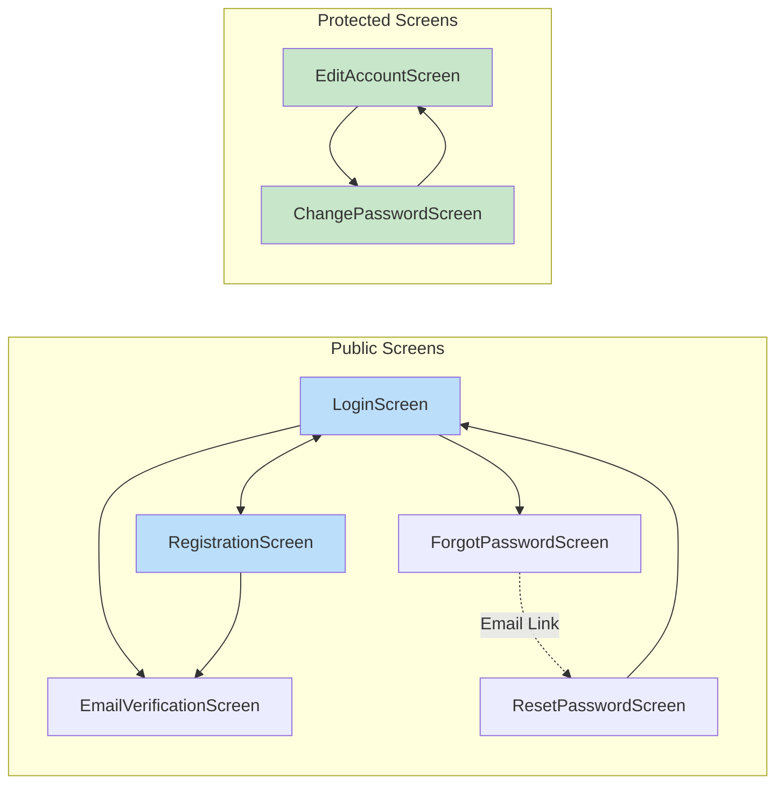
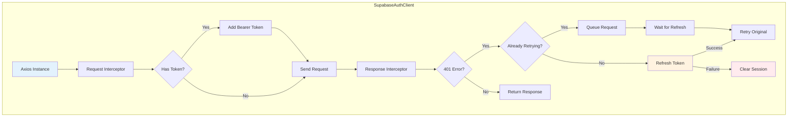
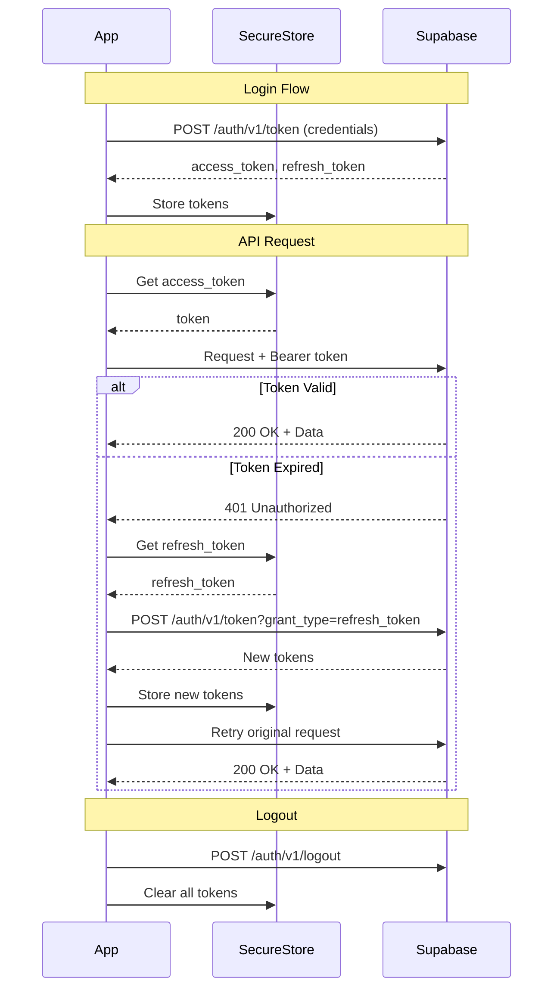
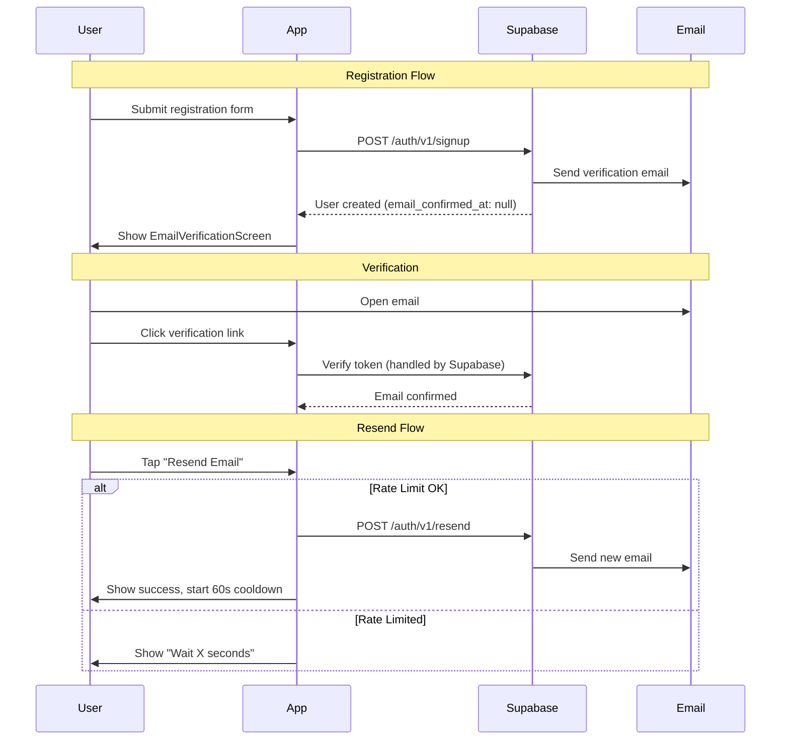
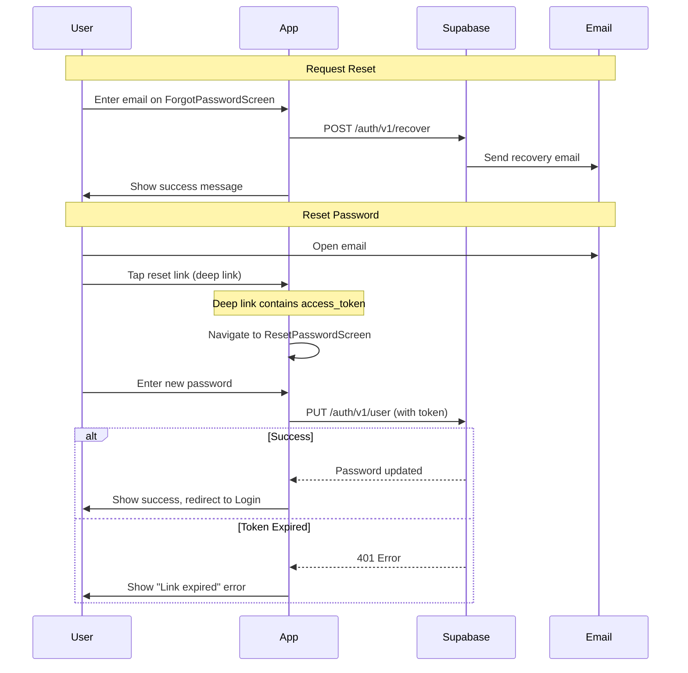

# Authentication Guide

The complete auth system: registration, login, password management, and session handling. Built on Supabase with a custom REST API client.

---

## Table of Contents

- [Overview](#overview)
- [Authentication Flow](#authentication-flow)
- [Screen Navigation](#screen-navigation)
- [Auth Screens](#auth-screens)
- [Supabase Integration](#supabase-integration)
- [Token Management](#token-management)
- [State Management](#state-management)
- [Email Verification](#email-verification)
- [Password Recovery](#password-recovery)
- [Security Considerations](#security-considerations)
- [Testing Authentication](#testing-authentication)
- [Troubleshooting](#troubleshooting)

---

## Overview

The authentication system provides a complete user authentication experience with:

- **Email/Password Registration** with email verification
- **Secure Login** with automatic session restoration
- **Password Recovery** via email with deep link support
- **Password Change** for logged-in users (requires current password)
- **Profile Editing** with secure data persistence
- **Session Management** with automatic token refresh

### Key Technologies

| Technology        | Purpose                           |
| ----------------- | --------------------------------- |
| Supabase REST API | Authentication backend            |
| Redux Toolkit     | State management                  |
| SecureStore       | Token storage (Keychain/Keystore) |
| EncryptedStore    | User data persistence             |
| React Hook Form   | Form validation                   |
| Yup               | Schema validation                 |

---

## Authentication Flow

The diagram below shows the complete authentication lifecycle from app launch to authenticated state.



---

## Screen Navigation

Seven screens handle the complete authentication flow. The diagram below shows how they connect.



---

## Auth Screens

### LoginScreen

The primary entry point for returning users. Handles email/password authentication with validation.

**Location:** `src/features/Auth/LoginScreen.tsx`

**Features:**

- Email and password validation via React Hook Form
- "Remember me" through automatic session restoration
- Redirect to EmailVerification if email not confirmed
- Intended route navigation (preserves deep link destination)
- Forgot password link
- Register link for new users

**Key Props:**

```typescript
type LoginScreenProps = NativeStackScreenProps<RootStackParamList, 'Login'>;

// Route params
interface LoginParams {
  passwordUpdated?: boolean; // Shows success toast after password reset
}
```

---

### RegistrationScreen

New user signup with full validation and terms acceptance.

**Location:** `src/features/Auth/RegistrationScreen.tsx`

**Features:**

- First name, last name, phone (optional), email, password fields
- Real-time password strength indicator
- Terms and conditions toggle with links
- Keyboard-aware form navigation
- Automatic redirect to EmailVerification on success

**Form Schema:**

```typescript
interface RegistrationFormData {
  firstName: string;
  lastName: string;
  phoneNumber?: string;
  email: string;
  password: string;
  confirmPassword: string;
  acceptTerms: boolean;
}
```

---

### EmailVerificationScreen

Shown after registration or when a user attempts to login without confirming their email.

**Location:** `src/features/Auth/EmailVerificationScreen.tsx`

**Features:**

- Clear messaging about checking email
- Resend confirmation email with rate limiting (60 second cooldown)
- Different toast messages based on navigation source
- Back to login button

**Navigation Sources:**
| Source | Toast Message |
|--------|---------------|
| `registration` | "Account created! Check your email" |
| `login` | "Email not confirmed" |
| `registration_exists` | "Account exists. Check email" |

---

### ForgotPasswordScreen

Initiates password recovery via email.

**Location:** `src/features/Auth/ForgotPasswordScreen.tsx`

**Features:**

- Single email input with validation
- Rate limiting to prevent abuse
- Success state always shown (prevents email enumeration)
- Information box explaining the process

---

### ResetPasswordScreen

Handles password reset from deep link. Accessed via the password recovery email.

**Location:** `src/features/Auth/ResetPasswordScreen.tsx`

**Features:**

- Receives access token from deep link
- New password and confirmation fields
- Password strength requirements display
- Different behaviour based on entry point (deep link vs in-app)

**Route Params:**

```typescript
interface ResetPasswordParams {
  accessToken: string; // From deep link
  fromEditAccount?: boolean; // Navigation context
}
```

---

### ChangePasswordScreen

Allows logged-in users to change their password with current password verification.

**Location:** `src/features/Auth/ChangePasswordScreen.tsx`

**Features:**

- Current password verification (re-authenticates user)
- New password with strength requirements
- Confirmation field
- Additional requirement: new password must differ from current

---

### EditAccountScreen

Profile management screen with logout functionality.

**Location:** `src/features/Auth/EditAccountScreen.tsx`

**Features:**

- Edit first name, last name, phone number
- Read-only email display
- Change password navigation
- Logout with confirmation dialog
- Auto-refresh user data on focus

---

## Supabase Integration

The app uses Supabase's REST API directly without the JavaScript SDK. This provides full control over request handling and E2E test mocking.

### API Client Architecture

**Location:** `src/httpClients/SupabaseAuthClient.ts`



### Available Methods

| Method                      | Description                     | E2E Mocked |
| --------------------------- | ------------------------------- | ---------- |
| `signUp()`                  | Register new user               | Yes        |
| `signIn()`                  | Login with email/password       | Yes        |
| `logout()`                  | End session                     | Yes        |
| `getCurrentUser()`          | Get user profile                | Yes        |
| `refreshSession()`          | Refresh access token            | No         |
| `updateUser()`              | Update profile data             | Yes        |
| `requestPasswordRecovery()` | Send reset email                | Yes        |
| `resendConfirmationEmail()` | Resend verification             | Yes        |
| `resetPasswordWithToken()`  | Set new password                | Yes        |
| `changePassword()`          | Change password (authenticated) | Yes        |
| `isAuthenticated()`         | Check token presence            | No         |

---

## Token Management

Tokens are stored securely using platform-specific secure storage mechanisms.

### Token Lifecycle



### Storage Keys

**SecureStore (Keychain/Keystore):**

- `accessToken` - JWT access token
- `refreshToken` - Refresh token
- `userId` - User identifier
- `biometricPreference` - Biometric auth setting
- `hashedPIN` - Hashed PIN for app lock
- `encryptionKey` - Encryption key for sensitive data

**EncryptedStore (Encrypted AsyncStorage):**

- `userEmail` - User's email address
- `userFirstName` - First name
- `userLastName` - Last name
- `userPhoneNumber` - Phone number
- `profilePictureURL` - Avatar URL
- `authProvider` - Authentication method (email/linkedin/magic_link)

---

## State Management

Authentication state is managed through Redux Toolkit with async thunks.

### Auth Slice Structure

```mermaid
flowchart TB
    subgraph AuthState
        A[isAuthenticated: boolean]
        B[isLoading: boolean]
        C[error: string | null]
        D[biometricEnabled: boolean]

        subgraph User
            E[id: string]
            F[email: string]
            G[firstName: string]
            H[lastName: string]
            I[phoneNumber: string]
            J[profilePicture: string]
            K[authProvider: enum]
        end
    end

    style AuthState fill:#e8f5e9
    style User fill:#fff8e1
```

### Async Thunks

| Thunk                    | Purpose                        | Updates State                           |
| ------------------------ | ------------------------------ | --------------------------------------- |
| `register`               | Create new account             | user, isAuthenticated                   |
| `login`                  | Authenticate user              | user, isAuthenticated                   |
| `checkSession`           | Restore session on app start   | user, isAuthenticated, biometricEnabled |
| `logout`                 | End session                    | Clears all auth state                   |
| `refreshUser`            | Refresh user data from backend | user (background, no loading)           |
| `updateUserProfileAsync` | Update profile on backend      | user                                    |

### Selectors

```typescript
// Available selectors
selectAuth(state); // Full auth slice
selectIsAuthenticated(state); // Boolean
selectUser(state); // User object or null
selectUserEmail(state); // Email string
selectUserFullName(state); // "First Last"
selectAuthLoading(state); // Boolean
selectAuthError(state); // Error string or null
selectBiometricEnabled(state); // Boolean
selectAuthProvider(state); // 'email' | 'linkedin' | 'magic_link'
```

---

## Email Verification

New users must verify their email before logging in. The flow handles both successful registration and the case where a user tries to login without verification.



### Rate Limiting

Email resend requests are rate-limited to prevent abuse:

- **Cooldown:** 60 seconds between requests
- **Storage:** AsyncStorage per email address
- **Reset:** Cooldown clears after successful resend

---

## Password Recovery

Users can reset their password via email link. The flow supports both app deep links and web fallback.



### Deep Link Configuration

Password reset links use the app's deep link scheme:

```
warrendeleon://reset-password?access_token=xxx
```

---

## Security Considerations

### Token Storage

| Platform | Storage Mechanism | Security            |
| -------- | ----------------- | ------------------- |
| iOS      | Keychain Services | Hardware-encrypted  |
| Android  | Android Keystore  | Hardware-backed TEE |

### Password Requirements

- Minimum 8 characters
- At least one uppercase letter
- At least one lowercase letter
- At least one number
- At least one special character

### Security Best Practices

1. **No Email Enumeration** - Password recovery always shows success
2. **Rate Limiting** - Email resend limited to 1 per minute
3. **Current Password Verification** - Required for password change
4. **Token Refresh** - Automatic on 401 responses
5. **Secure Logout** - Tokens invalidated on server + cleared locally
6. **E2E Mock Detection** - Mock mode clearly indicated in development
7. **Unicode Normalization** - Names validated against homograph attacks

### Homograph Attack Prevention

Name fields (firstName, lastName) are protected against [homograph attacks](https://en.wikipedia.org/wiki/IDN_homograph_attack) where attackers use visually identical Unicode characters to impersonate users.

**Protection implemented via `noHomographs()` Yup validation:**

| Check                  | Description                                       |
| ---------------------- | ------------------------------------------------- |
| Unicode Normalization  | Input normalized to NFC form                      |
| Mixed Script Detection | Blocks Latin + Cyrillic/Greek/Arabic combinations |
| Latin-Only Validation  | Only allows a-zA-Z, spaces, hyphens, apostrophes  |

**Example attacks blocked:**

- "Јohn" - Cyrillic J (U+0408) looks like Latin J
- "Mаry" - Cyrillic а (U+0430) looks like Latin a
- "Раypal" - Cyrillic Р and а used to spoof "Paypal"

**Legitimate names allowed:**

- O'Brien, Mary-Jane, de Leon (hyphens, apostrophes, spaces)

See [SECURITY.md](./SECURITY.md#unicode-normalization--homograph-prevention----implemented) for implementation details.

---

## Testing Authentication

### Unit Tests (RNTL)

Test files located in `src/features/Auth/__tests__/`:

| Test File                          | Coverage                            |
| ---------------------------------- | ----------------------------------- |
| `LoginScreen.rntl.tsx`             | Form validation, submission, errors |
| `RegistrationScreen.rntl.tsx`      | All fields, terms, validation       |
| `EmailVerificationScreen.rntl.tsx` | Resend flow, rate limiting          |
| `ForgotPasswordScreen.rntl.tsx`    | Email submission, success state     |
| `ResetPasswordScreen.rntl.tsx`     | Password reset, token handling      |
| `ChangePasswordScreen.rntl.tsx`    | Current password, new password      |
| `EditAccountScreen.rntl.tsx`       | Profile editing, logout             |

Store tests in `src/features/Auth/store/__tests__/`:

- `actions.rntl.ts` - All async thunks
- `reducer.rntl.ts` - State transitions
- `selectors.rntl.ts` - Selector functions

### E2E Tests (Detox + Cucumber)

Feature files in `src/features/Auth/__tests__/`:

```gherkin
Feature: User Login
  Scenario: Successful login with valid credentials
    Given I am on the login screen
    When I enter "test@example.com" as email
    And I enter "Password123!" as password
    And I tap the login button
    Then I should see the home screen
```

### E2E Mocking

The auth client supports E2E mocking via the `E2E_MOCK` environment variable:

```typescript
// When E2E_MOCK=true, API calls return mock data
if (isE2EMockEnabled()) {
  return { mocked: true /* mock data */ };
}
```

---

## Troubleshooting

### Common Issues

**"Email not confirmed" error on login**

- User registered but didn't click verification link
- Solution: Navigate to EmailVerificationScreen, resend email

**"Invalid credentials" error**

- Incorrect email or password
- Solution: Use forgot password flow

**Token refresh fails repeatedly**

- Refresh token may be expired or revoked
- Solution: User must login again

**Password reset link expired**

- Links valid for limited time (typically 1 hour)
- Solution: Request new reset email

**Rate limit exceeded**

- Too many email resend attempts
- Solution: Wait for cooldown timer

### Debug Tools

**Reactotron** - View Redux state transitions:

```
Auth Slice → isAuthenticated, user, error
```

**Metro Logs** - Look for auth-related logs:

```
[Auth] Login attempt: email@example.com
[Auth] Login success: user_id
[Auth] Token refresh: success
```

---

## Related Documentation

- [Testing Guide](TESTING.md) - Test patterns and coverage
- [Architecture](ARCHITECTURE.md) - Project structure
- [State Management](ARCHITECTURE.md#state-management) - Redux patterns
- [Navigation](ARCHITECTURE.md#navigation) - Screen flow
