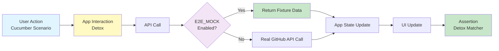
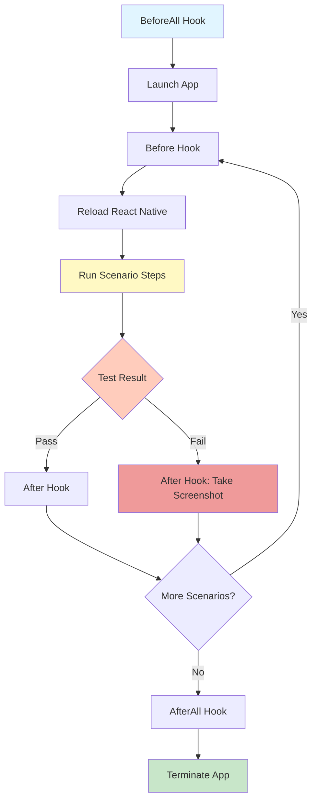
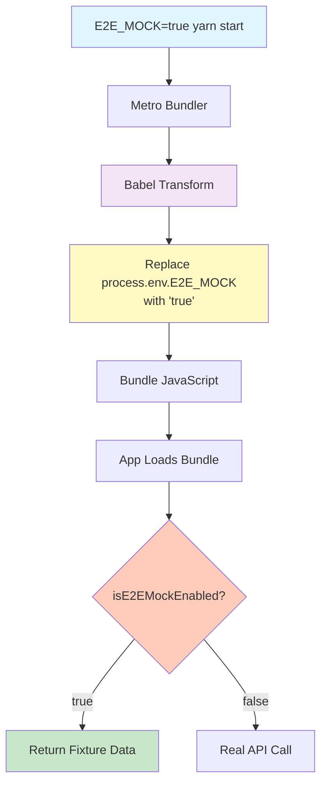

# E2E Testing Guide

This document covers end-to-end (E2E) testing with Detox, Cucumber, and Metro Runtime Mocking.

## Table of Contents

- [Overview](#overview)
- [Test Stack](#test-stack)
- [Setup](#setup)
- [Writing E2E Tests](#writing-e2e-tests)
- [Running E2E Tests](#running-e2e-tests)
- [Metro Runtime Mocking for API Data](#metro-runtime-mocking-for-api-data)
- [Best Practices](#best-practices)
- [Debugging](#debugging)
- [Troubleshooting](#troubleshooting)
  - [TrustKit SSL Pinning Blocking Detox Tests](#trustkit-ssl-pinning-blocking-detox-tests-ios)

## Overview

### What is E2E Testing?

End-to-end testing validates the complete user flow from start to finish, simulating real user interactions with your app. Unlike unit tests that test individual components in isolation, E2E tests verify that all parts of the app work together correctly.

### Why Detox + Cucumber?

- **Detox**: Grey-box testing framework for React Native with excellent performance and synchronisation
- **Cucumber**: Behaviour-Driven Development (BDD) tool using human-readable Gherkin syntax
- **Metro Runtime Mocking**: Bundle-time environment variable injection for deterministic API mocking without network interception

### Testing Flow



### Detox Test Execution Flow



## Test Stack

### Core Technologies

- **Detox**: E2E test runner and automation framework
- **Cucumber**: BDD test framework with Gherkin syntax
- **Metro Bundler**: JavaScript bundler with Babel transformation for environment variables
- **Jest**: Test runner (shared with unit tests)

### File Naming Convention

```
features/
  Home/
    __tests__/
      HomeScreen.feature        # Gherkin scenarios
      HomeScreen.cucumber.tsx   # Step definitions
```

- `.feature` - Gherkin scenarios (Given-When-Then)
- `.cucumber.tsx` - TypeScript step definitions

## Setup

### 1. Install Dependencies

```bash
# Detox CLI (global)
npm install -g detox-cli

# Project dependencies
yarn add -D detox @cucumber/cucumber
yarn add -D @types/cucumber @types/detox

# Metro runtime mocking (Babel plugin for environment variables)
yarn add -D babel-plugin-transform-inline-environment-variables
```

### 2. Initialise Detox

```bash
detox init
```

This creates:

- `.detoxrc.json` - Detox configuration
- `e2e/` - E2E test directory (optional, we use feature-first structure)

### 3. Configure Detox

**`.detoxrc.js`:**

```javascript
/** @type {Detox.DetoxConfig} */
module.exports = {
  apps: {
    'ios.debug': {
      type: 'ios.app',
      binaryPath: 'ios/build/Build/Products/Debug-iphonesimulator/warrendeleon.app',
      build:
        'xcodebuild -workspace ios/warrendeleon.xcworkspace -scheme warrendeleon -configuration Debug -sdk iphonesimulator -derivedDataPath ios/build',
    },
    'android.debug': {
      type: 'android.apk',
      binaryPath: 'android/app/build/outputs/apk/debug/app-debug.apk',
      build:
        'cd android && ./gradlew assembleDebug assembleAndroidTest -DtestBuildType=debug && cd ..',
      reversePorts: [8081],
    },
  },
  devices: {
    simulator: {
      type: 'ios.simulator',
      device: {
        type: 'iPhone 17 Pro',
      },
    },
    emulator: {
      type: 'android.emulator',
      device: {
        avdName: 'Pixel_7_API_35',
      },
    },
  },
  configurations: {
    'ios.sim.debug': {
      device: 'simulator',
      app: 'ios.debug',
    },
    'android.emu.debug': {
      device: 'emulator',
      app: 'android.debug',
    },
  },
};
```

### 4. Configure Cucumber

**`cucumber.js`:**

```javascript
module.exports = {
  default: {
    require: ['src/test-utils/cucumber/support/**/*.ts', 'src/**/*.cucumber.tsx'],
    requireModule: ['ts-node/register', 'tsconfig-paths/register'],
    format: [
      './src/test-utils/cucumber/formatters/CheckmarkFormatter.js',
      'json:cucumber-report.json',
    ],
    formatOptions: { snippetInterface: 'async-await' },
  },
};
```

### 5. Add Scripts to package.json

```json
{
  "scripts": {
    "detox:ios:build": "E2E_MOCK=true detox build -c ios.sim.debug",
    "detox:ios:test": "E2E_MOCK=true ENABLE_TEST_UI=true DETOX_LOGLEVEL=error DETOX_CONFIGURATION=ios.sim.debug TS_NODE_PROJECT=tsconfig.cucumber.json cucumber-js --format ./src/test-utils/cucumber/formatters/CheckmarkFormatter.js --require-module ts-node/register --require-module tsconfig-paths/register 'src/features/**/__tests__/*.feature' --require 'src/test-utils/cucumber/**/*.{ts,tsx}' --require 'src/features/**/__tests__/*.cucumber.{ts,tsx}'",
    "detox:android:build": "E2E_MOCK=true detox build -c android.emu.debug",
    "detox:android:test": "E2E_MOCK=true ENABLE_TEST_UI=true DETOX_LOGLEVEL=error DETOX_CONFIGURATION=android.emu.debug TS_NODE_PROJECT=tsconfig.cucumber.json cucumber-js --format ./src/test-utils/cucumber/formatters/CheckmarkFormatter.js --require-module ts-node/register --require-module tsconfig-paths/register 'src/features/**/__tests__/*.feature' --require 'src/test-utils/cucumber/**/*.{ts,tsx}' --require 'src/features/**/__tests__/*.cucumber.{ts,tsx}'",
    "e2e:ios": "yarn detox:ios:build && yarn detox:ios:test",
    "e2e:android": "yarn detox:android:build && yarn detox:android:test"
  }
}
```

**Note**: `E2E_MOCK=true` is set in both build and test scripts to ensure consistent bundle-time mocking.

### 6. Setup Test Utilities

**`src/test-utils/cucumber/support/world.ts`:**

```typescript
import { setWorldConstructor, World } from '@cucumber/cucumber';
import { device, element, expect as detoxExpect } from 'detox';

/**
 * Cucumber World - shared context across step definitions
 */
export class DetoxWorld extends World {
  device = device;
  element = element;
  expect = detoxExpect;

  // Store values between steps
  storage: Record<string, any> = {};
}

setWorldConstructor(DetoxWorld);
```

**`src/test-utils/cucumber/support/hooks.ts`:**

```typescript
import { Before, After, BeforeAll, AfterAll } from '@cucumber/cucumber';
import { device } from 'detox';

/**
 * Detox lifecycle hooks for E2E tests
 */
BeforeAll(async () => {
  // No Metro server needed - Detox uses already-running app bundle
});

Before(async () => {
  await device.reloadReactNative();
});

After(async function (scenario) {
  if (scenario.result?.status === 'failed') {
    const screenshot = await device.takeScreenshot(scenario.pickle.name);
    this.attach(screenshot, 'image/png');
  }
});

AfterAll(async () => {
  await device.terminateApp();
});
```

**`src/test-utils/cucumber/step-definitions/common.steps.tsx`:**

```typescript
import { Given, When, Then } from '@cucumber/cucumber';
import { by, device, element, expect as detoxExpect, waitFor } from 'detox';

import { DetoxWorld } from '../support/world';

// Common Given steps

Given('the app is launched', async function (this: DetoxWorld) {
  await device.launchApp({ newInstance: true });
});

Given('I am on the {string} screen', async function (this: DetoxWorld, screenName: string) {
  const testID = `${screenName.toLowerCase().replace(/\s+/g, '-')}-screen`;
  await waitFor(element(by.id(testID)))
    .toBeVisible()
    .withTimeout(5000);
});

// Common When steps

When('I tap the {string} button', async function (this: DetoxWorld, buttonName: string) {
  const testID = `${buttonName.toLowerCase().replace(/\s+/g, '-')}-button`;
  await waitFor(element(by.id(testID)))
    .toBeVisible()
    .withTimeout(5000);
  await element(by.id(testID)).tap();
});

When('I tap the element with testID {string}', async function (this: DetoxWorld, testID: string) {
  await waitFor(element(by.id(testID)))
    .toBeVisible()
    .withTimeout(5000);
  await element(by.id(testID)).tap();
});

// Common Then steps

Then('I should see the {string} screen', async function (this: DetoxWorld, screenName: string) {
  const testID = `${screenName.toLowerCase().replace(/\s+/g, '-')}-screen`;
  await waitFor(element(by.id(testID)))
    .toBeVisible()
    .withTimeout(5000);
});

Then('I should see text {string}', async function (this: DetoxWorld, text: string) {
  await waitFor(element(by.text(text)))
    .toBeVisible()
    .withTimeout(5000);
});
```

## Writing E2E Tests

### Gherkin Features

**Syntax:**

```gherkin
Feature: Feature Name
  Description of the feature

  Background:
    Given common setup for all scenarios

  Scenario: Scenario Name
    Given initial state
    When user action
    Then expected outcome

  Scenario Outline: Parameterised Scenario
    Given initial state with <param>
    When action with <param>
    Then outcome with <param>

    Examples:
      | param  |
      | value1 |
      | value2 |
```

**Example: `src/features/Home/__tests__/HomeScreen.feature`:**

```gherkin
Feature: Home Screen
  As a user
  I want to interact with the Home screen
  So that I can navigate to different parts of the app

  Scenario: Display Home Screen
    Given the app is launched
    Then I should see the "Home" screen
    And I should see the "home-settings" button

  Scenario: Navigate to Settings
    Given the app is launched
    And I am on the "Home" screen
    When I tap the "home-settings" button
    Then I should see the "Settings" screen
```

### Step Definitions

**Example: `src/features/Home/__tests__/HomeScreen.cucumber.tsx`:**

```typescript
// Import common steps to make them available
import '@app/test-utils/cucumber/step-definitions/common.steps';

import { Given, Then, When } from '@cucumber/cucumber';
import { by, device, element, waitFor } from 'detox';

import { DetoxWorld } from '@app/test-utils/cucumber/support/world';

// Home Screen specific steps

Given('I am viewing the home screen', async function (this: DetoxWorld) {
  await waitFor(element(by.id('home-screen')))
    .toBeVisible()
    .withTimeout(5000);
});

When('I go back', async function (this: DetoxWorld) {
  // Navigate back using device back button (Android) or header back button (iOS)
  if (device.getPlatform() === 'android') {
    await device.pressBack();
  } else {
    // iOS: Find the back button by traits (first button in navigation bar)
    await element(by.traits(['button']).and(by.label('Back'))).tap();
  }
});

Then('the home screen should display the settings button', async function (this: DetoxWorld) {
  await waitFor(element(by.id('home-settings-button')))
    .toBeVisible()
    .withTimeout(5000);
});
```

### Using testID in Components

Always add `testID` props for E2E testing:

```typescript
// Component
export const HomeScreen = () => {
  const navigation = useNavigation();

  return (
    <View testID="home-screen">
      <Text testID="home-title">Home</Text>
      <Button
        testID="settings-button"
        onPress={() => navigation.navigate('Settings')}
      >
        Settings
      </Button>
    </View>
  );
};
```

### Matchers

```typescript
// Visibility
await expect(element(by.id('button'))).toBeVisible();
await expect(element(by.id('button'))).not.toBeVisible();
await expect(element(by.id('button'))).toExist();

// Value
await expect(element(by.id('input'))).toHaveText('Hello');
await expect(element(by.id('label'))).toHaveLabel('Username');

// State
await expect(element(by.id('toggle'))).toHaveToggleValue(true);
```

## Running E2E Tests

### Quick Reference

```bash
# Build the app first (only needed once or after code changes)
yarn detox:ios:build     # Takes ~2-3 minutes

# Run all tests
yarn detox:ios:test      # Takes ~2.5 minutes (12 scenarios, 96 steps)

# Run single feature file
yarn detox:ios:test src/features/Settings/__tests__/Settings.feature
```

### Full Test Suite

```bash
# iOS - Full suite
yarn detox:ios:build    # Build app for testing
yarn detox:ios:test     # Run all tests
yarn e2e:ios            # Build + test (convenience)

# Android - Full suite
yarn detox:android:build
yarn detox:android:test
yarn e2e:android
```

**Timing**: Running the full suite takes approximately **2.5 minutes** for all scenarios.

### Run with/without Mocked Data

**With Mocked Data (E2E Tests)**:

```bash
# Metro bundler must be running with E2E_MOCK=true
E2E_MOCK=true yarn start

# In separate terminal, run tests
yarn detox:ios:test
```

The `E2E_MOCK=true` environment variable is **already configured** in the Detox scripts, so running `yarn detox:ios:test` automatically uses mocked data.

**Without Mocked Data (Manual Testing/Real API)**:

```bash
# Start Metro normally (no E2E_MOCK)
yarn start

# Run app normally
yarn ios
yarn android
```

**Key Point**: You must restart Metro bundler when switching between mocked and real data modes, as the environment variable is baked into the bundle at build time.

### Run Specific Feature

```bash
# Run all scenarios in a feature file
yarn detox:ios:test 'src/features/Home/__tests__/HomeScreen.feature'

# Run all scenarios in Settings feature
yarn detox:ios:test 'src/features/Settings/__tests__/Settings.feature'
```

### Debug Mode

```bash
# Run with debug logging
DETOX_LOGLEVEL=trace yarn detox:ios:test

# Keep app running after tests
detox test --configuration ios.sim.debug --cleanup false
```

## Metro Runtime Mocking for API Data

### Overview

Metro Runtime Mocking uses **Babel plugin transformation** to inject environment variables at **bundle time**, allowing deterministic API mocking for E2E tests without network interception.

### Why Metro Mocking Instead of Network Interception?

**Problem with MSW/Network Mocking**:

- React Native app runs in **native iOS/Android process** (simulator/emulator)
- Network mocking tools like MSW run in **Node.js test process**
- **Process isolation** prevents MSW from intercepting native networking

**Metro Mocking Solution**:

- Environment variable (`E2E_MOCK`) is transformed by Babel at **bundle time**
- API functions check the flag at **runtime** and return fixture data when enabled
- **No network interception needed** - mocking happens in application code
- Works perfectly with React Native's native networking stack

### How Metro Mocking Works



### Installation & Configuration

**1. Install Babel Plugin**:

```bash
yarn add -D babel-plugin-transform-inline-environment-variables
```

**2. Configure Babel** (`babel.config.js`):

```javascript
module.exports = {
  presets: ['@react-native/babel-preset', 'nativewind/babel'],
  plugins: [
    [
      'module-resolver',
      {
        root: ['./src'],
        extensions: [
          '.ios.ts',
          '.android.ts',
          '.ts',
          '.ios.tsx',
          '.android.tsx',
          '.tsx',
          '.jsx',
          '.js',
          '.json',
        ],
        alias: {
          '@app': './src',
        },
      },
    ],
    'react-native-worklets/plugin',
    'transform-inline-environment-variables', // Add this line
  ],
};
```

**3. Create E2E Configuration** (`src/config/e2e.ts`):

```typescript
/**
 * E2E Configuration
 * Determines if E2E mocking is enabled based on build-time environment variable
 * process.env.E2E_MOCK is transformed at build time by babel-plugin-transform-inline-environment-variables
 */

export const isE2EMockEnabled = process.env.E2E_MOCK === 'true';
```

**How the transformation works**:

```typescript
// Source code
export const isE2EMockEnabled = process.env.E2E_MOCK === 'true';

// After Babel transformation (with E2E_MOCK=true)
export const isE2EMockEnabled = 'true' === 'true'; // → true

// After Babel transformation (without E2E_MOCK)
export const isE2EMockEnabled = undefined === 'true'; // → false
```

### Implementing Runtime Mocking in API Files

**Example: `src/features/Profile/api/api.ts`**:

```typescript
import type { AxiosResponse, InternalAxiosRequestConfig } from 'axios';

import { isE2EMockEnabled } from '@app/config/e2e';
import { GithubApiClient } from '@app/httpClients';
import profileCA from '@app/test-utils/fixtures/api/ca/profile.json';
import profileEN from '@app/test-utils/fixtures/api/en/profile.json';
import profileES from '@app/test-utils/fixtures/api/es/profile.json';
import profilePL from '@app/test-utils/fixtures/api/pl/profile.json';
import profileTL from '@app/test-utils/fixtures/api/tl/profile.json';
import type { Profile } from '@app/types/portfolio';

type MockedProfile = Profile & { mocked: boolean };

const profileFixtures: Record<string, Profile> = {
  en: profileEN as Profile,
  es: profileES as Profile,
  ca: profileCA as Profile,
  pl: profilePL as Profile,
  tl: profileTL as Profile,
};

/**
 * Fetch profile data from GitHub for a specific language
 * @param language - Language code (e.g., 'en', 'es', 'ca', 'pl', 'tl')
 * @returns Promise with profile data
 */
export const fetchProfileData = async (language: string): Promise<AxiosResponse<Profile>> => {
  // E2E mocking: Return fixture data when E2E_MOCK=true
  if (isE2EMockEnabled) {
    const fixtureData = profileFixtures[language] || profileFixtures.en;
    const mockedData = {
      ...(fixtureData as Profile),
      mocked: true,
    } as MockedProfile;

    return Promise.resolve({
      data: mockedData,
      status: 200,
      statusText: 'OK',
      headers: {},
      config: {} as InternalAxiosRequestConfig,
    });
  }

  // Real API call
  return GithubApiClient.get<Profile>(`/${language}/profile.json`);
};
```

**Example with Array Data: `src/features/Education/api/api.ts`**:

```typescript
import type { AxiosResponse, InternalAxiosRequestConfig } from 'axios';

import { isE2EMockEnabled } from '@app/config/e2e';
import { GithubApiClient } from '@app/httpClients';
import educationCA from '@app/test-utils/fixtures/api/ca/education.json';
import educationEN from '@app/test-utils/fixtures/api/en/education.json';
import educationES from '@app/test-utils/fixtures/api/es/education.json';
import educationPL from '@app/test-utils/fixtures/api/pl/education.json';
import educationTL from '@app/test-utils/fixtures/api/tl/education.json';
import type { Education } from '@app/types/portfolio';

type MockedEducation = Education & { mocked: boolean };

const educationFixtures: Record<string, Education[]> = {
  en: educationEN as Education[],
  es: educationES as Education[],
  ca: educationCA as Education[],
  pl: educationPL as Education[],
  tl: educationTL as Education[],
};

/**
 * Fetch education data from GitHub for a specific language
 * @param language - Language code (e.g., 'en', 'es', 'ca', 'pl', 'tl')
 * @returns Promise with education data array
 */
export const fetchEducationData = async (language: string): Promise<AxiosResponse<Education[]>> => {
  // E2E mocking: Return fixture data when E2E_MOCK=true
  if (isE2EMockEnabled) {
    const fixtureData = educationFixtures[language] || educationFixtures.en;
    const mockedData: MockedEducation[] = (fixtureData as Education[]).map(item => ({
      ...item,
      mocked: true,
    }));

    return Promise.resolve({
      data: mockedData,
      status: 200,
      statusText: 'OK',
      headers: {},
      config: {} as InternalAxiosRequestConfig,
    });
  }

  // Real API call
  return GithubApiClient.get<Education[]>(`/${language}/education.json`);
};
```

### Creating Fixture Files

**Directory Structure**:

```
src/test-utils/fixtures/api/
  ca/
    profile.json
    education.json
    workxp.json
  en/
    profile.json
    education.json
    workxp.json
  es/
    profile.json
    education.json
    workxp.json
  pl/
    profile.json
    education.json
    workxp.json
  tl/
    profile.json
    education.json
    workxp.json
```

**Example Fixture: `src/test-utils/fixtures/api/en/profile.json`**:

```json
{
  "name": "Warren",
  "lastName": "De Leon",
  "title": "Senior Software Engineer",
  "profilePicture": "https://avatars.githubusercontent.com/u/12345678",
  "email": "warren@example.com",
  "location": "Barcelona, Spain",
  "bio": "Full-stack developer passionate about React Native"
}
```

**Note**: Fixtures should match your API response structure exactly. The `mocked: true` flag is added programmatically in the API function.

### Verifying Mocking Works

**Create a Mock Status Screen** (for development/debugging):

```typescript
import React from 'react';
import { View, Text } from 'react-native';
import { useAppSelector } from '@app/store';

export const MockStatusScreen: React.FC = () => {
  const profile = useAppSelector(state => state.profile.data);
  const education = useAppSelector(state => state.education.data);
  const workExperience = useAppSelector(state => state.workExperience.data);

  const profileMocked = (profile as any)?.mocked === true;
  const educationMocked = (education as any)?.[0]?.mocked === true;
  const workMocked = (workExperience as any)?.[0]?.mocked === true;

  return (
    <View testID="mock-status-screen">
      <Text testID="mock-status-profile">
        Profile: {profileMocked ? 'Mocked' : 'Not Mocked'}
      </Text>
      <Text testID="mock-status-education">
        Education: {educationMocked ? 'Mocked' : 'Not Mocked'}
      </Text>
      <Text testID="mock-status-work-experience">
        Work: {workMocked ? 'Mocked' : 'Not Mocked'}
      </Text>
    </View>
  );
};
```

**E2E Test to Verify Mocking**:

```gherkin
Feature: Mock Status Verification
  As a developer
  I want to verify API mocking is working during E2E tests
  So that I can confirm data is being mocked correctly

  Scenario: View mock status screen shows all mocked data
    Given the app is launched
    And I am on the "Home" screen
    When I tap the "home-settings" button
    Then I should see the "Settings" screen
    When I tap the element with testID "settings-mock-status-button"
    Then I should see the "Mock Status" screen
    And the element with testID "mock-status-profile" should contain text "Mocked"
    And the element with testID "mock-status-education" should contain text "Mocked"
    And the element with testID "mock-status-work-experience" should contain text "Mocked"
```

### Switching Between Mocked and Real Data

**Development Workflow**:

```bash
# 1. For E2E tests (mocked data)
E2E_MOCK=true yarn start          # Start Metro with mocking enabled
yarn detox:ios:test               # Run tests with mocked data

# 2. For manual testing with real API
yarn start                        # Start Metro normally (no mocking)
yarn ios                          # Run app with real API calls

# 3. Switching modes
killall node                      # Kill Metro bundler
E2E_MOCK=true yarn start          # Restart with desired mode
```

**Important**: You **MUST restart Metro** when switching modes because the environment variable is transformed at **bundle time**, not runtime. The value is "baked in" to the JavaScript bundle.

### Replicating in Other Projects

To implement Metro mocking in a new React Native project:

1. **Install Babel plugin**:

   ```bash
   yarn add -D babel-plugin-transform-inline-environment-variables
   ```

2. **Add to `babel.config.js`**:

   ```javascript
   plugins: [
     // ... existing plugins
     'transform-inline-environment-variables',
   ];
   ```

3. **Create `src/config/e2e.ts`**:

   ```typescript
   export const isE2EMockEnabled = process.env.E2E_MOCK === 'true';
   ```

4. **Update API functions**:

   ```typescript
   import { isE2EMockEnabled } from '@app/config/e2e';
   import fixtureData from '@app/fixtures/data.json';

   export const fetchData = async () => {
     if (isE2EMockEnabled) {
       return Promise.resolve({ data: fixtureData, status: 200 });
     }
     return apiClient.get('/data');
   };
   ```

5. **Update Detox scripts in `package.json`**:

   ```json
   {
     "detox:build": "E2E_MOCK=true detox build -c ios.sim.debug",
     "detox:test": "E2E_MOCK=true detox test -c ios.sim.debug"
   }
   ```

6. **Create fixture files** matching your API response structures

7. **Run tests**:
   ```bash
   yarn detox:build
   yarn detox:test
   ```

## Best Practices

### 1. Use Page Object Pattern

**`src/features/Home/__tests__/HomeScreen.page.ts`:**

```typescript
import { by, element } from 'detox';

/**
 * Page Object for Home Screen
 * Encapsulates element selectors and actions
 */
export class HomeScreenPage {
  // Selectors
  get screen() {
    return element(by.id('home-screen'));
  }

  get title() {
    return element(by.id('home-title'));
  }

  get settingsButton() {
    return element(by.id('settings-button'));
  }

  // Actions
  async tapSettings() {
    await this.settingsButton.tap();
  }

  async waitForScreen() {
    await waitFor(this.screen).toBeVisible().withTimeout(5000);
  }
}
```

### 2. Write Declarative Scenarios

**Bad:**

```gherkin
Scenario: Login
  Given I tap the email input
  And I type "test@example.com"
  And I tap the password input
  And I type "password123"
  And I tap the login button
  Then I see the home screen
```

**Good:**

```gherkin
Scenario: Login
  Given I am on the login screen
  When I login with valid credentials
  Then I should be on the home screen
```

### 3. Use Background for Common Setup

```gherkin
Feature: Settings

  Background:
    Given the app is launched
    And I navigate to Settings

  Scenario: Change language
    When I select Spanish
    Then the app language should be Spanish
```

### 4. Keep Tests Independent

Each scenario should:

- Set up its own data
- Not depend on other scenarios
- Clean up after itself (handled by `Before` hook)

### 5. Use Meaningful testIDs

```typescript
// Bad
<Button testID="btn1" />

// Good
<Button testID="submit-login-button" />
```

### 6. Wait for Elements

```typescript
// Wait for element to appear
await waitFor(element(by.id('message')))
  .toBeVisible()
  .withTimeout(5000);

// Wait for element to disappear
await waitFor(element(by.id('loading')))
  .not.toBeVisible()
  .withTimeout(10000);
```

### 7. Use Fixture Data for All Test Scenarios

**Organize by Language**:

```
fixtures/api/
  en/
    profile.json
    education.json
  es/
    profile.json
    education.json
```

**Keep Fixtures Up-to-Date**: When API response structure changes, update all corresponding fixture files.

## Debugging

### 1. Screenshots

Automatic on failure (configured in hooks), or manual:

```typescript
await device.takeScreenshot('test-failure');
```

Screenshots are saved to:

- **iOS**: `e2e/artifacts/<test-name>.png`
- **Android**: `e2e/artifacts/<test-name>.png`

### 2. Debug Logging

```typescript
// Log element attributes
console.log('Current screen:', await element(by.id('screen-title')).getAttributes());

// Log test context
console.log('Storage:', this.storage);
```

### 3. Verify Mocking Status

If tests fail with unexpected data:

```typescript
// Add to test
console.log('E2E_MOCK enabled:', isE2EMockEnabled);
console.log('Profile data:', profile);
console.log('Mocked flag:', (profile as any)?.mocked);
```

### 4. Inspect Element Hierarchy

```bash
# iOS - Generate element tree
detox test --configuration ios.sim.debug --take-screenshots all --record-logs all

# Android - Dump UI hierarchy
adb shell uiautomator dump
adb pull /sdcard/window_dump.xml
```

### 5. Keep App Running

```bash
# Don't terminate app after tests (useful for debugging UI state)
detox test --configuration ios.sim.debug --cleanup false
```

### 6. Verbose Logging

```bash
# Enable trace logging
DETOX_LOGLEVEL=trace yarn detox:ios:test
```

## Troubleshooting

### Tests Timeout

**Problem**: Tests hang or timeout during execution

**Solution**:

```typescript
// Increase timeout for specific element
await waitFor(element(by.id('slow-element')))
  .toBeVisible()
  .withTimeout(30000); // 30 seconds

// Or globally in .detoxrc.js
{
  "testRunner": {
    "jest": {
      "setupTimeout": 300000 // 5 minutes
    }
  }
}
```

**Common Causes**:

- Network requests taking too long (should be mocked with Metro approach)
- Animations not completing (disable in test builds)
- Detox waiting for app to be idle (disable synchronisation temporarily)

### Element Not Found

**Problem**: `Error: Cannot find element with id "element-id"`

**Solution**:

1. **Verify testID exists in component**:

   ```typescript
   <Button testID="submit-button">Submit</Button>
   ```

2. **Check element visibility**:

   ```typescript
   // Element might exist but not be visible
   await waitFor(element(by.id('element')))
     .toBeVisible()
     .withTimeout(5000);
   ```

3. **Use correct matcher**:

   ```typescript
   // For testID prop
   element(by.id('element-id'));

   // For text content
   element(by.text('Button Label'));

   // For accessibility label
   element(by.label('Accessibility Label'));
   ```

### Mocking Not Working

**Problem**: Tests show "Not Mocked" or real API calls happening

**Solution**:

1. **Verify Metro is running with E2E_MOCK=true**:

   ```bash
   # Kill existing Metro
   killall node

   # Start with mocking enabled
   E2E_MOCK=true yarn start
   ```

2. **Check Babel plugin is installed**:

   ```bash
   yarn list babel-plugin-transform-inline-environment-variables
   ```

3. **Verify babel.config.js has plugin**:

   ```javascript
   plugins: [
     // ...
     'transform-inline-environment-variables',
   ];
   ```

4. **Rebuild app after config changes**:

   ```bash
   yarn detox:ios:build
   ```

5. **Check fixture files exist**:

   ```bash
   ls -la src/test-utils/fixtures/api/en/
   ```

### Build Failures

**Problem**: Detox build fails with Xcode or Gradle errors

**Solution**:

```bash
# iOS - Clean and rebuild
cd ios
xcodebuild clean -workspace warrendeleon.xcworkspace -scheme warrendeleon
cd ..
yarn detox:ios:build

# iOS - Reset DerivedData
rm -rf ~/Library/Developer/Xcode/DerivedData
yarn detox:ios:build

# Android - Clean and rebuild
cd android
./gradlew clean
cd ..
yarn detox:android:build
```

### TrustKit SSL Pinning Blocking Detox Tests (iOS)

**Problem**: App gets stuck on the native iOS splash screen during Detox tests. Metro bundler connection fails silently, and the React Native app never loads.

**Symptoms**:

- App shows the LaunchScreen indefinitely
- No crash or error - just frozen on splash
- `device.launchApp()` succeeds but app never becomes interactive
- Tests timeout waiting for screens that never appear
- Works fine when running `yarn ios` manually

**Root Cause**: TrustKit is an iOS SSL certificate pinning library that enforces SSL pinning for all network connections. During Detox E2E tests:

1. The iOS app tries to connect to Metro bundler at `localhost:8081`
2. TrustKit intercepts this connection and performs certificate validation
3. Metro's development certificate doesn't match the pinned certificates
4. TrustKit **silently blocks** the connection (no error, no crash)
5. The JS bundle never loads, so the app stays on the native splash screen

**Solution**: Disable TrustKit for Detox test builds by checking for the Detox framework at runtime.

**Step 1: Modify AppDelegate.mm**

Add a helper function to detect if Detox is present:

```objectivec
// AppDelegate.mm

// Add at the top of the file, after imports
static BOOL isDetoxRunning(void) {
  // Check if Detox framework is loaded (only present during E2E tests)
  return NSClassFromString(@"Detox") != nil;
}
```

**Step 2: Conditionally Skip TrustKit Initialization**

In your `application:didFinishLaunchingWithOptions:` method:

```objectivec
- (BOOL)application:(UIApplication *)application didFinishLaunchingWithOptions:(NSDictionary *)launchOptions
{
  self.moduleName = @"warrendeleon";
  self.initialProps = @{};

  // Skip TrustKit during Detox E2E tests
  // TrustKit's SSL pinning blocks Metro bundler connections
  if (!isDetoxRunning()) {
    [self setupTrustKit];
  }

  return [super application:application didFinishLaunchingWithOptions:launchOptions];
}
```

**Step 3: Move TrustKit Setup to Separate Method**

```objectivec
- (void)setupTrustKit {
  NSDictionary *trustKitConfig = @{
    kTSKSwizzleNetworkDelegates: @YES,
    kTSKPinnedDomains: @{
      @"your-api-domain.com": @{
        kTSKIncludeSubdomains: @YES,
        kTSKEnforcePinning: @YES,
        kTSKPublicKeyHashes: @[
          @"AAAAAAAAAAAAAAAAAAAAAAAAAAAAAAAAAAAAAAAAAAA=",
          @"BBBBBBBBBBBBBBBBBBBBBBBBBBBBBBBBBBBBBBBBBBB="
        ],
      },
    },
  };

  [TrustKit initSharedInstanceWithConfiguration:trustKitConfig];
}
```

**Why This Works**:

1. During normal app usage: TrustKit is initialized and enforces SSL pinning
2. During Detox tests: The Detox framework is injected into the app
3. `NSClassFromString(@"Detox")` returns non-nil only when Detox is present
4. TrustKit is skipped, allowing Metro bundler connection to succeed
5. React Native loads normally, and Detox can interact with the app

**Security Note**: This is safe because:

- Detox is only present in debug/test builds
- Production builds don't include Detox framework
- The check happens at runtime, not compile time
- TrustKit still protects all production API calls

**Debugging TrustKit Issues**:

```objectivec
// Add verbose logging to diagnose TrustKit issues
- (BOOL)application:(UIApplication *)application didFinishLaunchingWithOptions:(NSDictionary *)launchOptions
{
  NSLog(@"Detox running: %@", isDetoxRunning() ? @"YES" : @"NO");

  if (!isDetoxRunning()) {
    NSLog(@"Initializing TrustKit...");
    [self setupTrustKit];
  } else {
    NSLog(@"Skipping TrustKit for Detox E2E tests");
  }

  return [super application:application didFinishLaunchingWithOptions:launchOptions];
}
```

**Alternative Solutions** (if you can't modify TrustKit initialization):

1. **Use a separate build configuration**: Create a "DetoxDebug" scheme that doesn't include TrustKit
2. **Preprocessor macro**: Use `#ifdef DEBUG` with an additional E2E flag
3. **Environment variable**: Check for an environment variable passed via Detox launch args

**Related Issues**:

- Similar problems occur with other SSL pinning libraries (like `ssl-pinning-react-native`)
- Charles Proxy and other debugging proxies can also trigger SSL pinning failures
- The key insight is that **any network interception** (including Metro) triggers pinning validation

### Flaky Tests

**Problem**: Tests pass sometimes and fail other times

**Common Causes & Solutions**:

1. **Timing Issues**:

   ```typescript
   // Bad - May fail if element appears slowly
   await element(by.id('button')).tap();

   // Good - Wait for element first
   await waitFor(element(by.id('button')))
     .toBeVisible()
     .withTimeout(5000);
   await element(by.id('button')).tap();
   ```

2. **State Leakage Between Tests**:

   ```typescript
   // Ensure Before hook resets app state
   Before(async () => {
     await device.reloadReactNative(); // Reset app state
   });
   ```

3. **Animation Interference**:

   ```typescript
   // Disable animations in test builds
   await device.launchApp({
     newInstance: true,
     launchArgs: { detoxEnableSynchronization: 'NO' },
   });
   ```

## Next Steps

- See [ARCHITECTURE](./ARCHITECTURE.md) for project structure
- See [Testing Guide](./TESTING.md) for test requirements
- See [WORKFLOWS](./WORKFLOWS.md) for E2E debugging workflow

---

**Need help?** Check the [Detox documentation](https://wix.github.io/Detox/) or [Cucumber documentation](https://cucumber.io/docs/cucumber/).
