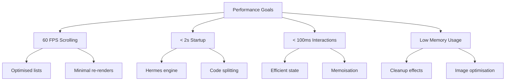

# Performance Guide

Performance optimisation patterns for React Native.

## Table of Contents

- [Overview](#overview)
- [Hermes Engine](#hermes-engine)
- [List Rendering](#list-rendering)
- [Re-render Optimisation](#re-render-optimisation)
- [Navigation Performance](#navigation-performance)
- [Bundle Size](#bundle-size)
- [Startup Time](#startup-time)
- [Memory Management](#memory-management)
- [Profiling Tools](#profiling-tools)
- [Best Practices](#best-practices)
- [Troubleshooting](#troubleshooting)

---

## Overview

Performance directly impacts user experience. This guide covers key optimisation strategies for React Native applications.

### Performance Goals



### Current Optimisations

This project includes:

- Hermes JavaScript engine (faster startup, lower memory)
- React.memo for list components (70% re-render reduction)
- useMemo for computed values
- useCallback for stable function references
- Reselect for memoised Redux selectors

---

## Hermes Engine

### Why Hermes

Hermes is a JavaScript engine optimised for React Native:

| Benefit                   | Impact                  |
| ------------------------- | ----------------------- |
| Faster Startup            | 50-70% improvement      |
| Lower Memory              | 30-50% reduction        |
| Smaller Bundle            | Bytecode precompilation |
| Better Garbage Collection | Optimised for mobile    |

### Configuration

Hermes is enabled by default in this project:

**iOS** (`ios/Podfile`):

```ruby
use_react_native!(
  :hermes_enabled => true
)
```

**Android** (`android/gradle.properties`):

```properties
hermesEnabled=true
```

### Verify Hermes

```typescript
const isHermes = () => global.HermesInternal != null;

// In app
console.log('Hermes enabled:', isHermes());
```

### Hermes Profiling

```bash
# Generate Hermes bytecode bundle for profiling
npx react-native bundle \
  --platform ios \
  --dev false \
  --entry-file index.js \
  --bundle-output ios/main.jsbundle
```

---

## List Rendering

### FlatList Optimisation

```typescript
import { FlatList } from 'react-native';

const OptimisedList = ({ data }) => (
  <FlatList
    data={data}
    renderItem={renderItem}
    keyExtractor={item => item.id}
    // Performance props
    removeClippedSubviews={true}
    maxToRenderPerBatch={10}
    updateCellsBatchingPeriod={50}
    initialNumToRender={10}
    windowSize={5}
    getItemLayout={getItemLayout}
  />
);

// Fixed height items - enables optimised scrolling
const getItemLayout = (data, index) => ({
  length: ITEM_HEIGHT,
  offset: ITEM_HEIGHT * index,
  index,
});

// Memoised render item
const renderItem = useCallback(({ item }) => (
  <MemoizedListItem item={item} />
), []);
```

### FlatList Props Reference

| Prop                        | Default | Recommended | Purpose                      |
| --------------------------- | ------- | ----------- | ---------------------------- |
| `removeClippedSubviews`     | false   | true        | Unmount off-screen items     |
| `maxToRenderPerBatch`       | 10      | 10          | Items per batch render       |
| `windowSize`                | 21      | 5-10        | Render ahead/behind viewport |
| `initialNumToRender`        | 10      | 10          | Initial visible items        |
| `updateCellsBatchingPeriod` | 50      | 50          | ms between batch updates     |

### SectionList Optimisation

```typescript
<SectionList
  sections={sections}
  renderItem={renderItem}
  renderSectionHeader={renderSectionHeader}
  stickySectionHeadersEnabled
  // Same performance props as FlatList
  removeClippedSubviews={true}
  maxToRenderPerBatch={10}
  initialNumToRender={10}
/>
```

### List Item Memoisation

```typescript
// Always memoise list items
const ListItem = React.memo(({ item, onPress }) => (
  <Pressable onPress={() => onPress(item.id)}>
    <Text>{item.title}</Text>
  </Pressable>
));

// With custom comparison
const ListItem = React.memo(
  ({ item, onPress }) => (
    <Pressable onPress={() => onPress(item.id)}>
      <Text>{item.title}</Text>
    </Pressable>
  ),
  (prevProps, nextProps) =>
    prevProps.item.id === nextProps.item.id &&
    prevProps.item.title === nextProps.item.title
);
```

### Avoid Common Mistakes

```typescript
// ❌ Bad - Creates new function on every render
<FlatList
  renderItem={({ item }) => <ListItem item={item} />}
/>

// ✅ Good - Stable reference
const renderItem = useCallback(
  ({ item }) => <ListItem item={item} />,
  []
);

<FlatList renderItem={renderItem} />
```

```typescript
// ❌ Bad - Creates new array reference
<FlatList data={items.filter(i => i.active)} />

// ✅ Good - Memoise filtered data
const filteredItems = useMemo(
  () => items.filter(i => i.active),
  [items]
);

<FlatList data={filteredItems} />
```

---

## Re-render Optimisation

### React.memo

```typescript
// Wrap components that don't need to re-render often
export const SettingsButton = React.memo(({ label, onPress }) => (
  <Pressable onPress={onPress}>
    <Text>{label}</Text>
  </Pressable>
));

// 70% fewer re-renders in lists
```

### useMemo

```typescript
// Memoise expensive calculations
const sortedItems = useMemo(() => {
  return items.sort((a, b) => a.name.localeCompare(b.name));
}, [items]);

// Memoise complex objects
const styleObject = useMemo(
  () => ({
    backgroundColor: isDark ? '#000' : '#fff',
    padding: size === 'large' ? 20 : 10,
  }),
  [isDark, size]
);
```

### useCallback

```typescript
// Memoise callbacks passed to children
const handlePress = useCallback(
  (id: string) => {
    dispatch(selectItem(id));
  },
  [dispatch]
);

// With dependencies
const handleSubmit = useCallback(() => {
  submitForm(formData);
}, [formData]);
```

### Prevent Prop Drilling Re-renders

```typescript
// ❌ Bad - Re-renders on every parent render
const Parent = () => {
  const [count, setCount] = useState(0);

  return (
    <>
      <Counter count={count} setCount={setCount} />
      <ExpensiveChild />  {/* Re-renders unnecessarily */}
    </>
  );
};

// ✅ Good - ExpensiveChild doesn't re-render
const ExpensiveChild = React.memo(() => (
  <View>{/* expensive render */}</View>
));
```

### Redux Selector Optimisation

```typescript
import { createSelector } from '@reduxjs/toolkit';

// ❌ Bad - Recalculates on every state change
const getActiveItems = state => state.items.filter(item => item.active);

// ✅ Good - Only recalculates when items change
const selectActiveItems = createSelector([state => state.items], items =>
  items.filter(item => item.active)
);
```

---

## Navigation Performance

### Native Stack Navigator

This project uses `@react-navigation/native-stack` for better performance:

```typescript
import { createNativeStackNavigator } from '@react-navigation/native-stack';

const Stack = createNativeStackNavigator<RootStackParamList>();

// Native stack uses native navigation primitives
// Better performance than JS-based stack
```

### Lazy Loading Screens

```typescript
// Lazy load heavy screens
const HeavyScreen = React.lazy(() => import('./HeavyScreen'));

// In navigator
<Stack.Screen
  name="Heavy"
  component={HeavyScreen}
/>
```

### Optimise Screen Transitions

```typescript
<Stack.Navigator
  screenOptions={{
    animation: 'slide_from_right',  // Native animation
    animationDuration: 200,          // Shorter duration
  }}
>
```

### Avoid Heavy Navigation Options

```typescript
// ❌ Bad - Heavy computation in options
<Stack.Screen
  name="Profile"
  options={{
    headerTitle: () => <ExpensiveComponent />,
  }}
/>

// ✅ Good - Simple, lightweight options
<Stack.Screen
  name="Profile"
  options={{
    title: 'Profile',
  }}
/>
```

---

## Bundle Size

### Analyse Bundle

```bash
# Generate source map
npx react-native bundle \
  --platform ios \
  --dev false \
  --entry-file index.js \
  --bundle-output bundle.js \
  --sourcemap-output bundle.js.map

# Analyse with source-map-explorer
npx source-map-explorer bundle.js bundle.js.map
```

### Reduce Bundle Size

#### 1. Tree Shaking

```typescript
// ❌ Bad - Imports entire library
import { format, parse, add, sub } from 'date-fns';

// ✅ Good - Import only what you need
import format from 'date-fns/format';
import parse from 'date-fns/parse';
```

#### 2. Icon Optimisation

```typescript
// ❌ Bad - Imports all icons
import * as Icons from '@gluestack-ui/themed';

// ✅ Good - Import specific icons
import { SunIcon, MoonIcon } from '@gluestack-ui/themed';
```

#### 3. Remove Console Logs

```javascript
// babel.config.js
module.exports = {
  presets: ['module:@react-native/babel-preset'],
  env: {
    production: {
      plugins: ['transform-remove-console'],
    },
  },
};
```

#### 4. Android APK Optimization - ✅ **Implemented**

ProGuard (R8) is enabled for Android release builds with comprehensive configuration.

**Configuration**: `android/app/build.gradle`

```gradle
def enableProguardInReleaseBuilds = true

buildTypes {
    release {
        minifyEnabled true  // Enable ProGuard (R8)
        shrinkResources true  // Remove unused resources
        proguardFiles getDefaultProguardFile("proguard-android-optimize.txt"), "proguard-rules.pro"
    }
}
```

**Measured Results**:

| Configuration    | APK Size   | Reduction       |
| ---------------- | ---------- | --------------- |
| Without ProGuard | 172 MB     | -               |
| With ProGuard    | **168 MB** | **4 MB (2.3%)** |

**What Gets Optimized**:

- **Code Shrinking**: Removes unused classes, methods, and fields
- **Code Obfuscation**: Renames classes/methods to shorter names
- **Resource Shrinking**: Removes unused images, layouts, and resources
- **Bytecode Optimization**: Optimizes Java bytecode for better performance

**Keep Rules**: Full rules in `android/app/proguard-rules.pro` preserve critical libraries:

- React Native core components
- Security libraries (keychain, encrypted-storage, biometrics)
- Navigation and Redux components
- JSON serialization classes

**Build Commands**:

```bash
# Build release APK with ProGuard
cd android && ./gradlew assembleRelease

# Verify APK size
ls -lh android/app/build/outputs/apk/release/app-release.apk
```

**Note**: The size reduction varies based on app complexity. Larger apps with more dependencies typically see greater reductions (5-15%).

---

## Startup Time

### Measure Startup

```typescript
// Add to App.tsx
import { PerformanceObserver } from 'react-native';

const startTime = Date.now();

const App = () => {
  useEffect(() => {
    const loadTime = Date.now() - startTime;
    console.log(`App loaded in ${loadTime}ms`);
  }, []);
};
```

### Optimise Startup

#### 1. Defer Non-Critical Imports

```typescript
// ❌ Bad - Imports at top level
import { Analytics } from './analytics';

// ✅ Good - Lazy import
const loadAnalytics = async () => {
  const { Analytics } = await import('./analytics');
  Analytics.init();
};
```

#### 2. Reduce Initial Bundle

```typescript
// Load features on demand
const SettingsScreen = React.lazy(() => import('@app/features/Settings'));
```

#### 3. Optimise Redux Store

```typescript
// Avoid heavy initial state computation
const initialState = {
  items: [], // Load from API later
  settings: defaultSettings,
};
```

#### 4. Delay Non-Critical Operations

```typescript
useEffect(() => {
  // Defer analytics, logging, etc.
  const timer = setTimeout(() => {
    initAnalytics();
    prefetchData();
  }, 1000);

  return () => clearTimeout(timer);
}, []);
```

---

## Memory Management

### Cleanup Effects

```typescript
// Always cleanup subscriptions, timers, etc.
useEffect(() => {
  const subscription = eventEmitter.subscribe(handleEvent);

  return () => {
    subscription.unsubscribe();
  };
}, []);

useEffect(() => {
  const timer = setInterval(updateTime, 1000);

  return () => {
    clearInterval(timer);
  };
}, []);
```

### Image Optimisation

```typescript
import FastImage from 'react-native-fast-image';

// Cached images with memory management
<FastImage
  source={{
    uri: imageUrl,
    priority: FastImage.priority.normal,
    cache: FastImage.cacheControl.immutable,
  }}
  resizeMode={FastImage.resizeMode.cover}
/>
```

### Avoid Memory Leaks

```typescript
// ❌ Bad - Memory leak if component unmounts
useEffect(() => {
  fetchData().then(setData);
}, []);

// ✅ Good - Cancelled if component unmounts
useEffect(() => {
  let cancelled = false;

  fetchData().then(data => {
    if (!cancelled) {
      setData(data);
    }
  });

  return () => {
    cancelled = true;
  };
}, []);
```

### Large Data Handling

```typescript
// Paginate large datasets
const [page, setPage] = useState(1);
const [items, setItems] = useState([]);

const loadMore = async () => {
  const newItems = await fetchItems(page);
  setItems(prev => [...prev, ...newItems]);
  setPage(prev => prev + 1);
};

<FlatList
  data={items}
  onEndReached={loadMore}
  onEndReachedThreshold={0.5}
/>
```

---

## Profiling Tools

### React DevTools Profiler

1. Install React DevTools
2. Enable profiling
3. Record interactions
4. Analyse component render times

### Reactotron

```bash
brew install --cask reactotron
```

Features:

- View Redux actions and state
- Track API requests
- Monitor performance benchmarks
- Log custom events

### Flipper

Download from [fbflipper.com](https://fbflipper.com/)

Features:

- React DevTools integration
- Layout inspector
- Network inspector
- Performance monitor
- Hermes debugger

### iOS Instruments

1. Open Xcode → Product → Profile
2. Choose "Time Profiler" template
3. Record app interactions
4. Analyse CPU usage

### Android Profiler

1. Open Android Studio
2. View → Tool Windows → Profiler
3. Select app process
4. Monitor CPU, Memory, Network

---

## Best Practices

### 1. Measure Before Optimising

```typescript
// Use performance marks
performance.mark('start-render');
// ... component render
performance.mark('end-render');
performance.measure('render-time', 'start-render', 'end-render');
```

### 2. Profile in Release Mode

Debug mode has significant overhead. Always test performance in release builds:

```bash
yarn ios:release
yarn android:release
```

### 3. Use React DevTools Profiler

Identify which components re-render and why.

### 4. Avoid Premature Optimisation

Only optimise when you have measured performance issues.

### 5. Follow the 60 FPS Rule

Target 16.67ms per frame for smooth scrolling.

### 6. Reduce Bridge Traffic

Minimise communication between JS and native:

- Batch updates
- Use native animations where possible
- Avoid frequent small updates

---

## Troubleshooting

### Slow List Scrolling

**Problem:** FlatList stutters during scroll.

**Solution:**

```typescript
<FlatList
  removeClippedSubviews={true}
  maxToRenderPerBatch={5}
  windowSize={5}
  initialNumToRender={10}
  getItemLayout={getItemLayout}  // If items have fixed height
/>
```

### Slow Screen Transitions

**Problem:** Navigation transitions are choppy.

**Solution:**

1. Use native stack navigator
2. Lazy load screens
3. Reduce complexity of screen being navigated to

### High Memory Usage

**Problem:** App uses too much memory.

**Solution:**

1. Check for memory leaks in useEffect
2. Use FastImage for image caching
3. Implement pagination for large lists
4. Remove unused images/assets

### Slow Redux Updates

**Problem:** UI slow to update after Redux action.

**Solution:**

1. Use createSelector for memoisation
2. Normalise state shape
3. Use shallowEqual in useSelector:
   ```typescript
   const items = useSelector(selectItems, shallowEqual);
   ```

### Slow Initial Load

**Problem:** App takes too long to start.

**Solution:**

1. Verify Hermes is enabled
2. Lazy load non-critical features
3. Defer analytics/logging initialisation
4. Reduce initial API calls

---

## Performance Checklist

Before releasing:

- [ ] Hermes enabled
- [ ] Lists use FlatList with optimisation props
- [ ] List items memoised with React.memo
- [ ] Expensive computations memoised with useMemo
- [ ] Callbacks memoised with useCallback
- [ ] Selectors memoised with createSelector
- [ ] useEffect cleanup functions in place
- [ ] No console.logs in production
- [ ] Images optimised
- [ ] Bundle analysed for large dependencies
- [ ] Tested on release build
- [ ] 60 FPS scrolling verified

---

## Next Steps

- **[State Management](./STATE_MANAGEMENT.md)** - Redux performance patterns
- **[Testing](./TESTING.md)** - Performance testing
- **[Development](./DEVELOPMENT.md)** - Debugging tools
- **[Cheatsheet](./CHEATSHEET.md)** - Quick reference

---

Use the profiling tools above to diagnose performance issues.
