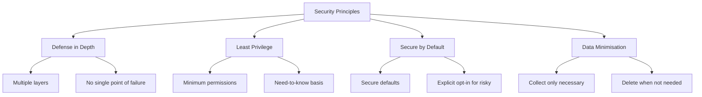

# Security Guide

Security best practices for building mobile apps that handle sensitive data properly.

## Table of Contents

- [Overview](#overview)
- [Secure Storage](#secure-storage)
- [Authentication](#authentication)
- [Network Security](#network-security)
- [Data Protection](#data-protection)
- [Environment Variables](#environment-variables)
- [Common Vulnerabilities](#common-vulnerabilities)
- [Secure Coding Practices](#secure-coding-practices)
- [Security Checklist](#security-checklist)
- [Incident Response](#incident-response)

**Related:** [Logging Guide](./LOGGING.md) - PII masking and logger utility

---

## Overview

Mobile apps face different security challenges than web apps.

### Security Principles



### Key Threats

| Threat              | Risk   | Mitigation                 |
| ------------------- | ------ | -------------------------- |
| Data Theft          | High   | Secure storage, encryption |
| Man-in-the-Middle   | High   | Certificate pinning, HTTPS |
| Reverse Engineering | Medium | Code obfuscation           |
| Injection Attacks   | Medium | Input validation           |
| Insecure Storage    | High   | Keychain/Keystore          |

### Implementation Status

| Feature                   | Android | iOS | Notes                                       |
| ------------------------- | ------- | --- | ------------------------------------------- |
| Secure Token Storage      | ✅      | ✅  | Keychain/Keystore via react-native-keychain |
| Encrypted PII Storage     | ✅      | ✅  | AES-256 via react-native-encrypted-storage  |
| HTTPS Enforcement         | ✅      | ✅  | network_security_config / ATS               |
| Certificate Pinning       | ✅      | ✅  | network_security_config / TrustKit          |
| ProGuard/Code Obfuscation | ✅      | N/A | Android release builds                      |
| Input Validation          | ✅      | ✅  | Yup schemas with homograph prevention       |
| PII Masking in Logs       | ✅      | ✅  | maskSensitiveData utility                   |
| Token Refresh             | ✅      | ✅  | Automatic 401 interceptor                   |
| WebView Security          | ✅      | ✅  | Domain whitelist + HTTPS-only enforcement   |
| Deep Link Validation      | ✅      | ✅  | URL scheme + callback type + route restrict |
| Root/Jailbreak Detection  | ❌      | ❌  | Planned (TASK-248)                          |
| Biometric Login           | ❌      | ❌  | Infrastructure only                         |

---

## Secure Storage

### Never Store in AsyncStorage

AsyncStorage is **not secure**. Never store sensitive data here:

```typescript
// ❌ NEVER do this
await AsyncStorage.setItem('authToken', token);
await AsyncStorage.setItem('password', password);
await AsyncStorage.setItem('creditCard', cardNumber);
```

### Use Keychain (iOS) / Keystore (Android)

Install a secure storage library:

```bash
yarn add react-native-keychain
```

```typescript
import * as Keychain from 'react-native-keychain';

// Store credentials securely
await Keychain.setGenericPassword('username', 'password');

// Retrieve credentials
const credentials = await Keychain.getGenericPassword();
if (credentials) {
  console.log('Username:', credentials.username);
  console.log('Password:', credentials.password);
}

// Delete credentials
await Keychain.resetGenericPassword();
```

### Secure Storage Options

```typescript
// With biometric protection
await Keychain.setGenericPassword('user', 'token', {
  accessControl: Keychain.ACCESS_CONTROL.BIOMETRY_ANY,
  accessible: Keychain.ACCESSIBLE.WHEN_UNLOCKED_THIS_DEVICE_ONLY,
});

// Require authentication
const credentials = await Keychain.getGenericPassword({
  authenticationPrompt: {
    title: 'Authentication Required',
    subtitle: 'Please authenticate to access secure data',
  },
});
```

### What to Store Securely

| Data Type           | Storage                      | Example         |
| ------------------- | ---------------------------- | --------------- |
| Auth tokens         | Keychain/Keystore            | JWT, API keys   |
| Passwords           | Keychain/Keystore            | User password   |
| Encryption keys     | Keychain/Keystore            | AES keys        |
| User preferences    | AsyncStorage + Redux Persist | Theme, language |
| Non-sensitive cache | AsyncStorage                 | UI state        |

---

## Authentication

### Token Management

```typescript
import * as Keychain from 'react-native-keychain';

// Secure token storage
const saveToken = async (token: string) => {
  await Keychain.setInternetCredentials('api.example.com', 'auth', token);
};

const getToken = async () => {
  const credentials = await Keychain.getInternetCredentials('api.example.com');
  return credentials ? credentials.password : null;
};

const clearToken = async () => {
  await Keychain.resetInternetCredentials('api.example.com');
};
```

### Token Refresh Pattern

```typescript
const apiClient = axios.create({
  baseURL: Config.API_URL,
});

apiClient.interceptors.response.use(
  response => response,
  async error => {
    if (error.response?.status === 401) {
      try {
        const newToken = await refreshToken();
        error.config.headers.Authorization = `Bearer ${newToken}`;
        return apiClient.request(error.config);
      } catch (refreshError) {
        // Logout user
        await logout();
        throw refreshError;
      }
    }
    throw error;
  }
);
```

### Biometric Authentication

```typescript
import * as Keychain from 'react-native-keychain';

const authenticateWithBiometrics = async () => {
  const biometryType = await Keychain.getSupportedBiometryType();

  if (biometryType) {
    const credentials = await Keychain.getGenericPassword({
      authenticationPrompt: {
        title: 'Authenticate',
        subtitle: `Use ${biometryType} to access your account`,
        cancel: 'Cancel',
      },
    });

    return credentials;
  }

  return null;
};
```

### Session Management

```typescript
// Auto-logout on inactivity
const TIMEOUT_DURATION = 5 * 60 * 1000; // 5 minutes
let timeoutId: NodeJS.Timeout;

const resetTimeout = () => {
  clearTimeout(timeoutId);
  timeoutId = setTimeout(logout, TIMEOUT_DURATION);
};

// Reset on user activity
const handleUserActivity = () => {
  resetTimeout();
};

// Clear session on logout
const logout = async () => {
  await clearToken();
  // Clear Redux state
  dispatch(resetState());
  // Navigate to login
  navigation.reset({
    index: 0,
    routes: [{ name: 'Login' }],
  });
};
```

---

## Network Security

### HTTPS Only

Always use HTTPS:

```typescript
// ✅ Correct
const API_URL = 'https://api.example.com';

// ❌ Never
const API_URL = 'http://api.example.com';
```

### Certificate Pinning & HTTPS Enforcement - ✅ **Implemented (Both Platforms)**

| Platform | Certificate Pinning | HTTPS Enforcement | Implementation                |
| -------- | ------------------- | ----------------- | ----------------------------- |
| Android  | ✅ Implemented      | ✅ Implemented    | network_security_config.xml   |
| iOS      | ✅ Implemented      | ✅ Via ATS        | TrustKit in AppDelegate.swift |

Both platforms use the **same certificate pins** for Supabase, with primary and backup pins for resilience.

#### Android - Network Security Config

**File**: `android/app/src/main/res/xml/network_security_config.xml`

```xml
<network-security-config>
    <!-- Production: HTTPS-only, no cleartext traffic -->
    <base-config cleartextTrafficPermitted="false">
        <trust-anchors>
            <certificates src="system" />
        </trust-anchors>
    </base-config>

    <!-- Certificate Pinning for Supabase -->
    <domain-config>
        <domain includeSubdomains="true">supabase.co</domain>
        <pin-set expiration="2026-02-02">
            <!-- Primary: Leaf certificate -->
            <pin digest="SHA-256">PzfKSv758ttsdJwUCkGhW/oxG9Wk1Y4N+NMkB5I7RXc=</pin>
            <!-- Backup: Intermediate CA (Google Trust Services WE1) -->
            <pin digest="SHA-256">kIdp6NNEd8wsugYyyIYFsi1ylMCED3hZbSR8ZFsa/A4=</pin>
        </pin-set>
    </domain-config>

    <!-- Development: Allow localhost for Metro bundler -->
    <domain-config cleartextTrafficPermitted="true">
        <domain includeSubdomains="true">localhost</domain>
        <domain includeSubdomains="true">10.0.2.2</domain>
    </domain-config>
</network-security-config>
```

#### iOS - TrustKit

**Files**: `ios/Podfile` + `ios/warrendeleon/AppDelegate.swift`

```ruby
# Podfile
pod 'TrustKit', '~> 3.0'
```

```swift
// AppDelegate.swift
import TrustKit

func application(_ application: UIApplication, didFinishLaunchingWithOptions...) -> Bool {
    // Skip TrustKit in Detox mode - SSL pinning interferes with E2E tests
    if !isRunningUnderDetox {
        let trustKitConfig: [String: Any] = [
            kTSKSwizzleNetworkDelegates: true,
            kTSKPinnedDomains: [
                "rgsvcwaxzfzqcvtyfcwk.supabase.co": [
                    kTSKIncludeSubdomains: true,
                    kTSKEnforcePinning: true,
                    kTSKPublicKeyHashes: [
                        "PzfKSv758ttsdJwUCkGhW/oxG9Wk1Y4N+NMkB5I7RXc=",  // Primary (leaf)
                        "kIdp6NNEd8wsugYyyIYFsi1ylMCED3hZbSR8ZFsa/A4="   // Backup (intermediate)
                    ]
                ]
            ]
        ]
        TrustKit.initSharedInstance(withConfiguration: trustKitConfig)
    }
    // ...
}
```

**Key Features**:

- **kTSKSwizzleNetworkDelegates**: Automatically intercepts all URLSession requests
- **kTSKEnforcePinning**: Fails connections if pins don't match
- **Detox bypass**: Disabled during E2E tests to allow Detox websocket communication

#### iOS - ATS (Additional Layer)

**File**: `ios/warrendeleon/Info.plist`

ATS provides an additional layer of HTTPS enforcement:

```xml
<key>NSAppTransportSecurity</key>
<dict>
    <key>NSAllowsArbitraryLoads</key>
    <false/>
    <key>NSAllowsLocalNetworking</key>
    <true/>
</dict>
```

#### Certificate Maintenance

**⚠️ Current certificate expires: Feb 2, 2026**

Extract new pin before expiration:

```bash
openssl s_client -servername <your-project>.supabase.co -connect <your-project>.supabase.co:443 </dev/null 2>/dev/null \
  | openssl x509 -pubkey -noout \
  | openssl pkey -pubin -outform der \
  | openssl dgst -sha256 -binary \
  | openssl enc -base64
```

**Update locations when rotating pins:**

1. `android/app/src/main/res/xml/network_security_config.xml`
2. `ios/warrendeleon/AppDelegate.swift`

### Request Security Headers

```typescript
const secureHeaders = {
  'Content-Type': 'application/json',
  'X-Content-Type-Options': 'nosniff',
  'X-Frame-Options': 'DENY',
};

const apiClient = axios.create({
  baseURL: Config.API_URL,
  headers: secureHeaders,
  timeout: 10000,
});
```

### Validate Server Responses

```typescript
// Validate response structure
const validateUserResponse = (data: unknown): User => {
  if (typeof data !== 'object' || data === null || !('id' in data) || !('email' in data)) {
    throw new Error('Invalid user response');
  }

  return data as User;
};

const getUser = async (id: string): Promise<User> => {
  const response = await apiClient.get(`/users/${id}`);
  return validateUserResponse(response.data);
};
```

---

## Data Protection

### Encrypt Sensitive Data

```typescript
import CryptoJS from 'crypto-js';

// Encrypt data before storing
const encrypt = (data: string, key: string): string => {
  return CryptoJS.AES.encrypt(data, key).toString();
};

// Decrypt data when retrieving
const decrypt = (encryptedData: string, key: string): string => {
  const bytes = CryptoJS.AES.decrypt(encryptedData, key);
  return bytes.toString(CryptoJS.enc.Utf8);
};
```

### Secure Data in Transit

```typescript
// Send only necessary data
const loginRequest = {
  email: email,
  password: password,
  // Don't send unnecessary data
};

// Hash sensitive data on client if needed
import { sha256 } from 'react-native-sha256';

const hashedPassword = await sha256(password);
```

### Clear Sensitive Data

```typescript
// Clear sensitive data from memory
const handleLogin = async (password: string) => {
  try {
    await login(password);
  } finally {
    // Clear password from memory
    password = '';
  }
};

// Clear clipboard after paste
import Clipboard from '@react-native-clipboard/clipboard';

const pasteAndClear = async () => {
  const text = await Clipboard.getString();
  // Use text
  Clipboard.setString(''); // Clear clipboard
  return text;
};
```

### Data Masking in Logs

**Use the logger utility** which automatically masks PII. Direct `console.*` calls are blocked by ESLint.

```typescript
import { logError, logWarning, logDebug } from '@app/utils/logger';

// ❌ Blocked by ESLint - never use console.* directly
console.log('User password:', password);
console.log('Token:', token);

// ✅ Use logger - PII is automatically masked
logDebug('Login attempt', { email, token });
// Output: [DEV] Login attempt { email: '[MASKED_EMAIL]', token: '[MASKED]' }

logError('Auth failed', error, { userId: '123' });
```

The logger automatically masks:

- Tokens (JWT, Bearer, API keys)
- Personal data (emails, phone numbers, addresses)
- Financial data (credit cards, CVV, account numbers)
- Identity numbers (SSN, NI numbers)

**See [LOGGING.md](./LOGGING.md) for complete usage guide and masked field reference.**

---

## Environment Variables

### Configuration Structure

```bash
# .env.development (for development)
APP_ENV=development
API_URL=https://api-dev.example.com

# .env.production (for production)
APP_ENV=production
API_URL=https://api.example.com
```

### Access Environment Variables

```typescript
import Config from 'react-native-config';

const apiUrl = Config.API_URL;
const appEnv = Config.APP_ENV;
```

### Never Store Secrets in Code

```typescript
// ❌ NEVER hardcode secrets
const API_KEY = 'abc123secret';
const STRIPE_KEY = 'pk_live_xxx';

// ✅ Use environment variables or secure storage
const API_KEY = Config.API_KEY;
```

### Production Secrets

For truly sensitive keys:

1. Don't bundle in the app
2. Fetch from server after authentication
3. Store in secure storage

```typescript
// Fetch sensitive config after auth
const getSecureConfig = async () => {
  const token = await getToken();
  const response = await fetch('/config/secure', {
    headers: { Authorization: `Bearer ${token}` },
  });
  return response.json();
};
```

---

## Common Vulnerabilities

### 1. Insecure Data Storage

**Vulnerability:** Storing sensitive data in plain text.

**Mitigation:**

- Use Keychain/Keystore for sensitive data
- Encrypt data at rest
- Never store passwords in plain text

### 2. Insufficient Transport Layer Security

**Vulnerability:** Transmitting data over HTTP.

**Mitigation:**

- Always use HTTPS
- Implement certificate pinning
- Validate SSL certificates

### 3. Insecure Authentication

**Vulnerability:** Weak authentication mechanisms.

**Mitigation:**

- Use strong token-based auth (JWT)
- Implement token refresh
- Add biometric authentication option
- Auto-logout on inactivity

### 4. Client-Side Injection

**Vulnerability:** WebView JavaScript injection.

**Mitigation:**

```typescript
// If using WebView
<WebView
  source={{ uri: 'https://example.com' }}
  javaScriptEnabled={false} // Disable if not needed
  originWhitelist={['https://*']} // Restrict origins
/>
```

### 5. Reverse Engineering

**Vulnerability:** App code can be decompiled.

**Mitigation:**

- Enable ProGuard (Android) - ✅ **Implemented**
- Don't embed secrets in code
- Use code obfuscation

#### Android ProGuard Configuration

ProGuard is **enabled** for release builds with comprehensive rules:

**Configuration**: `android/app/build.gradle`

```gradle
def enableProguardInReleaseBuilds = true

buildTypes {
    release {
        minifyEnabled true  // Enable ProGuard (R8)
        shrinkResources true  // Remove unused resources
        proguardFiles getDefaultProguardFile("proguard-android-optimize.txt"), "proguard-rules.pro"
    }
}
```

**Benefits**:

- **APK Size**: Reduced from 172 MB to **168 MB** (2.3% smaller)
- **Code Obfuscation**: Class and method names obfuscated
- **Attack Surface**: Unused code and resources removed
- **Reverse Engineering**: Significantly harder to decompile and understand

**Keep Rules**: Comprehensive rules in `android/app/proguard-rules.pro` protect:

- React Native core classes
- Critical security libraries (keychain, encrypted-storage, biometrics)
- Networking libraries (Axios, OkHttp, Supabase)
- Redux and navigation components

### 6. Improper Platform Usage

**Vulnerability:** Misusing platform security features.

**Mitigation:**

- Follow iOS/Android security guidelines
- Use platform-specific secure storage
- Request minimum necessary permissions

### 7. Code Tampering

**Vulnerability:** Modified app running on device.

**Mitigation:**

- Implement integrity checks
- Use app attestation services
- Detect rooted/jailbroken devices

**Status: ❌ Not Implemented**

Root/jailbreak detection is planned but not yet implemented. When implemented:

```typescript
// Future implementation with jail-monkey
import JailMonkey from 'jail-monkey';

if (JailMonkey.isJailBroken()) {
  // Warn user or restrict functionality
}
```

See [TASK-248](../planning/tasks/TASK-248-root-detection-service.md) for implementation plan.

---

## Secure Coding Practices

### Input Validation

```typescript
// Validate all user input
const validateEmail = (email: string): boolean => {
  const emailRegex = /^[^\s@]+@[^\s@]+\.[^\s@]+$/;
  return emailRegex.test(email);
};

const validatePassword = (password: string): boolean => {
  // Minimum 8 chars, one uppercase, one lowercase, one number
  const passwordRegex = /^(?=.*[a-z])(?=.*[A-Z])(?=.*\d).{8,}$/;
  return passwordRegex.test(password);
};

// Sanitise input
const sanitiseInput = (input: string): string => {
  return input.replace(/[<>]/g, '');
};
```

### Unicode Normalization & Homograph Prevention - ✅ **Implemented**

Prevent homograph attacks where attackers use Unicode lookalike characters (e.g., Cyrillic "а" looks identical to Latin "a") to impersonate legitimate users.

**Location**: `src/features/Auth/validation/utils/unicodeUtils.ts`

#### What It Protects Against

| Attack Type          | Example                     | Risk               |
| -------------------- | --------------------------- | ------------------ |
| Mixed Scripts        | "Јohn" (Cyrillic J + Latin) | User impersonation |
| Lookalike Characters | "Mаry" (Cyrillic а)         | Identity spoofing  |
| Visual Deception     | "Раypal" (Cyrillic Р, а)    | Phishing attempts  |

#### How It Works

```typescript
import {
  containsMixedScripts,
  normalizeAndValidate,
} from '@app/features/Auth/validation/utils/unicodeUtils';

// 1. Unicode Normalization (NFC form)
// Ensures consistent character representation
const { normalized, isValid } = normalizeAndValidate(name);

// 2. Mixed Script Detection
// Detects Latin + Cyrillic/Greek/Arabic combinations
if (containsMixedScripts(name)) {
  // Block: potential homograph attack
}

// 3. Latin-Only Validation for Names
// Only allows: a-zA-Z, spaces, hyphens, apostrophes
if (!isValid) {
  // Block: contains non-Latin characters
}
```

#### Yup Schema Integration

The `noHomographs()` custom Yup method is applied to name fields:

```typescript
import '@app/features/Auth/validation/customRules';

const schema = yup.object({
  firstName: yup
    .string()
    .noHomographs('First name contains invalid characters')
    .matches(/^[a-zA-Z\s'-]+$/, 'Invalid characters'),
  lastName: yup
    .string()
    .noHomographs('Last name contains invalid characters')
    .matches(/^[a-zA-Z\s'-]+$/, 'Invalid characters'),
});
```

#### Detected Lookalike Characters

Common Cyrillic characters that look identical to Latin:

| Cyrillic | Latin | Unicode |
| -------- | ----- | ------- |
| а        | a     | U+0430  |
| е        | e     | U+0435  |
| о        | o     | U+043E  |
| р        | p     | U+0440  |
| с        | c     | U+0441  |
| у        | y     | U+0443  |
| х        | x     | U+0445  |
| А        | A     | U+0410  |
| В        | B     | U+0412  |
| Е        | E     | U+0415  |
| К        | K     | U+041A  |
| М        | M     | U+041C  |
| Н        | H     | U+041D  |
| О        | O     | U+041E  |
| Р        | P     | U+0420  |
| С        | C     | U+0421  |
| Т        | T     | U+0422  |
| Х        | X     | U+0425  |

#### User-Friendly Error Messages

Error messages don't reveal attack details to prevent information leakage:

- Mixed scripts: "Name cannot contain mixed character sets"
- Invalid characters: "First name contains invalid characters"

**Note**: Legitimate names with hyphens (Mary-Jane), apostrophes (O'Brien), and spaces (Mary Jane) are allowed.

### Type Safety

```typescript
// Use TypeScript for type safety
interface User {
  id: string;
  email: string;
  role: 'admin' | 'user';
}

// Validate unknown data
const isUser = (data: unknown): data is User => {
  return (
    typeof data === 'object' && data !== null && 'id' in data && 'email' in data && 'role' in data
  );
};
```

### Error Handling

```typescript
// Don't expose sensitive errors to users
try {
  await loginUser(credentials);
} catch (error) {
  // Log full error internally
  console.error('Login error:', error);

  // Show generic message to user
  setError('Login failed. Please check your credentials.');
}
```

### Secure Navigation

```typescript
// Prevent navigation to protected screens
const RootNavigator = () => {
  const isAuthenticated = useSelector(selectIsAuthenticated);

  return (
    <Stack.Navigator>
      {isAuthenticated ? (
        // Protected screens
        <>
          <Stack.Screen name="Home" component={HomeScreen} />
          <Stack.Screen name="Settings" component={SettingsScreen} />
        </>
      ) : (
        // Auth screens
        <>
          <Stack.Screen name="Login" component={LoginScreen} />
          <Stack.Screen name="Register" component={RegisterScreen} />
        </>
      )}
    </Stack.Navigator>
  );
};
```

### Deep Link Security

```typescript
// Validate deep links
const handleDeepLink = (url: string) => {
  const parsed = Linking.parse(url);

  // Whitelist allowed paths
  const allowedPaths = ['product', 'settings', 'profile'];

  if (!allowedPaths.includes(parsed.path || '')) {
    console.warn('Invalid deep link:', url);
    return;
  }

  // Validate parameters
  if (parsed.queryParams?.id) {
    // Ensure ID is alphanumeric
    if (!/^[a-zA-Z0-9]+$/.test(parsed.queryParams.id)) {
      console.warn('Invalid ID in deep link');
      return;
    }
  }

  navigation.navigate(parsed.path, parsed.queryParams);
};
```

---

## Security Checklist

### Authentication

- [x] Tokens stored in Keychain/Keystore (SecureStore using react-native-keychain)
- [x] Token refresh implemented (automatic 401 interceptor)
- [ ] Auto-logout on inactivity (not implemented)
- [ ] Biometric option available (infrastructure only, not in login flow)
- [x] Secure password requirements (8+ chars, uppercase, lowercase, number, symbol)

### Data Storage

- [x] No sensitive data in AsyncStorage (using EncryptedStore for PII)
- [x] Encryption for sensitive local data (AES-256 via react-native-encrypted-storage)
- [x] Secure key management (Keychain/Keystore)
- [x] Data cleared on logout (SecureStore.clear() + EncryptedStore.clear())

### Network

- [x] HTTPS for all requests (ATS on iOS, network_security_config on Android)
- [x] Certificate pinning implemented (Android: network_security_config, iOS: TrustKit)
- [x] Request timeout configured (10 seconds in SupabaseAuthClient)
- [x] Response validation (Zod schemas for all API responses)

### Code Security

- [x] No hardcoded secrets (react-native-config for environment variables)
- [x] Environment variables for config (SUPABASE_URL, SUPABASE_ANON_KEY)
- [x] ProGuard enabled (Android release builds)
- [x] Input validation on all forms (Yup schemas)
- [x] Sensitive data masked in logs (maskSensitiveData utility)
- [x] Unicode normalization for names (homograph prevention)

### Platform Security

- [x] Minimum permissions requested (only location when needed)
- [x] Deep links validated (URL scheme + auth callback type + route restriction)
- [x] WebView secured (domain whitelist + HTTPS-only via urlValidator.ts)
- [ ] Root/jailbreak detection (not implemented - see TASK-248)

---

## Incident Response

### If You Discover a Vulnerability

1. **Assess Impact**: Determine what data/users are affected
2. **Contain**: Implement immediate fix if possible
3. **Investigate**: Understand how it happened
4. **Remediate**: Deploy proper fix
5. **Document**: Record lessons learned
6. **Notify**: Inform affected users if required

### Security Update Process

```bash
# Regular dependency updates
yarn upgrade-interactive

# Check for known vulnerabilities
yarn audit

# Fix vulnerabilities
yarn audit fix
```

### Reporting Security Issues

For security issues in dependencies:

- Check CVE databases
- Review GitHub security advisories
- Monitor React Native security updates

---

## Resources

- [OWASP Mobile Security](https://owasp.org/www-project-mobile-security/)
- [React Native Security Best Practices](https://reactnative.dev/docs/security)
- [iOS Security Guide](https://developer.apple.com/security/)
- [Android Security Guide](https://developer.android.com/security)

---

## Next Steps

- **[Development](./DEVELOPMENT.md)** - Development setup
- **[Architecture](./ARCHITECTURE.md)** - Project structure
- **[Performance](./PERFORMANCE.md)** - Performance optimisation
- **[Cheatsheet](./CHEATSHEET.md)** - Quick reference

---

Check the resources above for more security guidance.
