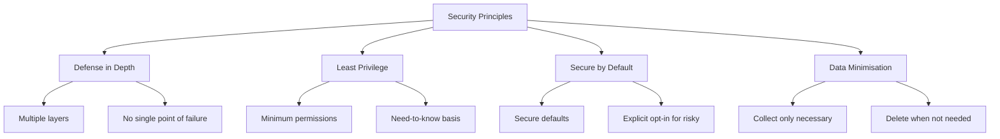

# Security Guide

This document covers security best practices for React Native mobile application development.

## Table of Contents

- [Overview](#overview)
- [Secure Storage](#secure-storage)
- [Authentication](#authentication)
- [Network Security](#network-security)
- [Data Protection](#data-protection)
- [Environment Variables](#environment-variables)
- [Common Vulnerabilities](#common-vulnerabilities)
- [Secure Coding Practices](#secure-coding-practices)
- [Security Checklist](#security-checklist)
- [Incident Response](#incident-response)

---

## Overview

Mobile applications face unique security challenges. This guide covers key security practices for React Native apps.

### Security Principles



### Key Threats

| Threat              | Risk   | Mitigation                 |
| ------------------- | ------ | -------------------------- |
| Data Theft          | High   | Secure storage, encryption |
| Man-in-the-Middle   | High   | Certificate pinning, HTTPS |
| Reverse Engineering | Medium | Code obfuscation           |
| Injection Attacks   | Medium | Input validation           |
| Insecure Storage    | High   | Keychain/Keystore          |

---

## Secure Storage

### Never Store in AsyncStorage

AsyncStorage is **not secure**. Never store sensitive data here:

```typescript
// ❌ NEVER do this
await AsyncStorage.setItem('authToken', token);
await AsyncStorage.setItem('password', password);
await AsyncStorage.setItem('creditCard', cardNumber);
```

### Use Keychain (iOS) / Keystore (Android)

Install a secure storage library:

```bash
yarn add react-native-keychain
```

```typescript
import * as Keychain from 'react-native-keychain';

// Store credentials securely
await Keychain.setGenericPassword('username', 'password');

// Retrieve credentials
const credentials = await Keychain.getGenericPassword();
if (credentials) {
  console.log('Username:', credentials.username);
  console.log('Password:', credentials.password);
}

// Delete credentials
await Keychain.resetGenericPassword();
```

### Secure Storage Options

```typescript
// With biometric protection
await Keychain.setGenericPassword('user', 'token', {
  accessControl: Keychain.ACCESS_CONTROL.BIOMETRY_ANY,
  accessible: Keychain.ACCESSIBLE.WHEN_UNLOCKED_THIS_DEVICE_ONLY,
});

// Require authentication
const credentials = await Keychain.getGenericPassword({
  authenticationPrompt: {
    title: 'Authentication Required',
    subtitle: 'Please authenticate to access secure data',
  },
});
```

### What to Store Securely

| Data Type           | Storage                      | Example         |
| ------------------- | ---------------------------- | --------------- |
| Auth tokens         | Keychain/Keystore            | JWT, API keys   |
| Passwords           | Keychain/Keystore            | User password   |
| Encryption keys     | Keychain/Keystore            | AES keys        |
| User preferences    | AsyncStorage + Redux Persist | Theme, language |
| Non-sensitive cache | AsyncStorage                 | UI state        |

---

## Authentication

### Token Management

```typescript
import * as Keychain from 'react-native-keychain';

// Secure token storage
const saveToken = async (token: string) => {
  await Keychain.setInternetCredentials('api.example.com', 'auth', token);
};

const getToken = async () => {
  const credentials = await Keychain.getInternetCredentials('api.example.com');
  return credentials ? credentials.password : null;
};

const clearToken = async () => {
  await Keychain.resetInternetCredentials('api.example.com');
};
```

### Token Refresh Pattern

```typescript
const apiClient = axios.create({
  baseURL: Config.API_URL,
});

apiClient.interceptors.response.use(
  response => response,
  async error => {
    if (error.response?.status === 401) {
      try {
        const newToken = await refreshToken();
        error.config.headers.Authorization = `Bearer ${newToken}`;
        return apiClient.request(error.config);
      } catch (refreshError) {
        // Logout user
        await logout();
        throw refreshError;
      }
    }
    throw error;
  }
);
```

### Biometric Authentication

```typescript
import * as Keychain from 'react-native-keychain';

const authenticateWithBiometrics = async () => {
  const biometryType = await Keychain.getSupportedBiometryType();

  if (biometryType) {
    const credentials = await Keychain.getGenericPassword({
      authenticationPrompt: {
        title: 'Authenticate',
        subtitle: `Use ${biometryType} to access your account`,
        cancel: 'Cancel',
      },
    });

    return credentials;
  }

  return null;
};
```

### Session Management

```typescript
// Auto-logout on inactivity
const TIMEOUT_DURATION = 5 * 60 * 1000; // 5 minutes
let timeoutId: NodeJS.Timeout;

const resetTimeout = () => {
  clearTimeout(timeoutId);
  timeoutId = setTimeout(logout, TIMEOUT_DURATION);
};

// Reset on user activity
const handleUserActivity = () => {
  resetTimeout();
};

// Clear session on logout
const logout = async () => {
  await clearToken();
  // Clear Redux state
  dispatch(resetState());
  // Navigate to login
  navigation.reset({
    index: 0,
    routes: [{ name: 'Login' }],
  });
};
```

---

## Network Security

### HTTPS Only

Always use HTTPS:

```typescript
// ✅ Correct
const API_URL = 'https://api.example.com';

// ❌ Never
const API_URL = 'http://api.example.com';
```

### Certificate Pinning

Prevent man-in-the-middle attacks:

```typescript
import { fetch } from 'react-native-ssl-pinning';

const pinnedFetch = async (url: string, options: any) => {
  return fetch(url, {
    ...options,
    sslPinning: {
      certs: ['cert1', 'cert2'], // Certificate names in assets
    },
  });
};
```

### Request Security Headers

```typescript
const secureHeaders = {
  'Content-Type': 'application/json',
  'X-Content-Type-Options': 'nosniff',
  'X-Frame-Options': 'DENY',
};

const apiClient = axios.create({
  baseURL: Config.API_URL,
  headers: secureHeaders,
  timeout: 10000,
});
```

### Validate Server Responses

```typescript
// Validate response structure
const validateUserResponse = (data: unknown): User => {
  if (typeof data !== 'object' || data === null || !('id' in data) || !('email' in data)) {
    throw new Error('Invalid user response');
  }

  return data as User;
};

const getUser = async (id: string): Promise<User> => {
  const response = await apiClient.get(`/users/${id}`);
  return validateUserResponse(response.data);
};
```

---

## Data Protection

### Encrypt Sensitive Data

```typescript
import CryptoJS from 'crypto-js';

// Encrypt data before storing
const encrypt = (data: string, key: string): string => {
  return CryptoJS.AES.encrypt(data, key).toString();
};

// Decrypt data when retrieving
const decrypt = (encryptedData: string, key: string): string => {
  const bytes = CryptoJS.AES.decrypt(encryptedData, key);
  return bytes.toString(CryptoJS.enc.Utf8);
};
```

### Secure Data in Transit

```typescript
// Send only necessary data
const loginRequest = {
  email: email,
  password: password,
  // Don't send unnecessary data
};

// Hash sensitive data on client if needed
import { sha256 } from 'react-native-sha256';

const hashedPassword = await sha256(password);
```

### Clear Sensitive Data

```typescript
// Clear sensitive data from memory
const handleLogin = async (password: string) => {
  try {
    await login(password);
  } finally {
    // Clear password from memory
    password = '';
  }
};

// Clear clipboard after paste
import Clipboard from '@react-native-clipboard/clipboard';

const pasteAndClear = async () => {
  const text = await Clipboard.getString();
  // Use text
  Clipboard.setString(''); // Clear clipboard
  return text;
};
```

### Data Masking in Logs

```typescript
// ❌ Never log sensitive data
console.log('User password:', password);
console.log('Token:', token);

// ✅ Mask sensitive data
console.log('Login attempt for:', email.slice(0, 3) + '***');
console.log('Token present:', !!token);
```

---

## Environment Variables

### Configuration Structure

```bash
# .env.development (for development)
APP_ENV=development
API_URL=https://api-dev.example.com

# .env.production (for production)
APP_ENV=production
API_URL=https://api.example.com
```

### Access Environment Variables

```typescript
import Config from 'react-native-config';

const apiUrl = Config.API_URL;
const appEnv = Config.APP_ENV;
```

### Never Store Secrets in Code

```typescript
// ❌ NEVER hardcode secrets
const API_KEY = 'abc123secret';
const STRIPE_KEY = 'pk_live_xxx';

// ✅ Use environment variables or secure storage
const API_KEY = Config.API_KEY;
```

### Production Secrets

For truly sensitive keys:

1. Don't bundle in the app
2. Fetch from server after authentication
3. Store in secure storage

```typescript
// Fetch sensitive config after auth
const getSecureConfig = async () => {
  const token = await getToken();
  const response = await fetch('/config/secure', {
    headers: { Authorization: `Bearer ${token}` },
  });
  return response.json();
};
```

---

## Common Vulnerabilities

### 1. Insecure Data Storage

**Vulnerability:** Storing sensitive data in plain text.

**Mitigation:**

- Use Keychain/Keystore for sensitive data
- Encrypt data at rest
- Never store passwords in plain text

### 2. Insufficient Transport Layer Security

**Vulnerability:** Transmitting data over HTTP.

**Mitigation:**

- Always use HTTPS
- Implement certificate pinning
- Validate SSL certificates

### 3. Insecure Authentication

**Vulnerability:** Weak authentication mechanisms.

**Mitigation:**

- Use strong token-based auth (JWT)
- Implement token refresh
- Add biometric authentication option
- Auto-logout on inactivity

### 4. Client-Side Injection

**Vulnerability:** WebView JavaScript injection.

**Mitigation:**

```typescript
// If using WebView
<WebView
  source={{ uri: 'https://example.com' }}
  javaScriptEnabled={false} // Disable if not needed
  originWhitelist={['https://*']} // Restrict origins
/>
```

### 5. Reverse Engineering

**Vulnerability:** App code can be decompiled.

**Mitigation:**

- Enable ProGuard (Android)
- Don't embed secrets in code
- Use code obfuscation

```properties
# android/app/build.gradle
def enableProguardInReleaseBuilds = true
```

### 6. Improper Platform Usage

**Vulnerability:** Misusing platform security features.

**Mitigation:**

- Follow iOS/Android security guidelines
- Use platform-specific secure storage
- Request minimum necessary permissions

### 7. Code Tampering

**Vulnerability:** Modified app running on device.

**Mitigation:**

- Implement integrity checks
- Use app attestation services
- Detect rooted/jailbroken devices

```typescript
import JailMonkey from 'jail-monkey';

if (JailMonkey.isJailBroken()) {
  // Warn user or restrict functionality
}
```

---

## Secure Coding Practices

### Input Validation

```typescript
// Validate all user input
const validateEmail = (email: string): boolean => {
  const emailRegex = /^[^\s@]+@[^\s@]+\.[^\s@]+$/;
  return emailRegex.test(email);
};

const validatePassword = (password: string): boolean => {
  // Minimum 8 chars, one uppercase, one lowercase, one number
  const passwordRegex = /^(?=.*[a-z])(?=.*[A-Z])(?=.*\d).{8,}$/;
  return passwordRegex.test(password);
};

// Sanitise input
const sanitiseInput = (input: string): string => {
  return input.replace(/[<>]/g, '');
};
```

### Type Safety

```typescript
// Use TypeScript for type safety
interface User {
  id: string;
  email: string;
  role: 'admin' | 'user';
}

// Validate unknown data
const isUser = (data: unknown): data is User => {
  return (
    typeof data === 'object' && data !== null && 'id' in data && 'email' in data && 'role' in data
  );
};
```

### Error Handling

```typescript
// Don't expose sensitive errors to users
try {
  await loginUser(credentials);
} catch (error) {
  // Log full error internally
  console.error('Login error:', error);

  // Show generic message to user
  setError('Login failed. Please check your credentials.');
}
```

### Secure Navigation

```typescript
// Prevent navigation to protected screens
const RootNavigator = () => {
  const isAuthenticated = useSelector(selectIsAuthenticated);

  return (
    <Stack.Navigator>
      {isAuthenticated ? (
        // Protected screens
        <>
          <Stack.Screen name="Home" component={HomeScreen} />
          <Stack.Screen name="Settings" component={SettingsScreen} />
        </>
      ) : (
        // Auth screens
        <>
          <Stack.Screen name="Login" component={LoginScreen} />
          <Stack.Screen name="Register" component={RegisterScreen} />
        </>
      )}
    </Stack.Navigator>
  );
};
```

### Deep Link Security

```typescript
// Validate deep links
const handleDeepLink = (url: string) => {
  const parsed = Linking.parse(url);

  // Whitelist allowed paths
  const allowedPaths = ['product', 'settings', 'profile'];

  if (!allowedPaths.includes(parsed.path || '')) {
    console.warn('Invalid deep link:', url);
    return;
  }

  // Validate parameters
  if (parsed.queryParams?.id) {
    // Ensure ID is alphanumeric
    if (!/^[a-zA-Z0-9]+$/.test(parsed.queryParams.id)) {
      console.warn('Invalid ID in deep link');
      return;
    }
  }

  navigation.navigate(parsed.path, parsed.queryParams);
};
```

---

## Security Checklist

### Authentication

- [ ] Tokens stored in Keychain/Keystore
- [ ] Token refresh implemented
- [ ] Auto-logout on inactivity
- [ ] Biometric option available
- [ ] Secure password requirements

### Data Storage

- [ ] No sensitive data in AsyncStorage
- [ ] Encryption for sensitive local data
- [ ] Secure key management
- [ ] Data cleared on logout

### Network

- [ ] HTTPS for all requests
- [ ] Certificate pinning implemented
- [ ] Request timeout configured
- [ ] Response validation

### Code Security

- [ ] No hardcoded secrets
- [ ] Environment variables for config
- [ ] ProGuard enabled (Android)
- [ ] Input validation on all forms
- [ ] Sensitive data masked in logs

### Platform Security

- [ ] Minimum permissions requested
- [ ] Deep links validated
- [ ] WebView secured (if used)
- [ ] Root/jailbreak detection (if needed)

---

## Incident Response

### If You Discover a Vulnerability

1. **Assess Impact**: Determine what data/users are affected
2. **Contain**: Implement immediate fix if possible
3. **Investigate**: Understand how it happened
4. **Remediate**: Deploy proper fix
5. **Document**: Record lessons learned
6. **Notify**: Inform affected users if required

### Security Update Process

```bash
# Regular dependency updates
yarn upgrade-interactive

# Check for known vulnerabilities
yarn audit

# Fix vulnerabilities
yarn audit fix
```

### Reporting Security Issues

For security issues in dependencies:

- Check CVE databases
- Review GitHub security advisories
- Monitor React Native security updates

---

## Resources

- [OWASP Mobile Security](https://owasp.org/www-project-mobile-security/)
- [React Native Security Best Practices](https://reactnative.dev/docs/security)
- [iOS Security Guide](https://developer.apple.com/security/)
- [Android Security Guide](https://developer.android.com/security)

---

## Next Steps

- **[Development](./DEVELOPMENT.md)** - Development setup
- **[Architecture](./ARCHITECTURE.md)** - Project structure
- **[Performance](./PERFORMANCE.md)** - Performance optimisation
- **[Cheatsheet](./CHEATSHEET.md)** - Quick reference

---

**Need help?** Open an issue on GitHub or consult the resources above.
