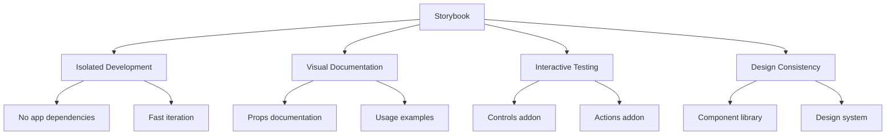
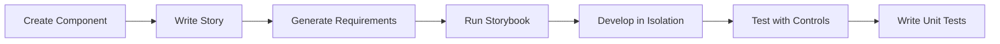

# Storybook Guide

This document covers using Storybook for isolated component development and documentation in this React Native project.

## Table of Contents

- [Overview](#overview)
- [Why Storybook](#why-storybook)
- [Getting Started](#getting-started)
- [Configuration](#configuration)
- [Writing Stories](#writing-stories)
- [Addons](#addons)
- [Best Practices](#best-practices)
- [Testing Integration](#testing-integration)
- [Troubleshooting](#troubleshooting)

---

## Overview

Storybook provides an isolated environment for developing, testing, and documenting React Native components. Each component can be viewed independently with different props, states, and backgrounds.

### Key Benefits



### Version

This project uses **Storybook 10.x** for React Native, which provides:

- On-device rendering (components render on actual device/simulator)
- Interactive controls for props
- Background switching (light/dark/grey)
- Action logging for events
- Notes for documentation

---

## Why Storybook

### Technical Decision

We chose Storybook v10 for React Native because:

1. **On-Device Development**: Components render on real iOS/Android devices, ensuring accurate behaviour
2. **React Native 0.82 Support**: v10 is compatible with the latest React Native
3. **GlueStack UI Integration**: Works seamlessly with our UI framework
4. **Interactive Controls**: Test props in real-time without code changes
5. **Documentation**: Built-in notes addon for component documentation
6. **Industry Standard**: Widely used for component-driven development

### When to Use Storybook

| Use Storybook For                   | Don't Use For       |
| ----------------------------------- | ------------------- |
| Developing new components           | Full screen flows   |
| Testing different prop combinations | Navigation testing  |
| Visual regression checking          | Integration tests   |
| Component documentation             | E2E scenarios       |
| Design system development           | Redux state testing |

---

## Getting Started

### Running Storybook

```bash
# iOS
yarn storybook:ios

# Android
yarn storybook:android
```

This builds and launches the app in Storybook mode, showing all available stories.

### Generating Story Requirements

When you add new stories, regenerate the story loader:

```bash
yarn storybook-generate
```

This updates `.rnstorybook/storybook.requires.ts` with all story files.

### Development Workflow



**Step-by-step:**

1. Create your component in `src/components/MyComponent/`
2. Add a story file: `MyComponent.stories.tsx`
3. Run `yarn storybook-generate`
4. Launch Storybook: `yarn storybook:ios`
5. Develop and test your component
6. Write unit tests when satisfied

---

## Configuration

### Project Structure

```
.rnstorybook/
├── main.ts              # Storybook configuration
├── preview.tsx          # Global decorators and parameters
├── index.ts             # Entry point
├── storybook.requires.ts # Auto-generated story loader
└── stories/             # Example stories (optional)
```

### Main Configuration

```typescript
// .rnstorybook/main.ts
import type { StorybookConfig } from '@storybook/react-native';

const main: StorybookConfig = {
  stories: ['../src/components/**/*.stories.?(ts|tsx|js|jsx)'],
  addons: [
    '@storybook/addon-ondevice-controls',
    '@storybook/addon-ondevice-actions',
    '@storybook/addon-ondevice-backgrounds',
    '@storybook/addon-ondevice-notes',
  ],
};

export default main;
```

**Note:** Stories are located in `src/components/` alongside their components.

### Preview Configuration

```typescript
// .rnstorybook/preview.tsx
import React from 'react';
import { GluestackUIProvider } from '@gluestack-ui/themed';
import type { Preview } from '@storybook/react-native';
import { config } from '../gluestack-ui.config';

const preview: Preview = {
  decorators: [
    Story => (
      <GluestackUIProvider config={config}>
        <Story />
      </GluestackUIProvider>
    ),
  ],
  parameters: {
    backgrounds: {
      default: 'light',
      values: [
        { name: 'light', value: '#FFFFFF' },
        { name: 'dark', value: '#1A1A1A' },
        { name: 'gray', value: '#F5F5F5' },
      ],
    },
    controls: {
      matchers: {
        color: /(background|color)$/i,
        date: /Date$/,
      },
    },
  },
};

export default preview;
```

**Key Points:**

- GluestackUIProvider wraps all stories (required for GlueStack UI components)
- Background presets for testing light/dark modes
- Colour matchers for automatic colour picker controls

---

## Writing Stories

### Basic Story Structure

```typescript
// src/components/MyComponent/MyComponent.stories.tsx
import type { Meta, StoryObj } from '@storybook/react-native';
import { MyComponent } from './MyComponent';

const meta: Meta<typeof MyComponent> = {
  title: 'Components/MyComponent',
  component: MyComponent,
};

export default meta;

type Story = StoryObj<typeof MyComponent>;

export const Default: Story = {
  args: {
    label: 'Hello',
  },
};
```

### Story with Controls

```typescript
import type { Meta, StoryObj } from '@storybook/react-native';
import { MyButton } from './MyButton';

const meta: Meta<typeof MyButton> = {
  title: 'Components/MyButton',
  component: MyButton,
  argTypes: {
    label: {
      control: 'text',
      description: 'Button label text',
    },
    variant: {
      control: 'select',
      options: ['primary', 'secondary', 'outline'],
      description: 'Button style variant',
    },
    disabled: {
      control: 'boolean',
      description: 'Disable the button',
    },
    size: {
      control: 'radio',
      options: ['sm', 'md', 'lg'],
      description: 'Button size',
    },
    colour: {
      control: 'color',
      description: 'Custom background colour',
    },
  },
};

export default meta;

type Story = StoryObj<typeof MyButton>;

export const Default: Story = {
  args: {
    label: 'Click Me',
    variant: 'primary',
    disabled: false,
    size: 'md',
  },
};

export const Secondary: Story = {
  args: {
    label: 'Secondary',
    variant: 'secondary',
  },
};

export const Disabled: Story = {
  args: {
    label: 'Disabled',
    disabled: true,
  },
};
```

### Story with Actions

```typescript
import { action } from '@storybook/addon-actions';
import type { Meta, StoryObj } from '@storybook/react-native';
import { MyButton } from './MyButton';

const meta: Meta<typeof MyButton> = {
  title: 'Components/MyButton',
  component: MyButton,
};

export default meta;

type Story = StoryObj<typeof MyButton>;

export const WithActions: Story = {
  args: {
    label: 'Press Me',
    onPress: action('button-pressed'),
    onLongPress: action('button-long-pressed'),
  },
};
```

### Story with Documentation Notes

```typescript
const meta: Meta<typeof SettingsItem> = {
  title: 'Components/SettingsItem',
  component: SettingsItem,
  parameters: {
    notes: `
## SettingsItem Component

Settings list item with optional icon, label, and navigation chevron.

### Props
- \`label\`: string - Main text
- \`onPress\`: () => void - Press handler
- \`startIcon\`: React.ElementType - Icon component
- \`startIconBgColor\`: string - Icon background colour
- \`endLabel\`: string - Secondary text on right
- \`groupVariant\`: 'single' | 'top' | 'middle' | 'bottom'
- \`showChevron\`: boolean - Show navigation chevron

### Accessibility
- Combines label and endLabel for accessibility label
- Optional accessibility hint

### Usage
\`\`\`tsx
<SettingsItem
  label="Appearance"
  startIcon={SunIcon}
  startIconBgColor="$orange500"
  onPress={handlePress}
/>
\`\`\`
    `,
  },
};
```

### Story for Group Variants

```typescript
export const TopInGroup: Story = {
  args: {
    label: 'First Item',
    groupVariant: 'top',
  },
};

export const MiddleInGroup: Story = {
  args: {
    label: 'Middle Item',
    groupVariant: 'middle',
  },
};

export const BottomInGroup: Story = {
  args: {
    label: 'Last Item',
    groupVariant: 'bottom',
  },
};

export const SingleItem: Story = {
  args: {
    label: 'Only Item',
    groupVariant: 'single',
  },
};
```

---

## Addons

### Available Addons

| Addon       | Purpose                  | Usage                       |
| ----------- | ------------------------ | --------------------------- |
| Controls    | Interactive prop editing | Change props in real-time   |
| Actions     | Event logging            | See onPress, onChange, etc. |
| Backgrounds | Background switching     | Test light/dark modes       |
| Notes       | Documentation            | Add component documentation |

### Controls Addon

Controls appear in the bottom panel and allow you to modify props interactively.

**Control Types:**

- `text` - Text input
- `boolean` - Toggle switch
- `number` - Number input
- `select` - Dropdown menu
- `radio` - Radio buttons
- `color` - Colour picker
- `date` - Date picker
- `object` - JSON editor

### Actions Addon

Actions log events to the actions panel:

```typescript
import { action } from '@storybook/addon-actions';

export const WithAction: Story = {
  args: {
    onPress: action('pressed'),
  },
};
```

View logged actions in the "Actions" tab.

### Backgrounds Addon

Switch between background colours using the backgrounds selector:

- Light (#FFFFFF)
- Dark (#1A1A1A)
- Gray (#F5F5F5)

Useful for testing components in dark mode without implementing full theme switching.

### Notes Addon

Add documentation directly in the story:

```typescript
parameters: {
  notes: `
    # Component Name
    Description and usage information.
  `,
}
```

Access via the "Notes" tab in Storybook.

---

## Best Practices

### 1. Co-locate Stories with Components

```
src/components/MyComponent/
├── MyComponent.tsx
├── MyComponent.stories.tsx    # Story file
├── index.ts
└── __tests__/
    └── MyComponent.rntl.tsx
```

### 2. Cover All Prop Variants

```typescript
// Cover all variants
export const Primary: Story = { args: { variant: 'primary' } };
export const Secondary: Story = { args: { variant: 'secondary' } };
export const Outline: Story = { args: { variant: 'outline' } };

// Cover all sizes
export const Small: Story = { args: { size: 'sm' } };
export const Medium: Story = { args: { size: 'md' } };
export const Large: Story = { args: { size: 'lg' } };

// Cover states
export const Disabled: Story = { args: { disabled: true } };
export const Loading: Story = { args: { isLoading: true } };
```

### 3. Use Descriptive Story Names

```typescript
// ✅ Good - descriptive names
export const WithIcon: Story = {};
export const WithEndLabel: Story = {};
export const WithoutChevron: Story = {};
export const TopInGroup: Story = {};

// ❌ Bad - unclear names
export const Story1: Story = {};
export const Test: Story = {};
export const Example: Story = {};
```

### 4. Document with Notes

Always add notes explaining:

- What the component does
- Available props
- Accessibility considerations
- Usage examples

### 5. Test Edge Cases

```typescript
// Long text
export const LongLabel: Story = {
  args: {
    label: 'This is a very long label that might wrap to multiple lines',
  },
};

// Empty state
export const EmptyLabel: Story = {
  args: {
    label: '',
  },
};

// Special characters
export const SpecialCharacters: Story = {
  args: {
    label: 'Café & "Quotes" <HTML>',
  },
};
```

### 6. Group Related Stories

Use the `title` hierarchy:

```typescript
// Components group
{
  title: 'Components/Button';
}
{
  title: 'Components/Input';
}

// Forms group
{
  title: 'Forms/TextField';
}
{
  title: 'Forms/Checkbox';
}

// Settings group
{
  title: 'Settings/SettingsItem';
}
{
  title: 'Settings/SettingsGroup';
}
```

---

## Testing Integration

### Story-Based Tests

Stories can serve as test cases:

```typescript
// MyComponent.rntl.tsx
import { render } from '@testing-library/react-native';
import { composeStories } from '@storybook/react';
import * as stories from './MyComponent.stories';

const { Default, WithIcon, Disabled } = composeStories(stories);

describe('MyComponent', () => {
  it('renders default story', () => {
    const { getByText } = render(<Default />);
    expect(getByText('Default Label')).toBeTruthy();
  });

  it('renders with icon story', () => {
    const { getByTestId } = render(<WithIcon />);
    expect(getByTestId('start-icon')).toBeTruthy();
  });

  it('renders disabled state', () => {
    const { getByRole } = render(<Disabled />);
    expect(getByRole('button')).toHaveAccessibilityState({ disabled: true });
  });
});
```

### Accessibility Testing

Test accessibility in stories:

```typescript
export const AccessibleButton: Story = {
  args: {
    label: 'Submit',
    accessibilityLabel: 'Submit form',
    accessibilityHint: 'Saves your changes',
  },
  parameters: {
    notes: `
      ## Accessibility
      - accessibilityRole: button
      - accessibilityLabel: Submit form
      - accessibilityHint: Saves your changes
    `,
  },
};
```

---

## Troubleshooting

### Stories Not Appearing

**Problem:** New stories don't show in Storybook.

**Solution:**

```bash
# Regenerate story loader
yarn storybook-generate

# Restart Storybook
yarn storybook:ios
```

### Metro Cache Issues

**Problem:** Changes not reflecting in Storybook.

**Solution:**

```bash
# Clear Metro cache
yarn start --reset-cache

# Rebuild Storybook
yarn storybook:ios
```

### GlueStack UI Components Not Styled

**Problem:** Components appear unstyled.

**Solution:**

Ensure preview.tsx wraps stories with GluestackUIProvider:

```typescript
// .rnstorybook/preview.tsx
decorators: [
  Story => (
    <GluestackUIProvider config={config}>
      <Story />
    </GluestackUIProvider>
  ),
],
```

### Controls Not Appearing

**Problem:** Control panel is empty.

**Solution:**

1. Check `argTypes` are defined correctly
2. Ensure props match component interface
3. Restart Storybook

### Background Not Changing

**Problem:** Background addon not working.

**Solution:**

Check preview.tsx has backgrounds parameter:

```typescript
parameters: {
  backgrounds: {
    default: 'light',
    values: [
      { name: 'light', value: '#FFFFFF' },
      { name: 'dark', value: '#1A1A1A' },
    ],
  },
},
```

---

## Useful Commands

```bash
# Run Storybook on iOS
yarn storybook:ios

# Run Storybook on Android
yarn storybook:android

# Generate story requirements
yarn storybook-generate

# Clear cache and restart
yarn start --reset-cache
```

---

## Next Steps

- **[Architecture](./ARCHITECTURE.md)** - Project structure
- **[Testing](./TESTING.md)** - Unit and integration testing
- **[Accessibility](./ACCESSIBILITY.md)** - EAA compliance requirements
- **[Cheatsheet](./CHEATSHEET.md)** - Quick reference

---

**Need help?** Open an issue on GitHub or check the troubleshooting section above.
