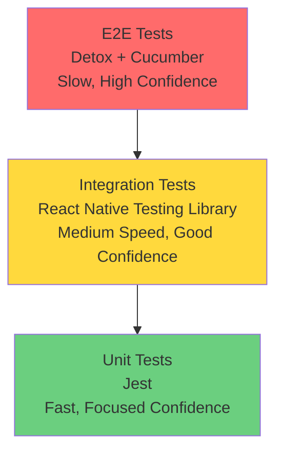

# Testing Guide

Unit and integration testing with Jest and React Native Testing Library (RNTL).

## Current Test Coverage

| Metric          | Value |
| --------------- | ----- |
| **Test Suites** | 230   |
| **Total Tests** | 5,279 |
| **Snapshots**   | 62    |

### Coverage Metrics

| Metric     | Current | Threshold |
| ---------- | ------- | --------- |
| Statements | 95.73%  | 85%       |
| Branches   | 87.50%  | 78%       |
| Functions  | 95.94%  | 65%       |
| Lines      | 95.85%  | 85%       |

### Test Distribution

| Category               | Files | Coverage |
| ---------------------- | ----- | -------- |
| Config (100% required) | 54+   | ✅ 100%  |
| Redux Store            | 100%  | ✅ 100%  |
| Integration Tests      | 30+   | ✅       |
| Auth Infrastructure    | 100+  | ✅       |
| Security Tests         | 40+   | ✅       |
| Accessibility Tests    | 20+   | ✅       |
| Performance Tests      | 10+   | ✅       |

_Last updated: 22 December 2025_

## Table of Contents

1. [Quick Start](#quick-start) - Running tests
2. [Test File Naming](#test-file-naming) - `.rntl.tsx` convention
3. [Test Structure](#test-structure) - File organisation
4. [Common Patterns](#common-patterns) - Render, interact, assert
5. [Accessibility Testing](#accessibility-testing-eaa) - EAA compliance utilities
6. [Security Testing](#security-testing) - Required scenarios
7. [Integration Testing](#integration-testing) - Cross-feature flows
8. [MSW Usage](#msw-usage) - HTTP mocking patterns
9. [Test Factories](#test-factories) - Creating mock data
10. [Troubleshooting](#troubleshooting) - Common issues

See also:

- **[Testing Patterns](./TESTING_PATTERNS.md)** - Code examples and patterns
- **[MSW Testing Guide](./MSW_TESTING_GUIDE.md)** - Advanced HTTP mocking
- **[E2E Testing](./E2E_TESTING.md)** - Detox and Cucumber

---

## Quick Start

### Run All Tests

```bash
yarn test
```

### Run Specific File

```bash
yarn test src/features/Auth/__tests__/LoginScreen.rntl.tsx
```

### Run Tests Matching Pattern

```bash
yarn test -t "renders login form"
```

### Watch Mode (Re-run on Changes)

```bash
yarn test:watch
```

### With Coverage Report

```bash
yarn test:coverage
open coverage/lcov-report/index.html
```

### Full Validation (Pre-commit)

```bash
yarn validate  # typecheck + lint + test
```

---

## Test File Naming

All unit and integration tests use the `.rntl.tsx` suffix (React Native Testing Library):

```
src/
├── features/
│   └── Auth/
│       ├── LoginScreen.tsx                    # Component
│       └── __tests__/
│           ├── LoginScreen.rntl.tsx           # Unit tests
│           ├── LoginScreen.security.rntl.tsx  # Security tests
│           └── LoginScreen.perf.rntl.tsx      # Performance tests
├── shared/
│   └── components/
│       └── Button/
│           ├── Button.tsx                     # Component
│           ├── Button.stories.tsx             # Storybook
│           └── __tests__/
│               └── Button.rntl.tsx            # Unit tests
```

**Why `.rntl.tsx`?**

- Distinguishes RNTL tests from E2E tests (`.feature`, `.cucumber.tsx`)
- Clear identification of testing library used
- Configured in `jest.config.cjs` via `testMatch`

---

## Test Structure

### File Organisation

```typescript
/**
 * LoginScreen Tests
 *
 * Verifies login form behaviour including:
 * - Form rendering and accessibility
 * - User input validation
 * - Submit handling and navigation
 * - Error states and recovery
 *
 * @requires MSW handlers: supabaseAuthHandlers
 * @see src/test-utils/msw/handlers.ts
 */

import { renderWithProviders, TEST_CREDENTIALS } from '@app/test-utils';
import { LoginScreen } from '../LoginScreen';

describe('LoginScreen', () => {
  // Group by behaviour, not implementation
  describe('rendering', () => {
    it('displays email and password inputs', () => { ... });
    it('shows login button', () => { ... });
    it('has correct accessibility labels', () => { ... });
  });

  describe('validation', () => {
    it('shows error for invalid email format', () => { ... });
    it('requires password minimum length', () => { ... });
  });

  describe('submission', () => {
    it('navigates to Home on successful login', () => { ... });
    it('displays error toast on failure', () => { ... });
  });
});
```

### Test Naming Convention

Use descriptive names that explain the expected behaviour:

```typescript
// ✅ Good: Describes user-visible behaviour
it('displays validation error when email is empty', () => { ... });
it('navigates to Home after successful login', () => { ... });
it('disables submit button while loading', () => { ... });

// ❌ Bad: Vague or implementation-focused
it('works', () => { ... });
it('calls handleSubmit', () => { ... });
it('test 1', () => { ... });
```

---

## Common Patterns

### Render → Interact → Assert

```typescript
import { renderWithProviders } from '@app/test-utils';
import { fireEvent, waitFor } from '@testing-library/react-native';

it('submits form and navigates to Home', async () => {
  // RENDER: Set up the component
  const { getByTestId, getByText } = renderWithProviders(
    <LoginScreen navigation={mockNavigation} route={mockRoute} />
  );

  // INTERACT: Simulate user actions
  fireEvent.changeText(getByTestId('email-input'), 'user@example.com');
  fireEvent.changeText(getByTestId('password-input'), 'SecurePass123!');
  fireEvent.press(getByTestId('login-button'));

  // ASSERT: Verify expected outcome
  await waitFor(() => {
    expect(mockNavigation.navigate).toHaveBeenCalledWith('Home');
  });
});
```

### Using Test Constants

```typescript
import {
  TEST_CREDENTIALS,
  INVALID_CREDENTIALS,
  SECURITY_TEST_VALUES,
  HTTP_STATUS,
} from '@app/test-utils';

it('accepts valid credentials', () => {
  fireEvent.changeText(emailInput, TEST_CREDENTIALS.VALID_EMAIL);
  fireEvent.changeText(passwordInput, TEST_CREDENTIALS.VALID_PASSWORD);
  // ...
});

it('rejects SQL injection attempts', () => {
  fireEvent.changeText(emailInput, SECURITY_TEST_VALUES.SQL_INJECTION);
  expect(getByText('Invalid email format')).toBeOnTheScreen();
});
```

### Using Test Helpers

```typescript
import {
  fillFormAndSubmit,
  expectNavigatedTo,
  expectAsyncSuccess,
} from '@app/test-utils';

it('completes login flow', async () => {
  const { getByTestId, getByText, user } = renderWithProviders(<LoginScreen />);

  await fillFormAndSubmit(
    user,
    [
      { element: getByTestId('email-input'), value: 'user@example.com' },
      { element: getByTestId('password-input'), value: 'SecurePass123!' },
    ],
    getByTestId('login-button'),
    'Welcome',
    getByText
  );

  expectNavigatedTo(mockNavigation, 'Home');
});
```

---

## Testing Philosophy

### What We Test

1. **Business Logic** (100% coverage required)
   - Redux actions, reducers, selectors
   - Utility functions
   - Custom hooks
   - Shared components
   - Configuration and setup

2. **Component Behaviour** (60% coverage target)
   - User interactions
   - Conditional rendering
   - Props validation
   - Event handlers

### What We Don't Test

- Third-party libraries
- React Native framework code
- Simple presentational components with no logic
- Type definitions
- Screens (excluded from coverage)

### Testing Pyramid



**Pyramid Strategy:**

- **Unit Tests (Base):** Most tests, fastest, test individual functions/utilities
- **Integration Tests (Middle):** Moderate tests, test component interactions
- **E2E Tests (Top):** Few tests, slowest, test complete user journeys

---

## Test Setup

### Tech Stack

| Tool                             | Purpose                                     |
| -------------------------------- | ------------------------------------------- |
| **Jest**                         | Test runner and assertion library           |
| **React Native Testing Library** | Component testing utilities                 |
| **renderWithProviders**          | Custom utility for GlueStack + Redux + i18n |
| **@testing-library/react-hooks** | Hook testing (if needed)                    |

### File Naming Convention

All unit/integration tests use the `.rntl.tsx` suffix:

```
HomeScreen.tsx          # Component
HomeScreen.rntl.tsx     # Unit/integration test
```

This distinguishes unit/integration tests from E2E tests (`.feature`, `.cucumber.tsx`).

### Configuration

Jest configuration is in `jest.config.cjs`:

```javascript
module.exports = {
  preset: 'react-native',
  testMatch: ['**/__tests__/**/*.rntl.[jt]s?(x)'],
  coverageThreshold: {
    global: {
      statements: 85,
      branches: 78,
      functions: 65,
      lines: 85,
    },
    // Business logic requires 100% coverage
    './src/**/store/**/*.ts': {
      statements: 100,
      branches: 100,
      functions: 100,
      lines: 100,
    },
    './src/config/**/*.ts': {
      statements: 100,
      branches: 100,
      functions: 100,
      lines: 100,
    },
  },
  collectCoverageFrom: [
    'src/**/*.{ts,tsx}',
    '!src/**/__tests__/**',
    '!src/**/index.ts',
    '!src/**/*Screen.tsx',
    '!src/**/*.stories.tsx', // Storybook stories (interactive, not Jest)
  ],
};
```

**Coverage Thresholds:**

| Scope                           | Statements | Branches | Functions | Lines |
| ------------------------------- | ---------- | -------- | --------- | ----- |
| Global                          | 85%        | 78%      | 65%       | 85%   |
| Redux store (`src/**/store/**`) | 100%       | 100%     | 100%      | 100%  |
| Config (`src/config/**`)        | 100%       | 100%     | 100%      | 100%  |

---

## Running Tests

### Basic Commands

```bash
# Run all tests
yarn test

# Watch mode (re-run on file changes)
yarn test:watch

# With coverage report
yarn test:coverage

# Run specific file
yarn test HomeScreen.rntl.tsx

# Run tests matching pattern
yarn test -t "renders correctly"

# Update snapshots
yarn test -u

# Clear cache and run
yarn test --clearCache
```

### Viewing Coverage

```bash
# Run coverage
yarn test:coverage

# Open HTML report in browser
open coverage/lcov-report/index.html
```

The coverage report shows:

- **Statements:** Individual code statements executed
- **Branches:** Conditional branches taken (if/else)
- **Functions:** Functions called
- **Lines:** Lines of code executed

---

## Writing Tests

### Basic Component Test

```typescript
import React from 'react';
import { renderWithProviders } from '@app/test-utils';
import { HomeScreen } from '../HomeScreen';

describe('HomeScreen', () => {
  it('renders without crashing', () => {
    const { getByText } = renderWithProviders(<HomeScreen />);
    expect(getByText('Home')).toBeTruthy();
  });

  it('displays welcome message', () => {
    const { getByText } = renderWithProviders(<HomeScreen />);
    expect(getByText('Welcome to the app')).toBeTruthy();
  });
});
```

### Testing with Props

```typescript
import { ButtonWithChevron } from '../ButtonWithChevron';

describe('ButtonWithChevron', () => {
  it('renders with custom label', () => {
    const { getByText } = renderWithProviders(
      <ButtonWithChevron label="Click me" onPress={jest.fn()} />
    );

    expect(getByText('Click me')).toBeTruthy();
  });

  it('renders with end label', () => {
    const { getByText } = renderWithProviders(
      <ButtonWithChevron
        label="Language"
        endLabel="English"
        onPress={jest.fn()}
      />
    );

    expect(getByText('Language')).toBeTruthy();
    expect(getByText('English')).toBeTruthy();
  });
});
```

### Testing User Interactions

```typescript
import { fireEvent } from '@testing-library/react-native';

describe('Button interactions', () => {
  it('calls onPress when button is tapped', () => {
    const onPress = jest.fn();
    const { getByTestId } = renderWithProviders(
      <Button testID="my-button" onPress={onPress} />
    );

    fireEvent.press(getByTestId('my-button'));

    expect(onPress).toHaveBeenCalledTimes(1);
  });

  it('does not call onPress when disabled', () => {
    const onPress = jest.fn();
    const { getByTestId } = renderWithProviders(
      <Button testID="my-button" onPress={onPress} disabled />
    );

    fireEvent.press(getByTestId('my-button'));

    expect(onPress).not.toHaveBeenCalled();
  });
});
```

### Testing with Redux

**For advanced Redux testing patterns with MSW (Mock Service Worker)**, see the **[MSW Testing Guide](./MSW_TESTING_GUIDE.md)**.

```typescript
import { renderWithProviders } from '@app/test-utils';
import { settingsSliceActions } from '../store';

describe('AppearanceScreen with Redux', () => {
  it('updates theme in Redux store', () => {
    const { store } = renderWithProviders(<AppearanceScreen />);

    // Dispatch action
    store.dispatch(settingsSliceActions.setTheme('dark'));

    // Check state updated
    const state = store.getState();
    expect(state.settings.theme).toBe('dark');
  });

  it('displays current theme from store', () => {
    const { getByText } = renderWithProviders(<AppearanceScreen />, {
      preloadedState: {
        settings: { theme: 'dark', language: 'en' },
      },
    });

    expect(getByText('Dark')).toBeTruthy();
  });
});
```

### Testing Redux Logic

#### Testing Reducers

```typescript
import { settingsReducer, settingsSliceActions } from '../reducer';

describe('settingsReducer', () => {
  const initialState = {
    theme: 'system' as const,
    language: 'en' as const,
  };

  it('updates theme', () => {
    const newState = settingsReducer(initialState, settingsSliceActions.setTheme('dark'));

    expect(newState.theme).toBe('dark');
    expect(newState.language).toBe('en'); // Unchanged
  });

  it('updates language', () => {
    const newState = settingsReducer(initialState, settingsSliceActions.setLanguage('es'));

    expect(newState.language).toBe('es');
    expect(newState.theme).toBe('system'); // Unchanged
  });

  it('resets to initial state', () => {
    const modifiedState = { theme: 'dark' as const, language: 'es' as const };
    const newState = settingsReducer(modifiedState, settingsSliceActions.resetSettings());

    expect(newState).toEqual(initialState);
  });
});
```

#### Testing Selectors

```typescript
import { selectTheme, selectLanguage } from '../selectors';
import type { RootState } from '@app/store';

describe('settingsSelectors', () => {
  const mockState: RootState = {
    settings: {
      theme: 'dark',
      language: 'en',
    },
  };

  it('selects theme from state', () => {
    expect(selectTheme(mockState)).toBe('dark');
  });

  it('selects language from state', () => {
    expect(selectLanguage(mockState)).toBe('en');
  });
});
```

### Testing Utilities

```typescript
import { getButtonGroupVariant } from '../utils';

describe('getButtonGroupVariant', () => {
  it('returns single for a single item', () => {
    expect(getButtonGroupVariant(0, 1)).toBe('single');
  });

  it('returns top for the first item of multiple', () => {
    expect(getButtonGroupVariant(0, 3)).toBe('top');
  });

  it('returns middle for middle items', () => {
    expect(getButtonGroupVariant(1, 3)).toBe('middle');
  });

  it('returns bottom for the last item', () => {
    expect(getButtonGroupVariant(2, 3)).toBe('bottom');
  });

  it('handles edge case of empty array', () => {
    expect(getButtonGroupVariant(0, 0)).toBe('single');
  });
});
```

### Mocking

#### Mock Functions

```typescript
const mockNavigate = jest.fn();
const mockOnPress = jest.fn();
```

#### Mock Modules

```typescript
jest.mock('@app/hooks/useAppColorScheme', () => ({
  useAppColorScheme: () => 'light',
}));

// Then import after mock
import { useAppColorScheme } from '@app/hooks/useAppColorScheme';
```

#### Mock React Native APIs

```typescript
import * as ReactNative from 'react-native';

jest.spyOn(ReactNative, 'useColorScheme').mockReturnValue('dark');
```

#### Mock Navigation

```typescript
const mockNavigation = {
  navigate: jest.fn(),
  goBack: jest.fn(),
  setOptions: jest.fn(),
};

it('navigates to Settings', () => {
  const { getByText } = renderWithProviders(
    <HomeScreen navigation={mockNavigation} />
  );

  fireEvent.press(getByText('Settings'));

  expect(mockNavigation.navigate).toHaveBeenCalledWith('Settings');
});
```

### Testing Async Operations

```typescript
import { waitFor } from '@testing-library/react-native';

it('loads data asynchronously', async () => {
  const { getByText, queryByText } = renderWithProviders(<DataScreen />);

  // Initially shows loading
  expect(getByText('Loading...')).toBeTruthy();

  // Wait for data to load
  await waitFor(() => {
    expect(queryByText('Loading...')).toBeNull();
    expect(getByText('Data loaded')).toBeTruthy();
  });
});

it('handles errors gracefully', async () => {
  const { getByText } = renderWithProviders(<DataScreen />);

  await waitFor(() => {
    expect(getByText('Error loading data')).toBeTruthy();
  });
});
```

---

## Coverage Requirements

### Global Thresholds

- **85% minimum** for statements
- **78% minimum** for branches
- **65% minimum** for functions
- **85% minimum** for lines

### Business Logic (100% Coverage Required)

Must have 100% coverage:

- Redux actions, reducers, selectors (`src/**/store/**`)
- Configuration files (`src/config/**`)

### Shared Components

Shared components at `src/shared/components/` have high coverage expectations but are not strictly enforced at 100% yet.

### Excluded from Coverage

These files are excluded from coverage metrics (configured in `jest.config.cjs`):

- Screen components (`*Screen.tsx`)
- Navigation setup (`src/navigation/`)
- Store configuration (`src/store/configureStore.ts`)
- Barrel exports (`index.ts` files)
- Type definitions (`*.d.ts`)
- Test utilities (`src/test-utils/`)
- Reactotron dev config (`src/config/reactotron.ts`)
- Storybook stories (`*.stories.tsx`) - designed for interactive visual testing, not Jest

### Per-Directory Thresholds

```javascript
// jest.config.cjs (actual values)
coverageThreshold: {
  global: { statements: 85, branches: 78, functions: 65, lines: 85 },
  './src/**/store/**/*.ts': { statements: 100, branches: 100, functions: 100, lines: 100 },
  './src/config/**/*.ts': { statements: 100, branches: 100, functions: 100, lines: 100 },
}
```

### View Coverage Report

```bash
yarn test:coverage
open coverage/lcov-report/index.html
```

---

## Best Practices

### 1. Test Behaviour, Not Implementation

**❌ Bad** (testing implementation):

```typescript
it('calls setState', () => {
  const { rerender } = render(<Component />);
  // Testing internal state implementation
});
```

**✅ Good** (testing behaviour):

```typescript
it('displays updated text when button clicked', () => {
  const { getByText, getByTestId } = renderWithProviders(<Component />);

  fireEvent.press(getByTestId('update-button'));

  expect(getByText('Updated')).toBeTruthy();
});
```

### 2. Use renderWithProviders

Always use `renderWithProviders` for components that use:

- GlueStack UI components
- Redux hooks (`useAppSelector`, `useAppDispatch`)
- i18n hooks (`useTranslation`)

```typescript
import { renderWithProviders } from '@app/test-utils';

const { getByText } = renderWithProviders(<MyComponent />);
```

**Why?** It wraps your component with all required providers (GlueStack, Redux, i18n).

### 3. Use Descriptive Test Names

**❌ Bad:**

```typescript
it('works', () => { ... });
it('test 1', () => { ... });
```

**✅ Good:**

```typescript
it('displays error message when form submission fails', () => { ... });
it('disables submit button while loading', () => { ... });
```

### 4. Follow AAA Pattern (Arrange, Act, Assert)

```typescript
it('increments counter when button pressed', () => {
  // Arrange: Set up test data
  const { getByTestId, getByText } = renderWithProviders(<Counter />);

  // Act: Perform action
  fireEvent.press(getByTestId('increment-button'));

  // Assert: Verify result
  expect(getByText('Count: 1')).toBeTruthy();
});
```

### 5. Test Edge Cases

```typescript
describe('getButtonGroupVariant', () => {
  it('handles single item', () => { ... });
  it('handles first item', () => { ... });
  it('handles middle items', () => { ... });
  it('handles last item', () => { ... });

  // Edge cases
  it('handles empty array', () => { ... });
  it('handles negative index', () => { ... });
  it('handles index out of bounds', () => { ... });
});
```

### 6. Keep Tests Independent

Each test should:

- Set up its own data
- Not depend on other tests
- Clean up after itself
- Be able to run in any order

```typescript
// ❌ Bad: Tests depend on each other
let count = 0;
it('increments', () => {
  count++;
});
it('shows 1', () => {
  expect(count).toBe(1);
});

// ✅ Good: Tests are independent
it('increments from 0 to 1', () => {
  const count = 0;
  expect(count + 1).toBe(1);
});
```

### 7. Use testID for Elements

```typescript
// Component
<Button testID="submit-button" onPress={onSubmit}>
  Submit
</Button>

// Test
const { getByTestId } = renderWithProviders(<Form />);
fireEvent.press(getByTestId('submit-button'));
```

**Why?** `testID` is reliable across text changes and localisation.

### 8. Avoid Implementation Details

**❌ Bad:**

```typescript
expect(component.state.isLoading).toBe(true);
expect(component.instance().handleClick).toHaveBeenCalled();
```

**✅ Good:**

```typescript
expect(getByText('Loading...')).toBeTruthy();
expect(mockOnClick).toHaveBeenCalled();
```

---

## Test Organisation

### Component Tests

```typescript
describe('ButtonWithChevron', () => {
  describe('rendering', () => {
    it('renders without crashing', () => { ... });
    it('renders with custom props', () => { ... });
    it('renders with start icon', () => { ... });
    it('renders with end label', () => { ... });
  });

  describe('interactions', () => {
    it('calls onPress when tapped', () => { ... });
    it('does not call onPress when disabled', () => { ... });
  });

  describe('edge cases', () => {
    it('handles missing props gracefully', () => { ... });
    it('handles empty label', () => { ... });
  });
});
```

### Redux Tests

```typescript
describe('settingsSlice', () => {
  describe('actions', () => {
    it('creates setTheme action', () => { ... });
    it('creates setLanguage action', () => { ... });
  });

  describe('reducer', () => {
    it('handles setTheme', () => { ... });
    it('handles setLanguage', () => { ... });
    it('handles reset', () => { ... });
  });

  describe('selectors', () => {
    it('selects theme', () => { ... });
    it('selects language', () => { ... });
  });
});
```

---

## Troubleshooting

### Tests Not Running

**Problem:** Jest not finding tests

**Solution:**

1. Verify file naming uses `.rntl.tsx` suffix
2. Check Jest config:
   ```bash
   cat jest.config.cjs | grep testMatch
   ```
3. Ensure file is in correct location (`__tests__/` directory)

### Mocks Not Working

**Problem:** Module mocks not applying

**Solution:**

Ensure mocks are defined **before** imports:

```typescript
// ✅ Correct order
jest.mock('@app/hooks/useTheme');
import { useTheme } from '@app/hooks/useTheme';

// ❌ Wrong order
import { useTheme } from '@app/hooks/useTheme';
jest.mock('@app/hooks/useTheme'); // Too late!
```

### Async Tests Timing Out

**Problem:** Test hangs or times out

**Solution:**

Use `waitFor` for async operations:

```typescript
import { waitFor } from '@testing-library/react-native';

await waitFor(() => {
  expect(getByText('Loaded')).toBeTruthy();
});

// Or with timeout
await waitFor(
  () => {
    expect(getByText('Loaded')).toBeTruthy();
  },
  { timeout: 5000 }
);
```

### Coverage Not Accurate

**Problem:** Coverage report shows untested code as tested

**Solution:**

Check for:

- Unused imports (counted as covered)
- Dead code (unreachable branches)
- Commented-out code
- Type-only imports

```bash
# Clear coverage cache
yarn test --clearCache
yarn test:coverage
```

### React Native Components Not Rendering

**Problem:** `ReferenceError: View is not defined`

**Solution:**

Ensure Jest is configured with React Native preset:

```javascript
// jest.config.cjs
module.exports = {
  preset: 'react-native',
  // ...
};
```

### renderWithProviders Not Working

**Problem:** Components using GlueStack UI or Redux not rendering

**Solution:**

1. Verify you're importing from the correct location:

   ```typescript
   import { renderWithProviders } from '@app/test-utils';
   ```

2. Check that `renderWithProviders` wraps all providers:
   ```typescript
   // src/test-utils/renderWithProviders.tsx
   export const renderWithProviders = (ui: React.ReactElement) =>
     render(
       <I18nextProvider i18n={i18n}>
         <GluestackUIProvider config={config}>{ui}</GluestackUIProvider>
       </I18nextProvider>
     );
   ```

### Snapshot Tests Failing

**Problem:** Snapshot tests fail after legitimate changes

**Solution:**

1. Review snapshot diff to ensure changes are intentional
2. Update snapshots:
   ```bash
   yarn test -u
   ```
3. Commit updated snapshots

**Tip:** Use snapshots sparingly - prefer explicit assertions.

---

## Test Factories

Use test factories for consistent mock data creation.

### User Factories

```typescript
import { createMockUser, createVerifiedUser, createCompleteUser } from '@app/test-utils';

// Basic mock user
const user = createMockUser({ email: 'test@example.com' });

// Verified user (email confirmed)
const verifiedUser = createVerifiedUser();

// User with all profile fields
const completeUser = createCompleteUser({
  firstName: 'Warren',
  lastName: 'DeLeon',
});
```

### Auth State Factories

```typescript
import {
  createAuthenticatedState,
  createBiometricAuthState,
  authErrorScenarios,
} from '@app/test-utils';

// Authenticated state for testing
const { getByText } = renderWithProviders(<MyComponent />, {
  preloadedState: createAuthenticatedState(),
});

// Biometric-enabled auth state
const bioState = createBiometricAuthState();

// Error scenarios
const expiredTokenState = authErrorScenarios.expiredSession();
```

### Navigation Factories

```typescript
import {
  createMockNavigation,
  createMockRoute,
  createScreenProps,
  loginScreenProps,
} from '@app/test-utils';

// Quick setup for screen tests
const { navigation, route } = loginScreenProps();

// Custom screen setup
const { navigation, route } = createScreenProps('Profile', { userId: '123' });

// Or build individually
const mockNavigation = createMockNavigation('Settings');
const mockRoute = createMockRoute('Settings', { tab: 'appearance' });
```

Available pre-configured screen props:

- `loginScreenProps()`
- `registrationScreenProps()`
- `forgotPasswordScreenProps()`
- `resetPasswordScreenProps(params?)`
- `homeScreenProps()`
- `profileScreenProps()`
- `settingsScreenProps()`
- `editAccountScreenProps()`

### Test Constants

```typescript
import {
  TEST_CREDENTIALS,
  INVALID_CREDENTIALS,
  SECURITY_TEST_VALUES,
  HTTP_STATUS,
  TOUCH_TARGET_SIZES,
} from '@app/test-utils/constants';

// Valid credentials
fireEvent.changeText(emailInput, TEST_CREDENTIALS.VALID_EMAIL);
fireEvent.changeText(passwordInput, TEST_CREDENTIALS.VALID_PASSWORD);

// Security tests
fireEvent.changeText(emailInput, SECURITY_TEST_VALUES.SQL_INJECTION);
fireEvent.changeText(emailInput, SECURITY_TEST_VALUES.XSS_ATTEMPT);

// HTTP status codes
if (response.status === HTTP_STATUS.UNAUTHORIZED) { ... }

// Touch target sizes
expect(element.props.style.minHeight).toBeGreaterThanOrEqual(TOUCH_TARGET_SIZES.IOS_MINIMUM);
```

---

## Integration Testing

Integration tests verify cross-feature flows and real Redux state updates.

### Complete User Journey Tests

```typescript
/**
 * Auth Flow Integration Tests
 *
 * Tests the complete authentication user journey:
 * 1. Navigate to login screen
 * 2. Enter credentials
 * 3. Submit form
 * 4. Verify navigation to Home
 * 5. Verify Redux state updated
 *
 * @requires MSW handlers: supabaseAuthHandlers
 */

import { renderWithProviders, server, handlers } from '@app/test-utils';

describe('Auth Flow Integration', () => {
  it('completes login → home navigation', async () => {
    const { store, getByTestId, getByText } = renderWithProviders(
      <AppNavigator />,
      { preloadedState: loggedOutAuthState }
    );

    // Fill and submit login form
    fireEvent.changeText(getByTestId('email-input'), 'user@example.com');
    fireEvent.changeText(getByTestId('password-input'), 'SecurePass123!');
    fireEvent.press(getByTestId('login-button'));

    // Wait for Redux state update from MSW response
    await waitFor(() => {
      expect(store.getState().auth.isAuthenticated).toBe(true);
    });

    // Verify navigation occurred
    expect(getByText('Welcome')).toBeOnTheScreen();
  });
});
```

### Cross-Feature State Tests

```typescript
it('profile update reflects in settings screen', async () => {
  const { store, getByTestId, rerender } = renderWithProviders(
    <ProfileScreen />,
    { preloadedState: createAuthenticatedState() }
  );

  // Update profile
  fireEvent.changeText(getByTestId('name-input'), 'New Name');
  fireEvent.press(getByTestId('save-button'));

  await waitFor(() => {
    expect(store.getState().profile.data?.name).toBe('New Name');
  });

  // Render settings screen with same store
  rerender(<SettingsScreen />);

  // Verify state is shared
  expect(getByTestId('profile-name')).toHaveTextContent('New Name');
});
```

### Error Recovery Integration

```typescript
import { server, errorHandlers, handlers } from '@app/test-utils';

it('recovers from network error with retry', async () => {
  // Start with error state
  server.use(...errorHandlers);

  const { getByTestId, getByText, store } = renderWithProviders(<ProfileScreen />);

  // Wait for error to display
  await waitFor(() => {
    expect(getByText('Failed to load')).toBeOnTheScreen();
  });

  // Switch to success handlers
  server.resetHandlers();
  server.use(...handlers);

  // Press retry
  fireEvent.press(getByTestId('retry-button'));

  // Wait for success
  await waitFor(() => {
    expect(store.getState().profile.loading).toBe(false);
    expect(store.getState().profile.data).toBeDefined();
  });
});
```

---

## MSW Usage

MSW (Mock Service Worker) intercepts HTTP requests at the network layer, allowing tests to use real Redux stores.

### Basic Setup

```typescript
import { renderWithProviders, server } from '@app/test-utils';

it('loads profile data via MSW', async () => {
  const { store } = renderWithProviders(<ProfileScreen />);

  // Wait for MSW to return mock data to Redux thunk
  await waitFor(() => {
    expect(store.getState().profile.loading).toBe(false);
  });

  // Verify actual Redux state (not mock calls)
  expect(store.getState().profile.data?.fullName).toBe('Warren de Leon');
});
```

### Using Error Handlers

```typescript
import { server, errorHandlers, unauthorizedHandlers } from '@app/test-utils';

describe('Error Handling', () => {
  it('displays error when API returns 500', async () => {
    server.use(...errorHandlers);

    const { getByText } = renderWithProviders(<ProfileScreen />);

    await waitFor(() => {
      expect(getByText('Network error')).toBeOnTheScreen();
    });
  });

  it('redirects to login on 401', async () => {
    server.use(...unauthorizedHandlers);

    const { store } = renderWithProviders(<ProfileScreen />);

    await waitFor(() => {
      expect(store.getState().auth.isAuthenticated).toBe(false);
    });
  });
});
```

### Handler Categories

| Handler Set               | Purpose                       |
| ------------------------- | ----------------------------- |
| `handlers`                | Default success responses     |
| `errorHandlers`           | 500 server errors             |
| `unauthorizedHandlers`    | 401 expired/invalid tokens    |
| `forbiddenHandlers`       | 403 banned/suspended accounts |
| `conflictHandlers`        | 409 duplicate registration    |
| `validationErrorHandlers` | 422 form validation errors    |
| `rateLimitHandlers`       | 429 rate limiting             |
| `timeoutHandlers`         | Request timeout simulation    |
| `offlineHandlers`         | Network failure simulation    |

### Per-Test Handler Override

```typescript
import { http, HttpResponse } from 'msw';

it('handles custom error response', async () => {
  // Override specific endpoint for this test only
  server.use(
    http.post('https://api.example.com/login', () => {
      return HttpResponse.json(
        { error: 'custom_error', message: 'Custom message' },
        { status: 418 }
      );
    })
  );

  // Test custom error handling
  // ...

  // Handlers auto-reset after test via jest.setup.ts
});
```

For detailed MSW patterns, see **[MSW Testing Guide](./MSW_TESTING_GUIDE.md)**.

---

## Security Testing

Security tests validate authentication, input sanitisation, and token handling.

### Token Refresh Tests

```typescript
it('handles concurrent refresh requests', async () => {
  const refreshPromises = [
    authClient.refreshSession(),
    authClient.refreshSession(),
    authClient.refreshSession(),
  ];

  const results = await Promise.all(refreshPromises);

  results.forEach(result => {
    expect(result.access_token).toBeDefined();
  });
});
```

### Input Sanitisation Tests

```typescript
it('rejects SQL injection in email', async () => {
  await expect(
    authClient.signUp({
      email: "admin'--@example.com",
      password: 'Password123!',
    })
  ).rejects.toThrow();
});

it('rejects XSS in email', async () => {
  await expect(
    authClient.signUp({
      email: '<script>alert("xss")</script>@example.com',
      password: 'Password123!',
    })
  ).rejects.toThrow();
});
```

### Token Expiry Detection

```typescript
// Test the token expiry detection logic
const isTokenExpired = (status: number, errorData: object): boolean => {
  return (
    status === 401 ||
    (status === 403 &&
      (errorData?.error_code === 'bad_jwt' || errorData?.msg?.includes('token is expired')))
  );
};

it('detects 401 as expired', () => {
  expect(isTokenExpired(401, {})).toBe(true);
});

it('detects 403 with bad_jwt as expired', () => {
  expect(isTokenExpired(403, { error_code: 'bad_jwt' })).toBe(true);
});
```

---

## Accessibility Testing (EAA)

All components must pass EAA (European Accessibility Act) compliance, which requires WCAG 2.1 Level AA.

### Required Accessibility Properties

Every interactive element needs these properties:

| Property             | Purpose                         | Example                           |
| -------------------- | ------------------------------- | --------------------------------- |
| `accessibilityRole`  | Element type for screen readers | `"button"`, `"link"`, `"header"`  |
| `accessibilityLabel` | Screen reader text              | `"Submit login form"`             |
| `accessibilityHint`  | Action description              | `"Logs you in and goes to Home"`  |
| `accessibilityState` | Current state                   | `{ disabled: false, busy: true }` |
| `testID`             | Test targeting                  | `"login-button"`                  |

### Touch Target Compliance

```typescript
import { expectTouchTargetCompliance } from '@app/test-utils';

it('has accessible touch targets', () => {
  const { getByTestId } = renderWithProviders(<MyButton />);

  // Validates 44×44 (iOS) or 48×48 (Android) minimum
  expectTouchTargetCompliance(getByTestId('my-button'));
});
```

### Screen Reader Announcements

```typescript
import { expectScreenReaderAnnouncement, expectLiveRegionContent } from '@app/test-utils';

it('announces toast to screen readers', () => {
  const { getByTestId } = renderWithProviders(<Toast message="Saved" />);

  expectScreenReaderAnnouncement(getByTestId('toast'), {
    liveRegion: 'polite',
    role: 'alert',
  });
});

it('announces correct content', () => {
  const { getByTestId } = renderWithProviders(<AlertBox message="Error occurred" />);

  expectLiveRegionContent(getByTestId('alert-box'), 'Error occurred', {
    liveRegion: 'polite',
    role: 'alert',
  });
});
```

### Required Accessibility Props

Every interactive element needs:

| Prop                 | Purpose                  |
| -------------------- | ------------------------ |
| `accessibilityRole`  | Element type             |
| `accessibilityLabel` | Screen reader label      |
| `accessibilityHint`  | Action description       |
| `accessibilityState` | Current state (disabled) |
| `testID`             | Test targeting           |

---

## Next Steps

- **[MSW Testing Guide](./MSW_TESTING_GUIDE.md)** - Advanced Redux testing with Mock Service Worker
- **[E2E Testing](./E2E_TESTING.md)** - End-to-end testing with Detox
- **[Accessibility Guide](./ACCESSIBILITY.md)** - EAA compliance requirements
- **[Architecture](./ARCHITECTURE.md)** - Project structure and patterns
- **[Workflows](./WORKFLOWS.md)** - Common testing workflows
- **[Cheatsheet](./CHEATSHEET.md)** - Quick testing reference

---

Tests failing unexpectedly? Check the troubleshooting section above.
